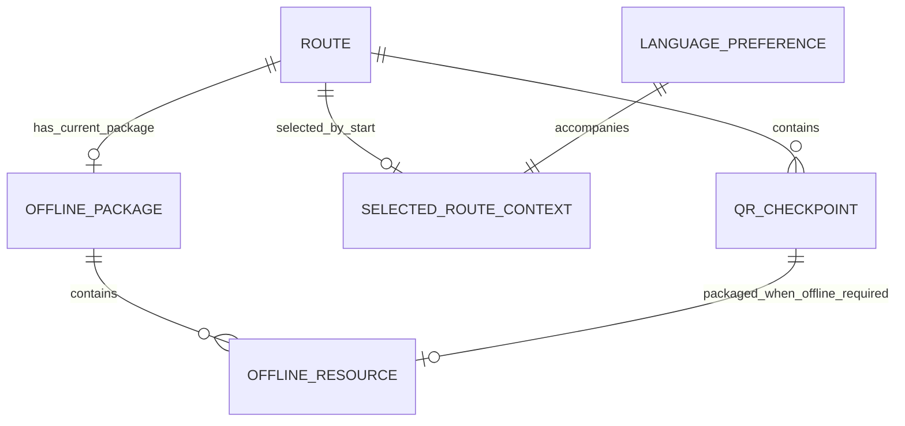
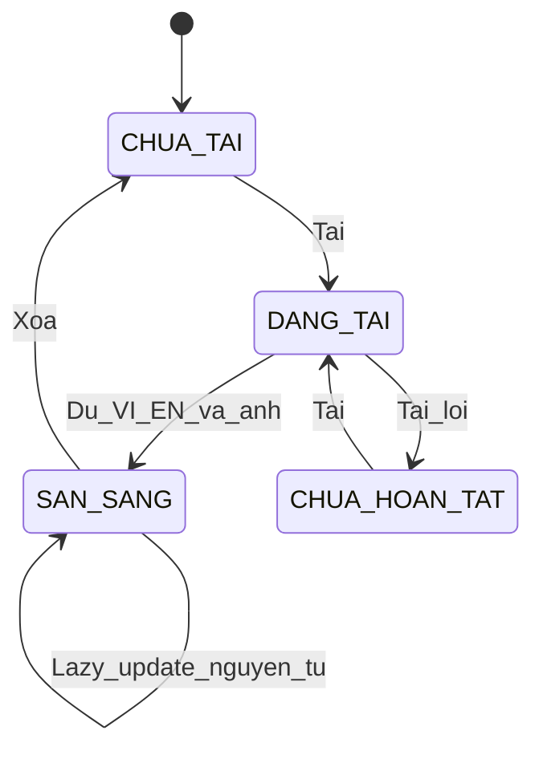
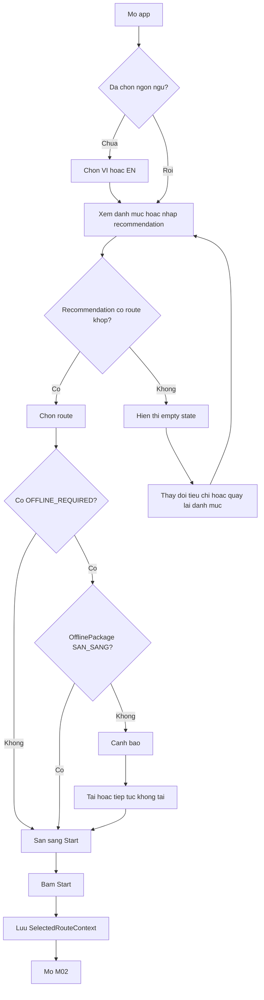

# MODULE SPECIFICATION — M01
## Lập kế hoạch & Chuẩn bị Tuyến — Cúc Phương Quest

---

| Thông tin tài liệu | Nội dung |
|---|---|
| **Module ID** | M01 |
| **Tên tiếng Việt** | Lập kế hoạch & Chuẩn bị Tuyến |
| **Tên tiếng Anh** | Route Planning & Preparation |
| **Phiên bản** | v2.4 |
| **Trạng thái** | Ready for FRD/SDD draft — contract MVP với M02/M03 đã chốt |
| **Ngày cập nhật** | 2026-09-22 |
| **Owner** | Product Owner/BA dự án |
| **Nguồn quyết định** | Các quyết định M01 được ghi trong tài liệu này, cập nhật đến 2026-09-19 |
| **Dependency bắt buộc** | M03 — Operations & Content Administration |
| **Module tiếp nhận dữ liệu** | M02 — Field Quest Experience |

> Tài liệu này là specification nghiệp vụ tự chứa cho M01. Chi tiết trình bày thuộc FRD/UI design; BRD chốt danh sách màn hình và hành vi nghiệp vụ tối thiểu, không yêu cầu mockup trước khi bắt đầu draft spec.

---

# SECTION 1: TỔNG QUAN MODULE & TÁC NHÂN

## 1.1 Mục đích

M01 giúp du khách chọn route phù hợp, chuẩn bị tài nguyên cho các điểm không bảo đảm kết nối và bắt đầu route. M01 cung cấp cho M02 đúng ba dữ liệu dùng chung:

- `LanguagePreference` hiện tại.
- `SelectedRouteContext.routeId` sau khi người dùng bấm **Start**.
- `OfflinePackage` ở trạng thái `SAN_SANG`, nếu người dùng đã tải.

M01 không quản lý quét QR, lịch sử khám phá, checkpoint đã hoàn thành hoặc tiến trình hành trình.

Mỗi QRCheckpoint do M03 phân loại:

- `ONLINE_AVAILABLE`: dự kiến có kết nối Internet sử dụng được.
- `OFFLINE_REQUIRED`: không bảo đảm kết nối; tài nguyên cốt lõi cần được tải trước để M02 sử dụng offline.

## 1.2 Phạm vi MVP

### 1.2.1 Trong phạm vi

- Chọn tiếng Việt hoặc tiếng Anh trước khi dùng chức năng khác.
- Đổi ngôn ngữ khi online hoặc offline; UI i18n và nội dung QR dùng cùng `LanguagePreference`.
- Xem danh mục và chi tiết route.
- Hiển thị tên, cự ly, thời lượng, độ khó và `content` song ngữ của route.
- Nhận tất cả route phù hợp dựa trên ba tiêu chí: thời gian, thành phần đoàn và sở thích trải nghiệm; kết quả có thể từ 0 đến nhiều route.
- Recommendation khớp tag do M03 cấu hình; không dùng AI, điểm số hoặc thuật toán tự học.
- Xác định route có checkpoint `OFFLINE_REQUIRED`.
- Cảnh báo hậu quả khi chưa có gói offline sẵn sàng.
- Cho phép tải gói hoặc tiếp tục không tải.
- Mỗi OfflinePackage chứa tài nguyên tiếng Việt và tiếng Anh cho tất cả checkpoint `OFFLINE_REQUIRED` của một route.
- Gói chỉ chứa thông tin giới thiệu (`introductionText`) và hình ảnh tĩnh; ảnh dùng chung giữa hai ngôn ngữ chỉ lưu một lần.
- Quản lý tài nguyên bằng ba hành động: **Xem**, **Tải**, **Xóa**.
- Lazy update khi người dùng mở/chọn lại route và thiết bị có mạng.
- Ghi route được chọn vào `SelectedRouteContext` khi người dùng bấm **Start**.
- Công bố dữ liệu dùng chung để M02 đọc độc lập.

### 1.2.2 Ngoài phạm vi

- CRUD route, QRCheckpoint, nội dung, tag recommendation và `ConnectivityMode`; thuộc M03.
- Quét/xác thực QR, hiển thị thông tin giới thiệu, tra cứu online và lịch sử khám phá; thuộc M02.
- Tiến trình route, trạng thái checkpoint hoàn thành và resume hành trình; thuộc M02.
- AI/machine learning cho recommendation.
- Dẫn đường GPS hoặc bản đồ thời gian thực.
- Audio, video hoặc bản đồ tĩnh trong OfflinePackage.
- Đồng bộ/chuyển gói giữa thiết bị hoặc trình duyệt.
- Backup hoặc khôi phục dữ liệu sau khi người dùng/trình duyệt xóa dữ liệu website.
- Push notification và vô hiệu hóa gói từ xa trong khi thiết bị offline.

## 1.3 Mục tiêu nghiệp vụ

| Mục tiêu ID | Mô tả | KPI cấp cao |
|---|---|---|
| **MO-M01-01** | Giúp du khách hiểu route trước khi chọn. | Tỷ lệ mở chi tiết route trước khi Start. |
| **MO-M01-02** | Cung cấp kết quả recommendation nhất quán với ba tiêu chí người dùng đã chọn. | 100% route được trả về đồng thời khớp đủ `timeTag`, `groupTag` và `experienceTag` đã chọn. |
| **MO-M01-03** | Cảnh báo rõ nhu cầu offline. | 100% route có `OFFLINE_REQUIRED` được kiểm tra gói trước Start. |
| **MO-M01-04** | Chuẩn bị nội dung song ngữ cho điểm không có mạng. | Gói chỉ `SAN_SANG` khi đủ Việt/Anh, resourceIndex và mọi ảnh đã khai báo. |
| **MO-M01-05** | Bàn giao route được Start cho M02 bằng contract tối thiểu. | M02 nhận đúng `routeId`, không phụ thuộc state nội bộ M01. |

## 1.4 Giá trị mang lại

- **Du khách:** chọn route nhanh, đổi ngôn ngữ được cả khi offline và chủ động tải tài nguyên.
- **M02:** nhận route đang được chọn và nội dung offline song ngữ qua contract nhỏ, ổn định.
- **M03:** quản lý tập trung route, checkpoint, content, tag và phiên bản.
- **Đội triển khai:** recommendation chỉ lọc chính xác theo ba nhóm tag, không giới hạn kết quả và không xếp hạng.

## 1.5 Tác nhân và vai trò

| Actor ID | Actor | Vai trò trong M01 |
|---|---|---|
| **ACT-001** | Du khách | Chọn ngôn ngữ, xem route, nhập tiêu chí, nhận đề xuất, tải/xóa tài nguyên và bấm Start. |
| **ACT-002** | Hệ thống M01 | Khớp tag, kiểm tra nhu cầu offline, tải/công bố gói, lưu ngôn ngữ và route được Start. |
| **ACT-003** | Quản trị viên M03 | CRUD nguồn dữ liệu; cấu hình tag, `ConnectivityMode`, content và version. |
| **ACT-004** | Hệ thống M02 | Đọc dữ liệu dùng chung; tự xử lý QR, nội dung và hành trình. |
| **ACT-005** | Ban Quản lý VQG | Phê duyệt nội dung, cảnh báo và quy tắc recommendation. |

### 1.5.1 Ma trận quyền/hành vi

| Chức năng | Du khách | M01 | M03 | M02 |
|---|---|---|---|---|
| Chọn/đổi ngôn ngữ | Thực hiện | Lưu/công bố | Cung cấp content song ngữ | Đọc ngôn ngữ hiện tại |
| Xem route | Thực hiện | Hiển thị | CRUD dữ liệu | Không sở hữu |
| Recommendation | Nhập 3 tiêu chí | Trả mọi route khớp đủ ba tag hoặc empty state | Cấu hình và duy trì recommendation tags hợp lệ trên route | Không sở hữu |
| Phân loại checkpoint | Không | Đọc | Tạo/rà soát | Đọc khi cần |
| Tải gói | Quyết định | Tải/công bố | Cung cấp tài nguyên | Đọc gói sẵn sàng |
| Quản lý gói | Xem/Tải/Xóa | Thực thi | Không thao tác | Không sửa gói |
| Start route | Bấm Start | Lưu `routeId` | Cung cấp route | Đọc `routeId` |
| Quét QR/tiến trình | Không thuộc M01 | Không quản lý | Cung cấp nội dung nguồn | Sở hữu |

### 1.5.2 Luồng trách nhiệm

```text
M03 --[public route/status/checkpoint/content/tags/version]--> M01
M01 --[LanguagePreference]------------------> Vùng dữ liệu dùng chung
M01 --[SelectedRouteContext sau Start]------> Vùng dữ liệu dùng chung
M01 --[OfflinePackage SAN_SANG]-------------> Vùng dữ liệu dùng chung
M02 --[đọc độc lập]-------------------------> Vùng dữ liệu dùng chung
```

## 1.6 Dependencies, ràng buộc và giả định

| ID | Loại | Nội dung |
|---|---|---|
| **DEP-M01-001** | M03 | M03 là nguồn chính thức của route, checkpoint, content, recommendation tags và `contentVersion`. |
| **DEP-M01-002** | M03 | M03 được lưu bản nháp chưa hoàn chỉnh nhưng chỉ công bố route khi `name`/`content` route đủ `vi/en`, mỗi checkpoint `OFFLINE_REQUIRED` đủ `introductionText` `vi/en`, ba nhóm recommendation tags hợp lệ, connectivity và version hợp lệ. |
| **REL-M01-001** | M02 | M02 chỉ phụ thuộc contract dữ liệu dùng chung, không phụ thuộc luồng UI hoặc state nội bộ của M01. |
| **CON-M01-001** | i18n | Resource UI `vi` và `en` phải được bundle/cache trong app để đổi ngôn ngữ offline. |
| **CON-M01-002** | Gói offline | Một gói theo route/version; đủ cả Việt và Anh mới được `SAN_SANG`. |
| **CON-M01-003** | Phiên bản | Mỗi `contentVersion` là một snapshot bất biến. Lazy update công bố nguyên tử: M02 chỉ thấy gói cũ hoàn chỉnh hoặc gói mới hoàn chỉnh. |
| **CON-M01-004** | Xóa dữ liệu | Khi dữ liệu website bị xóa, gói và SelectedRouteContext có thể mất; hệ thống không backup/khôi phục. |
| **CON-M01-005** | Vận hành | M03 ưu tiên tạo, cập nhật hoặc xóa route lúc không có khách hoặc vắng khách. |
| **CON-M01-006** | Lưu trữ offline | OfflinePackage, gồm manifest, nội dung Việt/Anh và byte ảnh, được lưu cùng trong IndexedDB; Cache Storage chỉ dùng cho app shell và i18n UI. |
| **CON-M01-007** | Ảnh offline | M01 phải tải và lưu dữ liệu ảnh thực tế; URL nguồn không được coi là tài nguyên offline. Ảnh là tùy chọn, nhưng mọi ảnh đã khai báo trong manifest phải tải thành công. |
| **CON-M01-008** | Kiểm tra kết nối | Quyết định tải/cập nhật phải dựa trên request thành công tới manifest/API nguồn, không chỉ dựa trên trạng thái kết nối do trình duyệt báo. |
| **CON-M01-009** | Phân quyền | Khách chỉ được đọc dữ liệu nguồn; chỉ Admin M03 được tạo, sửa hoặc xóa. Quyền phải được thực thi tại Supabase, không chỉ ẩn chức năng trên UI. |
| **ASM-M01-001** | Thiết bị | Trình duyệt hỗ trợ i18n, lưu trữ cục bộ và app shell offline. |
| **ASM-M01-002** | Tag | M03 duy trì recommendation tags hợp lệ cho các route được công bố. |

---

# SECTION 2: DOMAIN ENTITIES & STATE MACHINE

## 2.1 Danh sách Domain Entities

| Entity ID | Entity | Mô tả | Data owner |
|---|---|---|---|
| **ENT-001** | Route | Route hiển thị cho du khách. | M03 |
| **ENT-002** | QRCheckpoint | Điểm QR thuộc route, có phân loại kết nối. | M03 |
| **ENT-003** | RecommendationContext | Ba lựa chọn dùng để khớp tag. | M01 |
| **ENT-004** | SelectedRouteContext | Route được Start gần nhất để M02 đọc. | M01 |
| **ENT-005** | OfflinePackage | Gói song ngữ theo route/version. | M01 |
| **ENT-006** | OfflineResource | Storytelling song ngữ và ảnh của một checkpoint offline. | Nguồn M03; bản cục bộ M01 |
| **ENT-007** | LanguagePreference | Ngôn ngữ UI/nội dung hiện tại. | M01 |

### 2.1.1 Entity Relationship Diagram



## 2.2 Chi tiết Entity

### ENT-001 — Route

| Thuộc tính | Kiểu logic | Mô tả | Ràng buộc |
|---|---|---|---|
| `routeId` | Text | Mã route. | Duy nhất, bắt buộc. |
| `status` | Enum | Trạng thái public do M03 công bố. | M01 chỉ hiển thị, recommendation và cho Start khi `HOAT_DONG`; đọc `TAM_DONG` để loại route khỏi lựa chọn mới. |
| `name` | Localized Text | Tên Việt/Anh. | Có cả `vi` và `en`. |
| `estimatedDuration` | Number | Thời lượng phút. | Lớn hơn 0. |
| `distance` | Number | Cự ly route. | Không âm. |
| `difficulty` | Enum | `NHE`, `TRUNG_BINH`, `KHO`. | Chỉ hiển thị; không dùng recommendation. |
| `content` | Localized Rich Text | Mô tả, điểm nổi bật và thông tin an toàn nếu áp dụng. | Có cả `vi` và `en`; M03 chịu trách nhiệm nội dung an toàn. |
| `timeTags` | Array<Enum> | Tag thời gian. | Ít nhất một tag hợp lệ. |
| `groupTags` | Array<Enum> | Tag thành phần đoàn. | Ít nhất một tag hợp lệ. |
| `experienceTags` | Array<Enum> | Tag sở thích. | Ít nhất một tag hợp lệ. |
| `contentVersion` | Text | Phiên bản snapshot nội dung. | Tăng khi dữ liệu gói thay đổi; snapshot đã phát hành không được sửa tại chỗ. |

**Business Rules:** BR-M01-005, BR-M01-007 đến BR-M01-013, BR-M01-023, BR-M01-031.

### ENT-002 — QRCheckpoint

| Thuộc tính | Kiểu logic | Mô tả | Ràng buộc |
|---|---|---|---|
| `checkpointId` | Text | Định danh ổn định của checkpoint. | Duy nhất; không thay đổi khi in lại biển QR. |
| `routeId` | Text | Route chứa checkpoint. | Bắt buộc. |
| `sequence` | Number | Thứ tự trong route. | Số nguyên dương. |
| `qrIdentifiers` | Array<Text> | Toàn bộ giá trị QR đang hoạt động của checkpoint. | Ít nhất một giá trị; mỗi QR duy nhất toàn hệ thống và phân giải về cùng `checkpointId`. |
| `connectivityMode` | Enum | `ONLINE_AVAILABLE` hoặc `OFFLINE_REQUIRED`. | M03 bắt buộc cấu hình. |

M03 sở hữu entity và phân loại kết nối. M01 chỉ dùng để xác định tài nguyên cần tải. M02 sở hữu hành vi quét/xử lý QR.

**Business Rules:** BR-M01-001, BR-M01-002, BR-M01-006, BR-M01-023.

### ENT-003 — RecommendationContext

| Thuộc tính | Kiểu logic | Giá trị hợp lệ | Bắt buộc |
|---|---|---|---|
| `timeTag` | Enum | `TIME_NGAN` (≤90 phút), `TIME_VUA` (>90–180 phút), `TIME_DAI` (>180 phút) | Có |
| `groupTag` | Enum | `GROUP_CA_NHAN_NGUOI_LON` (một mình/nhóm người lớn), `GROUP_GIA_DINH_CO_TRE`, `GROUP_CAN_DE_DANG` (có người cao tuổi/nhóm hỗn hợp) | Có |
| `experienceTag` | Enum | `INTEREST_THIEN_NHIEN_CHUP_ANH`, `INTEREST_TIM_HIEU`, `INTEREST_KHAM_PHA` | Có |

Không thu thập tuổi, sức khỏe hoặc văn bản tự do.

**Business Rules:** BR-M01-007 đến BR-M01-013.

### ENT-004 — SelectedRouteContext

| Thuộc tính | Kiểu logic | Mô tả | Ràng buộc |
|---|---|---|---|
| `routeId` | Text | Route người dùng đã bấm Start. | Chỉ ghi khi Start; Start route khác sẽ ghi đè. |

Entity không chứa checkpoint hiện tại, tiến trình, lịch sử hoặc trạng thái hoàn thành.

**Business Rules:** BR-M01-022, BR-M01-024, BR-M01-025.

### ENT-005 — OfflinePackage

| Thuộc tính | Kiểu logic | Mô tả | Ràng buộc |
|---|---|---|---|
| `packageId` | Text | Mã gói cục bộ. | Duy nhất theo route/version. |
| `routeId` | Text | Route của gói. | Bắt buộc. |
| `contentVersion` | Text | Version snapshot nguồn. | Khớp manifest bất biến do M03 cung cấp. |
| `manifest` | Object | Danh sách checkpoint, content và ảnh cần có trong snapshot. | Bất biến trong cùng `contentVersion`; là chuẩn kiểm tra gói hoàn chỉnh. |
| `supportedLanguages` | Array<Enum> | Ngôn ngữ trong gói. | Luôn gồm `vi` và `en`. |
| `status` | Enum | `CHUA_TAI`, `DANG_TAI`, `SAN_SANG`, `CHUA_HOAN_TAT`. | Theo SM-001. |
| `downloadedAt` | DateTime | Thời điểm hoàn tất. | Chỉ có khi `SAN_SANG`. |
| `resourceIndex` | Array<Object> | Ánh xạ `checkpointId` tới resource; có thể kèm mapping QR hiện hành khi payload khác `checkpointId`. | Đủ mọi checkpoint `OFFLINE_REQUIRED`; `checkpointId` là khóa resource ổn định. |
| `resources` | Array<ENT-006> | Tài nguyên offline. | Không chứa checkpoint `ONLINE_AVAILABLE`. |

**Business Rules:** BR-M01-003, BR-M01-004, BR-M01-017 đến BR-M01-021, BR-M01-026 đến BR-M01-029.

### ENT-006 — OfflineResource

| Thuộc tính | Kiểu logic | Mô tả | Ràng buộc |
|---|---|---|---|
| `checkpointId` | Text | Checkpoint nhận tài nguyên. | Phải là `OFFLINE_REQUIRED`. |
| `qrIdentifiers` | Array<Text> | Các payload QR hiện hành của checkpoint. | Chỉ là mapping hỗ trợ phân giải; không phải khóa resource. |
| `localizedContent.vi.introductionText` | Text | Thông tin giới thiệu tiếng Việt. | Bắt buộc. |
| `localizedContent.en.introductionText` | Text | Thông tin giới thiệu tiếng Anh. | Bắt buộc. |
| `staticImages` | Array<BlobRef> | Dữ liệu ảnh tĩnh đã tải về, dùng chung hoặc đã được localize. | Tùy chọn; có thể rỗng; không chứa audio/video/bản đồ; URL nguồn đơn thuần không hợp lệ khi offline. |
| `contentVersion` | Text | Version resource. | Khớp OfflinePackage. |

Không có thuộc tính `hints`.

**Business Rules:** BR-M01-003, BR-M01-004, BR-M01-006, BR-M01-017, BR-M01-027, BR-M01-028.

### ENT-007 — LanguagePreference

| Thuộc tính | Kiểu logic | Mô tả | Ràng buộc |
|---|---|---|---|
| `languageCode` | Enum | Ngôn ngữ UI/nội dung. | `vi` hoặc `en`. |
| `selectedAt` | DateTime | Thời điểm chọn/đổi. | Lưu cục bộ. |

**Business Rules:** BR-M01-020, BR-M01-021, BR-M01-024.

## 2.3 State Machine

### 2.3.1 SM-001 — Trạng thái OfflinePackage

| Trạng thái hiện tại | Event | Guard | Action | Trạng thái tiếp theo | BR |
|---|---|---|---|---|---|
| Khởi tạo | Chưa có gói route/version | — | Hiển thị Chưa tải | `CHUA_TAI` | BR-M01-019 |
| `CHUA_TAI` | Người dùng chọn Tải | Route có `OFFLINE_REQUIRED`, thiết bị online | Tải Việt/Anh, ảnh và resourceIndex | `DANG_TAI` | BR-M01-003, 017 |
| `DANG_TAI` | Tải/lưu hoàn tất | Đủ resourceIndex, nội dung bắt buộc của cả hai ngôn ngữ và mọi ảnh được manifest khai báo | Công bố gói | `SAN_SANG` | BR-M01-017 |
| `DANG_TAI` | Tải thất bại | Không có gói cũ hợp lệ | Không công bố dữ liệu dở | `CHUA_HOAN_TAT` | BR-M01-017 |
| `CHUA_HOAN_TAT` | Người dùng chọn Tải | Thiết bị online | Tải lại toàn bộ gói | `DANG_TAI` | BR-M01-019 |
| `SAN_SANG` | Người dùng chọn Xóa | Người dùng xác nhận | Xóa gói | `CHUA_TAI` | BR-M01-019 |
| `SAN_SANG` | Phát hiện version mới | Mở/chọn route khi online | Tải bản mới vào vùng staging; tiếp tục công bố gói cũ | `SAN_SANG` | BR-M01-018 |
| `SAN_SANG` | Staging hoàn tất | Bản mới đủ resourceIndex, Việt/Anh và mọi ảnh được manifest khai báo | Đổi `activeVersion` trong IndexedDB và sau đó dọn bản cũ | `SAN_SANG` | BR-M01-018 |
| `SAN_SANG` | Staging thất bại | Có gói cũ hợp lệ | Xóa staging, giữ gói cũ | `SAN_SANG` | BR-M01-018 |



#### Ràng buộc trạng thái

- Không công bố gói thiếu tiếng Việt, tiếng Anh, resourceIndex hoặc bất kỳ ảnh nào đã được khai báo trong manifest; checkpoint được phép không có ảnh.
- M02 không đọc dữ liệu `DANG_TAI` hoặc `CHUA_HOAN_TAT`.
- Lazy update không làm gói cũ mất trạng thái `SAN_SANG`.
- Đổi `LanguagePreference` không làm thay đổi trạng thái OfflinePackage.

## 2.4 Business Rule Catalog

| BR Code | Tên quy tắc | Mô tả | Ưu tiên |
|---|---|---|---|
| **BR-M01-001** | Phân loại kết nối | M03 phải gán mỗi QRCheckpoint là `ONLINE_AVAILABLE` hoặc `OFFLINE_REQUIRED`. | Critical |
| **BR-M01-002** | Route cần offline | Route cần chuẩn bị gói nếu có ít nhất một checkpoint `OFFLINE_REQUIRED`. | Critical |
| **BR-M01-003** | Gói song ngữ | Một gói chứa `introductionText` Việt/Anh của mọi checkpoint `OFFLINE_REQUIRED`, resource index theo `checkpointId` ổn định và byte của ảnh tĩnh nếu checkpoint có khai báo ảnh. | Critical |
| **BR-M01-004** | Tài nguyên loại trừ | Gói không chứa hints, audio, video, bản đồ hoặc tài nguyên của checkpoint `ONLINE_AVAILABLE`. | Major |
| **BR-M01-005** | Content route | Route dùng một trường `content` song ngữ để chứa mô tả, điểm nổi bật và thông tin an toàn nếu áp dụng. | Critical |
| **BR-M01-006** | Quyền sở hữu và định danh QR | M03 sở hữu QRCheckpoint và duy trì `checkpointId` ổn định; M01 lập chỉ mục resource offline theo `checkpointId`; hành vi quét và phân giải payload QR về `checkpointId` thuộc M02. In lại biển QR không làm thay đổi identity của checkpoint. | Critical |
| **BR-M01-007** | Input recommendation | Bắt buộc chọn thời gian, thành phần đoàn và sở thích từ danh sách định sẵn. | Major |
| **BR-M01-008** | Tag thời gian | Dùng ba lựa chọn: `TIME_NGAN` ≤90 phút, `TIME_VUA` >90–180 phút và `TIME_DAI` >180 phút; input phải khớp một `timeTag` của route. | Critical |
| **BR-M01-009** | Tag thành phần đoàn | Input phải khớp một `groupTag` của route. | Critical |
| **BR-M01-010** | Tag sở thích | Input phải khớp một `experienceTag` của route. | Critical |
| **BR-M01-011** | Khớp recommendation | Route `HOAT_DONG` là ứng viên khi đồng thời khớp đủ ba nhóm tag; không chấm điểm. | Critical |
| **BR-M01-012** | Kết quả recommendation | Trả toàn bộ route đồng thời khớp đủ ba nhóm tag; không giới hạn số lượng, không chấm điểm và không xếp hạng. | Critical |
| **BR-M01-013** | Không có route phù hợp | Một tổ hợp recommendation hợp lệ có thể không khớp route nào. Khi không có ứng viên, M01 hiển thị trạng thái “Không có tuyến phù hợp với các tiêu chí đã chọn”, cho phép người dùng thay đổi tiêu chí hoặc quay lại danh mục; M01 không tự nới lỏng điều kiện khớp hoặc trả route không khớp đủ ba nhóm tag. | Critical |
| **BR-M01-014** | Cảnh báo offline | Nếu route cần offline nhưng chưa có gói `SAN_SANG`, cảnh báo số checkpoint bị ảnh hưởng và hậu quả. | Critical |
| **BR-M01-015** | Download tùy chọn | Người dùng có thể Tải, Tiếp tục không tải hoặc Quay lại. | Critical |
| **BR-M01-016** | Start không có gói | Sau khi xác nhận cảnh báo, người dùng vẫn được Start route mà không tải gói. | Critical |
| **BR-M01-017** | Điều kiện sẵn sàng | Chỉ `SAN_SANG` khi đủ resourceIndex theo `checkpointId`, `introductionText` Việt/Anh và mọi ảnh được manifest khai báo; ảnh không bắt buộc phải tồn tại tại mỗi checkpoint. | Critical |
| **BR-M01-018** | Lazy update | Khi request manifest/API nguồn thành công và có version mới, tải snapshot mới vào staging; chỉ đổi `activeVersion` sau khi hoàn tất, nếu lỗi giữ gói cũ. | Critical |
| **BR-M01-019** | Quản lý tài nguyên | Chỉ có ba hành động Xem, Tải và Xóa; lần tải sau lỗi vẫn dùng hành động Tải. | Major |
| **BR-M01-020** | Ngôn ngữ UI | Phải chọn `vi` hoặc `en`; resource i18n được bundle/cache để đổi UI offline. | Critical |
| **BR-M01-021** | Ngôn ngữ nội dung | M02 chọn nhánh `vi` hoặc `en` trong cùng OfflinePackage theo `LanguagePreference`; không cần tải lại. | Critical |
| **BR-M01-022** | Start route | Chỉ khi bấm Start, M01 mới ghi `SelectedRouteContext.routeId`. | Critical |
| **BR-M01-023** | Nguồn public M03 | M03 được lưu dữ liệu nháp nhưng chỉ công bố route `HOAT_DONG` sau khi validate ID; `name`/`content` route `vi/en`; `introductionText` `vi/en` cho checkpoint `OFFLINE_REQUIRED`; ba nhóm tag; connectivity và version. M01 chỉ hiển thị, recommendation và cho Start route `HOAT_DONG`, đồng thời được đọc trạng thái public để xử lý route không còn khả dụng. | Critical |
| **BR-M01-024** | Contract M01–M02 | M01 công bố `LanguagePreference`, `SelectedRouteContext` và OfflinePackage `SAN_SANG`; không công bố tiến trình hoặc lịch sử. | Critical |
| **BR-M01-025** | Thay route và quét tự do | Start route mới ghi đè route cũ. M02 được quét QR ngoài route nhưng không tự thay đổi `SelectedRouteContext`. | Major |
| **BR-M01-026** | Snapshot bất biến | M03 công bố hoàn chỉnh snapshot/manifest bất biến trước khi chuyển version hiện hành; luôn giữ version hiện hành, version ngay trước đó và các version bị thay thế chưa đủ 30 ngày. M01 không gửi acknowledgement. | Critical |
| **BR-M01-027** | Lưu gói trong IndexedDB | Manifest, resourceIndex, nội dung Việt/Anh và byte ảnh của OfflinePackage được lưu cùng trong IndexedDB; Cache Storage không lưu nội dung nghiệp vụ của gói. | Critical |
| **BR-M01-028** | Ảnh offline thực tế | M01 chỉ coi ảnh là đã tải khi byte ảnh đã được lưu cục bộ và đọc được; không coi URL Supabase hoặc signed URL là dữ liệu offline. | Critical |
| **BR-M01-029** | Xác nhận nguồn truy cập được | M01 chỉ bắt đầu tải/lazy update sau khi request manifest/API nguồn thành công; không dùng riêng `navigator.onLine` để kết luận nguồn truy cập được. | Major |
| **BR-M01-030** | Phân quyền nguồn | Khách chỉ có quyền đọc dữ liệu route/resource; quyền ghi thuộc Admin M03 và được Supabase RLS thực thi; service-role key không được đưa vào frontend. | Critical |
| **BR-M01-031** | Route không còn khả dụng | Khi đồng bộ nguồn route thành công thấy route bị xóa hoặc route public chuyển `TAM_DONG`, M01 loại route khỏi danh mục lựa chọn mới và recommendation, không cho Start mới, nhưng giữ OfflinePackage đã tải và `SelectedRouteContext`; gói chỉ bị xóa khi người dùng chọn Xóa. Nếu chỉ checkpoint `TAM_DONG`, M01 tuân theo trạng thái route do M03 công bố; hành vi phiên đang chạy thuộc M02. | Major |

### 2.4.1 Decision Table — Recommendation theo tag

| Rule | Điều kiện | Kết quả |
|---|---|---|
| **REC-01** | Route chứa `RecommendationContext.timeTag` | Qua điều kiện thời gian |
| **REC-02** | Route chứa `RecommendationContext.groupTag` | Qua điều kiện thành phần đoàn |
| **REC-03** | Route chứa `RecommendationContext.experienceTag` | Qua điều kiện sở thích |
| **REC-04** | REC-01, REC-02 và REC-03 đều đúng | Route là ứng viên |
| **REC-05** | Có ít nhất 1 ứng viên | Trả toàn bộ ứng viên, không giới hạn và không xếp hạng |
| **REC-06** | Không có ứng viên sau khi áp dụng REC-01 đến REC-04 | Hiển thị trạng thái không có route phù hợp; cho phép thay đổi tiêu chí hoặc quay lại danh mục. |

Ba nhóm tag tạo ra 27 tổ hợp input lý thuyết (3 time × 3 group × 3 experience). M01 không yêu cầu toàn bộ 27 tổ hợp phải có route phù hợp; coverage của toàn bộ 27 tổ hợp không phải là yêu cầu validation, release hoặc KPI của M03.

---

# SECTION 3: QUY TRÌNH NGHIỆP VỤ & KỊCH BẢN KIỂM THỬ

## 3.1 Danh sách Business Flows

| Flow ID | Tên flow | Actor chính |
|---|---|---|
| **FLO-M01-01** | Khám phá và chọn route | ACT-001 |
| **FLO-M01-02** | Nhận recommendation | ACT-001 |
| **FLO-M01-03** | Tải gói song ngữ | ACT-001 |
| **FLO-M01-04** | Tiếp tục không tải | ACT-001 |
| **FLO-M01-05** | Chọn/đổi ngôn ngữ | ACT-001 |
| **FLO-M01-06** | Quản lý tài nguyên | ACT-001 |
| **FLO-M01-07** | Lazy update | ACT-002 |
| **FLO-M01-08** | Start route và bàn giao M02 | ACT-001 |

## 3.2 Luồng tổng quan



## 3.3 Chi tiết Business Flows

### FLO-M01-01 — Khám phá và chọn route

**Pre-conditions:** Đã có LanguagePreference; M01 đồng bộ được public projection hợp lệ từ M03.  
**Post-conditions:** Một route được chọn để chuẩn bị hoặc người dùng quay lại.

| Bước | Actor | Hành động | Phản hồi | BR |
|---|---|---|---|---|
| 1 | Du khách | Mở danh mục | Chỉ hiển thị route public `HOAT_DONG`; không hiển thị route nháp hoặc `TAM_DONG` | BR-M01-023, 031 |
| 2 | Du khách | Mở route | Hiển thị tên, thời lượng, cự ly, độ khó và content | BR-M01-005 |
| 3 | Du khách | Chọn route | Kiểm tra checkpoint offline và gói hiện tại | BR-M01-002, 014 |
| 4a | M01 | Không cần offline hoặc gói đã sẵn sàng | Cho phép Start | BR-M01-016, 017 |
| 4b | M01 | Cần offline nhưng chưa có gói | Chuyển sang cảnh báo/tải | BR-M01-014, 015 |

### FLO-M01-02 — Nhận recommendation

**Pre-conditions:** Dữ liệu route/tag `HOAT_DONG` khả dụng; người dùng có thể nhập ba tiêu chí recommendation.  
**Post-conditions:** Hiển thị toàn bộ route khớp hoặc trạng thái không có route phù hợp.

| Bước | Actor | Hành động | Phản hồi | BR |
|---|---|---|---|---|
| 1 | Du khách | Chọn thời gian | Ghi `timeTag` | BR-M01-007, 008 |
| 2 | Du khách | Chọn thành phần đoàn | Ghi `groupTag` | BR-M01-007, 009 |
| 3 | Du khách | Chọn sở thích | Ghi `experienceTag` | BR-M01-007, 010 |
| 4 | M01 | Lọc route `HOAT_DONG` và khớp đủ ba tag | Tạo danh sách ứng viên | BR-M01-011, 023, 031 |
| 5a | M01 | Có ít nhất 1 ứng viên | Hiển thị toàn bộ route khớp và cho phép mở chi tiết; không xếp hạng | BR-M01-012 |
| 5b | M01 | Có 0 ứng viên | Hiển thị trạng thái “Không có tuyến phù hợp với các tiêu chí đã chọn”; cho phép thay đổi tiêu chí hoặc quay lại danh mục | BR-M01-013 |

### FLO-M01-03 — Tải gói song ngữ

**Pre-conditions:** Route có `OFFLINE_REQUIRED`; thiết bị online.  
**Post-conditions:** Gói `SAN_SANG` hoặc `CHUA_HOAN_TAT`.

| Bước | Actor | Hành động | Phản hồi | BR |
|---|---|---|---|---|
| 1 | Du khách | Chọn Tải | Hiển thị route và phạm vi gói song ngữ | BR-M01-003, 004 |
| 2 | M01 | Request manifest/API nguồn | Chỉ tiếp tục khi nguồn phản hồi thành công; lấy snapshot bất biến của `contentVersion` | BR-M01-026, 029 |
| 3 | M01 | Tải content vào IndexedDB staging | Chỉ lấy checkpoint `OFFLINE_REQUIRED`; lưu `introductionText` Việt/Anh và byte của mọi ảnh manifest khai báo | BR-M01-002, 003, 027, 028 |
| 4 | M01 | Kiểm tra toàn vẹn theo manifest | Chỉ công bố khi đủ toàn bộ tài nguyên đã khai báo | BR-M01-017, 026 |
| 5a | M01 | Thành công | Gói `SAN_SANG` | BR-M01-017 |
| 5b | M01 | Thất bại | Gói `CHUA_HOAN_TAT`; lần sau người dùng chọn Tải | BR-M01-019 |

### FLO-M01-04 — Tiếp tục không tải

**Pre-conditions:** Route cần offline nhưng chưa có gói sẵn sàng.  
**Post-conditions:** Không tạo gói; route vẫn có thể được Start.

| Bước | Actor | Hành động | Phản hồi | BR |
|---|---|---|---|---|
| 1 | Du khách | Chọn Tiếp tục không tải | Hiển thị hậu quả tại các checkpoint offline | BR-M01-014, 015 |
| 2 | Du khách | Xác nhận | Không tạo OfflinePackage | BR-M01-015 |
| 3 | M01 | Kết thúc chuẩn bị | Cho phép Start route | BR-M01-016 |

### FLO-M01-05 — Chọn hoặc đổi ngôn ngữ

**Pre-conditions:** App shell và i18n resource Việt/Anh khả dụng.  
**Post-conditions:** LanguagePreference mới được lưu và công bố.

| Bước | Actor | Hành động | Phản hồi | BR |
|---|---|---|---|---|
| 1 | M01 | Chưa có LanguagePreference | Yêu cầu chọn Việt/Anh | BR-M01-020 |
| 2 | Du khách | Chọn/đổi ngôn ngữ | Lưu `LanguagePreference` | BR-M01-020 |
| 3 | M01 | Áp dụng i18n | Đổi UI ngay, kể cả offline | BR-M01-020 |
| 4 | M02 | Đọc ngôn ngữ hiện tại | Dùng nhánh `vi` hoặc `en` trong cùng gói | BR-M01-021, 024 |

Đổi ngôn ngữ không tải, xóa hoặc thay đổi trạng thái OfflinePackage.

### FLO-M01-06 — Quản lý tài nguyên

**Pre-conditions:** Có route cần offline hoặc đã có dữ liệu gói.  
**Post-conditions:** Gói được xem, tải hoặc xóa.

| Bước | Actor | Hành động | Phản hồi | BR |
|---|---|---|---|---|
| 1 | Du khách | Mở Quản lý tài nguyên | Hiển thị route, version và trạng thái | BR-M01-019 |
| 2a | Du khách | Chọn Xem | Hiển thị thông tin gói | BR-M01-019 |
| 2b | Du khách | Chọn Tải | Thực hiện FLO-M01-03 | BR-M01-019 |
| 2c | Du khách | Chọn Xóa | Yêu cầu xác nhận | BR-M01-019 |
| 3 | Du khách | Xác nhận Xóa | Xóa đúng gói được chọn | BR-M01-019 |

### FLO-M01-07 — Lazy update

**Pre-conditions:** Có gói `SAN_SANG`; người dùng mở/chọn lại route; request tới manifest/API nguồn thành công.  
**Post-conditions:** Gói mới thay thế nguyên tử hoặc gói cũ được giữ.

| Bước | Actor | Hành động | Phản hồi | BR |
|---|---|---|---|---|
| 1 | M01 | Request manifest và so sánh version | Không làm gì nếu không truy cập được nguồn hoặc cùng version | BR-M01-018, 029 |
| 2 | M01 | Có snapshot version mới | Tải bản mới vào IndexedDB staging | BR-M01-018, 026, 027 |
| 3a | M01 | Staging hoàn tất | Đổi `activeVersion`, sau đó xóa gói cũ | BR-M01-018, 027 |
| 3b | M01 | Staging thất bại | Xóa staging, giữ gói cũ | BR-M01-018 |

### FLO-M01-08 — Start route và bàn giao M02

**Pre-conditions:** Một route `HOAT_DONG` được chọn; người dùng đã xử lý cảnh báo offline nếu có.  
**Post-conditions:** SelectedRouteContext chứa routeId mới; M02 được mở.

| Bước | Actor | Hành động | Phản hồi | BR |
|---|---|---|---|---|
| 1 | Du khách | Bấm Start | M01 xác nhận route vẫn `HOAT_DONG`; route `TAM_DONG` không được Start mới | BR-M01-022, 023, 031 |
| 2 | M01 | Ghi SelectedRouteContext | Chỉ lưu `routeId`; ghi đè route cũ | BR-M01-022, 025 |
| 3 | M01 | Mở M02 | M02 đọc route, ngôn ngữ và gói sẵn sàng nếu có | BR-M01-024 |
| 4 | M02 | Quét QR ngoài route | Cho phép theo logic M02; không đổi route đã chọn | BR-M01-025 |

## 3.4 Edge Cases & Exception Handling

| Edge ID | Điều kiện | Hành vi | Kết quả | BR |
|---|---|---|---|---|
| **EC-M01-001** | Ba tiêu chí hợp lệ nhưng không có route đồng thời khớp | M01 hiển thị empty state recommendation | Người dùng có thể thay đổi tiêu chí hoặc quay lại danh mục; đây không phải system error | BR-M01-013 |
| **EC-M01-002** | Mất mạng/tải lỗi khi tải gói lần đầu | Không công bố dữ liệu dở; `CHUA_HOAN_TAT` | Người dùng chọn Tải lại sau | BR-M01-017, 019 |
| **EC-M01-003** | Điểm `ONLINE_AVAILABLE` mất mạng thực tế | M01 không có fallback offline | M02 xử lý lỗi kết nối | BR-M01-004, 006 |
| **EC-M01-004** | Dữ liệu website bị xóa | Chấp nhận mất gói, ngôn ngữ và route context | Người dùng cấu hình/tải lại khi có mạng | BR-M01-020, 022, 024 |
| **EC-M01-005** | Lazy update thất bại | Giữ gói cũ `SAN_SANG` | Thử lại ở lần mở/chọn route sau | BR-M01-018 |
| **EC-M01-006** | Đổi ngôn ngữ khi offline | Đổi UI và chọn nhánh local tương ứng | Không tải lại gói | BR-M01-020, 021 |
| **EC-M01-007** | Start route khác | Ghi đè `SelectedRouteContext.routeId` | M02 đọc route mới | BR-M01-025 |
| **EC-M01-008** | Route cần offline nhưng người dùng không tải | Không tạo gói; vẫn lưu route khi Start | QR offline có thể không có nội dung | BR-M01-014 đến BR-M01-016, BR-M01-022 |
| **EC-M01-009** | Route bị M03 xóa hoặc chuyển `TAM_DONG` | Sau lần đồng bộ nguồn thành công, bỏ route khỏi danh mục lựa chọn mới/recommendation và không cho Start mới; không tự xóa gói hoặc route context cục bộ | Người dùng có thể tự xóa gói; phiên đang chạy/cảnh báo do M02 xử lý; không module nào bảo đảm cảnh báo thời gian thực tới thiết bị mất mạng, nên M03/Ban quản lý phải có biện pháp an toàn ngoài hệ thống | BR-M01-019, 023, 031 |
| **EC-M01-010** | Trình duyệt báo online nhưng manifest/API nguồn không phản hồi | Không bắt đầu tải hoặc lazy update; giữ nguyên gói hiện hành | Người dùng thử lại khi kết nối tới nguồn hoạt động | BR-M01-018, 029 |

## 3.5 Kịch bản BDD/Gherkin

### GHER-001 — Chọn ngôn ngữ lần đầu

```gherkin
Feature: Ngôn ngữ
  Scenario: Người dùng chưa chọn ngôn ngữ
    Given chưa có LanguagePreference
    When người dùng mở app
    Then hệ thống yêu cầu chọn Tiếng Việt hoặc English
    And lưu lựa chọn để M01 và M02 cùng đọc
```

### GHER-002 — Đổi ngôn ngữ offline

```gherkin
Feature: i18n offline
  Scenario: Đổi UI và nội dung khi không có mạng
    Given app đã cache resource i18n Việt và Anh
    And có OfflinePackage Sẵn sàng chứa cả vi và en
    And thiết bị đang offline
    When người dùng đổi ngôn ngữ
    Then UI đổi sang ngôn ngữ mới
    And M02 dùng nhánh nội dung tương ứng trong cùng gói
    And hệ thống không tải hoặc xóa gói
```

### GHER-003 — Hiển thị danh mục

```gherkin
Feature: Danh mục route
  Scenario: Hiển thị route đang hoạt động
    Given M03 đã phát hành route hợp lệ với trạng thái HOAT_DONG
    And nguồn cũng có route nháp hoặc TAM_DONG
    When người dùng mở danh mục
    Then chỉ hiển thị route HOAT_DONG
    And không hiển thị route nháp hoặc TAM_DONG
    And mỗi route cho phép mở chi tiết content
```

### GHER-004 — Recommendation theo tag

```gherkin
Feature: Recommendation
  Scenario: Khớp đủ ba nhóm tag
    Given người dùng đã chọn timeTag, groupTag và experienceTag
    When M01 xử lý recommendation
    Then chỉ route HOAT_DONG chứa đủ ba tag được chọn
    And không áp dụng điểm số
    And hiển thị toàn bộ route phù hợp
```

### GHER-005 — Recommendation không có route phù hợp

```gherkin
Feature: Recommendation không có route phù hợp
  Scenario: Không có route khớp đủ ba tiêu chí
    Given người dùng đã chọn một timeTag hợp lệ
    And đã chọn một groupTag hợp lệ
    And đã chọn một experienceTag hợp lệ
    And không có route nào đồng thời chứa cả ba tag này
    When người dùng yêu cầu recommendation
    Then M01 không trả route nào
    And hiển thị trạng thái “Không có tuyến phù hợp với các tiêu chí đã chọn”
    And cho phép người dùng thay đổi tiêu chí
    And cho phép người dùng quay lại danh mục route
    And không tự động trả route không khớp đủ ba tiêu chí
```

### GHER-006 — Trả toàn bộ route khớp

```gherkin
Feature: Recommendation
  Scenario: Có hơn hai route phù hợp
    Given có hơn 2 route khớp đủ ba tag
    When M01 tạo kết quả
    Then hệ thống trả toàn bộ route khớp
    And không chấm điểm hoặc xếp hạng route
```

### GHER-007 — Route toàn online

```gherkin
Feature: Chuẩn bị route
  Scenario: Không cần gói
    Given mọi checkpoint của route là ONLINE_AVAILABLE
    When người dùng chọn route
    Then M01 không yêu cầu tải OfflinePackage
    And cho phép Start
```

### GHER-008 — Cảnh báo thiếu gói

```gherkin
Feature: Chuẩn bị offline
  Scenario: Route có điểm offline nhưng chưa có gói
    Given route có checkpoint OFFLINE_REQUIRED
    And chưa có OfflinePackage Sẵn sàng
    When người dùng chọn route
    Then hiển thị số checkpoint bị ảnh hưởng
    And cung cấp Tải, Tiếp tục không tải hoặc Quay lại
```

### GHER-009 — Tải gói song ngữ đúng phạm vi

```gherkin
Feature: OfflinePackage
  Scenario: Tải route có điểm offline
    Given route có checkpoint ONLINE_AVAILABLE và OFFLINE_REQUIRED
    When người dùng chọn Tải
    Then gói chỉ chứa resource của checkpoint OFFLINE_REQUIRED
    And mỗi resource có introductionText vi và en
    And byte của mọi ảnh được manifest khai báo được lưu trong IndexedDB
    And ảnh dùng chung không bị lưu lặp theo ngôn ngữ
    And gói không chứa hints, audio, video hoặc bản đồ
```

### GHER-010 — Gói sẵn sàng

```gherkin
Feature: Trạng thái gói
  Scenario: Công bố gói hoàn chỉnh
    Given M01 đang tải gói
    When đủ resourceIndex, content vi, content en và mọi ảnh được manifest khai báo
    Then gói chuyển sang Sẵn sàng
    And được công bố cho M02
```

### GHER-011 — Tiếp tục không tải

```gherkin
Feature: Download tùy chọn
  Scenario: Người dùng chấp nhận không có nội dung offline
    Given route cần offline và chưa có gói Sẵn sàng
    When người dùng chọn Tiếp tục không tải và xác nhận
    Then M01 không tạo gói
    And vẫn cho phép bấm Start
```

### GHER-012 — Quản lý tài nguyên

```gherkin
Feature: Quản lý tài nguyên
  Scenario: Chỉ cung cấp ba hành động
    When người dùng mở Quản lý tài nguyên
    Then chỉ có Xem, Tải và Xóa
    And không có hành động Retry hoặc Update thủ công
```

### GHER-013 — Lazy update

```gherkin
Feature: Cập nhật gói
  Scenario: Thay gói nguyên tử
    Given có gói cũ Sẵn sàng
    And request manifest nguồn thành công
    And M03 có snapshot contentVersion mới
    When người dùng mở route
    Then M01 tải bản mới vào IndexedDB staging
    And tiếp tục công bố gói cũ trong khi tải
    And chỉ đổi activeVersion sau khi bản mới hoàn chỉnh
```

### GHER-014 — Lazy update thất bại

```gherkin
Feature: Cập nhật gói
  Scenario: Giữ gói cũ
    Given đang tải version mới vào staging
    When tải thất bại
    Then xóa staging chưa hoàn tất
    And giữ gói cũ ở trạng thái Sẵn sàng
```

### GHER-015 — Start route

```gherkin
Feature: Bàn giao M01 sang M02
  Scenario: Chỉ ghi route khi bấm Start
    Given người dùng đã chọn route R01 đang HOAT_DONG
    When người dùng bấm Start
    Then M01 lưu SelectedRouteContext.routeId là R01
    And M02 đọc được routeId, LanguagePreference và gói Sẵn sàng nếu có
    And M01 không tạo tiến trình hoặc lịch sử khám phá
```

### GHER-016 — Start route khác

```gherkin
Feature: Thay route hiện tại
  Scenario: Start route mới
    Given SelectedRouteContext đang chứa R01
    When người dùng Start route R02
    Then routeId được ghi đè thành R02
    And không giữ hai route hiện tại
```

### GHER-017 — Quét QR ngoài route

```gherkin
Feature: Ranh giới M01 và M02
  Scenario: M02 quét QR không thuộc route đã Start
    Given SelectedRouteContext là R01
    And OfflineResource được lập chỉ mục theo checkpointId ổn định
    When M02 phân giải và xử lý một QR ngoài R01
    Then M02 quyết định hành vi quét theo BRD M02
    And SelectedRouteContext vẫn là R01
```

### GHER-018 — Dữ liệu trình duyệt bị xóa

```gherkin
Feature: Giới hạn lưu trữ
  Scenario: Người dùng xóa dữ liệu website
    Given thiết bị đã lưu gói và route context
    When dữ liệu website bị xóa
    Then hệ thống chấp nhận dữ liệu cục bộ bị mất
    And không tự khôi phục
    And người dùng phải tải/chọn lại khi có mạng
```

### GHER-019 — Checkpoint không có ảnh

```gherkin
Feature: Ảnh offline tùy chọn
  Scenario: Tải checkpoint chỉ có nội dung chữ
    Given manifest có một checkpoint OFFLINE_REQUIRED không khai báo ảnh
    And checkpoint có đầy đủ introductionText vi và en
    When M01 kiểm tra tính đầy đủ của gói
    Then checkpoint được coi là hợp lệ
    And gói không thất bại chỉ vì checkpoint không có ảnh
```

### GHER-020 — Không dùng trạng thái online của trình duyệt làm bằng chứng

```gherkin
Feature: Kiểm tra nguồn tải
  Scenario: Trình duyệt báo online nhưng API nguồn không phản hồi
    Given trình duyệt báo thiết bị đang online
    And request manifest hoặc API nguồn thất bại
    When M01 chuẩn bị tải hoặc lazy update
    Then M01 không bắt đầu thay đổi gói hiện hành
    And nếu có gói cũ Sẵn sàng thì tiếp tục giữ gói cũ
```

### GHER-021 — Route không còn khả dụng

```gherkin
Feature: Giữ dữ liệu cục bộ
  Scenario: Đồng bộ sau khi Admin xóa route
    Given người dùng đã tải gói và Start route R01
    And M03 đã xóa R01 khỏi nguồn người dùng
    When M01 đồng bộ danh mục thành công
    Then R01 không còn xuất hiện trong danh mục
    And OfflinePackage của R01 vẫn được giữ
    And SelectedRouteContext vẫn giữ R01
    And gói chỉ bị xóa khi người dùng chọn Xóa

  Scenario: Đồng bộ sau khi route bị tạm đóng
    Given người dùng đã tải gói và Start route R02
    And M03 đã chuyển trạng thái public của R02 thành TAM_DONG
    When M01 đồng bộ nguồn route thành công
    Then R02 không còn xuất hiện trong danh mục lựa chọn mới hoặc recommendation
    And M01 không cho Start mới R02
    And OfflinePackage của R02 vẫn được giữ
    And SelectedRouteContext vẫn giữ R02
    And hành vi cảnh báo cho phiên đang chạy thuộc M02
    And M01 không tuyên bố cảnh báo thời gian thực đã đến thiết bị đang mất mạng
```

### GHER-022 — Phân quyền dữ liệu nguồn

```gherkin
Feature: Phân quyền Supabase
  Scenario: Khách không được sửa dữ liệu nguồn
    Given người dùng đang sử dụng quyền khách trên frontend
    When người dùng gửi yêu cầu tạo, sửa hoặc xóa route/resource
    Then Supabase RLS từ chối yêu cầu
    And frontend không sử dụng service-role key
```

## 3.6 Mapping Gherkin → Business Rules

| Scenario | Business Rules |
|---|---|
| GHER-001 | BR-M01-020, 024 |
| GHER-002 | BR-M01-020, 021, 024 |
| GHER-003 | BR-M01-005, 023, 031 |
| GHER-004 | BR-M01-007 đến 012, BR-M01-023, BR-M01-031 |
| GHER-005 | BR-M01-007 đến BR-M01-013 |
| GHER-006 | BR-M01-012 |
| GHER-007 | BR-M01-002, 016 |
| GHER-008 | BR-M01-014, 015 |
| GHER-009 | BR-M01-003, 004, 027, 028 |
| GHER-010 | BR-M01-017, 024, 026, 027 |
| GHER-011 | BR-M01-015, 016 |
| GHER-012 | BR-M01-019 |
| GHER-013 | BR-M01-018, 026, 027, 029 |
| GHER-014 | BR-M01-018, 027 |
| GHER-015 | BR-M01-022, 023, 024, 031 |
| GHER-016 | BR-M01-025 |
| GHER-017 | BR-M01-006, 025 |
| GHER-018 | BR-M01-020, 022, 024 |
| GHER-019 | BR-M01-017, 028 |
| GHER-020 | BR-M01-018, 029 |
| GHER-021 | BR-M01-019, 023, 031 |
| GHER-022 | BR-M01-030 |

---

# SECTION 4: YÊU CẦU CHỨC NĂNG, CONTRACT VÀ HOÀN THÀNH

## 4.1 Functional Requirements

| FR ID | Requirement | Actor | Priority | Business rules | Acceptance evidence |
|---|---|---|---|---|---|
| **FR-M01-001** | Hệ thống MUST cho du khách chọn `vi` hoặc `en` trước khi dùng chức năng khác và lưu/công bố lựa chọn đó. | Du khách | Must | BR-M01-020, 021, 024 | GHER-001, 002 |
| **FR-M01-002** | Hệ thống MUST chỉ hiển thị danh mục và chi tiết route public `HOAT_DONG`, với tên, cự ly, thời lượng, độ khó và `content` song ngữ; route bị xóa hoặc `TAM_DONG` không còn là lựa chọn mới. | Du khách | Must | BR-M01-005, 023, 031 | GHER-003, 021 |
| **FR-M01-003** | Hệ thống MUST nhận đủ ba tiêu chí recommendation, trả toàn bộ route `HOAT_DONG` khớp đồng thời ba tag hoặc hiển thị empty state khi có 0 kết quả; không chấm điểm, giới hạn hoặc xếp hạng. | Du khách | Must | BR-M01-007 đến BR-M01-013, BR-M01-023, BR-M01-031 | GHER-004 đến GHER-006, GHER-021 |
| **FR-M01-004** | Hệ thống MUST xác định route có checkpoint `OFFLINE_REQUIRED` và cảnh báo số checkpoint bị ảnh hưởng khi chưa có gói `SAN_SANG`. | Du khách | Must | BR-M01-001, 002, 014 | GHER-007, 008 |
| **FR-M01-005** | Hệ thống MUST cho du khách chọn Tải, Tiếp tục không tải hoặc Quay lại sau cảnh báo offline. | Du khách | Must | BR-M01-015, 016 | GHER-008, 011 |
| **FR-M01-006** | Hệ thống MUST tải và chỉ công bố OfflinePackage khi gói đủ resource index, nội dung `vi/en` và mọi ảnh được manifest khai báo. | Du khách | Must | BR-M01-003, 004, 017, 027, 028 | GHER-009, 010, 019 |
| **FR-M01-007** | Hệ thống MUST cho phép Xem, Tải và Xóa OfflinePackage; chỉ ba hành động này thuộc quản lý tài nguyên. | Du khách | Should | BR-M01-019 | GHER-012 |
| **FR-M01-008** | Hệ thống MUST kiểm tra nguồn truy cập được khi du khách mở/chọn lại route và, khi có version mới, cập nhật gói nguyên tử hoặc giữ gói cũ nếu lỗi. | Hệ thống M01 | Must | BR-M01-018, 026, 029, 031 | GHER-013, 014, 020, 021 |
| **FR-M01-009** | Hệ thống MUST chỉ ghi `SelectedRouteContext.routeId` sau thao tác Start một route còn `HOAT_DONG`; Start route mới ghi đè route cũ. | Du khách | Must | BR-M01-022, 023, 025, 031 | GHER-015, 016, 021 |
| **FR-M01-010** | Hệ thống MUST công bố LanguagePreference, SelectedRouteContext và chỉ OfflinePackage `SAN_SANG` để M02 đọc độc lập. | Hệ thống M01 | Must | BR-M01-021, 024 | GHER-010, 015 |
| **FR-M01-011** | Hệ thống MUST duy trì ranh giới sở hữu: M01 không quản lý quét QR, checkpoint hoàn thành, tiến trình hoặc lịch sử của M02. | Hệ thống M01 | Must | BR-M01-006, 024, 025 | GHER-017, 018 |
| **FR-M01-012** | Hệ thống MUST chỉ dùng route/checkpoint/content đã hợp lệ từ M03 và tôn trọng quyền đọc của khách. | Hệ thống M01 | Must | BR-M01-023, 030 | GHER-022 |

## 4.2 Input / Output Contract

| FR ID | Input | Type | Required | Output | Type | Validation / notes |
|---|---|---|---|---|---|---|
| FR-M01-001 | `languageCode` | Enum | Yes | `LanguagePreference` | Entity | Chỉ `vi` hoặc `en`. |
| FR-M01-002 | Public projection route từ M03 | `Route` | Yes | Danh mục/chi tiết Route | `Route` | Chỉ route `HOAT_DONG`; `name.vi/en`, `content.vi/en` và các contract bắt buộc phải hợp lệ theo BR-M01-023. |
| FR-M01-003 | `timeTag`, `groupTag`, `experienceTag` | Enum × 3 | Yes | Danh sách Route phù hợp hoặc empty state | `Array<Route>` (0..N), UI state | Mỗi giá trị phải hợp lệ; chỉ route `HOAT_DONG` khớp đủ ba tag; 0 kết quả là business outcome hợp lệ. |
| FR-M01-004 | Route và QRCheckpoint | `Route`, Array<QRCheckpoint> | Yes | Nhu cầu offline và số checkpoint | Boolean, Number | Theo `connectivityMode`. |
| FR-M01-005 | Hành động sau cảnh báo | Enum | Yes | Lựa chọn tiếp theo | Enum | Chỉ Tải, Tiếp tục không tải, Quay lại. |
| FR-M01-006 | Manifest route/version | Object | Yes | `OfflinePackage` | Entity | Chỉ `SAN_SANG` khi đầy đủ theo BR-M01-017. |
| FR-M01-007 | Hành động quản lý gói | Enum | Yes | Trạng thái/chi tiết gói | `OfflinePackage` | Chỉ Xem, Tải, Xóa. |
| FR-M01-008 | Manifest/API nguồn có thể truy cập | Result | Yes | Gói hiện hành | `OfflinePackage` | Không kết luận chỉ từ trạng thái kết nối trình duyệt. |
| FR-M01-009 | Route `HOAT_DONG`, `routeId` và thao tác Start | Route, Text, Event | Yes | `SelectedRouteContext` | Entity | Chỉ ghi khi Start và route vẫn `HOAT_DONG`. |
| FR-M01-010 | Dữ liệu M01 đã hợp lệ | Entities | Yes | Dữ liệu dùng chung | Entities | Không công bố gói dở/staging. |

## 4.3 Screens Involved

BRD chốt danh sách màn hình logic tối thiểu; wireframe và visual design được thực hiện trong FRD/UI design và không chặn việc viết draft spec.

| Screen ID | Màn hình | Hành vi chính |
|---|---|---|
| `M01-S01` | Chọn ngôn ngữ | Chọn `vi` hoặc `en` trước khi tiếp tục |
| `M01-S02` | Danh mục tuyến | Xem route `HOAT_DONG`, mở chi tiết hoặc recommendation |
| `M01-S03` | Chi tiết tuyến | Xem thông tin tuyến, trạng thái gói và bấm Start |
| `M01-S04` | Recommendation | Chọn ba tiêu chí và xem kết quả `0..N` |
| `M01-S05` | Xác nhận tải offline | Tải, tiếp tục không tải hoặc quay lại |
| `M01-S06` | Quản lý tài nguyên | Xem, tải hoặc xóa OfflinePackage |

## 4.4 Success Criteria

| SC ID | Tiêu chí | Cách đo |
|---|---|---|
| **SC-M01-001** | Du khách có thể hiểu route trước khi bắt đầu. | Tỷ lệ mở chi tiết route trước Start. |
| **SC-M01-002** | Recommendation trả toàn bộ route exact-match; trường hợp 0 kết quả được xử lý bằng empty state. | 100% route được trả về khớp đủ ba tag đã chọn; 0 kết quả không dùng fallback hoặc near-match. |
| **SC-M01-003** | Du khách được cảnh báo khi route cần nội dung offline chưa có gói sẵn sàng. | 100% route có `OFFLINE_REQUIRED` được kiểm tra trước Start. |
| **SC-M01-004** | Gói sẵn sàng chứa đầy đủ nội dung song ngữ và tài nguyên đã khai báo. | Mọi gói `SAN_SANG` đạt điều kiện BR-M01-017. |
| **SC-M01-005** | M02 nhận đúng route đã Start mà không phụ thuộc UI/state nội bộ M01. | M02 đọc `routeId` từ SelectedRouteContext. |

## 4.5 Open Questions

| ID | Question | Blocking | Owner | Status |
|---|---|---|---|---|
| **OQ-M01-001** | Ai là owner và người phê duyệt M01? | No | BA/Tech Lead | Closed — Product Owner/BA dự án |
| **OQ-M01-002** | Screen list, Screen ID, mockup và navigation được phê duyệt cho M01 là gì? | No | Product/UX | Closed — screen logic chốt tại 4.3; mockup thuộc FRD/UI design |
| **OQ-M01-003** | M02 xác nhận contract đọc ba dữ liệu dùng chung như thế nào? | No | Owner M02 | Closed — M02 v1.3 chỉ đọc, resource/check-in khóa theo `checkpointId` |
| **OQ-M01-004** | M03 xác nhận validation, lifecycle và quyền ghi dữ liệu nguồn như thế nào? | No | Owner M03 | Closed — contract đã chốt tại DEC-M01-018 đến DEC-M01-020 và XMOD liên quan |

# PHỤ LỤC

## A. Decision Register hiện hành

| Decision ID | Quyết định |
|---|---|
| **DEC-M01-001** | Route dùng trường `content` song ngữ, gộp mô tả, điểm nổi bật và thông tin an toàn. |
| **DEC-M01-002** | M03 sở hữu route, QRCheckpoint, content, ConnectivityMode, recommendation tags và version. |
| **DEC-M01-003** | OfflinePackage theo route/version và chứa cả Việt/Anh; ảnh dùng chung chỉ lưu một lần. |
| **DEC-M01-004** | Cho phép đổi ngôn ngữ offline bằng i18n resource và gói song ngữ đã cache. |
| **DEC-M01-005** | Quản lý tài nguyên chỉ có Xem, Tải và Xóa. |
| **DEC-M01-006** | Recommendation chỉ dùng thời gian, thành phần đoàn và sở thích; trả tất cả route khớp đủ ba tag, không giới hạn, chấm điểm hoặc xếp hạng. |
| **DEC-M01-007** | Recommendation có thể trả 0..N route. M03 không phải bảo đảm coverage cho toàn bộ tổ hợp input. Khi 0 route khớp, M01 hiển thị trạng thái không có kết quả và không tự động nới lỏng điều kiện khớp. |
| **DEC-M01-008** | M01 chỉ truyền `routeId` cho M02 khi người dùng bấm Start. |
| **DEC-M01-009** | M02 có thể quét ngoài route nhưng không tự thay đổi route đã Start. |
| **DEC-M01-010** | Dữ liệu trình duyệt bị xóa được chấp nhận là mất; không backup/restore trong MVP. |
| **DEC-M01-011** | OfflineResource không có hints, audio, video hoặc bản đồ. |
| **DEC-M01-012** | Route bị xóa khỏi nguồn không làm M01 tự xóa OfflinePackage hoặc SelectedRouteContext cục bộ. |
| **DEC-M01-013** | Mỗi `contentVersion` là snapshot bất biến; version mới được tải staging và kích hoạt bằng `activeVersion`. |
| **DEC-M01-014** | OfflinePackage lưu trọn trong IndexedDB; Cache Storage chỉ chứa app shell và i18n UI. |
| **DEC-M01-015** | Ảnh checkpoint là tùy chọn; ảnh đã khai báo phải được tải dưới dạng byte/Blob, không chỉ lưu URL. |
| **DEC-M01-016** | Kiểm tra khả năng truy cập manifest/API nguồn thay cho việc chỉ tin `navigator.onLine`. |
| **DEC-M01-017** | Supabase cho khách quyền đọc và chỉ Admin M03 có quyền ghi qua RLS; frontend không chứa service-role key. |
| **DEC-M01-018** | M03 được lưu nháp; M01 chỉ hiển thị, recommendation và cho Start route public `HOAT_DONG` đã vượt qua validation contract. |
| **DEC-M01-019** | `checkpointId` là identity ổn định và khóa resource offline; M03 cung cấp `qrIdentifiers[]`, M02 sở hữu việc phân giải payload QR về `checkpointId`. |
| **DEC-M01-021** | Nội dung checkpoint public dùng `localizedContent.vi/en.introductionText`, ánh xạ từ `M03.noi_dung_gioi_thieu`. |
| **DEC-M01-022** | Snapshot retention không dùng acknowledgement: M03 giữ current + previous và version bị thay thế chưa đủ 30 ngày. |
| **DEC-M01-020** | Route `TAM_DONG` bị loại khỏi lựa chọn mới sau lần đồng bộ nguồn thành công nhưng không làm M01 tự xóa OfflinePackage hoặc SelectedRouteContext; checkpoint tạm đóng được phản ánh qua trạng thái route do M03 công bố. |

## B. Internal Traceability

| Artifact | Related artifact | Relationship |
|---|---|---|
| MO-M01-01 đến MO-M01-05 | SC-M01-001 đến SC-M01-005 | Measured by |
| FR-M01-001 | BR-M01-020, BR-M01-021, BR-M01-024 | Constrained by |
| FR-M01-002 | BR-M01-005, BR-M01-023, BR-M01-031 | Constrained by |
| FR-M01-003 | BR-M01-007 đến BR-M01-013, BR-M01-023, BR-M01-031; REC-01 đến REC-06 | Constrained by |
| FR-M01-004 đến FR-M01-007 | BR-M01-001 đến BR-M01-004, BR-M01-014 đến BR-M01-019 | Constrained by |
| FR-M01-008 | BR-M01-018, BR-M01-026 đến BR-M01-029 | Constrained by |
| FR-M01-009 | BR-M01-022, BR-M01-023, BR-M01-025, BR-M01-031 | Constrained by |
| FR-M01-010 | BR-M01-021, BR-M01-024 | Constrained by |
| FR-M01-011 | BR-M01-006, BR-M01-024, BR-M01-025 | Constrained by |
| FR-M01-012 | BR-M01-023, BR-M01-030 | Constrained by |
| GHER-001 đến GHER-022 | FR-M01-001 đến FR-M01-012 | Acceptance evidence for |
| FR-M01-001 đến FR-M01-012 | OQ-M01-002 | Screen presentation pending clarification |

## C. Handoff sang FRD/SDD

| ID | Nội dung cần chi tiết hóa |
|---|---|
| **FRD-M01-001** | Wireframe danh mục, content, recommendation, cảnh báo offline, Start và Quản lý tài nguyên. |
| **FRD-M01-002** | Schema lưu trữ cho LanguagePreference, SelectedRouteContext và OfflinePackage song ngữ. |
| **FRD-M01-003** | Cơ chế bundle/cache i18n `vi/en` và đổi UI offline. |
| **FRD-M01-004** | Schema IndexedDB, cơ chế staging, kiểm tra toàn vẹn theo manifest và đổi `activeVersion` nguyên tử; Cache Storage chỉ dùng cho app shell/i18n UI. |
| **FRD-M01-005** | Định dạng ảnh Blob, quy tắc tải byte ảnh, tối ưu ảnh và progress tải. |
| **FRD-M01-006** | Contract dữ liệu dùng chung M01–M02, gồm versioning, quyền đọc/ghi và phân giải payload QR ổn định về `checkpointId`. |
| **FRD-M01-007** | Validation trước khi M03 phát hành public projection: trạng thái route; `name`/`content` route `vi/en`; tag hợp lệ; `introductionText` `vi/en` cho checkpoint offline; connectivity; `checkpointId`; `qrIdentifiers[]`; manifest và snapshot `contentVersion` bất biến. Retention theo DEC-M01-022; không yêu cầu global recommendation coverage. |
| **FRD-M01-008** | Điều hướng từ nút Start sang M02 và hành vi khi Start route khác. |
| **FRD-M01-009** | Supabase RLS: khách chỉ đọc, Admin ghi; chính sách Storage/CORS và nguyên tắc không đưa service-role key vào frontend. |
| **FRD-M01-010** | Request kiểm tra manifest/API nguồn trước khi tải hoặc cập nhật; không phụ thuộc riêng `navigator.onLine`. |

## D. Cross-Module Decision Traceability

### D.1 Ma trận trách nhiệm M01–M02–M03

| Cross ID | Contract/quyết định | Owner | Nghĩa vụ M01 | Nghĩa vụ M02 | Nghĩa vụ M03 |
|---|---|---|---|---|---|
| **XMOD-M01-001** | Public projection route/content/status là nguồn chính thức | M03 | Chỉ hiển thị/recommendation/Start route public `HOAT_DONG`; đọc trạng thái public để xử lý route không còn khả dụng | Chỉ đọc dữ liệu public hợp lệ cần cho hành trình | Cho phép lưu nháp; validate contract trước khi phát hành và quản lý lifecycle |
| **XMOD-M01-002** | QRCheckpoint, identity và ConnectivityMode | M03 | Dùng `checkpointId` ổn định để lập chỉ mục resource offline và xác định phạm vi gói | Sở hữu hành vi quét và phân giải từng giá trị trong `qrIdentifiers[]` về `checkpointId` | Bảo đảm `checkpointId` ổn định/duy nhất, QR mapping hợp lệ và phân loại connectivity bắt buộc; in lại biển không đổi identity |
| **XMOD-M01-003** | Recommendation tags | M03 | Khớp chính xác ba tag và trả tất cả route phù hợp; không chấm điểm/xếp hạng | Không phụ thuộc | Cấu hình ba nhóm tag hợp lệ |
| **XMOD-M01-004** | Recommendation result availability | M01 | Chấp nhận 0..N ứng viên và hiển thị empty state khi 0 kết quả | Không phụ thuộc | Không có nghĩa vụ bảo đảm coverage toàn bộ catalog; 0 kết quả không làm dữ liệu M03 trở thành invalid |
| **XMOD-M01-005** | Content song ngữ | M03 | Hiển thị `name`/`content` route và đóng gói `introductionText` đúng dữ liệu | Hiển thị đúng LanguagePreference | Trước khi phát hành, cung cấp `name`/`content` route `vi/en` và `introductionText` `vi/en` cho checkpoint `OFFLINE_REQUIRED` |
| **XMOD-M01-006** | OfflinePackage | M01 | Công bố chỉ khi `SAN_SANG`; lưu toàn gói trong IndexedDB | Chỉ đọc; chọn nhánh `vi/en` | Công bố hoàn chỉnh snapshot bất biến trước khi chuyển version hiện hành; tăng `contentVersion` khi manifest/resource offline đã phát hành thay đổi |
| **XMOD-M01-007** | LanguagePreference | M01 | Lưu/công bố và hỗ trợ đổi offline | Đọc giá trị hiện tại | Duy trì content Việt/Anh |
| **XMOD-M01-008** | SelectedRouteContext | M01 | Chỉ ghi khi Start; Start mới ghi đè | Đọc routeId; tự quản lý hành trình | Bảo đảm routeId hợp lệ khi lưu vào nguồn người dùng |
| **XMOD-M01-009** | QR ngoài route | M02 | Không chặn hoặc đổi context | Tự quyết định hành vi; không đổi route hiện tại | Cung cấp content QR |
| **XMOD-M01-010** | Lazy update | M01 | Request manifest nguồn; đổi `activeVersion` nguyên tử và giữ bản cũ khi lỗi | Đọc gói hiện hành, không đọc staging | Cung cấp snapshot version bất biến vào thời điểm vận hành phù hợp |
| **XMOD-M01-011** | Route bị xóa hoặc `TAM_DONG` ở M03 | M03 | Sau đồng bộ nguồn thành công, loại route khỏi lựa chọn mới/recommendation và chặn Start mới; giữ gói và route context cục bộ | Xử lý phiên đang chạy/cảnh báo theo BRD M02; không tự sửa/xóa dữ liệu M01 | Công bố trạng thái route; nếu checkpoint tạm đóng phải quyết định route còn `HOAT_DONG` hay chuyển `TAM_DONG`; áp dụng biện pháp an toàn ngoài hệ thống khi thiết bị mất mạng |
| **XMOD-M01-012** | Ảnh offline | M01 | Tải và lưu byte/Blob của mọi ảnh được manifest khai báo | Đọc ảnh cục bộ, không phụ thuộc URL nguồn khi offline | Cung cấp ảnh nguồn hợp lệ và manifest đầy đủ; ảnh checkpoint là tùy chọn |
| **XMOD-M01-013** | Quyền Supabase | M03 | Chỉ dùng quyền đọc của khách | Chỉ dùng quyền đọc của khách | Thực thi quyền ghi Admin qua RLS; không cấp service-role key cho frontend |

### D.2 Dữ liệu M01 công bố cho M02

| Dữ liệu | Khi nào công bố | M02 được làm | M02 không được làm |
|---|---|---|---|
| `LanguagePreference` | Sau chọn/đổi ngôn ngữ | Đọc để chọn UI/content | Sửa trực tiếp store của M01 |
| `SelectedRouteContext.routeId` | Sau nút Start | Dùng làm route hiện tại | Tự thay routeId khi quét QR |
| `OfflinePackage SAN_SANG` | Sau tải/kiểm tra toàn vẹn | Đọc resourceIndex và content `vi/en` | Đọc staging/dữ liệu dở hoặc sửa/xóa gói |

### D.3 Checklist cross-review

| Nhóm | Nội dung cần xác nhận | Trạng thái |
|---|---|---|
| **M01** | Entity, state machine, recommendation, package và Start flow | Đã mô tả |
| **M02** | Đọc ba contract; chọn content theo ngôn ngữ; sở hữu QR/progress/history | Đã chốt tại M02 v1.3 |
| **M03** | Validation trước phát hành, `qrIdentifiers[]`, nội dung song ngữ, snapshot và identity checkpoint | Đã chốt tại M03 v3.2 |
| **BA/Tech Lead** | Không module nào ghi vào dữ liệu do module khác sở hữu | Đã chốt cho MVP |

## E. Checklist hoàn thiện BRD

- [x] Phạm vi và quyền sở hữu M01/M02/M03 đã phân tách.
- [x] 7 entities hiện hành đã mô tả.
- [x] 1 state machine OfflinePackage đã mô tả.
- [x] 31 business rules hiện hành đã trace.
- [x] Recommendation trả toàn bộ route exact-match; trường hợp 0 kết quả được xử lý bằng empty state và không dùng fallback/near-match.
- [x] Gói song ngữ và đổi ngôn ngữ offline đã trace.
- [x] Start route và contract sang M02 đã trace.
- [x] 8 flows và 22 BDD scenarios đã map.
- [x] Không giữ decision/rule/scenario đã bị thay thế.
- [x] M02 review contract tích hợp; chỉ đọc dữ liệu M01 và khóa check-in/resource theo `checkpointId`.
- [x] Contract validation, lifecycle, QR array, nội dung và snapshot với M03 đã chốt.
- [x] Danh sách screen logic tối thiểu đã xác định; mockup chuyển sang FRD/UI design.

## F. Version History

| Version | Ngày | Trạng thái | Thay đổi |
|---|---|---|---|
| v2.4 | 2026-09-22 | Ready for FRD/SDD draft | Chốt `qrIdentifiers[]`, `introductionText`, retention snapshot 30 ngày, screen list logic và cross-review M02/M03. |
| v2.3 | 2026-09-19 | Draft — đã đồng bộ contract M03, chờ M02 review/phê duyệt | Phân biệt lưu nháp với phát hành; chỉ dùng route `HOAT_DONG`; làm rõ song ngữ, tag, snapshot; dùng `checkpointId` ổn định; bổ sung hành vi route `TAM_DONG` và giới hạn cảnh báo offline. |
| v2.2 | 2026-09-19 | Draft — chờ cross-review | Cho phép recommendation trả 0 kết quả; loại bỏ yêu cầu M03 bảo đảm coverage toàn bộ tổ hợp; bổ sung empty-state behavior cho recommendation. |
| v2.1 | 2026-09-19 | Draft — chờ cross-review | Đơn giản hóa recommendation để trả mọi route khớp và không giới hạn kết quả; bỏ quy trình phát hành riêng của M03; giữ gói khi route bị xóa; chốt snapshot bất biến, IndexedDB, ảnh Blob, kiểm tra nguồn và Supabase RLS. |
| v2.0 | 2026-09-19 | Draft — chờ cross-review | Baseline hiện hành cho gói song ngữ, đổi ngôn ngữ offline, recommendation theo tag, Start route và ràng buộc M01–M02–M03. |
