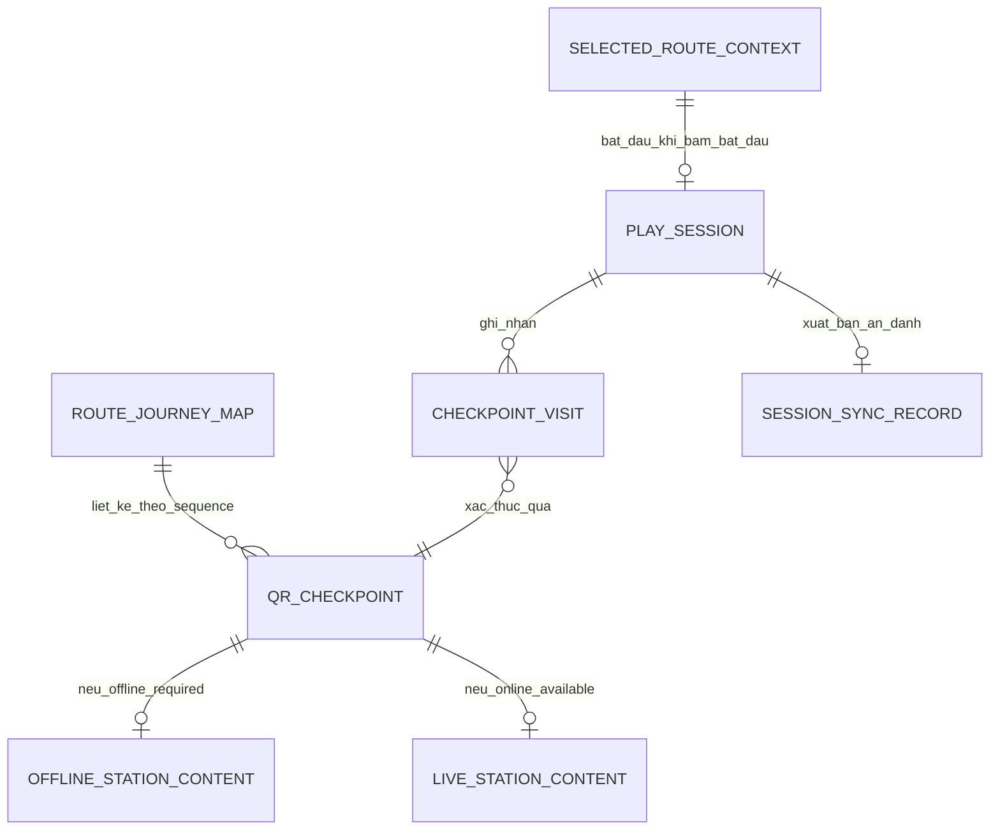
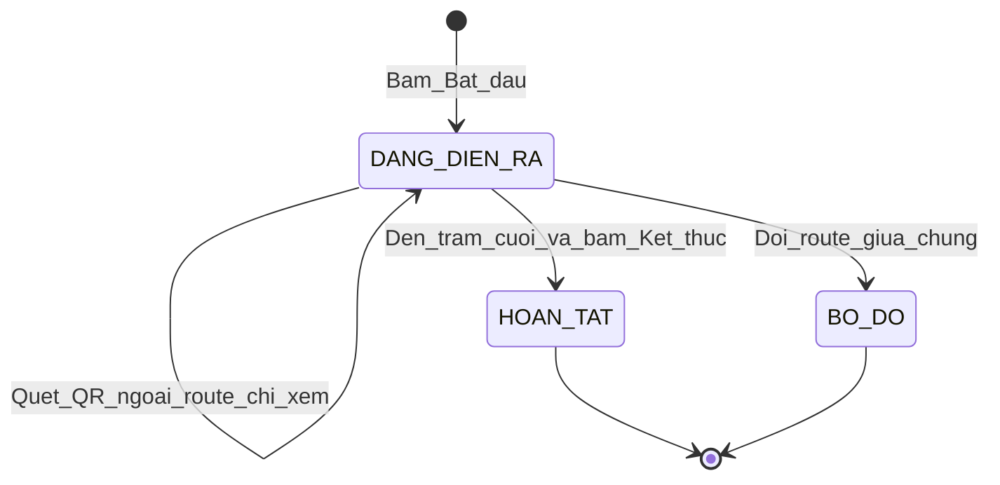
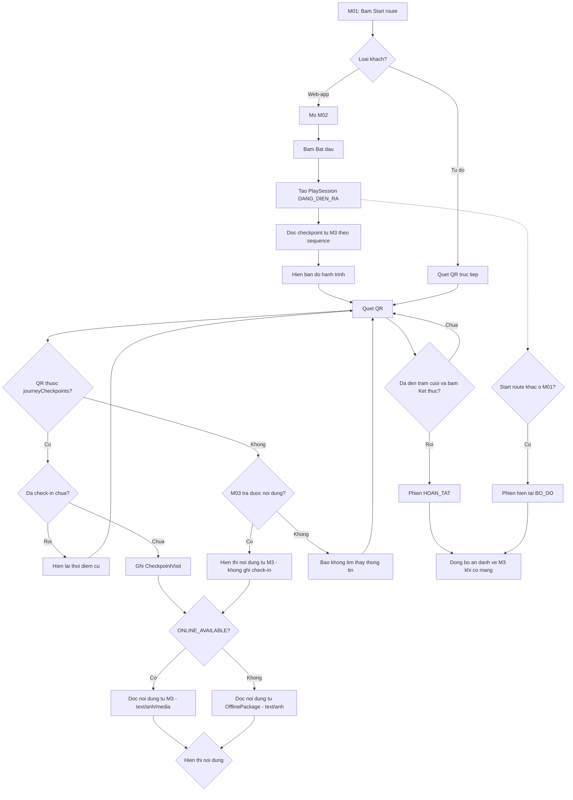

# BUSINESS REQUIREMENTS DOCUMENT — MODULE 2
## Trải nghiệm Khám phá Thực địa — Cúc Phương Quest

---

| Thông tin tài liệu | Nội dung |
|---|---|
| **Module ID** | M02 |
| **Tên tiếng Việt** | Trải nghiệm Khám phá Thực địa |
| **Tên tiếng Anh** | Field Quest Experience |
| **Phiên bản** | v1.3 |
| **Trạng thái** | Ready for FRD/SDD draft — contract MVP với M01/M03 đã chốt |
| **Ngày cập nhật** | 2026-09-21 |
| **Nguồn quyết định** | Các quyết định Module 2 đã chốt đến 2026-09-21 |
| **Template** | Theo cấu trúc `BRD-module-1.md` v2.1 |
| **Dependency bắt buộc** | M01 — Route Planning & Preparation; M03 — Operations & Content Administration |
| **Module nhận dữ liệu từ M02** | M03 — báo cáo vận hành |

> Tài liệu này là specification nghiệp vụ ở cấp module. Tài liệu chỉ gồm Sections 1–3 và phụ lục traceability. API, database vật lý, chi tiết lưu trữ trình duyệt, wireframe và error dictionary thuộc FRD/SDD.

> **Cập nhật v1.3:**
> - Bỏ tính năng Custom Journey (tự chọn checkpoint) — chỉ còn duy nhất một loại hành trình là Route cấu hình sẵn.
> - Bỏ nhãn `tourType` (GUIDED/FREE_FOR_ALL) — không còn hiển thị.
> - Tách tác nhân Du khách thành hai actor riêng biệt.
> - Sửa Decision Table quét QR: cho phép quét cả QR ngoài route; QR ngoài route vẫn hiển thị nội dung, chỉ không ghi nhận check-in.
> - Một checkpoint nhận `qrIdentifiers[]`; QR được phân giải về `checkpointId`, còn check-in và offline resource luôn khóa theo `checkpointId`.
> - Chuẩn hóa nội dung public thành `introductionText`, ánh xạ từ `M03.ThongTinDiemThamQuan.noi_dung_gioi_thieu`.
> - Chỉ đồng bộ `SessionSyncRecord` khi phiên đã `HOAN_TAT` hoặc `BO_DO`; retry ở lần thiết bị có mạng sau.

---

# SECTION 1: TỔNG QUAN MODULE & TÁC NHÂN

## 1.1 Mục đích

M02 đồng hành cùng du khách trong hành trình thực địa: hiển thị bản đồ hành trình, xác thực điểm đến qua QR, mở thông tin giới thiệu (text/ảnh/audio/video tuỳ loại checkpoint) và duy trì liên tục trạng thái trải nghiệm trên thiết bị kể cả khi mất mạng.

M02 đọc ba dữ liệu dùng chung do M01 công bố:

- `LanguagePreference` hiện tại.
- `SelectedRouteContext` sau khi người dùng bấm **Start** ở M01. Từ v1.2, `SelectedRouteContext` chỉ chứa `routeId` của một Route cấu hình sẵn do M03 cung cấp; M02 nhận danh sách checkpoint có thứ tự cuối cùng gọi là `journeyCheckpoints`.
- `OfflinePackage` ở trạng thái `SAN_SANG`, nếu có — chỉ chứa text/ảnh của checkpoint `OFFLINE_REQUIRED`.

M02 đọc trực tiếp từ nguồn M03 (không qua M01):

- Danh sách đầy đủ `QRCheckpoint` của route (gồm cả `ONLINE_AVAILABLE`) để dựng bản đồ hành trình.
- Thông tin giới thiệu/ảnh/audio/video của checkpoint `ONLINE_AVAILABLE` tại thời điểm quét.

M02 sở hữu và không module nào khác được ghi: phiên trải nghiệm (`PlaySession`), lịch sử check-in (`CheckpointVisit`) và việc quyết định phản hồi khi quét QR.

M02 **không** có hệ thống gợi ý (hint) hay cơ chế khám phá thông điệp ẩn riêng biệt.

## 1.2 Phạm vi MVP

### 1.2.1 Trong phạm vi

- Bắt đầu phiên trải nghiệm (`PlaySession`) khi **khách sử dụng web-app** bấm **Bắt đầu**, sau khi hành trình Route đã được Start ở M01.
- Hiển thị bản đồ tĩnh dạng sơ đồ/timeline liệt kê toàn bộ checkpoint của `journeyCheckpoints` theo đúng thứ tự đã chốt lúc Bắt đầu.
- Cập nhật đánh dấu trên bản đồ khi checkpoint được check-in.
- **Cho phép quét QR thoải mái**, kể cả QR không thuộc route hiện tại và kể cả khi chưa bấm Bắt đầu:
  - QR thuộc `journeyCheckpoints` và checkpoint chưa check-in: ghi `CheckpointVisit` + hiển thị nội dung.
  - QR thuộc `journeyCheckpoints` và checkpoint đã check-in: hiển thị thời điểm cũ, không ghi mới.
  - QR ngoài route (không thuộc `journeyCheckpoints`): **vẫn hiển thị nội dung checkpoint** nếu truy xuất được từ M03, chỉ **không ghi nhận check-in**; áp dụng như nhau cho cả hai nhóm du khách.
- Hiển thị thông tin giới thiệu + hình ảnh cho mọi checkpoint đã check-in và cho cả QR ngoài route (nếu đọc được nội dung); audio/video bổ sung tại checkpoint `ONLINE_AVAILABLE`, phát theo yêu cầu của du khách.
- Với checkpoint `OFFLINE_REQUIRED`: nội dung đọc từ `OfflinePackage` do M01 công bố.
- Với checkpoint `ONLINE_AVAILABLE`: nội dung (kể cả audio/video) đọc trực tiếp từ M03 tại chỗ; không preload; các trạm này được xác nhận luôn có kết nối ổn định.
- Cho phép Start route khác bất cứ lúc nào, kể cả giữa phiên đang chạy; phiên đang chạy khi đó chuyển sang trạng thái bỏ dở.
- Không có hành động Tạm dừng chủ động; đóng/mở lại app tự động khôi phục đúng phiên đang chạy.
- Hoàn tất phiên khi du khách đến checkpoint cuối cùng trong `journeyCheckpoints` đã chốt và chủ động bấm **Kết thúc**.
- Lưu liên tục trên thiết bị: thông tin phiên và lịch sử check-in (checkpoint + thời điểm).
- Đồng bộ dữ liệu phiên (ẩn danh) về M03 khi thiết bị có mạng, phục vụ báo cáo vận hành.

### 1.2.2 Ngoài phạm vi

- CRUD route, QRCheckpoint, nội dung, `ConnectivityMode`, sinh mã QR; thuộc M03.
- Tải/quản lý `OfflinePackage`, chọn/đổi `LanguagePreference`, đề xuất route; thuộc M01.
- Hệ thống gợi ý theo kịch bản (hint chain) và cơ chế khám phá thông điệp ẩn riêng biệt.
- Gamification: chấm điểm, bảng xếp hạng, huy hiệu, chứng nhận điện tử.
- Đăng ký/định danh tài khoản du khách; mọi dữ liệu đồng bộ về M03 đều ẩn danh.
- Dẫn đường GPS hoặc bản đồ định vị thời gian thực — bản đồ ở M02 là ảnh tĩnh dạng sơ đồ/timeline.
- Cơ chế fallback/cache/retry cho trường hợp checkpoint `ONLINE_AVAILABLE` mất sóng — các trạm này được xác nhận luôn có kết nối.
- Tuyến đa ngày, cắm trại qua đêm hoặc tuyến bắt buộc hướng dẫn viên đồng hành liên tục (không phù hợp mô hình 1 phiên không tạm dừng của MVP).
- Tính năng tự chọn checkpoint / Custom Journey (đã loại bỏ từ v1.2). M02 chỉ xử lý một loại hành trình duy nhất: Route cấu hình sẵn từ M03.
- Đồng bộ/khôi phục phiên giữa nhiều thiết bị hoặc trình duyệt.
- Backup/khôi phục dữ liệu sau khi người dùng/trình duyệt xóa dữ liệu website (kế thừa nguyên tắc từ M01).
- Nhãn `tourType` (GUIDED/FREE_FOR_ALL) — đã loại bỏ từ v1.2.

## 1.3 Mục tiêu nghiệp vụ

| Mục tiêu ID | Mô tả | KPI cấp cao |
|---|---|---|
| **MO-M02-01** | Kết nối cảnh quan thực tế với câu chuyện và thông điệp bảo tồn đúng tại địa điểm. | Tỷ lệ checkpoint được mở nội dung trên mỗi phiên. |
| **MO-M02-02** | Duy trì hành trình liên tục khi mạng yếu hoặc mất kết nối. | Tỷ lệ phiên tiếp tục được mà không mất tiến trình sau khi ngoại tuyến hoặc mở lại app. |
| **MO-M02-03** | Giảm rào cản kỹ thuật khi khám phá thực địa. | Tỷ lệ quét QR thành công trên tổng lượt quét hợp lệ. |
| **MO-M02-04** | Phục vụ cả khách tự do (chưa mở web) và khách sử dụng web-app: cả hai đều xem được nội dung khi quét QR; chỉ khách web-app mới sinh ra check-in và dữ liệu báo cáo. | Tỷ lệ phiên đồng bộ thành công về M03; 0% bản ghi chứa PII. |
| **MO-M02-05** | Cung cấp dữ liệu vận hành đáng tin cậy cho M03 mà không thu thập thông tin định danh cá nhân. | Tỷ lệ phiên đồng bộ thành công về M03; 0% bản ghi chứa PII. |

## 1.4 Giá trị mang lại

- **Khách sử dụng web-app:** khám phá có hệ thống theo Route, luôn có nội dung text/ảnh dù mất mạng; có thể đổi ý sang tuyến khác bất cứ lúc nào.
- **Khách tự do:** tiếp cận nội dung trạm ngay khi quét QR, không cần tải app/đăng ký; vẫn nhận đầy đủ thông tin giới thiệu, ảnh, audio/video theo khả năng của thiết bị và checkpoint.
- **M01:** chỉ cần bàn giao ba dữ liệu tối thiểu, không phải quan tâm đến tiến trình/lịch sử khám phá.
- **M03:** nhận dữ liệu vận hành ẩn danh, đáng tin cậy để đánh giá mức độ sử dụng tuyến và trạm; không phải duy trì hint chain; không phải phân biệt journeySource.
- **Ban quản lý VQG:** trải nghiệm khớp với thực tế địa hình (đa số tuyến là đường mòn một chiều), không tạo thêm rào cản không cần thiết cho du khách.

## 1.5 Tác nhân và vai trò

| Actor ID | Actor | Vai trò trong M02 |
|---|---|---|
| **ACT-M02-001** | Khách sử dụng web-app | Có chọn route ở M01, bấm Bắt đầu trail, xem bản đồ, quét QR để check-in, xem/mở nội dung, phát audio/video theo ý muốn, bấm Kết thúc. Chỉ nhóm này sinh ra `PlaySession`/`CheckpointVisit` và dữ liệu đồng bộ về M03. |
| **ACT-M02-002** | Khách tự do | Chưa mở web-app, chỉ quét QR tại trạm để xem thông tin. Không sinh phiên, không check-in, không đồng bộ; vẫn xem được nội dung khi quét QR (kể cả QR ngoài route hiện tại, miễn M03 tra được). |
| **ACT-M02-003** | Hệ thống M02 | Quản lý vòng đời `PlaySession`, xác thực QR theo route, đọc nội dung offline/online đúng nguồn, lưu tiến trình cục bộ, đồng bộ dữ liệu ẩn danh về M03. |
| **ACT-M02-004** | Hệ thống M01 | Công bố `LanguagePreference`, `SelectedRouteContext` (chỉ `routeId`), `OfflinePackage SAN_SANG`; không quản lý tiến trình. |
| **ACT-M02-005** | Hệ thống M03 | Nguồn chính thức của Route/QRCheckpoint/nội dung; tiếp nhận dữ liệu đồng bộ ẩn danh từ M02 để báo cáo. |
| **ACT-M02-006** | Ban Quản lý VQG | Cấu hình thứ tự trạm (`sequence`), phân loại `connectivityMode`, phê duyệt nội dung; sử dụng báo cáo tổng hợp từ M03. |

### 1.5.1 Ma trận quyền/hành vi

| Chức năng | Khách web-app | Khách tự do | M02 | M01 | M03 |
|---|---|---|---|---|---|
| Bắt đầu phiên | Bấm Bắt đầu | Không thuộc | Tạo `PlaySession`, chốt `journeyCheckpoints` | Cung cấp `routeId` đã Start | Cung cấp dữ liệu checkpoint |
| Hiển thị bản đồ | Xem | Không thuộc (chưa có phiên) | Dựng từ `journeyCheckpoints` | Không thuộc | Cung cấp danh sách checkpoint + `sequence` |
| Quét QR thuộc route | Check-in + xem nội dung | Xem nội dung (không check-in) | Xử lý theo QR-M02-02/03 | Không thuộc | Cung cấp `qrIdentifier`/`connectivityMode` + nội dung |
| Quét QR ngoài route | Xem nội dung (không check-in) | Xem nội dung (không check-in) | Tra M03; hiển thị nội dung nếu có; không ghi nhận | Không thuộc | Cung cấp nội dung nếu checkpoint tồn tại trong hệ thống |
| Nội dung offline | Xem | Không có offline (không tải package) | Đọc `OfflinePackage` cho web-app | Công bố gói `SAN_SANG` | Cung cấp nguồn gốc nội dung cho M01 đóng gói |
| Nội dung online | Xem/phát media | Xem/phát media nếu có mạng | Đọc trực tiếp | Không thuộc | Cung cấp nội dung sống (text/ảnh/audio/video) |
| Đổi route giữa chừng | Bấm Start route khác ở M01 | Không thuộc | Chuyển phiên hiện tại sang bỏ dở | Ghi đè `SelectedRouteContext` | Không thuộc |
| Kết thúc phiên | Bấm Kết thúc tại trạm cuối | Không thuộc | Ghi `HOAN_TAT` | Không thuộc | Không thuộc |
| Đồng bộ báo cáo | Không thao tác trực tiếp | Không thuộc | Gửi dữ liệu ẩn danh khi có mạng | Không thuộc | Nhận, upsert theo `sessionId`, tổng hợp báo cáo |

### 1.5.2 Luồng trách nhiệm

```text
M01 --[LanguagePreference, SelectedRouteContext.routeId, OfflinePackage SAN_SANG]--> M02
M03 --[Route/QRCheckpoint đầy đủ + sequence]---------------------------------> M02
M03 --[LiveStationContent cho checkpoint ONLINE_AVAILABLE]--------------------> M02
M03 --[LiveStationContent cho checkpoint bất kỳ khi quét QR ngoài route]-------> M02
M02 --[PlaySession + CheckpointVisit, ẩn danh, khi có mạng]-------------------> M03
```

## 1.6 Dependencies, ràng buộc và giả định

| ID | Loại | Nội dung |
|---|---|---|
| **DEP-M02-001** | M01 | M02 phụ thuộc `LanguagePreference`, `SelectedRouteContext.routeId` và `OfflinePackage SAN_SANG` do M01 công bố; không đọc state nội bộ khác của M01. |
| **DEP-M02-002** | M03 | M03 là nguồn chính thức của Route, QRCheckpoint (kể cả `sequence`, `connectivityMode`), và nội dung trực tiếp cho checkpoint `ONLINE_AVAILABLE`. M02 cũng đọc trực tiếp M03 khi khách quét QR ngoài route. |
| **REL-M02-001** | M01 | M02 chỉ đọc; không ghi/sửa `SelectedRouteContext`, `LanguagePreference` hoặc `OfflinePackage`. |
| **REL-M02-002** | M03 | M03 chịu trách nhiệm phân loại `connectivityMode` chính xác theo tình trạng sóng thực tế; M02 không có cơ chế dự phòng nếu phân loại sai. |
| **CON-M02-001** | Phiên | Tối đa một `PlaySession` ở trạng thái đang diễn ra trên một thiết bị tại một thời điểm. |
| **CON-M02-002** | Phiên | Không có hành động Tạm dừng chủ động; khôi phục sau khi đóng/mở lại app là hành vi kỹ thuật bắt buộc, không phải một loại tạm dừng. |
| **CON-M02-003** | Lưu trữ | Dữ liệu `PlaySession` và `CheckpointVisit` lưu cục bộ liên tục trên thiết bị (cùng cơ chế lưu trữ offline với M01), độc lập với trạng thái mạng. |
| **CON-M02-004** | Xác thực QR | QR hợp lệ để ghi nhận check-in là QR thuộc `journeyCheckpoints` hiện tại; không có ràng buộc về thứ tự quét. QR ngoài `journeyCheckpoints` vẫn được M02 tra M03 và hiển thị nội dung (nếu có), nhưng không ghi nhận check-in và không sinh dữ liệu báo cáo. |
| **CON-M02-005** | Đồng bộ | Dữ liệu gửi về M03 không chứa thông tin định danh cá nhân của du khách. |
| **ASM-M02-001** | Kết nối | Mọi checkpoint được M3 phân loại `ONLINE_AVAILABLE` có kết nối ổn định tại vị trí thực địa; không xảy ra tình trạng mất sóng/sóng yếu tạm thời tại các trạm này. |
| **ASM-M02-002** | Phạm vi tuyến | MVP chỉ áp dụng cho tuyến tham quan trong ngày; không bao gồm tuyến đa ngày/cắm trại qua đêm hoặc tuyến bắt buộc hướng dẫn viên đồng hành liên tục. |
| **ASM-M02-003** | Thiết bị | Thiết bị có camera hoạt động và quyền truy cập camera được cấp cho trình duyệt. |
| **ASM-M02-004** | Vật lý | Mã QR vật lý được Ban quản lý lắp đặt đúng trạm và bảo trì định kỳ (kế thừa giả định gốc của dự án). |
| **ASM-M02-005** | Khách tự do | Khách tự do có thiết bị cá nhân và trình duyệt hỗ trợ quét QR; chấp nhận trải nghiệm không có offline (chỉ xem được khi có mạng) và không có tiến trình được lưu. |

---

# SECTION 2: DOMAIN ENTITIES & STATE MACHINE

## 2.1 Danh sách Domain Entities

| Entity ID | Entity | Mô tả | Data owner |
|---|---|---|---|
| **ENT-M02-001** | PlaySession | Phiên trải nghiệm của khách web-app trên một thiết bị. | M02 |
| **ENT-M02-002** | CheckpointVisit | Bản ghi check-in một checkpoint trong một phiên. | M02 |
| **ENT-M02-003** | RouteJourneyMap | Danh sách checkpoint có thứ tự của `journeyCheckpoints` (nguồn Route cấu hình sẵn), dùng để dựng bản đồ. | Nguồn M01/M03; bản cục bộ M02 |
| **ENT-M02-004** | OfflineStationContent | Storytelling + ảnh của checkpoint `OFFLINE_REQUIRED`, đọc từ `OfflinePackage`. | Sở hữu bởi M01 (ENT-006 của M01); M02 chỉ đọc |
| **ENT-M02-005** | LiveStationContent | Storytelling + ảnh + audio/video của checkpoint `ONLINE_AVAILABLE` hoặc của checkpoint được quét bất kỳ, đọc trực tiếp từ M03. | Nguồn M03; không lưu cục bộ |
| **ENT-M02-006** | SessionSyncRecord | Bản ghi ẩn danh của một phiên gửi về M03 để báo cáo. | M02 tạo; M03 lưu trữ |

### 2.1.1 Entity Relationship Diagram



## 2.2 Chi tiết Entity

### ENT-M02-001 — PlaySession

| Thuộc tính | Kiểu logic | Mô tả | Ràng buộc |
|---|---|---|---|
| `sessionId` | Text | Mã phiên, sinh cục bộ, ẩn danh. | Duy nhất trên thiết bị. |
| `routeId` | Text | Route của phiên. | Lấy từ `SelectedRouteContext.routeId` tại thời điểm bấm Bắt đầu. |
| `journeyCheckpoints` | Array<Text> | Danh sách `checkpointId` có thứ tự của toàn bộ hành trình. | Chốt một lần tại thời điểm bấm Bắt đầu; không đổi trong suốt phiên dù dữ liệu nguồn (Route) thay đổi sau đó. |
| `status` | Enum | `DANG_DIEN_RA`, `HOAN_TAT`, `BO_DO`. | Theo SM-M02-001. |
| `startedAt` | DateTime | Thời điểm bấm Bắt đầu. | Bắt buộc. |
| `endedAt` | DateTime | Thời điểm chuyển `HOAN_TAT` hoặc `BO_DO`. | Chỉ có khi phiên đã kết thúc. |
| `syncedAt` | DateTime | Lần gửi thành công gần nhất về M03. | Rỗng nếu chưa từng đồng bộ. |

Không chứa bất kỳ thông tin định danh cá nhân nào của du khách.

**Business Rules:** BR-M02-001 đến BR-M02-005, BR-M02-021 đến BR-M02-024.

### ENT-M02-002 — CheckpointVisit

| Thuộc tính | Kiểu logic | Mô tả | Ràng buộc |
|---|---|---|---|
| `sessionId` | Text | Phiên chứa lượt check-in. | Bắt buộc. |
| `checkpointId` | Text | Checkpoint được check-in. | Bắt buộc; khớp `QRCheckpoint` của M03. |
| `qrIdentifier` | Text | Giá trị QR đã quét. | Dùng để tra cứu ngược nội dung. |
| `checkedInAt` | DateTime | Thời điểm check-in đầu tiên. | Chỉ ghi một lần; quét lặp không tạo bản ghi mới. |

Tổ hợp `(sessionId, checkpointId)` là duy nhất. `CheckpointVisit` chỉ được ghi khi QR thuộc `journeyCheckpoints` của phiên hiện tại.

**Business Rules:** BR-M02-009 đến BR-M02-012.

### ENT-M02-003 — RouteJourneyMap

| Thuộc tính | Kiểu logic | Mô tả | Ràng buộc |
|---|---|---|---|
| `routeId` | Text | Route của phiên. | Khớp `PlaySession.routeId`. |
| `checkpoints` | Array<Object> | Danh sách `{checkpointId, orderIndex, qrIdentifiers[], connectivityMode}` theo đúng thứ tự `journeyCheckpoints`. | `orderIndex` khớp `sequence` do M03 cấu hình; `qrIdentifiers` chứa toàn bộ QR `HOAT_DONG` của điểm. |
| `fetchedAt` | DateTime | Thời điểm lấy dữ liệu thành công gần nhất. | Dùng làm bản cache khi tạm thời không có mạng ngay lúc mở M02. |

M02 chỉ đọc; không được sửa thứ tự hoặc `connectivityMode`.

**Business Rules:** BR-M02-006 đến BR-M02-008.

### ENT-M02-004 — OfflineStationContent

| Thuộc tính | Kiểu logic | Mô tả | Ràng buộc |
|---|---|---|---|
| `checkpointId` | Text | Checkpoint `OFFLINE_REQUIRED`. | Bắt buộc. |
| `localizedContent.vi/en.introductionText` | Text | Thông tin giới thiệu song ngữ. | Đọc nguyên trạng từ `OfflinePackage.resources` của M01. |
| `staticImages` | Array<BlobRef> | Ảnh tĩnh đã tải sẵn. | Không có audio/video. |

Entity này là view chỉ-đọc của `OfflineResource` (ENT-006, M01); M02 không tạo bản sao ghi được. Chỉ áp dụng cho khách web-app đã tải `OfflinePackage`.

**Business Rules:** BR-M02-013, BR-M02-017.

### ENT-M02-005 — LiveStationContent

| Thuộc tính | Kiểu logic | Mô tả | Ràng buộc |
|---|---|---|---|
| `checkpointId` | Text | Checkpoint `ONLINE_AVAILABLE`, hoặc checkpoint bất kỳ khi M02 tra cho QR ngoài route. | Bắt buộc. |
| `localizedContent.vi/en.introductionText` | Text | Thông tin giới thiệu song ngữ. | Ánh xạ từ `ThongTinDiemThamQuan.noi_dung_gioi_thieu` của M03 tại thời điểm quét. |
| `staticImages` | Array<URL/BlobRef> | Ảnh minh hoạ. | Không preload, không lưu offline. |
| `mediaResources` | Array<Object> | `{type: audio\|video, sourceRef}`. | Phát theo yêu cầu; không tự động phát. |

Không lưu cục bộ dưới bất kỳ hình thức nào; mỗi lần hiển thị là một lần đọc mới từ M03. Áp dụng như nhau cho cả hai nhóm du khách (web-app và tự do).

**Business Rules:** BR-M02-014 đến BR-M02-016.

### ENT-M02-006 — SessionSyncRecord

| Thuộc tính | Kiểu logic | Mô tả | Ràng buộc |
|---|---|---|---|
| `sessionId` | Text | Khoá upsert khi đồng bộ. | Bắt buộc, duy nhất. |
| `routeId` | Text | Route của phiên. | Bắt buộc. |
| `startedAt`, `endedAt` | DateTime | Mốc thời gian phiên. | Cả hai bắt buộc; chỉ tạo record sau khi phiên kết thúc. |
| `status` | Enum | `HOAN_TAT`, `BO_DO`. | Không đồng bộ phiên `DANG_DIEN_RA`. |
| `visitedCheckpoints` | Array<Object> | `{checkpointId, checkedInAt}`. | Không chứa nội dung giới thiệu, chỉ danh sách + thời điểm. |

Không có trường nào định danh cá nhân, thiết bị vật lý hoặc vị trí GPS. Chỉ sinh ra từ phiên của khách web-app.

**Business Rules:** BR-M02-021 đến BR-M02-024.

## 2.3 State Machine

### 2.3.1 SM-M02-001 — Trạng thái PlaySession

| Trạng thái hiện tại | Event | Guard | Action | Trạng thái tiếp theo | BR |
|---|---|---|---|---|---|
| Khởi tạo | Bấm Bắt đầu | `SelectedRouteContext.routeId` tồn tại; không có phiên nào khác đang `DANG_DIEN_RA` | Tạo `PlaySession`; chốt `journeyCheckpoints`; ghi `startedAt` | `DANG_DIEN_RA` | BR-M02-001, 002 |
| `DANG_DIEN_RA` | Quét QR thuộc `journeyCheckpoints`, checkpoint mới | QR khớp `journeyCheckpoints` | Ghi `CheckpointVisit`; hiển thị nội dung | `DANG_DIEN_RA` | BR-M02-009, 011 |
| `DANG_DIEN_RA` | Quét QR thuộc `journeyCheckpoints`, checkpoint đã check-in | — | Đọc lại `checkedInAt`; hiển thị lại | `DANG_DIEN_RA` | BR-M02-012 |
| `DANG_DIEN_RA` | Quét QR ngoài `journeyCheckpoints` | M03 trả được nội dung cho `qrIdentifier` | Tra M03; hiển thị nội dung; **không ghi `CheckpointVisit`** | `DANG_DIEN_RA` | BR-M02-018 |
| `DANG_DIEN_RA` | Đóng/mở lại app | Vẫn còn `PlaySession` ở `DANG_DIEN_RA` cục bộ | Khôi phục đúng phiên, không tạo phiên mới | `DANG_DIEN_RA` | BR-M02-003 |
| `DANG_DIEN_RA` | `SelectedRouteContext` đổi (Start route khác ở M01) | — | Ghi `endedAt`; giữ nguyên `CheckpointVisit` đã có | `BO_DO` | BR-M02-004 |
| `DANG_DIEN_RA` | Bấm Kết thúc | Checkpoint cuối cùng trong `journeyCheckpoints` đã được check-in | Ghi `endedAt` | `HOAN_TAT` | BR-M02-005, 019 |
| `HOAN_TAT` / `BO_DO` | Có mạng | Chưa `syncedAt` hoặc dữ liệu thay đổi kể từ lần đồng bộ trước | Gửi `SessionSyncRecord` về M03 | Không đổi (trạng thái cuối) | BR-M02-020 đến 023 |

> **Lưu ý:** Khách tự do (ACT-M02-002) không có `PlaySession`, không có event nào trong state machine này. Hành vi của nhóm này chỉ là đọc nội dung checkpoint từ M03 qua thao tác quét QR, không tạo/cập nhật phiên.



#### Ràng buộc trạng thái

- `HOAN_TAT` và `BO_DO` là trạng thái cuối; không có event nào đưa phiên quay lại `DANG_DIEN_RA`.
- Tại một thời điểm, thiết bị chỉ có tối đa một `PlaySession` ở `DANG_DIEN_RA`.
- Không có event "Tạm dừng"; khôi phục sau khi đóng/mở lại app không đổi trạng thái.
- Dữ liệu `CheckpointVisit` của một phiên không bị xoá khi phiên chuyển `BO_DO`.

## 2.4 Business Rule Catalog

| BR Code | Tên quy tắc | Mô tả | Ưu tiên |
|---|---|---|---|
| **BR-M02-001** | Bắt đầu phiên | `PlaySession` chỉ được tạo khi khách web-app bấm Bắt đầu tại M02, sau khi `SelectedRouteContext.routeId` đã tồn tại từ M01. | Critical |
| **BR-M02-002** | Một phiên/thiết bị | Tại một thời điểm, thiết bị chỉ có tối đa một `PlaySession` ở trạng thái `DANG_DIEN_RA`. | Critical |
| **BR-M02-003** | Không tạm dừng chủ động | Không có hành động Tạm dừng; đóng/mở lại app tự động khôi phục đúng phiên `DANG_DIEN_RA` hiện có. | Critical |
| **BR-M02-004** | Đổi route giữa chừng | Khi `SelectedRouteContext.routeId` đổi trong lúc có phiên `DANG_DIEN_RA`, phiên hiện tại chuyển `BO_DO` ngay lập tức; `CheckpointVisit` đã có được giữ nguyên. | Major |
| **BR-M02-005** | Hoàn tất phiên | Phiên chuyển `HOAN_TAT` chỉ khi checkpoint cuối cùng trong `journeyCheckpoints` đã được check-in và khách web-app chủ động bấm Kết thúc. | Critical |
| **BR-M02-006** | Bản đồ hành trình | Sau khi bấm Bắt đầu, hệ thống hiển thị bản đồ tĩnh dạng sơ đồ/timeline liệt kê toàn bộ checkpoint của `journeyCheckpoints` theo đúng thứ tự đã chốt. | Critical |
| **BR-M02-007** | Nguồn dữ liệu bản đồ | Danh sách checkpoint đầy đủ (gồm cả `ONLINE_AVAILABLE` và `OFFLINE_REQUIRED`) được M02 đọc trực tiếp từ M3 theo `sequence`, không qua M1. | Critical |
| **BR-M02-008** | Cập nhật bản đồ theo tiến trình | Mỗi khi có checkpoint được check-in, bản đồ cập nhật đánh dấu trạm đó đã ghé thăm. | Major |
| **BR-M02-009** | Check-in lần đầu | Khi QR thuộc `journeyCheckpoints` và checkpoint chưa từng check-in trong phiên hiện tại, hệ thống ghi `CheckpointVisit` mới và hiển thị nội dung trạm. | Critical |
| **BR-M02-010** | Không ép buộc thứ tự | Quét QR hợp lệ được chấp nhận bất kể thứ tự hiển thị trên bản đồ; hệ thống không chặn hoặc cảnh báo lệch thứ tự. | Major |
| **BR-M02-011** | Check-in lặp lại | Khi QR thuộc `journeyCheckpoints` và checkpoint đã check-in trong phiên hiện tại, hệ thống không tạo bản ghi mới; chỉ đọc lại `checkedInAt` và hiển thị "bạn đã khám phá trạm này lúc [giờ:phút]". | Major |
| **BR-M02-012** | Mở nội dung là tùy chọn | Check-in xác nhận khách web-app đã đến điểm; việc mở xem nội dung sau đó là lựa chọn của du khách, không ảnh hưởng trạng thái check-in đã ghi. | Major |
| **BR-M02-013** | Nội dung offline | Với checkpoint `OFFLINE_REQUIRED`, nội dung hiển thị (text + ảnh) đọc từ `OfflinePackage` do M01 công bố; không có audio/video. Áp dụng cho khách web-app đã tải gói offline. | Critical |
| **BR-M02-014** | Nội dung online | Với checkpoint `ONLINE_AVAILABLE`, nội dung (text + ảnh + audio/video) đọc trực tiếp từ M03 tại thời điểm quét; không preload, không lưu offline, không qua M01. | Critical |
| **BR-M02-015** | Kết nối tại trạm online | Checkpoint `ONLINE_AVAILABLE` được xác nhận có kết nối ổn định tại thực địa; M02 không cần cơ chế fallback khi mất sóng tại các trạm này. | Major |
| **BR-M02-016** | Phát media theo yêu cầu | Audio/video tại checkpoint `ONLINE_AVAILABLE` chỉ phát khi du khách chủ động chọn; không tự động phát. | Major |
| **BR-M02-017** | Ngôn ngữ nội dung | M02 hiển thị `introductionText` theo nhánh `vi/en` khớp `LanguagePreference` hiện tại, dù đọc từ `OfflinePackage` hay từ M03. Áp dụng cho cả hai nhóm du khách. | Critical |
| **BR-M02-018** | QR ngoài route vẫn xem được nội dung | Khi du khách (cả web-app lẫn tự do) quét QR không thuộc `journeyCheckpoints` hiện tại, M02 vẫn tra M03 theo `qrIdentifier` và hiển thị nội dung nếu tra được. **Không** tạo `CheckpointVisit`, **không** thông báo lỗi, **không** ảnh hưởng `SelectedRouteContext`. | Major |
| **BR-M02-019** | Trạm cuối tổng quát | "Trạm cuối" của một phiên luôn là phần tử cuối cùng trong `journeyCheckpoints` đã chốt tại thời điểm Bắt đầu. | Critical |
| **BR-M02-020** | Nút Kết thúc có điều kiện | Nút Kết thúc chỉ hiển thị/khả dụng sau khi checkpoint cuối cùng trong `journeyCheckpoints` đã được check-in. | Major |
| **BR-M02-021** | Lưu tiến trình offline | Trong lúc phiên `DANG_DIEN_RA`, M02 lưu liên tục trên thiết bị: thông tin phiên và danh sách `CheckpointVisit`. | Critical |
| **BR-M02-022** | Không mất tiến trình | Tải lại trang hoặc thay đổi kết nối mạng giữa chừng không được làm mất hoặc ghi lùi dữ liệu `CheckpointVisit` đã lưu hợp lệ. | Critical |
| **BR-M02-023** | Đồng bộ về M03 | Khi phiên chuyển `HOAN_TAT` hoặc `BO_DO` và thiết bị có mạng, M02 gửi `SessionSyncRecord` gồm `sessionId`, `routeId`, mốc thời gian, danh sách checkpoint đã check-in kèm thời điểm và trạng thái cuối. | Major |
| **BR-M02-024** | Ẩn danh | Dữ liệu đồng bộ không chứa bất kỳ thông tin định danh cá nhân nào của du khách. | Critical |
| **BR-M02-025** | Thời điểm đồng bộ | Chỉ đồng bộ phiên đã kết thúc. Nếu kết thúc khi offline hoặc gửi thất bại, giữ record cục bộ và thử lại khi ứng dụng phát hiện có mạng ở lần sử dụng sau. | Major |
| **BR-M02-026** | Chống trùng đồng bộ | M03 dùng `sessionId` làm khoá upsert khi nhận dữ liệu đồng bộ để tránh nhân đôi bản ghi khi gửi lại do lỗi mạng giữa chừng. | Major |
| **BR-M02-027** | Không ghi dữ liệu nguồn M01/M03 | M02 chỉ đọc `SelectedRouteContext`, `LanguagePreference`, `OfflinePackage` (M01) và Route/QRCheckpoint/nội dung (M03); không ghi/sửa các store này. | Critical |
| **BR-M02-028** | Không có hint system | M02 không cung cấp cơ chế gợi ý theo kịch bản hay khám phá thông điệp ẩn; chỉ hiển thị thông tin giới thiệu điểm tham quan. | Major |
| **BR-M02-029** | Phạm vi tuyến | M02 chỉ áp dụng cho route thuộc phạm vi tuyến trong ngày theo `ASM-M02-002`; không xử lý route đa ngày. | Minor |
| **BR-M02-030** | Khách tự do không sinh phiên | Khách tự do (ACT-M02-002) chỉ thực hiện hành vi đọc nội dung khi quét QR; không tạo `PlaySession`, không ghi `CheckpointVisit`, không đồng bộ bất kỳ dữ liệu nào về M03. | Major |

### 2.4.1 Decision Table — Xử lý khi quét QR

| Rule | Điều kiện | Kết quả |
|---|---|---|
| **QR-M02-01** | QR thuộc `journeyCheckpoints` hiện tại, checkpoint chưa check-in trong phiên | Ghi `CheckpointVisit` mới; hiển thị nội dung trạm |
| **QR-M02-02** | QR thuộc `journeyCheckpoints` hiện tại, checkpoint đã check-in trong phiên | Không ghi mới; hiển thị "bạn đã khám phá trạm này lúc x giờ x phút" |
| **QR-M02-03** | QR không thuộc `journeyCheckpoints` hiện tại, M03 trả được nội dung cho `qrIdentifier` | Hiển thị nội dung trạm từ M03; **không** ghi `CheckpointVisit`; **không** hiển thị thông báo lỗi/check-in |
| **QR-M02-04** | QR không thuộc `journeyCheckpoints` hiện tại, M03 không trả được nội dung cho `qrIdentifier` | Hiển thị "không tìm thấy thông tin cho mã QR này"; **không** ghi nhận |
| **QR-M02-05** | `connectivityMode = OFFLINE_REQUIRED` | Nội dung lấy từ `OfflinePackage` (M01); chỉ text + ảnh. Áp dụng cho khách web-app đã tải gói; khách tự do không có offline. |
| **QR-M02-06** | `connectivityMode = ONLINE_AVAILABLE` | Nội dung lấy trực tiếp từ M03; gồm text + ảnh + audio/video theo yêu cầu. Áp dụng cho cả hai nhóm du khách khi có mạng. |

> **Tổng quát:** M02 không giới hạn việc quét QR — cả khách web-app và khách tự do đều có thể quét bất kỳ QR nào. Phân biệt duy nhất nằm ở việc có `PlaySession` (web-app) hay không (tự do): có phiên thì QR trong `journeyCheckpoints` mới ghi `CheckpointVisit`; quét QR không thuộc route bao giờ cũng chỉ dẫn tới hiển thị nội dung, không sinh dữ liệu báo cáo.

---

# SECTION 3: QUY TRÌNH NGHIỆP VỤ & KỊCH BẢN KIỂM THỬ

## 3.1 Danh sách Business Flows

| Flow ID | Tên flow | Actor chính |
|---|---|---|
| **FLO-M02-01** | Bắt đầu phiên & hiển thị bản đồ | ACT-M02-001 (khách web-app) |
| **FLO-M02-02** | Quét QR thuộc route & check-in trạm mới | ACT-M02-001 |
| **FLO-M02-03** | Quét lại trạm đã check-in | ACT-M02-001 |
| **FLO-M02-04** | Quét QR ngoài route — vẫn xem nội dung | ACT-M02-001 / ACT-M02-002 |
| **FLO-M02-05** | Xem nội dung trạm offline | ACT-M02-001 |
| **FLO-M02-06** | Xem nội dung trạm online & phát media | ACT-M02-001 / ACT-M02-002 |
| **FLO-M02-07** | Đổi route giữa chừng (bỏ dở phiên) | ACT-M02-001 |
| **FLO-M02-08** | Khôi phục phiên khi mở lại app | ACT-M02-003 |
| **FLO-M02-09** | Hoàn tất phiên | ACT-M02-001 |
| **FLO-M02-10** | Đồng bộ dữ liệu phiên về M3 | ACT-M02-003 |
| **FLO-M02-11** | Khách tự do quét QR xem nội dung | ACT-M02-002 |

## 3.2 Luồng tổng quan



## 3.3 Chi tiết Business Flows

### FLO-M02-01 — Bắt đầu phiên & hiển thị bản đồ

**Actor chính:** Khách web-app (ACT-M02-001)
**Pre-conditions:** `SelectedRouteContext.routeId` tồn tại (đã Start ở M01); không có `PlaySession` nào khác đang `DANG_DIEN_RA`.
**Post-conditions:** `PlaySession` ở trạng thái `DANG_DIEN_RA` với `journeyCheckpoints` đã chốt; bản đồ hành trình hiển thị.

| Bước | Actor | Hành động | Phản hồi | BR |
|---|---|---|---|---|
| 1 | Khách web-app | Bấm Bắt đầu | Tạo `PlaySession`, ghi `startedAt`, `routeId` | BR-M02-001, 002 |
| 2 | M02 | Đọc danh sách checkpoint đầy đủ từ M03 | Chốt `journeyCheckpoints` theo `sequence` | BR-M02-006, 007 |
| 3 | M02 | Hiển thị bản đồ tĩnh dạng sơ đồ/timeline | Khách thấy toàn bộ trạm của `journeyCheckpoints` | BR-M02-006 |

### FLO-M02-02 — Quét QR thuộc route & check-in trạm mới

**Actor chính:** Khách web-app (ACT-M02-001)
**Pre-conditions:** Có `PlaySession` ở `DANG_DIEN_RA`.
**Post-conditions:** `CheckpointVisit` mới được ghi; nội dung trạm hiển thị.

| Bước | Actor | Hành động | Phản hồi | BR |
|---|---|---|---|---|
| 1 | Khách web-app | Quét QR bằng camera | Phân giải `qrIdentifier` về `checkpointId`, rồi đối chiếu `checkpointId` với `journeyCheckpoints` hiện tại | QR-M02-01 |
| 2 | M02 | QR thuộc route, checkpoint mới | Ghi `CheckpointVisit(checkpointId, checkedInAt)` | BR-M02-009 |
| 3 | M02 | Cập nhật bản đồ | Đánh dấu checkpoint đã ghé | BR-M02-008 |
| 4 | Khách web-app | Chọn mở nội dung (tuỳ chọn) | Thực hiện FLO-M02-05 hoặc FLO-M02-06 tuỳ `connectivityMode` | BR-M02-012, 013, 014 |

### FLO-M02-03 — Quét lại trạm đã check-in

**Actor chính:** Khách web-app (ACT-M02-001)
**Pre-conditions:** Checkpoint đã có `CheckpointVisit` trong phiên hiện tại.
**Post-conditions:** Không tạo bản ghi mới.

| Bước | Actor | Hành động | Phản hồi | BR |
|---|---|---|---|---|
| 1 | Khách web-app | Quét lại QR đã check-in | Đối chiếu, phát hiện đã tồn tại `CheckpointVisit` | QR-M02-02 |
| 2 | M02 | Đọc lại `checkedInAt` cũ | Hiển thị "bạn đã khám phá trạm này lúc x giờ x phút" | BR-M02-011 |

### FLO-M02-04 — Quét QR ngoài route

**Actor chính:** Khách web-app (ACT-M02-001) hoặc Khách tự do (ACT-M02-002)
**Pre-conditions:** Có thể có hoặc không có `PlaySession` ở `DANG_DIEN_RA` (với khách tự do thì không có).
**Post-conditions:** Không ghi `CheckpointVisit`; `SelectedRouteContext` không đổi.

| Bước | Actor | Hành động | Phản hồi | BR |
|---|---|---|---|---|
| 1 | Du khách | Quét QR không thuộc `journeyCheckpoints` hiện tại | M02 đối chiếu với `journeyCheckpoints` của phiên (nếu có) | QR-M02-03 |
| 2 | M02 | Tra M03 theo `qrIdentifier` | Nhận nội dung nếu M03 có checkpoint tương ứng | BR-M02-018 |
| 3a | M02 | M03 trả được nội dung | Hiển thị nội dung cho cả hai nhóm du khách; **không** ghi `CheckpointVisit`, **không** thông báo lỗi/check-in | BR-M02-018, 030 |
| 3b | M02 | M03 không trả được nội dung | Hiển thị "không tìm thấy thông tin cho mã QR này" | QR-M02-04 |

### FLO-M02-05 — Xem nội dung trạm offline

**Actor chính:** Khách web-app (ACT-M02-001)
**Pre-conditions:** Checkpoint `OFFLINE_REQUIRED` đã check-in; `OfflinePackage SAN_SANG` có sẵn (nếu khách đã tải ở M01).
**Post-conditions:** Nội dung text + ảnh hiển thị đúng ngôn ngữ.

| Bước | Actor | Hành động | Phản hồi | BR |
|---|---|---|---|---|
| 1 | M02 | Sau khi phân giải QR, tra `resourceIndex` trong `OfflinePackage` theo `checkpointId` | Lấy `OfflineStationContent` | BR-M02-013 |
| 2 | M02 | Chọn nhánh `vi/en` theo `LanguagePreference` | Hiển thị `introductionText` + ảnh | BR-M02-017 |

### FLO-M02-06 — Xem nội dung trạm online & phát media

**Actor chính:** Khách web-app (ACT-M02-001) hoặc Khách tự do (ACT-M02-002)
**Pre-conditions:** Checkpoint `ONLINE_AVAILABLE` đã check-in (với web-app) hoặc QR được quét (cả hai nhóm).
**Post-conditions:** Nội dung text + ảnh hiển thị; media phát nếu du khách chọn.

| Bước | Actor | Hành động | Phản hồi | BR |
|---|---|---|---|---|
| 1 | M02 | Gọi M03 lấy `LiveStationContent` theo `checkpointId` | Nhận text/ảnh/media song ngữ | BR-M02-014, 015 |
| 2 | M02 | Hiển thị `introductionText` + ảnh theo `LanguagePreference` | — | BR-M02-017 |
| 3 | Du khách | Chọn phát audio/video (tuỳ chọn) | Phát media theo yêu cầu | BR-M02-016 |

### FLO-M02-07 — Đổi route giữa chừng (bỏ dở phiên)

**Actor chính:** Khách web-app (ACT-M02-001)
**Pre-conditions:** Có `PlaySession` ở `DANG_DIEN_RA`; khách quay lại M01 và Start route khác.
**Post-conditions:** Phiên cũ `BO_DO`; phiên mới có thể được tạo cho route mới.

| Bước | Actor | Hành động | Phản hồi | BR |
|---|---|---|---|---|
| 1 | Khách web-app | Ở M01, bấm Start route khác | M01 ghi đè `SelectedRouteContext.routeId` | BR-M01-025 |
| 2 | M02 | Phát hiện `SelectedRouteContext` đổi | Chuyển `PlaySession` hiện tại sang `BO_DO`, ghi `endedAt` | BR-M02-004 |
| 3 | M02 | Giữ nguyên `CheckpointVisit` đã ghi | Dữ liệu sẵn sàng cho đồng bộ | BR-M02-004 |
| 4 | Khách web-app | Bấm Bắt đầu cho route mới | Thực hiện lại FLO-M02-01 | BR-M02-001 |

### FLO-M02-08 — Khôi phục phiên khi mở lại app

**Actor chính:** Hệ thống M02 (ACT-M02-003)
**Pre-conditions:** Có `PlaySession` ở `DANG_DIEN_RA` lưu cục bộ từ trước.
**Post-conditions:** Phiên tiếp tục đúng trạng thái, không tạo phiên mới.

| Bước | Actor | Hành động | Phản hồi | BR |
|---|---|---|---|---|
| 1 | Khách web-app | Đóng rồi mở lại app | M02 đọc `PlaySession` cục bộ | BR-M02-003 |
| 2 | M02 | Tìm thấy phiên `DANG_DIEN_RA` | Khôi phục bản đồ và danh sách checkpoint đã check-in | BR-M02-003, 008 |

### FLO-M02-09 — Hoàn tất phiên

**Actor chính:** Khách web-app (ACT-M02-001)
**Pre-conditions:** Checkpoint cuối cùng trong `journeyCheckpoints` đã được check-in.
**Post-conditions:** `PlaySession` chuyển `HOAN_TAT`.

| Bước | Actor | Hành động | Phản hồi | BR |
|---|---|---|---|---|
| 1 | M02 | Phát hiện checkpoint cuối trong `journeyCheckpoints` đã check-in | Kích hoạt nút Kết thúc | BR-M02-020, 019 |
| 2 | Khách web-app | Bấm Kết thúc | Ghi `endedAt`, chuyển `HOAN_TAT` | BR-M02-005 |

### FLO-M02-10 — Đồng bộ dữ liệu phiên về M3

**Actor chính:** Hệ thống M02 (ACT-M02-003)
**Pre-conditions:** Phiên ở trạng thái `HOAN_TAT` hoặc `BO_DO`; thiết bị có mạng.
**Post-conditions:** M03 nhận `SessionSyncRecord` mới nhất, không trùng lặp.

| Bước | Actor | Hành động | Phản hồi | BR |
|---|---|---|---|---|
| 1 | M02 | Phát hiện có mạng | Tạo `SessionSyncRecord` ẩn danh | BR-M02-023, 024 |
| 2 | M02 | Gửi bản ghi phiên đã kết thúc | Gửi tới M03 | BR-M02-025 |
| 3 | M03 | Nhận dữ liệu | Upsert theo `sessionId` | BR-M02-026 |

### FLO-M02-11 — Khách tự do quét QR xem nội dung

**Actor chính:** Khách tự do (ACT-M02-002)
**Pre-conditions:** Khách truy cập trang quét QR của M02 (chưa Start ở M01), thiết bị có mạng (nếu checkpoint online).
**Post-conditions:** Nội dung trạm hiển thị nếu tra được từ M03; không tạo phiên, không ghi check-in, không đồng bộ.

| Bước | Actor | Hành động | Phản hồi | BR |
|---|---|---|---|---|
| 1 | Khách tự do | Quét QR bằng camera | M02 nhận `qrIdentifier` | BR-M02-030 |
| 2 | M02 | Không có `PlaySession` → bỏ qua bước đối chiếu `journeyCheckpoints` | Tra thẳng M03 theo `qrIdentifier` | BR-M02-018 |
| 3 | M02 | M03 trả nội dung | Hiển thị text/ảnh (audio/video nếu `ONLINE_AVAILABLE` và có mạng) | BR-M02-014, 016, 017 |
| 4 | M02 | M03 không trả nội dung | Hiển thị "không tìm thấy thông tin cho mã QR này" | QR-M02-04 |

## 3.4 Edge Cases & Exception Handling

| Edge ID | Điều kiện | Hành vi | Kết quả | BR |
|---|---|---|---|---|
| **EC-M02-001** | Khách web-app mở M02 nhưng chưa có `SelectedRouteContext` (chưa Start ở M01) | Không cho vào màn hình phiên | Điều hướng về M01 để chọn/Start route | BR-M02-001 |
| **EC-M02-002** | Khách web-app quét QR khi chưa bấm Bắt đầu | Vẫn cho phép quét QR thoải mái, không chặn | Hệ thống tra M03 và hiển thị nội dung nếu có (giống QR ngoài route) | BR-M02-018, 030 |
| **EC-M02-003** | Mất mạng giữa phiên tại checkpoint `OFFLINE_REQUIRED` | Không ảnh hưởng | Nội dung vẫn hiển thị bình thường vì đã preload | BR-M02-013 |
| **EC-M02-004** | Route không có checkpoint `ONLINE_AVAILABLE` nào | Không có trạm nào phát audio/video | Toàn bộ trải nghiệm bằng text + ảnh | BR-M02-013 |
| **EC-M02-005** | Dữ liệu trình duyệt bị xóa giữa phiên | Chấp nhận mất `PlaySession`/`CheckpointVisit` cục bộ | Không khôi phục; kế thừa nguyên tắc CON-M01-004 | CON-M02-003 |
| **EC-M02-006** | Đồng bộ thất bại nhiều lần liên tiếp (mất mạng kéo dài) | Giữ `SessionSyncRecord` cục bộ, thử lại ở lần có mạng kế tiếp | Không giới hạn số lần thử | BR-M02-025 |
| **EC-M02-007** | Route bị M03 xóa khỏi nguồn trong lúc phiên đang chạy | Không ảnh hưởng phiên đang diễn ra tại M02 | Chỉ ảnh hưởng danh mục hiển thị ở M01 | REL-M02-001 |
| **EC-M02-008** | Đến trạm cuối nhưng chưa check-in hết các trạm giữa đường | Vẫn cho phép bấm Kết thúc | Phiên vẫn `HOAN_TAT` dù không ghé đủ mọi trạm | BR-M02-005, 010 |
| **EC-M02-009** | Camera lỗi/ánh sáng yếu khiến không đọc được QR | Thuộc phạm vi kỹ thuật quét | Chuyển FRD/SDD xử lý; không phải business rule M02 | ASM-M02-003 |
| **EC-M02-010** | Route thuộc loại đa ngày/cắm trại (ngoài `ASM-M02-002`) | M02 không được thiết kế cho luồng nhiều ngày không tạm dừng | Route như vậy nằm ngoài phạm vi MVP, cần M03 không đưa vào hệ thống hoặc xử lý riêng | ASM-M02-002 |
| **EC-M02-011** | Khách tự do quét QR nhưng mất mạng tại checkpoint `ONLINE_AVAILABLE` | Không có cơ chế fallback cho khách tự do | Hiển thị thông báo không tải được nội dung; hướng dẫn thử lại khi có mạng | ASM-M02-005 |
| **EC-M02-012** | Khách tự do quét QR tại checkpoint `OFFLINE_REQUIRED` | Không có `OfflinePackage` (chỉ web-app mới tải) | Tra M03 trực tiếp: nếu M03 có nội dung thì hiển thị, nếu không thì báo không tìm thấy | BR-M02-018 |

## 3.5 Kịch bản BDD/Gherkin

### GHER-M02-001 — Bắt đầu phiên

```gherkin
Feature: Bắt đầu phiên
  Scenario: Tạo phiên khi bấm Bắt đầu
    Given SelectedRouteContext chứa routeId R01
    And không có phiên nào khác đang diễn ra
    When khách web-app bấm Bắt đầu
    Then hệ thống tạo PlaySession trạng thái DANG_DIEN_RA
    And hiển thị bản đồ hành trình theo sequence của R01
```

### GHER-M02-002 — Một phiên/thiết bị

```gherkin
Feature: Giới hạn phiên
  Scenario: Không tạo phiên thứ hai
    Given đã có PlaySession đang DANG_DIEN_RA
    When khách web-app cố bấm Bắt đầu lại
    Then hệ thống không tạo phiên mới
    And tiếp tục hiển thị phiên hiện có
```

### GHER-M02-003 — Quét QR ngoài route (web-app)

```gherkin
Feature: Xử lý QR ngoài route
  Scenario: Web-app quét QR không thuộc journeyCheckpoints nhưng M03 có nội dung
    Given PlaySession đang DANG_DIEN_RA trên route R01
    When khách web-app quét một QR thuộc route R02 mà M03 có nội dung
    Then hệ thống hiển thị nội dung trạm từ M03
    And không tạo CheckpointVisit mới
    And không hiển thị thông báo lỗi/check-in
```

### GHER-M02-004 — Check-in trạm mới

```gherkin
Feature: Check-in
  Scenario: Quét QR hợp lệ lần đầu
    Given checkpoint C01 thuộc journeyCheckpoints đang chọn
    And C01 chưa có CheckpointVisit trong phiên hiện tại
    When khách web-app quét QR của C01
    Then hệ thống ghi CheckpointVisit mới với thời điểm hiện tại
    And bản đồ đánh dấu C01 đã ghé thăm
```

### GHER-M02-005 — Quét lặp lại

```gherkin
Feature: Check-in
  Scenario: Quét lại checkpoint đã check-in
    Given checkpoint C01 đã có CheckpointVisit lúc 09:15
    When khách web-app quét lại QR của C01
    Then hệ thống không tạo bản ghi mới
    And hiển thị "bạn đã khám phá trạm này lúc 09:15"
```

### GHER-M02-006 — Check-in tự do, không theo thứ tự

```gherkin
Feature: Khám phá tự do
  Scenario: Quét checkpoint có sequence cao trước checkpoint sequence thấp
    Given checkpoint C05 có sequence 5 và checkpoint C02 có sequence 2
    And chưa checkpoint nào được check-in
    When khách web-app quét QR của C05 trước
    Then hệ thống vẫn ghi nhận check-in bình thường
    And không hiển thị cảnh báo sai thứ tự
```

### GHER-M02-007 — Nội dung offline

```gherkin
Feature: Nội dung checkpoint offline
  Scenario: Hiển thị nội dung đã preload
    Given checkpoint C01 là OFFLINE_REQUIRED
    And OfflinePackage của route đang SAN_SANG
    When khách web-app mở nội dung C01
    Then hệ thống hiển thị introductionText và ảnh theo LanguagePreference
    And không có tuỳ chọn audio/video
```

### GHER-M02-008 — Nội dung online có media

```gherkin
Feature: Nội dung checkpoint online
  Scenario: Hiển thị nội dung sống kèm media
    Given checkpoint C07 là ONLINE_AVAILABLE
    When khách web-app mở nội dung C07
    Then hệ thống lấy introductionText, ảnh và media trực tiếp từ M03
    And media chỉ phát khi khách chủ động chọn phát
```

### GHER-M02-009 — Không có hint system

```gherkin
Feature: Không hint chain
  Scenario: Không có cơ chế gợi ý riêng
    Given khách web-app đang xem nội dung một checkpoint
    When khách tìm cách tương tác thêm để hiểu thông điệp
    Then hệ thống không cung cấp bất kỳ nút hoặc luồng gợi ý nào
    And không có cơ chế gợi ý hoặc thông điệp ẩn
```

### GHER-M02-010 — Đổi route giữa chừng

```gherkin
Feature: Bỏ dở phiên
  Scenario: Start route khác khi đang có phiên
    Given PlaySession của route R01 đang DANG_DIEN_RA với 3 CheckpointVisit
    When khách web-app quay lại M01 và Start route R02
    Then phiên của R01 chuyển sang BO_DO
    And 3 CheckpointVisit của R01 vẫn được giữ nguyên
    And khách có thể bấm Bắt đầu để tạo phiên mới cho R02
```

### GHER-M02-011 — Khôi phục phiên

```gherkin
Feature: Khôi phục phiên
  Scenario: Đóng và mở lại app
    Given PlaySession đang DANG_DIEN_RA với 2 CheckpointVisit
    When khách web-app đóng app rồi mở lại
    Then hệ thống khôi phục đúng phiên đang diễn ra
    And không tạo phiên mới
    And bản đồ vẫn hiển thị 2 checkpoint đã ghé
```

### GHER-M02-012 — Hoàn tất phiên

```gherkin
Feature: Kết thúc hành trình
  Scenario: Đến trạm cuối và bấm Kết thúc
    Given checkpoint cuối cùng trong journeyCheckpoints đã được check-in
    When khách web-app bấm Kết thúc
    Then PlaySession chuyển sang HOAN_TAT
    And ghi lại thời điểm kết thúc
```

### GHER-M02-013 — Chưa đến trạm cuối thì không kết thúc được

```gherkin
Feature: Kết thúc hành trình
  Scenario: Chưa check-in trạm cuối
    Given checkpoint cuối cùng trong journeyCheckpoints chưa được check-in
    When khách web-app mở màn hình phiên
    Then nút Kết thúc không khả dụng
```

### GHER-M02-014 — Lưu tiến trình offline

```gherkin
Feature: Bảo toàn tiến trình
  Scenario: Tải lại trang giữa phiên
    Given PlaySession đang DANG_DIEN_RA với dữ liệu CheckpointVisit đã lưu cục bộ
    When trang được tải lại hoặc kết nối mạng thay đổi
    Then dữ liệu phiên và CheckpointVisit không bị mất hoặc ghi lùi
```

### GHER-M02-015 — Đồng bộ ẩn danh về M03

```gherkin
Feature: Đồng bộ báo cáo
  Scenario: Gửi dữ liệu khi có mạng
    Given phiên đã HOAN_TAT và thiết bị đang offline
    When thiết bị có mạng trở lại
    Then hệ thống gửi ngay SessionSyncRecord ẩn danh về M03
    And bản ghi không chứa bất kỳ thông tin định danh cá nhân nào
```

### GHER-M02-016 — Chống trùng khi đồng bộ lại

```gherkin
Feature: Đồng bộ báo cáo
  Scenario: Gửi lại do lỗi mạng giữa chừng
    Given SessionSyncRecord của sessionId S01 đã gửi một phần rồi mất mạng
    When thiết bị có mạng trở lại và gửi lại toàn bộ bản ghi
    Then M3 upsert theo sessionId S01
    And không tạo bản ghi trùng lặp
```

### GHER-M02-017 — Kết nối tại trạm online luôn ổn định

```gherkin
Feature: Giả định kết nối
  Scenario: Không cần fallback tại checkpoint online
    Given checkpoint C07 được M3 phân loại ONLINE_AVAILABLE
    When khách web-app quét QR tại C07
    Then hệ thống lấy nội dung trực tiếp từ M3 mà không có cơ chế thử lại
    And không hiển thị thông báo lỗi kết nối tại các trạm này
```

### GHER-M02-018 — Khách tự do quét QR xem nội dung

```gherkin
Feature: Khách tự do
  Scenario: Khách tự do quét QR tại trạm và xem nội dung
    Given khách tự do chưa Start route ở M01, không có PlaySession
    When khách quét QR của một checkpoint mà M03 có nội dung
    Then hệ thống hiển thị nội dung trạm
    And không tạo PlaySession
    And không ghi CheckpointVisit
    And không gửi dữ liệu đồng bộ về M03
```

### GHER-M02-019 — Khách tự do quét QR không tìm thấy nội dung

```gherkin
Feature: Khách tự do
  Scenario: Khách tự do quét QR mà M03 không trả được nội dung
    Given khách tự do chưa Start route ở M01, không có PlaySession
    When khách quét một QR mà M03 không nhận diện được
    Then hệ thống hiển thị "không tìm thấy thông tin cho mã QR này"
    And không tạo PlaySession hay CheckpointVisit
```

### GHER-M02-020 — Web-app quét QR khi chưa bấm Bắt đầu

```gherkin
Feature: Quét QR trước khi Bắt đầu
  Scenario: Khách web-app quét QR trước khi tạo PlaySession
    Given khách web-app đã Start route ở M01 nhưng chưa bấm Bắt đầu ở M02
    When khách quét QR của một checkpoint thuộc route đó
    Then hệ thống vẫn cho quét và hiển thị nội dung từ M03
    And không ghi CheckpointVisit
    And nhắc khách bấm Bắt đầu để tạo phiên nếu muốn ghi nhận
```

## 3.6 Mapping Gherkin → Business Rules

| Scenario | Business Rules |
|---|---|
| GHER-M02-001 | BR-M02-001, 002, 006 |
| GHER-M02-002 | BR-M02-002 |
| GHER-M02-003 | BR-M02-018, 030 |
| GHER-M02-004 | BR-M02-009, 008 |
| GHER-M02-005 | BR-M02-011 |
| GHER-M02-006 | BR-M02-010 |
| GHER-M02-007 | BR-M02-013, 017 |
| GHER-M02-008 | BR-M02-014, 015, 016 |
| GHER-M02-009 | BR-M02-028 |
| GHER-M02-010 | BR-M02-004 |
| GHER-M02-011 | BR-M02-003 |
| GHER-M02-012 | BR-M02-005, 020 |
| GHER-M02-013 | BR-M02-020 |
| GHER-M02-014 | BR-M02-021, 022 |
| GHER-M02-015 | BR-M02-023, 024, 025 |
| GHER-M02-016 | BR-M02-026 |
| GHER-M02-017 | BR-M02-015 |
| GHER-M02-018 | BR-M02-018, 030 |
| GHER-M02-019 | QR-M02-04 |
| GHER-M02-020 | BR-M02-018, 030 |

---

# PHỤ LỤC

## A. Decision Register hiện hành

| Decision ID | Quyết định |
|---|---|
| **DEC-M02-001** | Phiên bắt đầu khi khách web-app bấm Bắt đầu; một phiên/thiết bị; không có nút Tạm dừng chủ động. |
| **DEC-M02-002** | Đóng/mở lại app tự động khôi phục đúng phiên đang chạy; đây là tính liên tục kỹ thuật, không phải một loại tạm dừng. |
| **DEC-M02-003** | Cho phép Start route khác bất cứ lúc nào, kể cả giữa phiên đang chạy; phiên cũ tự động chuyển `BO_DO`, dữ liệu check-in cũ được giữ nguyên. |
| **DEC-M02-004** | Phiên hoàn tất khi khách web-app đến checkpoint cuối cùng trong `journeyCheckpoints` đã chốt và chủ động bấm Kết thúc. |
| **DEC-M02-005** | Bản đồ hiển thị sau khi bấm Bắt đầu là ảnh tĩnh dạng sơ đồ/timeline, liệt kê checkpoint theo `sequence` M03 cấu hình. |
| **DEC-M02-006** | M02 đọc danh sách checkpoint đầy đủ của route (gồm cả `ONLINE_AVAILABLE`) trực tiếp từ M03, không qua M01. |
| **DEC-M02-007** | M01 chỉ preload text + ảnh cho checkpoint `OFFLINE_REQUIRED`. Checkpoint `ONLINE_AVAILABLE`: text + ảnh + audio/video đều lấy trực tiếp từ M03 tại chỗ, không preload, không qua M01. |
| **DEC-M02-008** | Checkpoint `ONLINE_AVAILABLE` được xác nhận luôn có kết nối ổn định 100% tại thực địa; không cần cơ chế fallback khi mất sóng. |
| **DEC-M02-009** | Trạm được cấu hình thứ tự (`sequence`) theo sắp xếp của Ban quản lý VQG Cúc Phương, nhưng quét QR không bị ép buộc theo thứ tự đó — khách web-app check-in tự do. |
| **DEC-M02-010** | Quét QR ngoài route **vẫn hiển thị nội dung** nếu M03 tra được, chỉ không ghi nhận check-in; quét lặp → hiển thị lại thời điểm đã khám phá. |
| **DEC-M02-011** | Check-in chỉ xác nhận đã đến điểm; mở xem nội dung là tuỳ chọn của du khách. |
| **DEC-M02-012** | Quét lại một checkpoint đã check-in không tạo bản ghi mới, chỉ đọc lại timestamp cũ. |
| **DEC-M02-013** | Dữ liệu lưu offline gồm: `introductionText`/ảnh đã tải ở M01, cộng danh sách checkpoint đã check-in kèm thời điểm. |
| **DEC-M02-014** | Bỏ hoàn toàn hệ thống gợi ý theo kịch bản (hint chain) khỏi phạm vi M02; đồng thời loại khỏi phạm vi quản trị nội dung của M03. |
| **DEC-M02-015** | Đồng bộ dữ liệu phiên về M03 chỉ sau khi phiên `HOAN_TAT`/`BO_DO`: `sessionId`, `routeId`, mốc thời gian, danh sách checkpoint đã check-in kèm timestamp và trạng thái cuối; hoàn toàn ẩn danh; chống trùng bằng `sessionId` làm khoá upsert. |
| **DEC-M02-016** | MVP giới hạn phạm vi cho tuyến trong ngày; tuyến đa ngày/cắm trại yêu cầu hướng dẫn viên nằm ngoài phạm vi mô hình 1 phiên không tạm dừng. |
| **DEC-M02-017** | *(Đã loại bỏ từ v1.2)* Tính năng Custom Journey và nhãn `tourType` (GUIDED/FREE_FOR_ALL) đã được loại bỏ; M02 chỉ xử lý một loại hành trình duy nhất là Route cấu hình sẵn từ M03. |
| **DEC-M02-018** | Tách tác nhân Du khách thành hai actor: Khách sử dụng web-app (có chọn route ở M01, bấm Bắt đầu, sinh `PlaySession`/`CheckpointVisit`/dữ liệu đồng bộ) và Khách tự do (chưa mở web, chỉ quét QR để xem thông tin, không sinh dữ liệu báo cáo). |
| **DEC-M02-019** | Cho phép quét QR thoải mái — không giới hạn điều kiện quét: (i) với khách web-app đã có phiên, QR thuộc `journeyCheckpoints` → ghi check-in, QR ngoài → chỉ xem; (ii) với khách tự do, mọi QR đều chỉ dẫn tới tra M03 và hiển thị nội dung nếu có. |
| **DEC-M02-020** | M03 cung cấp `qrIdentifiers[]` cho mỗi checkpoint. M02 phân giải mã đã quét về `checkpointId`; check-in và offline content đều khóa theo `checkpointId`. |
| **DEC-M02-021** | Nội dung public dùng trường `localizedContent.vi/en.introductionText`; không dùng vocabulary storytelling. |

## B. Traceability nguồn

| Phạm vi | Nguồn |
|---|---|
| Mục tiêu, trải nghiệm thực địa và storytelling | `BRD_Cuc_Phuong_Goc.md` — BR-02 |
| Các quyết định chi tiết M02 | Quyết định đã chốt đến 2026-09-21 (cập nhật v1.2) |
| Cấu trúc BRD | `BRD-module-1.md` v2.1 |
| Thông tin thực địa tham khảo (tuyến, độ dài, đặc điểm) | Nghiên cứu thực tế về các tuyến tham quan VQG Cúc Phương |
| Giới hạn kỹ thuật | Chuyển FRD/SDD |

## C. Handoff sang FRD/SDD

| ID | Nội dung cần chi tiết hóa |
|---|---|
| **FRD-M02-001** | Wireframe bản đồ hành trình, màn hình quét QR, màn hình nội dung trạm (offline/online), màn hình Kết thúc; tách rõ luồng cho khách web-app (có phiên) và khách tự do (chỉ xem). |
| **FRD-M02-002** | Schema lưu trữ cục bộ cho `PlaySession` và `CheckpointVisit` (IndexedDB, đồng bộ cơ chế với M01). |
| **FRD-M02-003** | Chi tiết kỹ thuật quét QR: quyền camera, xử lý lỗi đọc mã, độ trễ nhận diện, trải nghiệm khi quét QR ngoài route. |
| **FRD-M02-004** | API/contract đọc `RouteJourneyMap` và `LiveStationContent` trực tiếp từ M03; bao gồm endpoint tra nội dung theo `qrIdentifier` cho cả QR ngoài route và khách tự do. |
| **FRD-M02-005** | Cơ chế phát audio/video theo yêu cầu: điều khiển, phụ đề/âm lượng nếu có, hành vi khi khách rời màn hình giữa lúc phát. |
| **FRD-M02-006** | Định dạng và endpoint đồng bộ `SessionSyncRecord`; cơ chế retry khi đồng bộ thất bại; logic upsert tại M03. |
| **FRD-M02-007** | Quy tắc xác định checkpoint cuối cùng trong `journeyCheckpoints` khi route có cấu trúc phức tạp (nếu phát sinh). |
| **FRD-M02-008** | *(Đã lược bỏ từ v1.2)* Không còn xử lý Custom Journey; không cần mở rộng `SelectedRouteContext` thêm `customJourney`. |

## D. Cross-Module Decision Traceability

### D.1 Ma trận trách nhiệm M01–M02–M03

| Cross ID | Contract/quyết định | Owner | Nghĩa vụ M01 | Nghĩa vụ M02 | Nghĩa vụ M03 |
|---|---|---|---|---|---|
| **XMOD-M02-001** | `SelectedRouteContext.routeId` là điều kiện bắt buộc để mở phiên M02 | M01 | Chỉ ghi khi Start; Start mới ghi đè | Chỉ đọc; tạo phiên khi có `routeId` | Không phụ thuộc |
| **XMOD-M02-002** | `OfflinePackage` cho checkpoint `OFFLINE_REQUIRED` | M01 | Công bố chỉ khi `SAN_SANG` | Chỉ đọc `resourceIndex`/`resources`; không sửa; chỉ phục vụ khách web-app | Cung cấp nội dung nguồn cho M01 đóng gói |
| **XMOD-M02-003** | Danh sách checkpoint đầy đủ + `sequence` | M03 | Không phụ thuộc | Đọc trực tiếp từ M03 để dựng bản đồ, không qua M01 | Cung cấp `sequence` chính xác theo cấu hình Ban quản lý |
| **XMOD-M02-004** | Nội dung checkpoint `ONLINE_AVAILABLE` | M03 | Không phụ thuộc | Đọc trực tiếp tại thời điểm quét; không lưu offline | Bảo đảm phân loại đúng và nội dung sẵn có khi truy cập |
| **XMOD-M02-005** | Tra nội dung theo `qrIdentifier` (cho QR ngoài route & khách tự do) | M03 | Không phụ thuộc | Gọi M03 với `qrIdentifier` thuần; hiển thị nếu M03 trả về | Cung cấp endpoint/contract tra cứu nội dung theo `qrIdentifier` |
| **XMOD-M02-006** | Đổi route giữa chừng | M01 | Ghi đè `SelectedRouteContext.routeId` bất cứ lúc nào | Phát hiện thay đổi và chuyển phiên hiện tại sang `BO_DO` | Không phụ thuộc |
| **XMOD-M02-007** | Dữ liệu báo cáo vận hành | M02 | Không phụ thuộc | Tạo và gửi `SessionSyncRecord` ẩn danh khi có mạng (chỉ từ phiên web-app) | Nhận, upsert theo `sessionId`, tổng hợp báo cáo |
| **XMOD-M02-008** | Loại bỏ hint chain | M02/M03 | Không phụ thuộc | Không cung cấp cơ chế gợi ý | Không cần quản trị nội dung gợi ý; không cần chỉ số "lượt dùng gợi ý" trong báo cáo |

### D.2 Dữ liệu M02 công bố cho M03

| Dữ liệu | Khi nào công bố | M03 được làm | M03 không được làm |
|---|---|---|---|
| `SessionSyncRecord` | Khi phiên `HOAN_TAT`/`BO_DO` và thiết bị có mạng (chỉ từ phiên của khách web-app) | Đọc, upsert theo `sessionId`, tổng hợp báo cáo vận hành | Suy luận danh tính cá nhân từ dữ liệu ẩn danh |

### D.3 Checklist cross-review

| Nhóm | Nội dung cần xác nhận | Trạng thái |
|---|---|---|
| **M02** | Entity, state machine, xử lý QR (kể cả QR ngoài route), phân tách khách web-app / khách tự do, nội dung offline/online, đồng bộ báo cáo | Đã mô tả |
| **M01** | M02 chỉ đọc ba contract, không ghi state nội bộ M01; offline resource khóa theo `checkpointId` | Đã chốt |
| **M03** | Cung cấp `sequence`/`connectivityMode`/`qrIdentifiers[]`; tra nội dung theo `qrIdentifier`; nhận phiên kết thúc và upsert theo `sessionId` | Đã chốt tại BRD M03 v3.2 |
| **BA/Tech Lead** | Không module nào ghi dữ liệu nguồn của module khác; MVP chỉ hỗ trợ tuyến trong ngày và cho phép khách tự do quét QR | Đã chốt cho MVP |

## E. Checklist hoàn thiện BRD

- [x] Phạm vi và quyền sở hữu M01/M02/M03 đã phân tách.
- [x] 6 entities hiện hành đã mô tả (đã đơn giản hoá: bỏ `journeySource`/`customJourney`).
- [x] 1 state machine PlaySession đã mô tả (áp dụng duy nhất cho khách web-app).
- [x] 30 business rules hiện hành đã trace (bao gồm BR-M02-018 cho QR ngoài route, BR-M02-030 cho khách tự do).
- [x] Quy tắc quét QR (trong route/ngoài route/lặp) và không ép thứ tự đã trace.
- [x] Ranh giới nội dung offline (M01) và online (M03 trực tiếp) đã trace.
- [x] Phân tách khách web-app / khách tự do đã mô tả ở Section 1.5 và 3.3.
- [x] Loại bỏ hint system khỏi M02 và ảnh hưởng ngược lên M03 đã ghi nhận.
- [x] Đồng bộ báo cáo ẩn danh về M03 đã trace (chỉ phát sinh từ khách web-app).
- [x] Đã loại bỏ tính năng Custom Journey và nhãn `tourType` (DEC-M02-017 ghi nhận việc loại bỏ).
- [x] 11 flows và 20 BDD scenarios đã map.
- [x] Không giữ decision/rule/scenario đã bị thay thế (đã bỏ toàn bộ nội dung liên quan Custom Journey, `tourType`, "không cho quét QR ngoài route", "khách chưa bấm Bắt đầu thì chặn quét").
- [x] M01/M02 dùng `checkpointId` làm khóa resource và check-in.
- [x] M03 cung cấp `qrIdentifiers[]`, dữ liệu trực tiếp và endpoint phân giải `qrIdentifier`.
- [x] Đồng bộ chỉ áp dụng cho phiên kết thúc và M03 upsert theo `sessionId`.
- [x] Nội dung canonical dùng `introductionText`.
- [x] MVP chấp nhận giả định: tuyến trong ngày, trạm online đã được xác minh kết nối, khách tự do không có offline.

## F. Version History

| Version | Ngày | Trạng thái | Thay đổi |
|---|---|---|---|
| v1.3 | 2026-09-22 | Ready for FRD/SDD draft | Chốt `qrIdentifiers[]` và phân giải về `checkpointId`; đổi nội dung sang `introductionText`; chỉ đồng bộ phiên kết thúc; đóng cross-review với M01/M03. |
| v1.2 | 2026-09-21 | Draft — chờ cross-review | Bỏ tính năng Custom Journey và nhãn `tourType`. Tách tác nhân Du khách thành hai actor (Khách sử dụng web-app và Khách tự do). Sửa Decision Table: cho phép quét QR thoải mái; QR ngoài route vẫn hiển thị nội dung (nếu M03 tra được), chỉ không ghi nhận check-in. Khách tự do không sinh phiên/check-in/đồng bộ; khách web-app quét trước khi bấm Bắt đầu cũng được hiển thị nội dung mà không ghi check-in. |
| v1.1 | 2026-09-19 | Đã thay thế | Thêm nhãn `tourType` (GUIDED/FREE_FOR_ALL, suy ra từ `journeySource`, không lưu ở M3); thêm tính năng Custom Journey (tự chọn checkpoint trong cụm gần cổng, giới hạn 1 nhánh, ghép theo cây không dùng AI); tổng quát hoá `PlaySession`/state machine/BR theo `journeyCheckpoints` trung lập nguồn; thêm Phụ lục G liệt kê yêu cầu bổ sung cho M1/M3. |
| v1.0 | 2026-09-19 | Đã thay thế | Baseline M02: phiên trải nghiệm, bản đồ tĩnh, check-in tự do không ép thứ tự, ranh giới nội dung offline (M1)/online (M3 trực tiếp), loại bỏ hint system, đồng bộ báo cáo ẩn danh về M3. |
