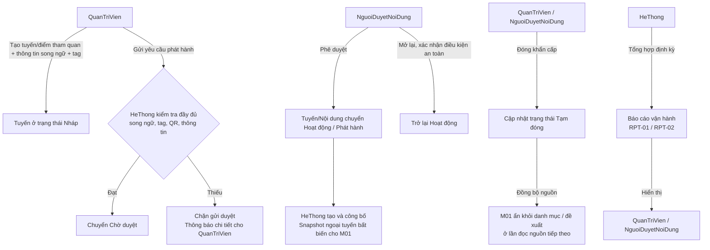
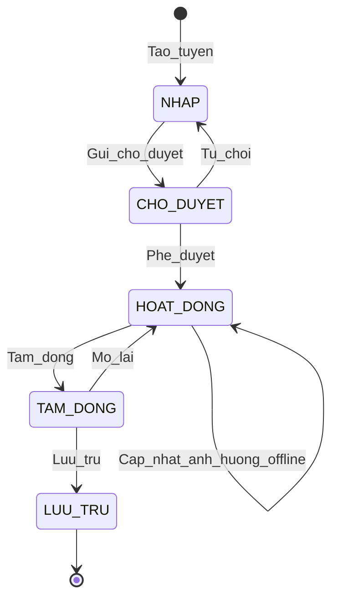
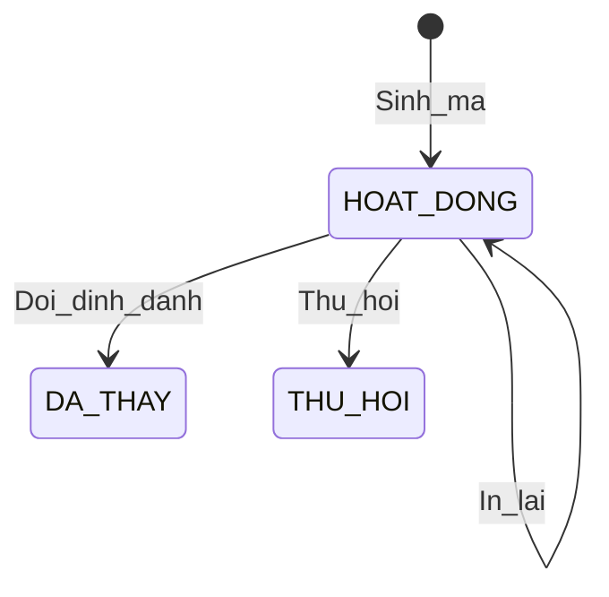
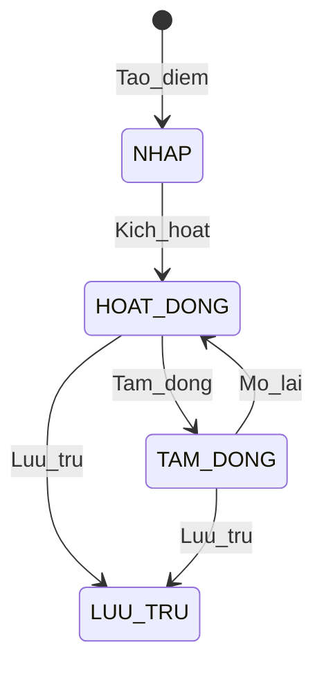
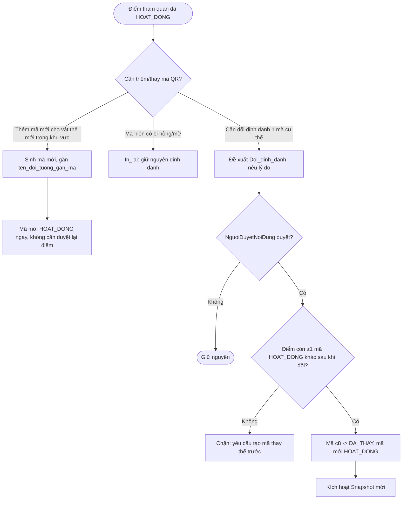

# BRD MODULE 3 — QUẢN TRỊ VẬN HÀNH & TÀI NGUYÊN TUYẾN

## Business Requirements Document chi tiết — Dự án Chuyển đổi số Vườn Quốc gia Cúc Phương (Cúc Phương Quest)

---

| Thông tin tài liệu | Nội dung |
|---|---|
| **Tên tài liệu** | BRD Module 3 — Operations & Content Administration Module |
| **Sản phẩm** | Cúc Phương Quest |
| **Phiên bản** | v3.2 |
| **Trạng thái** | Ready for FRD/SDD draft — các quyết định MVP liên module đã được chốt trong v3.2 |
| **Ngày tạo** | 2026-09-19 |
| **Ngày cập nhật** | 2026-09-22 |
| **Người tạo** | [Tên BA] |
| **Tài liệu liên quan** | `BRD-module-1.md` (M01) v2.4; `BRD-module-2.md` (M02) v1.3 |

---

# SECTION 1: TỔNG QUAN MODULE & TÁC NHÂN

## 1.1 Thông tin Module

| Thuộc tính | Giá trị |
|---|---|
| **Module ID** | M03 |
| **Tên tiếng Việt** | Quản trị Vận hành & Tài nguyên Tuyến |
| **MVP Scope** | Quản lý tuyến; quản lý điểm tham quan và mã QR theo khu vực; thông tin giới thiệu điểm tham quan (song ngữ); giám sát vận hành và báo cáo; công bố snapshot bất biến phục vụ đóng gói ngoại tuyến của M01 |
| **Module Owner** | Ban Quản lý VQG Cúc Phương / Quản trị viên hệ thống |
| **Dependencies** | M01 — tiêu thụ route/nội dung public + snapshot offline; M02 — tiêu thụ cấu trúc điểm tham quan/QR/thông tin, thực hiện check-in theo khu vực, cung cấp ngược dữ liệu phiên cho báo cáo |
| **Ngày cập nhật** | 2026-09-22 |

## 1.2 Mục tiêu Module

| Mục tiêu ID | Mô tả | KPI liên quan |
|---|---|---|
| **MO-M03-01** | Cho phép Ban quản lý/Quản trị viên tự chủ tạo, cập nhật và phát hành tuyến, điểm tham quan, mã QR và thông tin giới thiệu mà không cần đội kỹ thuật can thiệp | Số thay đổi thực hiện qua cổng quản trị / tổng số thay đổi |
| **MO-M03-02** | Đảm bảo mọi điểm tham quan khi đến tay du khách đều có thông tin giới thiệu đầy đủ, chính xác trước khi phát hành | Tỷ lệ điểm tham quan đạt kiểm tra đầy đủ thông tin trước khi tuyến chuyển Hoạt động |
| **MO-M03-03** | Cung cấp khả năng giám sát vận hành và xử lý sự cố tuyến/điểm tham quan kịp thời, bao gồm khả năng đóng khẩn cấp | Thời gian trung bình từ phát hiện sự cố đến khi trạng thái được cập nhật |
| **MO-M03-04** | Kiểm soát phiên bản nội dung để thay đổi mới không làm hỏng gói ngoại tuyến đã tải (M01) hoặc phiên đang diễn ra (M02) | Tỷ lệ phiên/gói đang hoạt động không bị gián đoạn sau khi nội dung liên quan được cập nhật |
| **MO-M03-05** | Đảm bảo mọi route public đủ điều kiện dữ liệu tối thiểu để M01 sử dụng được: tên/mô tả song ngữ, đủ ba nhóm recommendation tag, snapshot ngoại tuyến hợp lệ | Tỷ lệ route Hoạt động thoả guard phát hành / tổng route Hoạt động |
| **MO-M03-06** | Đảm bảo mỗi điểm tham quan có đủ mã QR bố trí trong khu vực để du khách check-in thuận tiện từ nhiều vị trí vật thể khác nhau, không phụ thuộc vào việc tìm đúng một mã QR duy nhất | Tỷ lệ điểm tham quan có ≥ 2 mã QR Hoạt động (khuyến nghị, không bắt buộc) |

## 1.3 Danh sách Tác nhân & Ma trận Quyền hạn

| Actor ID | Tên Actor | Vai trò nghiệp vụ | Quyền hạn trong Module |
|---|---|---|---|
| **ACT-M03-001** | QuanTriVien | Cán bộ vận hành/nội dung được Ban quản lý cấp quyền truy cập cổng quản trị | Tạo/sửa tuyến, điểm tham quan, mã QR, thông tin giới thiệu song ngữ, media, tag recommendation; gửi yêu cầu phát hành; xem báo cáo vận hành |
| **ACT-M03-002** | NguoiDuyetNoiDung | Đại diện Ban Quản lý VQG chịu trách nhiệm phê duyệt nội dung/tuyến trước khi phát hành | Phê duyệt/từ chối tuyến và nội dung; đóng khẩn cấp và mở lại tuyến/điểm tham quan; cấu hình phân quyền quản trị; xem toàn bộ báo cáo |
| **ACT-M03-003** | HeThong | Actor tự động — kiểm tra dữ liệu, gán phiên bản, tạo/công bố snapshot, tổng hợp số liệu | Kiểm tra tính đầy đủ nội dung (song ngữ + tag) và quan hệ tuyến–điểm; tự động gán/tăng phiên bản; tạo và công bố Snapshot ngoại tuyến bất biến; tổng hợp báo cáo |

> MVP cố định hai vai trò `QuanTriVien` và `NguoiDuyetNoiDung` để bảo đảm người tạo không tự phê duyệt nội dung của mình.

### 1.3.2 Ma trận Quyền hạn

| Chức năng | QuanTriVien | NguoiDuyetNoiDung | HeThong |
|---|---|---|---|
| Tạo/cập nhật thông tin tuyến (nháp/song ngữ) | ✓ | R | ✗ |
| Gán recommendation tag (`timeTags`/`groupTags`/`experienceTags`) | ✓ | R | ✗ |
| Tạo/cập nhật điểm tham quan, gồm `connectivity_mode` | ✓ | R | ✗ |
| Sinh nhiều mã QR cho một điểm tham quan | ✓ | R | ✓ (tự động sinh chuỗi mã) |
| In lại mã QR hỏng, giữ nguyên định danh | ✓ | R | ✗ |
| Đổi định danh một mã QR cụ thể (không ảnh hưởng các mã khác cùng điểm) | Đề xuất | ✓ Phê duyệt | ✗ |
| Soạn thông tin giới thiệu điểm tham quan song ngữ | ✓ | R | ✗ |
| Quản lý ảnh tĩnh và audio/video bổ sung | ✓ | R | ✗ |
| Kiểm tra tính đầy đủ nội dung trước phát hành | R | R | ✓ |
| Tạo/công bố Snapshot ngoại tuyến bất biến | R | R | ✓ |
| Gửi yêu cầu phát hành | ✓ | ✗ | ✗ |
| Phê duyệt/từ chối phát hành | ✗ | ✓ | ✗ |
| Kích hoạt điểm tham quan mới thêm vào tuyến đang Hoạt động | Đề xuất | ✓ Xác nhận | ✓ (kiểm tra tự động) |
| Đóng khẩn cấp tuyến/điểm tham quan | ✓ | ✓ | ✗ |
| Mở lại tuyến/điểm tham quan sau Tạm đóng | ✗ | ✓ | ✗ |
| Xem báo cáo vận hành | ✓ | ✓ | ✓ |
| Cấu hình phân quyền | ✗ | ✓ | ✗ |

> Mở lại tuyến/điểm tham quan chỉ do `NguoiDuyetNoiDung` thực hiện. MVP không có chức năng ủy quyền tạm thời; Ban quản lý cấp tài khoản `NguoiDuyetNoiDung` dự phòng bằng quy trình quản trị tài khoản hiện có.
> Mọi quyền trong bảng phải được thực thi ở tầng hệ thống (backend), không chỉ bằng ẩn/hiện chức năng trên giao diện (`BR-M03-010`).

### 1.3.3 Luồng ủy quyền nghiệp vụ

### 1.3.3 Luồng ủy quyền nghiệp vụ



---

# SECTION 2: DOMAIN ENTITIES & STATE MACHINE

## 2.1 Danh sách Domain Entities

| Entity ID | Tên Entity | Mô tả | Entity liên quan |
|---|---|---|---|
| **ENT-M03-001** | Tuyen | Tuyến tham quan; mang tên/mô tả/cảnh báo song ngữ và ba nhóm recommendation tag | DiemThamQuan, LichSuPhienBan, SnapshotTuyen |
| **ENT-M03-002** | DiemThamQuan | Điểm tham quan; tương ứng 1–1 với **checkpoint** của M02 | Tuyen, MaQR, ThongTinDiemThamQuan |
| **ENT-M03-003** | MaQR | Mã QR vật lý; quan hệ **nhiều-một** với `DiemThamQuan` | DiemThamQuan |
| **ENT-M03-004** | ThongTinDiemThamQuan | Thông tin giới thiệu điểm tham quan, theo từng ngôn ngữ | DiemThamQuan, TaiNguyenMedia, LichSuPhienBan |
| **ENT-M03-005** | TaiNguyenMedia | Ảnh tĩnh và audio/video bổ sung | ThongTinDiemThamQuan |
| **ENT-M03-006** | LichSuPhienBan | Nhật ký phiên bản khi Tuyến/Nội dung thay đổi sau phát hành | Tuyen, ThongTinDiemThamQuan |
| **ENT-M03-007** | SnapshotTuyen | Snapshot/manifest bất biến theo `routeId + contentVersion`, dùng làm nguồn cho `OfflinePackage` của M01 | Tuyen, DiemThamQuan, ThongTinDiemThamQuan, MaQR |
| **ENT-M03-008** | SessionSyncRecord | Bản ghi phiên đã kết thúc do M02 đồng bộ, làm nguồn cho báo cáo vận hành | Tuyen, DiemThamQuan |

### 2.1.2 Entity Relationship Diagram (mức nghiệp vụ)

```text
[TUYEN] 1 ──────< N [DIEM_THAM_QUAN]
   │                   │
   │                   ├──< N [MA_QR]                    (1 điểm : N mã QR)
   │                   └──< N [THONG_TIN_DIEM_THAM_QUAN] ──< N [TAI_NGUYEN_MEDIA]
   │                            (1 điểm : 2 bản ghi — vi, en)
    ├───> [LICH_SU_PHIEN_BAN]
    └───< N [SNAPSHOT_TUYEN]
[TUYEN] 1 ──────< N [SESSION_REPORT_RECORD]
```

### 2.1.3 Chi tiết Entity

#### ENT-M03-001 — Tuyen

| Thuộc tính | Kiểu dữ liệu logic | Mô tả nghiệp vụ | Ràng buộc |
|---|---|---|---|
| ma_tuyen | Text | Mã định danh duy nhất | NOT NULL, UNIQUE, FORMAT: `TUYEN-###` |
| ten_tuyen | Localized Text `{vi, en}` | Tên hiển thị (dùng bởi M01) | `vi` bắt buộc từ khi tạo; `vi` VÀ `en` bắt buộc trước khi được phép `HOAT_DONG` |
| mo_ta | Localized Rich Text `{vi, en}` | Mô tả tổng quan, điểm nổi bật | Cùng ràng buộc như `ten_tuyen` |
| canh_bao_an_toan | Localized Text `{vi, en}`, nullable | Cảnh báo an toàn hiện hành | Optional theo route; nếu có nội dung ở một ngôn ngữ, ngôn ngữ còn lại cũng bắt buộc trước khi `HOAT_DONG` |
| cu_ly_km | Number | Cự ly tuyến | NOT NULL, DECIMAL(4,1), > 0 |
| thoi_luong_du_kien_phut | Number | Thời lượng dự kiến | NOT NULL, INTEGER, > 0 |
| do_kho | Enum | Mức độ khó | NOT NULL, IN (`NHE`, `TRUNG_BINH`, `KHO`) |
| timeTags | Array\<Enum\> | Tag thời gian dùng cho recommendation M01 | NOT NULL, ≥ 1 giá trị, IN (`TIME_NGAN`, `TIME_VUA`, `TIME_DAI`) |
| groupTags | Array\<Enum\> | Tag thành phần đoàn | NOT NULL, ≥ 1 giá trị, IN (`GROUP_CA_NHAN_NGUOI_LON`, `GROUP_GIA_DINH_CO_TRE`, `GROUP_CAN_DE_DANG`) |
| experienceTags | Array\<Enum\> | Tag sở thích trải nghiệm | NOT NULL, ≥ 1 giá trị, IN (`INTEREST_THIEN_NHIEN_CHUP_ANH`, `INTEREST_TIM_HIEU`, `INTEREST_KHAM_PHA`) |
| doi_tuong_phu_hop | Array\<Text\> | Mô tả nhóm phù hợp dạng tự do, chỉ mang tính hiển thị bổ sung, không dùng cho recommendation | Optional |
| trang_thai | Enum | Trạng thái vòng đời | NOT NULL, IN (`NHAP`, `CHO_DUYET`, `HOAT_DONG`, `TAM_DONG`, `LUU_TRU`) |
| phien_ban | Number | Số phiên bản metadata (khác `contentVersion` của Snapshot) | NOT NULL, INTEGER, DEFAULT 1 |
| activeContentVersion | Text, nullable | Trỏ tới `SnapshotTuyen.content_version` đang có hiệu lực cho route này | Null khi chưa có snapshot nào được công bố; chỉ HeThong ghi |
| nguoi_tao / nguoi_duyet | Text | Người tạo/duyệt | NOT NULL / Optional |
| ly_do_tam_dong | Text | Lý do đóng/tạm đóng gần nhất | Optional, MAX 500 |
| thoi_gian_tao / thoi_gian_cap_nhat | DateTime | Mốc thời gian | NOT NULL, ISO 8601 |

**Quy tắc nghiệp vụ liên quan:** `BR-M03-001`, `BR-M03-002`, `BR-M03-003`, `BR-M03-005`, `BR-M03-013`, `BR-M03-014`.

#### ENT-M03-002 — DiemThamQuan

| Thuộc tính | Kiểu dữ liệu logic | Mô tả nghiệp vụ | Ràng buộc |
|---|---|---|---|
| ma_diem | Text | Định danh duy nhất — là `checkpointId` ổn định, dùng làm khoá chính cho M01/M02 | NOT NULL, UNIQUE, FORMAT: `DIEM-###`, bất biến trọn đời điểm |
| ma_tuyen | Text | Tuyến sở hữu | NOT NULL, FK → Tuyen |
| ten_diem | Text | Tên hiển thị | NOT NULL, MAX 150 |
| thu_tu | Number | Thứ tự trong tuyến | NOT NULL, INTEGER, UNIQUE per ma_tuyen |
| mo_ta_khu_vuc | Text, Optional | Mô tả phạm vi/ranh giới khu vực vật lý của điểm tham quan (ví dụ: "bán kính khoảng 30m quanh gốc cây Chò chỉ, gồm cả lối mòn phụ"), phục vụ QuanTriVien khi bố trí nhiều mã QR trong cùng khu vực | Optional, MAX 500 — chỉ mang tính tham chiếu vận hành |
| toa_do_gps | Object `{latitude, longitude}`, Optional | Tọa độ trung tâm khu vực, chỉ phục vụ tham chiếu vận hành; không dùng dẫn đường thời gian thực | Nếu có: latitude `-90..90`, longitude `-180..180` |
| connectivity_mode | Enum | `ONLINE_AVAILABLE` hoặc `OFFLINE_REQUIRED` | NOT NULL, bắt buộc gán tường minh; chỉ gán `ONLINE_AVAILABLE` sau khi xác minh thực địa (`BR-M03-020`) |
| trang_thai | Enum | `NHAP`, `HOAT_DONG`, `TAM_DONG`, `LUU_TRU` | NOT NULL |
| thoi_gian_tao / thoi_gian_cap_nhat | DateTime | | NOT NULL |

**Quan hệ với M02:** một `DiemThamQuan` = một **checkpoint** trong trải nghiệm thực địa của M02 (`ENT-M02-003.checkpoints`, `journeyCheckpoints`). Việc quét **bất kỳ** mã QR nào thuộc `ma_diem` này đều là một hành động check-in hợp lệ cho checkpoint tương ứng — logic check-in của M02 (`BR-M02-011`, `ENT-M02-002`) khoá theo `checkpointId` sau khi phân giải, nên tương thích trực tiếp với việc một điểm có nhiều mã QR.

**Quy tắc nghiệp vụ liên quan:** `BR-M03-002`, `BR-M03-006`, `BR-M03-013`, `BR-M03-020`.

#### ENT-M03-003 — MaQR

| Thuộc tính | Kiểu dữ liệu logic | Mô tả nghiệp vụ | Ràng buộc |
|---|---|---|---|
| ma_qr | Text | Mã định danh bản ghi QR (nội bộ quản trị) | NOT NULL, UNIQUE, FORMAT: `QR-YYYYMMDD-###` |
| ma_diem | Text | Điểm tham quan sở hữu — nhiều bản ghi `MaQR` có thể cùng trỏ về một `ma_diem` | NOT NULL, FK → DiemThamQuan |
| ten_doi_tuong_gan_ma | Text | Tên/mô tả ngắn vật thể vật lý mà mã này được gắn lên (ví dụ: "Cây Chò chỉ 700 năm", "Bia di tích Hang Con Moong") | NOT NULL, MAX 150 — phục vụ quản trị/lắp đặt thực địa, không hiển thị cho du khách như một nội dung riêng biệt |
| noi_dung_ma | Text | Chuỗi/payload mã hoá trong QR | NOT NULL, UNIQUE toàn hệ thống; phải chứa `ma_diem` làm thành phần định danh chính (ví dụ `DIEM-014-Q02`), để mọi mã QR thuộc cùng điểm đều phân giải được về cùng một `checkpointId` |
| trang_thai | Enum | `HOAT_DONG`, `DA_THAY`, `THU_HOI` | NOT NULL |
| ngay_sinh / ngay_thu_hoi | DateTime | | NOT NULL / Optional |
| ly_do_thay_the | Text | Lý do đổi định danh/thu hồi | Optional, MAX 300 |

**Nguyên tắc cốt lõi:**
- Một `DiemThamQuan` có thể có 1 đến N mã QR đang `HOAT_DONG` cùng lúc, mỗi mã gắn vào một vật thể/vị trí cụ thể trong khu vực (`ten_doi_tuong_gan_ma`).
- Quét bất kỳ mã nào trong số đó → M02 phân giải `noi_dung_ma` → `ma_diem` → ghi nhận check-in cho checkpoint đó. Quét thêm mã khác cùng `ma_diem` trong cùng phiên **không tạo thêm check-in mới** — hành vi này đã được xác nhận tương thích với M02 v1.2 (`BR-M02-011`, `BR-M02-012`: khoá theo `(sessionId, checkpointId)`, không phải theo `qrIdentifier`).
- Nội dung hiển thị cho du khách (`ENT-M03-004`) gắn theo `ma_diem`, không gắn theo từng mã QR riêng lẻ.
- M03 phải cung cấp cho M02, với mỗi điểm tham quan, **toàn bộ tập `noi_dung_ma` đang `HOAT_DONG`** (không phải một giá trị đơn) — xem Phụ lục C.

**Quy tắc nghiệp vụ liên quan:**
- `BR-M03-009`: mọi `noi_dung_ma` phải duy nhất toàn hệ thống và chứa `ma_diem` làm thành phần định danh chính.
- `BR-M03-017`: **In lại** một mã QR cụ thể (hỏng/mờ) giữ nguyên `noi_dung_ma` của chính mã đó, không ảnh hưởng các mã QR khác cùng điểm. **Đổi định danh** một mã QR cụ thể chỉ vô hiệu hoá riêng mã đó (chuyển `DA_THAY`); các mã QR khác cùng `ma_diem` vẫn `HOAT_DONG` bình thường — điểm tham quan không mất khả năng check-in miễn còn ≥ 1 mã `HOAT_DONG`. Nếu việc đổi định danh khiến điểm không còn mã QR nào `HOAT_DONG`, hệ thống phải chặn thao tác cho đến khi có mã thay thế.
- `BR-M03-019`: Một điểm tham quan chỉ được `Kich_hoat` (chuyển `HOAT_DONG` ở `SM-M03-004`) khi có tối thiểu 1 mã QR ở trạng thái `HOAT_DONG`.

#### ENT-M03-004 — ThongTinDiemThamQuan

| Thuộc tính | Kiểu dữ liệu logic | Mô tả nghiệp vụ | Ràng buộc |
|---|---|---|---|
| ma_thong_tin | Text | Mã định danh | NOT NULL, UNIQUE |
| ma_diem | Text | Điểm tham quan sở hữu | NOT NULL, FK → DiemThamQuan |
| ngon_ngu | Enum | `vi` hoặc `en` — mỗi ngôn ngữ một bản ghi, vòng đời độc lập | NOT NULL |
| noi_dung_gioi_thieu | Text | Thông tin giới thiệu điểm tham quan: mô tả loài/vật thể/địa điểm, đặc điểm, ý nghĩa — văn phong thông tin/tra cứu | NOT NULL, MIN 30 ký tự |
| trang_thai | Enum | `NHAP`, `CHO_DUYET`, `DA_DUYET`, `PHAT_HANH`, `LUU_TRU` | NOT NULL |
| phien_ban | Number | | NOT NULL, INTEGER, DEFAULT 1 |
| nguoi_tao / nguoi_duyet | Text | | NOT NULL / Optional |
| thoi_gian_phat_hanh | DateTime | | Optional |

**Quy tắc nghiệp vụ liên quan:**
- `BR-M03-006`: Mọi `DiemThamQuan` public, bất kể `connectivity_mode`, phải có cả hai bản ghi `ThongTinDiemThamQuan` (`vi` và `en`) ở trạng thái `PHAT_HANH` trước khi được kích hoạt. Quy tắc chung này bảo đảm M02 luôn hiển thị được ngôn ngữ đã chọn mà không cần fallback.
- `BR-M03-007`: `noi_dung_gioi_thieu` không được rỗng và phải đạt tối thiểu 30 ký tự mới được chuyển `DA_DUYET → PHAT_HANH`.
- `BR-M03-008`: tạo `LichSuPhienBan` trước khi áp dụng chỉnh sửa lên nội dung đã `PHAT_HANH`.

#### ENT-M03-005 — TaiNguyenMedia

| Thuộc tính | Kiểu dữ liệu logic | Ràng buộc |
|---|---|---|
| ma_media | Text | NOT NULL, UNIQUE |
| ma_thong_tin | Text | NOT NULL, FK → ThongTinDiemThamQuan |
| loai | Enum `IMAGE`, `AUDIO`, `VIDEO` | NOT NULL |
| url_luu_tru | Text | NOT NULL; chỉ URL do storage của hệ thống quản lý |
| dinh_dang | Text | MIME type hợp lệ |
| dung_luong_mb | Number | > 0 |
| thoi_luong_giay | Number, nullable | Chỉ áp dụng cho AUDIO/VIDEO |
| alt_text | Localized Text `{vi,en}`, nullable | Khuyến nghị cho IMAGE |
| quyen_su_dung | Text | Bắt buộc trước khi phát hành |
| trang_thai | Enum `NHAP`, `PHAT_HANH`, `LUU_TRU` | Chỉ media `PHAT_HANH` được đưa ra public |

Ảnh `PHAT_HANH` của checkpoint `OFFLINE_REQUIRED` được liệt kê trong `SnapshotTuyen` để M01 tải byte ảnh. Audio/video không được đưa vào gói offline và chỉ được M02 đọc trực tiếp khi có mạng.

#### ENT-M03-006 — LichSuPhienBan

Ghi nhật ký mỗi lần `Tuyen` hoặc `ThongTinDiemThamQuan` đã phát hành bị chỉnh sửa (`loai_doi_tuong`, `ma_doi_tuong`, `du_lieu_truoc`, `du_lieu_sau`, `nguoi_thuc_hien`, `thoi_gian`).

#### ENT-M03-007 — SnapshotTuyen

| Thuộc tính | Kiểu dữ liệu logic | Mô tả nghiệp vụ | Ràng buộc |
|---|---|---|---|
| ma_snapshot | Text | | NOT NULL, UNIQUE |
| ma_tuyen | Text | | NOT NULL, FK → Tuyen |
| content_version | Text | | NOT NULL, UNIQUE trong phạm vi `ma_tuyen`; bất biến sau khi `DA_CONG_BO` |
| danh_sach_checkpoint | Object (JSON) | Với mỗi `DiemThamQuan` `OFFLINE_REQUIRED`: `checkpointId` (= `ma_diem`), `qrIdentifiers: Array<Text>` (tất cả `noi_dung_ma` đang `HOAT_DONG`), `connectivityMode`, `localizedContent: {vi: {introductionText}, en: {introductionText}}`, `staticImages[]` gồm URL, MIME type, kích thước và checksum | NOT NULL — đây là manifest canonical M01 tiêu thụ; resource được khóa theo `checkpointId` |
| trang_thai | Enum | `DANG_TAO`, `DA_CONG_BO` | NOT NULL |
| thoi_gian_cong_bo | DateTime | | Optional |
| snapshot_truoc_do | Text, nullable | | Optional |

**Quy tắc nghiệp vụ liên quan:**
- `BR-M03-014`: HeThong tạo và công bố một `SnapshotTuyen` mới khi: (a) Tuyến chuyển `CHO_DUYET → HOAT_DONG` lần đầu; hoặc (b) một thay đổi đã phát hành làm ảnh hưởng dữ liệu offline của route — thông tin/ảnh của điểm `OFFLINE_REQUIRED`, sự kiện Đổi định danh QR của điểm `OFFLINE_REQUIRED`, hoặc thêm/bớt điểm `OFFLINE_REQUIRED`. Thay đổi metadata không nằm trong `danh_sach_checkpoint` không bắt buộc tạo snapshot mới.
- `BR-M03-015`: Snapshot ở trạng thái `DA_CONG_BO` là bất biến, không sửa tại chỗ. `Tuyen.activeContentVersion` chỉ được HeThong cập nhật trỏ sang snapshot mới sau khi toàn bộ dữ liệu trong `danh_sach_checkpoint` đã đầy đủ và nhất quán.
- `BR-M03-016`: M03 luôn giữ snapshot hiện hành và snapshot ngay trước đó. Các snapshot cũ hơn được giữ tối thiểu 30 ngày kể từ lúc bị thay thế rồi có thể dọn tự động. M01 không cần gửi acknowledgement.

#### ENT-M03-008 — SessionSyncRecord

| Thuộc tính | Kiểu dữ liệu logic | Ràng buộc |
|---|---|---|
| sessionId | Text | Khoá duy nhất để upsert; do M02 sinh |
| routeId | Text | FK logic tới Tuyen |
| startedAt / endedAt | DateTime | Bắt buộc; `endedAt >= startedAt` |
| status | Enum `HOAN_TAT`, `BO_DO` | Chỉ nhận trạng thái kết thúc |
| visitedCheckpoints | Array<Object> | Mỗi phần tử gồm `checkpointId`, `checkedInAt`; không trùng checkpoint trong một phiên |
| receivedAt | DateTime | Thời điểm M03 nhận bản ghi gần nhất |

M03 upsert theo `sessionId`. Payload không chứa tên, tài khoản, vị trí GPS hoặc định danh thiết bị. Bản ghi này chỉ phục vụ hai báo cáo MVP: `RPT-01` tổng hợp phiên theo tuyến và `RPT-02` tổng hợp lượt ghé checkpoint.

## 2.2 State Machine

### 2.2.1 SM-M03-001 — Vòng đời Tuyến

| Trạng thái hiện tại | Event | Guard | Action | Trạng thái kế tiếp |
|---|---|---|---|---|
| *(khởi tạo)* | Tao_tuyen | — | Ghi log, phien_ban = 1 | NHAP |
| NHAP | Gui_cho_duyet | Đủ `ten_tuyen.vi`, `mo_ta.vi`, cự ly, thời lượng, độ khó và ≥ 1 điểm tham quan | Chuyển hàng chờ duyệt | CHO_DUYET |
| NHAP | Gui_cho_duyet | Thiếu điều kiện trên | Chặn, thông báo lỗi | NHAP |
| CHO_DUYET | Phe_duyet | (a) `ten_tuyen` và `mo_ta` đủ `vi` VÀ `en`; (b) đủ ba nhóm tag, mỗi nhóm ≥ 1 giá trị; (c) mọi điểm tham quan có ≥ 1 mã QR `HOAT_DONG`; (d) mọi điểm có thông tin giới thiệu `PHAT_HANH` đủ `vi` và `en`; (e) `nguoi_duyet ≠ nguoi_tao` | Cập nhật `nguoi_duyet`; gán `HOAT_DONG`; kích hoạt `BR-M03-014` tạo & công bố `SnapshotTuyen` mới | HOAT_DONG |
| CHO_DUYET | Tu_choi | NguoiDuyetNoiDung có quyền | Ghi log lý do, thông báo QuanTriVien | NHAP |
| HOAT_DONG | Tam_dong | NguoiDuyetNoiDung/QuanTriVien có quyền, có lý do | Cập nhật trạng thái; không tự xoá `activeContentVersion` — M01 tự loại route này khỏi danh mục/đề xuất ở lần đồng bộ nguồn tiếp theo; phiên M02 đang diễn ra không bị gián đoạn (xem `BR-M03-018`) | TAM_DONG |
| HOAT_DONG | Cap_nhat_metadata | Thay đổi không ảnh hưởng cấu trúc điểm/manifest offline | Tạo `LichSuPhienBan`, tăng `phien_ban` (metadata) | HOAT_DONG |
| HOAT_DONG | Cap_nhat_anh_huong_offline | Thay đổi ảnh hưởng `danh_sach_checkpoint` (thông tin/ảnh/QR của điểm OFFLINE_REQUIRED) | Kích hoạt `BR-M03-014` tạo `SnapshotTuyen` mới; giữ `activeContentVersion` cũ cho tới khi snapshot mới `DA_CONG_BO` | HOAT_DONG |
| TAM_DONG | Mo_lai | Chỉ `NguoiDuyetNoiDung` xác nhận lại điều kiện an toàn | Đưa trở lại danh mục/đề xuất M01 ở lần đồng bộ nguồn tiếp theo | HOAT_DONG |
| TAM_DONG | Luu_tru | NguoiDuyetNoiDung xác nhận lưu trữ và nhập lý do | Ẩn vĩnh viễn khỏi lựa chọn mới của M01/M02; phiên M02 đã chốt dữ liệu vẫn tự kết thúc theo snapshot cục bộ | LUU_TRU |
| LUU_TRU | *(terminal)* | — | — | — |



### 2.2.2 SM-M03-002 — Vòng đời Thông tin điểm tham quan

| Trạng thái hiện tại | Event | Guard | Action | Trạng thái tiếp theo |
|---|---|---|---|---|
| *(khởi tạo)* | Tao_noi_dung | QuanTriVien có quyền | Tạo bản ghi cho một ngôn ngữ | NHAP |
| NHAP | Gui_duyet | `noi_dung_gioi_thieu` ≥ 30 ký tự | Ghi người gửi và thời gian | CHO_DUYET |
| CHO_DUYET | Phe_duyet | NguoiDuyetNoiDung khác người tạo | Ghi người duyệt | DA_DUYET |
| CHO_DUYET | Tu_choi | Có lý do | Trả về người soạn | NHAP |
| DA_DUYET | Phat_hanh | Điểm còn hợp lệ | Công bố bản này làm nội dung hiện hành | PHAT_HANH |
| PHAT_HANH | Chinh_sua | QuanTriVien có quyền | Giữ bản đang phát hành; tạo bản nháp version mới | PHAT_HANH |
| PHAT_HANH | Luu_tru | Điểm bị lưu trữ hoặc có bản thay thế đã phát hành | Ngừng public bản cũ | LUU_TRU |

Hai ngôn ngữ có vòng đời độc lập, nhưng mọi điểm chỉ đủ điều kiện hoạt động khi cả `vi` và `en` đều có bản `PHAT_HANH`.

### 2.2.3 SM-M03-003 — Vòng đời Mã QR

| Trạng thái hiện tại | Event | Guard | Action | Trạng thái kế tiếp |
|---|---|---|---|---|
| *(khởi tạo)* | Sinh_ma | `noi_dung_ma` chứa `ma_diem`, duy nhất toàn hệ thống | Ghi log, gắn vào điểm tham quan (điểm có thể đã có sẵn các mã khác) | HOAT_DONG |
| HOAT_DONG | In_lai | Hỏng/mờ vật lý, định danh không đổi | Xuất lại file in | HOAT_DONG |
| HOAT_DONG | Doi_dinh_danh | Bắt buộc nghiệp vụ, đã được `NguoiDuyetNoiDung` phê duyệt; sau khi đổi, điểm vẫn còn ≥ 1 mã `HOAT_DONG` khác hoặc mã mới đã sẵn sàng ngay | Sinh mã mới `HOAT_DONG`; mã cũ → `DA_THAY`; kích hoạt tạo Snapshot mới | DA_THAY *(mã cũ)* |
| HOAT_DONG | Thu_hoi | Vật thể/vị trí gắn mã không còn tồn tại nhưng điểm tham quan vẫn hoạt động | Ghi log thu hồi; kiểm tra điểm còn ≥ 1 mã `HOAT_DONG` khác (nếu không, chặn thao tác) | THU_HOI |



### 2.2.4 SM-M03-004 — Vòng đời Điểm tham quan

| Trạng thái hiện tại | Event | Guard | Action | Trạng thái kế tiếp |
|---|---|---|---|---|
| *(khởi tạo)* | Tao_diem | Thuộc một Tuyen hợp lệ | Ghi log | NHAP |
| NHAP | Kich_hoat | ≥ 1 mã QR `HOAT_DONG` và đủ thông tin giới thiệu `vi/en` ở trạng thái `PHAT_HANH` | Đưa điểm vào vận hành | HOAT_DONG |
| HOAT_DONG | Tam_dong | Có lý do, người có quyền | Ghi log; kích hoạt `BR-M03-013` đánh giá tuyến | TAM_DONG |
| TAM_DONG | Mo_lai | Chỉ `NguoiDuyetNoiDung` | Ghi log | HOAT_DONG |
| HOAT_DONG / TAM_DONG | Luu_tru | Tuyến chứa điểm chuyển `LUU_TRU`, hoặc điểm bị loại bỏ vĩnh viễn | Ẩn khỏi M01/M02; nếu điểm là `OFFLINE_REQUIRED`, kích hoạt tạo Snapshot mới loại bỏ điểm khỏi manifest | LUU_TRU |



**`BR-M03-013`:** Khi một `DiemThamQuan` chuyển `TAM_DONG`, `HeThong` đánh giá route chứa điểm đó còn đủ điều kiện giữ `HOAT_DONG` hay không (đặc biệt nếu điểm là `OFFLINE_REQUIRED` và việc thiếu nó phá vỡ tính liên tục của trải nghiệm ngoại tuyến). `NguoiDuyetNoiDung` xác nhận quyết định cuối. **M01 chỉ đọc và tuân theo trạng thái cấp route**; M02 không đọc trạng thái từng điểm giữa phiên đang diễn ra (xem `BR-M03-018`).

## 2.3 Business Rule Catalog đầy đủ

| BR Code | Tên quy tắc | Mô tả |
|---|---|---|
| `BR-M03-001` | Điều kiện NHAP → CHO_DUYET | Đủ tên/mô tả `vi`, cự ly, thời lượng, độ khó, ≥1 điểm tham quan. |
| `BR-M03-002` | Điều kiện CHO_DUYET → HOAT_DONG | Xem guard `Phe_duyet` ở SM-M03-001. |
| `BR-M03-003` | Song ngữ bắt buộc cho route public | Route ở `HOAT_DONG` phải có `ten_tuyen`/`mo_ta` đủ `vi` và `en`; nếu `canh_bao_an_toan` có nội dung, phải đủ cả hai ngôn ngữ. |
| `BR-M03-005` | Loại tuyến khỏi M01 khi TAM_DONG/LUU_TRU | Khi chuyển `TAM_DONG`/`LUU_TRU`, route bị loại khỏi danh mục/đề xuất M01 ở lần đồng bộ nguồn tiếp theo của M01. |
| `BR-M03-006` | Điều kiện phát hành thông tin điểm tham quan | Mọi điểm public bắt buộc có nội dung `PHAT_HANH` đủ `vi` và `en`; không phân biệt `OFFLINE_REQUIRED` hay `ONLINE_AVAILABLE`. |
| `BR-M03-007` | Nội dung giới thiệu tối thiểu | `noi_dung_gioi_thieu` ≥ 30 ký tự mới được `PHAT_HANH`. |
| `BR-M03-008` | Kiểm soát phiên bản khi chỉnh sửa | Tạo `LichSuPhienBan` trước khi áp dụng thay đổi trên nội dung/tuyến đã phát hành. |
| `BR-M03-009` | Định danh QR ổn định | `noi_dung_ma` phải chứa trực tiếp `ma_diem`; duy nhất toàn hệ thống. |
| `BR-M03-010` | Thực thi quyền ở backend | Mọi quyền trong ma trận 1.3.2 phải được chặn ở tầng hệ thống. |
| `BR-M03-011` | Ghi nhận khi đóng khẩn cấp | Hành động `Tam_dong` phải ghi log đầy đủ (thời gian, người thực hiện, lý do) và cập nhật trạng thái nguồn ngay lập tức. Theo xác nhận từ BRD M02 v1.2 (`EC-M02-007`), một phiên `PlaySession` đang `DANG_DIEN_RA` **không nhận thông báo và không bị gián đoạn** khi trạng thái nguồn của route/điểm thay đổi — M03 không gửi và không cam kết bất kỳ cảnh báo trong ứng dụng nào tới phiên đang chạy. |
| `BR-M03-012` | Checklist tối thiểu khi duyệt | Xem Phụ lục D — không chặn quy trình, chỉ là công cụ hỗ trợ `NguoiDuyetNoiDung`. |
| `BR-M03-013` | Đánh giá route khi một điểm TAM_DONG | Xem SM-M03-004; M01 chỉ đọc trạng thái cấp route. |
| `BR-M03-014` | Tạo/công bố Snapshot | Xem ENT-M03-007. |
| `BR-M03-015` | Snapshot bất biến | Xem ENT-M03-007. |
| `BR-M03-016` | Duy trì snapshot cũ trong lúc chuyển tiếp | Xem ENT-M03-007. |
| `BR-M03-017` | Phân biệt In lại và Đổi định danh QR | Xem ENT-M03-003/SM-M03-003. |
| `BR-M03-018` | Không cam kết cảnh báo real-time tới thiết bị/phiên đang chạy | Ban Quản lý/M03 phải có biện pháp an toàn ngoài hệ thống (biển báo vật lý, chốt kiểm lâm, chặn lối vào…) cho khu vực đóng khẩn cấp. Đây là business assumption an toàn, được xác nhận thêm bởi BRD M02 v1.2 (`EC-M02-007`): phiên đang diễn ra không có kênh nhận cảnh báo và tiếp tục cho đến khi kết thúc tự nhiên. |
| `BR-M03-019` | Điểm tham quan cần ≥1 mã QR Hoạt động để Kích hoạt | Xem `SM-M03-004`. |
| `BR-M03-020` | Xác minh trước khi gán ONLINE_AVAILABLE | Một điểm tham quan chỉ được gán `connectivity_mode = ONLINE_AVAILABLE` sau khi đã xác minh thực địa có kết nối mạng ổn định (không chỉ dựa trên suy đoán/bản đồ phủ sóng nhà mạng). Bắt buộc vì BRD M02 v1.2 (`ASM-M02-001`, `DEC-M02-008`) xác nhận hệ thống không có bất kỳ cơ chế dự phòng nào nếu điểm bị phân loại sai. |
| `BR-M03-021` | Tiếp nhận dữ liệu phiên kết thúc | M03 chỉ nhận `SessionSyncRecord` có trạng thái `HOAN_TAT` hoặc `BO_DO`; upsert idempotent theo `sessionId`. |
| `BR-M03-022` | Báo cáo phiên theo tuyến | `RPT-01` hiển thị theo khoảng ngày và route: tổng phiên, số/tỷ lệ `HOAN_TAT`, số/tỷ lệ `BO_DO`; một `sessionId` chỉ được tính một lần. |
| `BR-M03-023` | Báo cáo lượt ghé checkpoint | `RPT-02` hiển thị theo khoảng ngày, route và checkpoint: số phiên có ghé checkpoint; mỗi checkpoint chỉ tính tối đa một lượt trong một phiên. |
| `BR-M03-024` | Múi giờ báo cáo | Bộ lọc ngày và nhóm theo ngày dùng múi giờ `Asia/Bangkok`; dữ liệu lưu bằng timestamp ISO 8601. |
| `BR-M03-025` | Giữ snapshot tối giản | Luôn giữ snapshot hiện hành, snapshot ngay trước đó và mọi snapshot bị thay thế chưa đủ 30 ngày; không cần acknowledgement từ M01. |

---

# SECTION 3: QUY TRÌNH NGHIỆP VỤ — CƠ CHẾ CHI TIẾT TẠO MỚI/CẬP NHẬT

## 3.1 Bảng điều kiện đầy đủ dữ liệu theo giai đoạn — TUYẾN

| Trường | Lúc tạo (`NHAP`) | Lúc gửi duyệt (`CHO_DUYET`) | Lúc phát hành (`HOAT_DONG`) |
|---|---|---|---|
| `ten_tuyen.vi` | Bắt buộc | Bắt buộc | Bắt buộc |
| `ten_tuyen.en` | Không bắt buộc | Không bắt buộc | Bắt buộc |
| `mo_ta.vi` | Bắt buộc | Bắt buộc | Bắt buộc |
| `mo_ta.en` | Không bắt buộc | Không bắt buộc | Bắt buộc |
| `canh_bao_an_toan` | Optional | Optional | Nếu có nội dung ở 1 ngôn ngữ → bắt buộc đủ cả 2 |
| `cu_ly_km`, `thoi_luong_du_kien_phut`, `do_kho` | Bắt buộc | Bắt buộc | Bắt buộc |
| `timeTags` / `groupTags` / `experienceTags` | Không bắt buộc | Không bắt buộc | Bắt buộc ≥1 giá trị mỗi nhóm |
| Số điểm tham quan thuộc tuyến | Cho phép = 0 | ≥ 1 | ≥ 1, mỗi điểm phải tự đạt `HOAT_DONG` |
| `doi_tuong_phu_hop` | Optional | Optional | Optional (không chặn phát hành) |

## 3.2 Bảng điều kiện đầy đủ dữ liệu theo giai đoạn — ĐIỂM THAM QUAN

| Trường | Lúc tạo (`NHAP`) | Lúc kích hoạt (`HOAT_DONG`) |
|---|---|---|
| `ten_diem` | Bắt buộc | Bắt buộc |
| `thu_tu` | Bắt buộc, duy nhất trong tuyến | Bắt buộc |
| `connectivity_mode` | Bắt buộc, phải gán tường minh | Bắt buộc; `ONLINE_AVAILABLE` chỉ sau khi xác minh thực địa (`BR-M03-020`) |
| `mo_ta_khu_vuc` | Optional (khuyến nghị nếu dự kiến gắn nhiều mã QR) | Optional |
| `toa_do_gps` | Optional | Optional |
| Số mã QR `HOAT_DONG` gắn với điểm | Cho phép = 0 | ≥ 1 (`BR-M03-019`) |
| Thông tin giới thiệu — `vi` | Optional | Bắt buộc `PHAT_HANH` |
| Thông tin giới thiệu — `en` | Optional | Bắt buộc `PHAT_HANH` |

## 3.3 Bảng điều kiện đầy đủ dữ liệu — MÃ QR

| Trường | Bắt buộc khi sinh mã mới |
|---|---|
| `ma_diem` (điểm sở hữu) | Bắt buộc — có thể trùng với mã QR khác đã tồn tại cùng điểm |
| `ten_doi_tuong_gan_ma` | Bắt buộc |
| `noi_dung_ma` | Bắt buộc, hệ thống tự sinh, chứa `ma_diem`, duy nhất toàn hệ thống |

## 3.4 Cơ chế chi tiết — Tạo tuyến mới

**Pre-conditions:** QuanTriVien đã đăng nhập; có dữ liệu khảo sát thực địa.
**Post-conditions:** Tuyến `HOAT_DONG`; mọi điểm tham quan tự đạt `HOAT_DONG`; `SnapshotTuyen` đầu tiên `DA_CONG_BO`.

| Bước | Actor | Hành động | Điều kiện/Hệ thống phản hồi | Tham chiếu |
|---|---|---|---|---|
| 1 | QuanTriVien | Tạo tuyến: `ten_tuyen.vi`, `mo_ta.vi`, cự ly, thời lượng, `do_kho` | Lưu `NHAP` | 3.1 |
| 2 | QuanTriVien | Với mỗi điểm tham quan: tạo bản ghi, nhập `ten_diem`, `thu_tu`, bắt buộc chọn `connectivity_mode` (xác minh thực địa trước nếu chọn `ONLINE_AVAILABLE`) | Lưu `NHAP` | 3.2, `BR-M03-020` |
| 3 | QuanTriVien | Sinh một hoặc nhiều mã QR cho điểm, mỗi mã kèm `ten_doi_tuong_gan_ma` | Hệ thống sinh `noi_dung_ma` chứa `ma_diem`, duy nhất | 3.3 |
| 4 | QuanTriVien | Soạn thông tin giới thiệu cho điểm, bắt buộc đủ `vi`/`en` trước khi kích hoạt | Lưu `NHAP` theo từng bản ghi ngôn ngữ | `BR-M03-006` |
| 5 | QuanTriVien | Gửi duyệt/kích hoạt từng điểm tham quan (`Kich_hoat`) | Kiểm tra `BR-M03-019` + điều kiện thông tin theo `connectivity_mode` | `SM-M03-004` |
| 6 | QuanTriVien | Gán `timeTags`/`groupTags`/`experienceTags` cho tuyến, nhập bổ sung `ten_tuyen.en`/`mo_ta.en` | Lưu vào Tuyến | 3.1 |
| 7 | QuanTriVien | Gửi yêu cầu phát hành tuyến | Chuyển `CHO_DUYET` nếu đủ điều kiện `BR-M03-001` | — |
| 8 | HeThong | — | Kiểm tra guard `Phe_duyet` đầy đủ | `BR-M03-002` |
| 9 | NguoiDuyetNoiDung | Xem xét (Phụ lục D) và phê duyệt/từ chối | Duyệt: tuyến → `HOAT_DONG` | `BR-M03-002` |
| 10 | HeThong | — | Tạo và công bố `SnapshotTuyen` đầu tiên; cập nhật `activeContentVersion` | `BR-M03-014` |

## 3.5 Cơ chế chi tiết — Thêm/loại bỏ điểm tham quan khỏi tuyến ĐANG Hoạt động

**Nguyên tắc:** thêm một điểm tham quan mới vào tuyến đã `HOAT_DONG` không yêu cầu duyệt lại toàn bộ tuyến; chỉ điểm mới phải tự đạt điều kiện kích hoạt.

| Bước | Actor | Hành động | Hệ thống phản hồi |
|---|---|---|---|
| 1 | QuanTriVien | Tạo điểm tham quan mới trong tuyến đang `HOAT_DONG`, điền đủ trường theo 3.2 | Điểm mới ở `NHAP`; tuyến vẫn hiển thị bình thường trên M01/M02, chưa gồm điểm mới |
| 2 | QuanTriVien | Sinh mã QR, soạn thông tin giới thiệu song ngữ `vi/en` | Như 3.4 bước 3–4 |
| 3 | QuanTriVien | Gửi đề xuất kích hoạt điểm | Kiểm tra `BR-M03-019` + điều kiện thông tin |
| 4 | NguoiDuyetNoiDung | Xác nhận điểm đủ điều kiện đưa vào khai thác | Điểm chuyển `HOAT_DONG` |
| 5 | HeThong | — | Kích hoạt `Cap_nhat_anh_huong_offline` (nếu `OFFLINE_REQUIRED`) → tạo `SnapshotTuyen` mới; nếu `ONLINE_AVAILABLE`, điểm xuất hiện ngay ở lần M02 đọc dữ liệu tiếp theo |

**Loại bỏ một điểm tham quan khỏi tuyến đang Hoạt động:**

| Bước | Actor | Hành động | Hệ thống phản hồi |
|---|---|---|---|
| 1 | QuanTriVien | Đề xuất loại bỏ điểm, nhập lý do | — |
| 2 | NguoiDuyetNoiDung | Phê duyệt loại bỏ | Điểm chuyển `LUU_TRU`; không xoá vật lý bản ghi, giữ lịch sử |
| 3 | HeThong | — | Nếu điểm là `OFFLINE_REQUIRED`: tạo `SnapshotTuyen` mới loại bỏ điểm khỏi manifest ngay lập tức |

## 3.6 Cơ chế chi tiết — Cập nhật thông tin điểm tham quan đã phát hành

| Bước | Actor | Hành động | Hệ thống phản hồi | BR |
|---|---|---|---|---|
| 1 | QuanTriVien | Chọn bản ghi `ThongTinDiemThamQuan` (`PHAT_HANH`, một ngôn ngữ cụ thể) cần sửa | Tạo bản nháp riêng | `BR-M03-008` |
| 2 | QuanTriVien | Chỉnh sửa `noi_dung_gioi_thieu` | Validate ≥ 30 ký tự | `BR-M03-007` |
| 3 | QuanTriVien | Gửi duyệt | Chuyển `CHO_DUYET` | — |
| 4 | NguoiDuyetNoiDung | Phê duyệt/từ chối | Duyệt: `DA_DUYET` | — |
| 5 | HeThong | — | Ghi `LichSuPhienBan`; áp dụng bản mới `PHAT_HANH`, tăng `phien_ban` | `BR-M03-008` |
| 6 | HeThong | — | Nếu điểm `OFFLINE_REQUIRED`: tạo `SnapshotTuyen` mới, chỉ áp dụng cho lượt tải tiếp theo của M01; nếu `ONLINE_AVAILABLE`: M02 đọc trực tiếp bản mới nhất | `BR-M03-014`, `BR-M03-015` |

## 3.7 Cơ chế chi tiết — Quản lý mã QR theo khu vực



**Lưu ý vận hành:** vì một điểm có thể có nhiều mã QR, việc một mã bị hỏng hoặc cần thay đổi không còn làm gián đoạn khả năng check-in tại điểm đó, miễn còn ít nhất một mã khác đang `HOAT_DONG`.

## 3.8 Đóng khẩn cấp và giới hạn về cảnh báo — đối chiếu với M02

| Bước | Actor | Hành động | Hệ thống phản hồi | BR |
|---|---|---|---|---|
| 1 | QuanTriVien hoặc NguoiDuyetNoiDung | Chọn tuyến/điểm cần đóng, nhập lý do, xác nhận | Ghi log (thời gian, người, lý do) | `BR-M03-011` |
| 2 | HeThong | — | Cập nhật trạng thái `TAM_DONG` ngay lập tức trong nguồn dữ liệu | `BR-M03-011` |
| 3 | HeThong | — | Route/điểm bị loại khỏi kết quả mà M01 nhận được ở lần đồng bộ nguồn kế tiếp | `BR-M03-005` |

**Không có bước "gửi cảnh báo tới phiên M02"** — theo xác nhận từ BRD M02 v1.2 (`EC-M02-007`), một phiên đang `DANG_DIEN_RA` không có kênh nhận và không bị ảnh hưởng bởi thay đổi trạng thái nguồn; phiên tiếp tục bình thường cho đến khi tự nhiên kết thúc hoặc du khách chủ động rời khỏi ứng dụng. An toàn cho khu vực đóng khẩn cấp phụ thuộc hoàn toàn vào biện pháp ngoài hệ thống (biển báo vật lý, chốt kiểm lâm, chặn lối vào…) — đây là giới hạn được chấp nhận (`BR-M03-018`), không phải lỗi kỹ thuật chờ khắc phục.

## 3.9 Mở lại tuyến/điểm tham quan sau Tạm đóng

| Bước | Actor | Hành động | Hệ thống phản hồi | BR |
|---|---|---|---|---|
| 1 | NguoiDuyetNoiDung | Xác nhận điều kiện an toàn đã được khắc phục (ngoài hệ thống) | Hiển thị form xác nhận, yêu cầu ghi chú | — |
| 2 | NguoiDuyetNoiDung | Thực hiện `Mo_lai` | Cập nhật trạng thái `HOAT_DONG`; ghi log | SM-M03-001/004 |
| 3 | HeThong | — | Route/điểm xuất hiện lại trong nguồn dữ liệu cho M01 ở lần đồng bộ tiếp theo | — |

## 3.10 Tiếp nhận dữ liệu phiên và báo cáo MVP

### 3.10.1 Tiếp nhận SessionSyncRecord

**Pre-conditions:** Phiên M02 đã `HOAN_TAT` hoặc `BO_DO`; thiết bị có mạng.

| Bước | Actor | Hành động | Hệ thống phản hồi |
|---|---|---|---|
| 1 | M02 | Gửi `SessionSyncRecord` ẩn danh | M03 kiểm tra các trường bắt buộc và trạng thái kết thúc |
| 2 | HeThong | Payload hợp lệ | Upsert theo `sessionId`, ghi `receivedAt`, trả thành công |
| 3 | HeThong | Payload thiếu/sai kiểu hoặc trạng thái chưa kết thúc | Từ chối, trả lỗi validation; không tạo bản ghi một phần |
| 4 | M02 | Không nhận được xác nhận thành công | Giữ bản ghi cục bộ và thử lại khi ứng dụng có mạng lần sau |

### 3.10.2 RPT-01 — Tổng hợp phiên theo tuyến

| Thành phần | Định nghĩa MVP |
|---|---|
| Bộ lọc | Từ ngày, đến ngày, route; mặc định 30 ngày gần nhất |
| Tổng phiên | Số `sessionId` duy nhất có `endedAt` trong khoảng lọc |
| Hoàn tất | Số phiên `HOAN_TAT` và tỷ lệ trên tổng phiên |
| Bỏ dở | Số phiên `BO_DO` và tỷ lệ trên tổng phiên |
| Phân nhóm | Theo route; có hàng tổng |
| Độ trễ | Dữ liệu xuất hiện sau khi M02 đồng bộ thành công; không cam kết realtime |

### 3.10.3 RPT-02 — Lượt ghé checkpoint

| Thành phần | Định nghĩa MVP |
|---|---|
| Bộ lọc | Từ ngày, đến ngày, route; mặc định 30 ngày gần nhất |
| Lượt ghé | Số phiên duy nhất có `checkpointId` trong `visitedCheckpoints` |
| Phân nhóm | Theo route và checkpoint, sắp theo `sequence` hiện hành |
| Dữ liệu thiếu | Phiên chưa đồng bộ không xuất hiện; giao diện ghi rõ thời điểm cập nhật gần nhất |

MVP chỉ hiển thị bảng và số tổng hợp, không yêu cầu biểu đồ phức tạp, export file, realtime dashboard hoặc phát hiện QR lắp sai vị trí.

---

# PHỤ LỤC

## A. Checklist hoàn thiện BRD Module 3

- [x] 8 Entities đã được liệt kê, gồm dữ liệu phiên tối thiểu phục vụ báo cáo.
- [x] 4 State Machines đã được định nghĩa đầy đủ.
- [x] Guard phát hành tuyến (`BR-M03-002`) bao gồm song ngữ + tag + thông tin giới thiệu `vi/en` cho mọi điểm public.
- [x] Cơ chế snapshot/manifest bất biến cấp route đã được mô hình hoá.
- [x] Mô hình mã QR theo khu vực (nhiều mã/một điểm) đã được đặc tả, kèm 3 bảng điều kiện đầy đủ dữ liệu và cơ chế thêm/loại bỏ điểm khỏi tuyến đang Hoạt động.
- [x] Đã đối chiếu với BRD Module 2 v1.2: xác nhận check-in idempotent tương thích; gỡ giả định cảnh báo tới phiên M02; bổ sung điều kiện xác minh trước khi gán `ONLINE_AVAILABLE`.
- [x] M01 tra cứu `OfflineResource` theo `checkpointId` và tiêu thụ manifest canonical của `SnapshotTuyen`.
- [x] M02 nhận `qrIdentifiers[]`, phân giải QR về `checkpointId` và check-in idempotent theo checkpoint.
- [x] RBAC MVP đã chốt: QuanTriVien/NguoiDuyetNoiDung được đóng; chỉ NguoiDuyetNoiDung được mở lại.
- [x] Reporting MVP đã giới hạn ở RPT-01/RPT-02 và chỉ dùng phiên đã kết thúc.
- [x] Snapshot retention đã chốt theo quy tắc current + previous + tối thiểu 30 ngày.
- [ ] Database Team review thiết kế vật lý; việc chọn JSON hay bảng quan hệ không làm thay đổi logic BRD.

## B. Cross-Module Decision & Traceability

### B.1 Ma trận Cross-Module Decision Traceability

| Cross ID | Quyết định/dữ liệu dùng chung | Decision owner | Module tiếp nhận | Nghĩa vụ của module tiếp nhận | Trạng thái |
|---|---|---|---|---|---|
| **XMOD-M03-001** | Cấu trúc tuyến/điểm tham quan và trạng thái vòng đời | M03 | M01, M02 | M01 chỉ hiển thị/đề xuất route `HOAT_DONG`; M02 chỉ khởi tạo phiên trên route `HOAT_DONG` | Đã chốt |
| **XMOD-M03-002** | Thông tin giới thiệu điểm tham quan | M03 | M01, M02 | Mọi điểm public đủ `vi/en`; M01 chỉ đóng gói điểm OFFLINE_REQUIRED; M02 chỉ hiển thị nội dung `PHAT_HANH` | Đã chốt |
| **XMOD-M03-003** | Định danh checkpoint ổn định (`checkpointId` = `ma_diem`) làm khoá chính | M01/M03 | M01, M02, M03 | M03 đảm bảo mọi `noi_dung_ma` chứa `ma_diem`; M01 tra cứu resource theo `checkpointId` | Đã chốt |
| **XMOD-M03-004** | Một điểm có nhiều mã QR hợp lệ | M03 | M02 | M03 cung cấp `qrIdentifiers[]`; M02 phân giải từng mã về `checkpointId` | Đã chốt |
| **XMOD-M03-005** | Check-in idempotent khi quét nhiều mã cùng điểm | M02 | — | M02 khoá theo `(sessionId, checkpointId)` — đã xác nhận tương thích, không cần M03 xử lý thêm | Đã xác nhận (`BR-M02-011`, `BR-M02-012`) |
| **XMOD-M03-006** | Snapshot/manifest bất biến cấp route cho gói offline | M03 | M01 | M01 chỉ đóng gói từ `SnapshotTuyen.DA_CONG_BO`; M03 giữ current + previous và snapshot bị thay thế chưa đủ 30 ngày | Đã chốt |
| **XMOD-M03-007** | Route public bắt buộc đủ song ngữ + 3 nhóm tag | M03 | M01 | M01 chỉ hiển thị/đề xuất route thoả điều kiện; M03 chặn phát hành nếu thiếu | Đã chốt |
| **XMOD-M03-008** | Không có kênh cảnh báo real-time tới phiên/thiết bị đang offline | M02 (xác nhận), M03 (áp dụng) | Tất cả | Mỗi module ghi nhận giới hạn này trong BRD của mình; Ban Quản lý chịu trách nhiệm biện pháp ngoài hệ thống | **Đã xác nhận bởi M02 v1.2 (`EC-M02-007`)** |
| **XMOD-M03-009** | Độ tin cậy kết nối tại checkpoint `ONLINE_AVAILABLE` không có fallback | M02 (`ASM-M02-001`, `DEC-M02-008`) | M03 | M03 chỉ gán `ONLINE_AVAILABLE` sau khi xác minh thực địa (`BR-M03-020`) | Đã chốt |

### B.2 Quyết định MVP đã chốt

| Decision ID | Quyết định |
|---|---|
| **DEC-M03-021** | Giữ hai vai trò riêng; người tạo không tự phê duyệt nội dung của mình. |
| **DEC-M03-022** | QuanTriVien và NguoiDuyetNoiDung được đóng khẩn cấp; chỉ NguoiDuyetNoiDung được mở lại. |
| **DEC-M03-023** | Không xây chức năng ủy quyền tạm thời trong MVP; tổ chức phải có tài khoản người duyệt dự phòng. |
| **DEC-M03-024** | `toa_do_gps` là dữ liệu tùy chọn phục vụ vận hành, không dùng dẫn đường. |
| **DEC-M03-025** | Không hỗ trợ lưu nháp offline trong cổng quản trị MVP. |
| **DEC-M03-026** | Không có tính năng báo QR lắp sai vị trí trong MVP. |
| **DEC-M03-027** | Reporting MVP gồm RPT-01/RPT-02, cập nhật sau khi phiên kết thúc được đồng bộ thành công. |

### B.3 Checklist xác nhận giữa nhóm

| Nhóm phụ trách | Phạm vi cần xác nhận |
|---|---|
| **Module M01** | Dùng `checkpointId` làm resource key; dùng `introductionText`; áp dụng retention không acknowledgement |
| **Module M02** | Dùng `qrIdentifiers[]`; chỉ đồng bộ phiên đã kết thúc; dùng `introductionText` |
| **Ban Quản lý VQG** | Vận hành tài khoản người duyệt dự phòng; bảo đảm biện pháp an toàn ngoài hệ thống và xác minh kết nối thực địa |
| **Database/Tech Team** | Chọn thiết kế vật lý cho SnapshotTuyen, MaQR và SessionSyncRecord mà không đổi contract logic |

## C. Version History

| Version | Ngày | Thay đổi |
|---|---|---|
| **v3.2** | 2026-09-22 | Chốt QR array/checkpoint identity, `introductionText`, sync phiên kết thúc, reporting MVP, RBAC, media ảnh tĩnh và retention snapshot 30 ngày; đóng các open decision có thể đơn giản hóa cho MVP. |
| **v3.1** | 2026-09-22 | Đối chiếu và thống nhất với `BRD-module-2.md` v1.2: xác nhận cơ chế check-in idempotent tương thích với mô hình nhiều mã QR/điểm; bổ sung hợp đồng cung cấp toàn bộ tập mã QR cho mỗi checkpoint; gỡ giả định "gửi cảnh báo tới phiên M02" khỏi `BR-M03-011`/luồng đóng khẩn cấp; bổ sung `BR-M03-020` (điều kiện xác minh trước khi gán `ONLINE_AVAILABLE`). Dọn các chú thích thay đổi rải rác trong nội dung, gộp về mục changelog đầu tài liệu. |
| v3.0 | 2026-09-22 | Bỏ storytelling/thông điệp/hint, đơn giản hoá thành thông tin giới thiệu điểm tham quan; tái cấu trúc mã QR theo mô hình khu vực (1 điểm tham quan – nhiều mã QR); bổ sung 3 bảng điều kiện đầy đủ dữ liệu theo giai đoạn và cơ chế chi tiết thêm/loại bỏ điểm tham quan khỏi tuyến đang Hoạt động. |
| v2.0 | 2026-09-21 | Tích hợp `DEC-XMOD-01` đến `06`: song ngữ cấp route, recommendation tag bắt buộc, Snapshot/contentVersion bất biến, phân biệt In lại/Đổi định danh QR, giới hạn cảnh báo khẩn cấp, quyền "Mở lại". |
| v1.0 | 2026-09-19 | Tạo mới BRD chi tiết Module 3. |

## D. Checklist tham khảo cho NguoiDuyetNoiDung khi phê duyệt

1. Thông tin an toàn (`canh_bao_an_toan`) đã chính xác và đủ hai ngôn ngữ (nếu có áp dụng)?
2. `do_kho` và `doi_tuong_phu_hop` có phản ánh đúng thực địa?
3. Ba nhóm tag recommendation có phản ánh đúng bản chất tuyến?
4. Thông tin giới thiệu từng điểm tham quan có chính xác về mặt khoa học/lịch sử, không gây hiểu nhầm?
5. Với điểm `OFFLINE_REQUIRED`: bản dịch tiếng Anh đã được kiểm tra chất lượng chưa?
6. Mỗi điểm tham quan có đủ số lượng mã QR bố trí hợp lý trong khu vực để du khách dễ tìm thấy mã gần nhất không?
7. Với điểm `ONLINE_AVAILABLE`: đã có xác minh thực địa về độ ổn định kết nối chưa (`BR-M03-020`)? Đây là điều kiện bắt buộc vì M02 không có phương án dự phòng nếu phân loại sai.

*(Checklist này là công cụ tham khảo, có thể được tinh chỉnh ở FRD; không phải Business Rule chặn quy trình.)*

---

**KẾT THÚC TÀI LIỆU**

*Tài liệu v3.2 đã sẵn sàng làm đầu vào cho FRD/SDD draft. Thiết kế database vật lý và UI chi tiết được chốt ở bước spec mà không thay đổi contract nghiệp vụ trong tài liệu này.*
