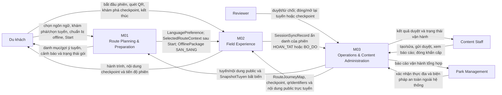

# System Context Diagram — Cúc Phương Quest

Sơ đồ mô tả ranh giới logic của MVP theo specification M01–M03. Đây không phải deployment diagram hoặc physical API design.

## Ranh giới trách nhiệm

| Module | Sở hữu | Không sở hữu |
|---|---|---|
| M01 | Chọn ngôn ngữ/tuyến, recommendation, chuẩn bị và quản lý gói offline, Start và handoff sang M02 | Quét QR, tiến độ phiên, CRUD dữ liệu nguồn |
| M02 | `PlaySession`, `CheckpointVisit`, quét QR, hiển thị nội dung tại điểm, lưu tiến độ cục bộ và đồng bộ phiên kết thúc | Quản trị nội dung, tạo gói offline, thay đổi context M01 |
| M03 | Tuyến, checkpoint, nhiều QR trên mỗi checkpoint, nội dung/media, kiểm duyệt, snapshot, trạng thái vận hành và RPT-01/RPT-02 | Trải nghiệm thực địa, package trên thiết bị, cảnh báo real-time tới phiên đang chạy |

## Contract liên module

| Hướng | Contract | Điều kiện chính |
|---|---|---|
| M03 → M01 | Public route/content/tags/status và `SnapshotTuyen` | Chỉ dữ liệu đã phát hành; snapshot bất biến và versioned |
| M01 → M02 | `LanguagePreference` | Công bố sau khi chọn/đổi hợp lệ |
| M01 → M02 | `SelectedRouteContext.routeId` | Chỉ ghi/công bố sau Start hợp lệ |
| M01 → M02 | `OfflinePackage` | M02 chỉ đọc package active ở trạng thái `SAN_SANG` |
| M03 → M02 | Route/checkpoint/QR/content public | Một checkpoint có `qrIdentifiers[]`; QR phân giải về cùng `checkpointId` |
| M02 → M03 | `SessionSyncRecord` | Ẩn danh; chỉ `HOAN_TAT`/`BO_DO`; upsert theo `sessionId` |

## Giới hạn hệ thống

- Tài nguyên offline và check-in khóa theo `checkpointId`, không theo từng QR vật lý.
- Nội dung `OFFLINE_REQUIRED` được M02 đọc từ package M01; nội dung `ONLINE_AVAILABLE` được đọc trực tiếp từ M03.
- Đóng tuyến/checkpoint cập nhật nguồn cho lượt đọc mới nhưng không cam kết cảnh báo hay ngắt phiên M02 đang chạy.
- Báo cáo M03 chạy theo yêu cầu sau khi phiên kết thúc được đồng bộ thành công; không cam kết realtime.

## Nguồn

- [Specification M01](../../specs/spec-M01.md)
- [Specification M02](../../specs/spec-M02.md)
- [Specification M03](../../specs/spec-M03.md)
