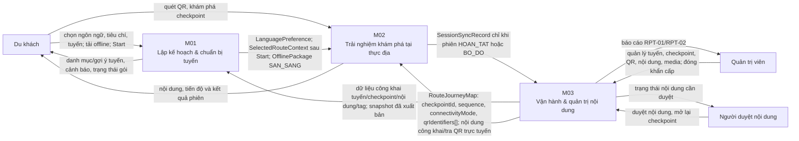

# System Context Diagram — Cúc Phương Quest

## Ranh giới trách nhiệm

| Thành phần | Sở hữu chính |
|---|---|
| M01 | Chọn tuyến, chọn ngôn ngữ, chuẩn bị/tải gói offline và khởi tạo ngữ cảnh tuyến cho du khách. |
| M02 | Quét QR, trải nghiệm tại checkpoint, tiến độ và phiên chơi (`PlaySession`, `CheckpointVisit`). |
| M03 | Dữ liệu vận hành: tuyến, checkpoint, QR, nội dung, media, xuất bản, kiểm duyệt và báo cáo. |

## Quy ước liên module

- Một `checkpointId` có thể có nhiều `qrIdentifiers[]`; QR được ánh xạ về checkpoint đó.
- Tài nguyên offline và check-in ở M02 được định danh theo `checkpointId`, không theo từng mã QR.
- M03 là nguồn dữ liệu công khai; M01 sử dụng snapshot đã xuất bản cho chuẩn bị tuyến, còn M02 dùng `RouteJourneyMap` và chỉ tra cứu trực tuyến khi cần.
- M02 không gửi sự kiện từng lượt quét sang M03. Chỉ đồng bộ bản ghi phiên ẩn danh khi phiên ở trạng thái kết thúc.