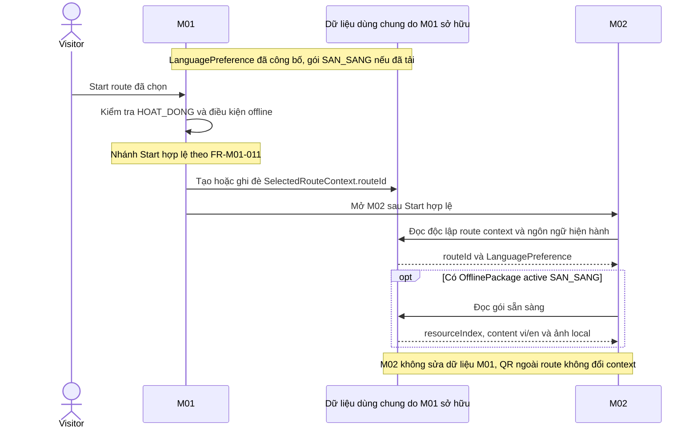
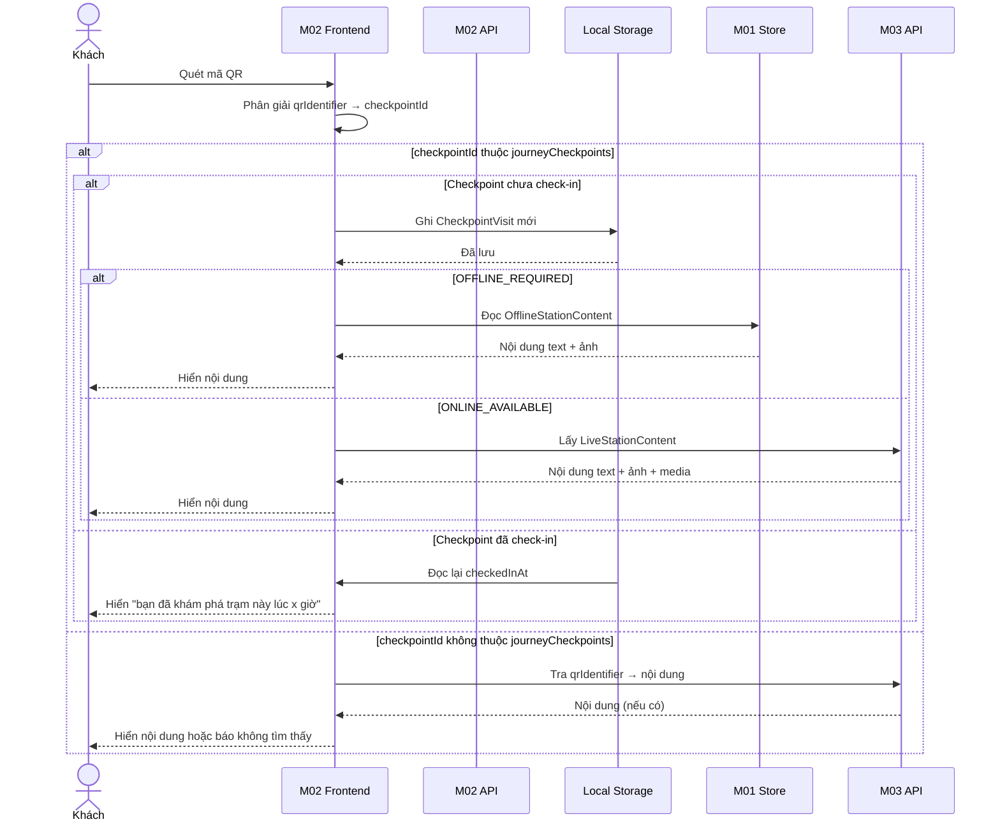
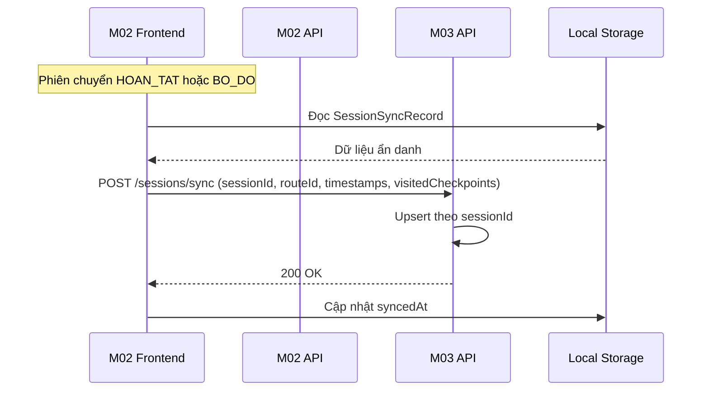
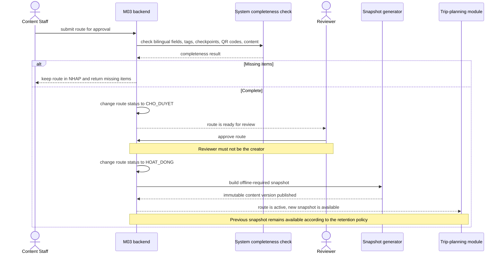

# Sequence Diagrams — Cúc Phương Quest

File này chỉ tập hợp nguyên văn các block `sequenceDiagram` đã có trong specification module; không diễn giải, chỉnh sửa hoặc bổ sung flow.

## Danh mục sequence

1. [SD-01 — M01 Start Route & Handoff](#sd-01--m01-start-route--handoff)
2. [SD-02 — M02 Quét QR & Check-in](#sd-02--m02-quét-qr--check-in)
3. [SD-03 — M02 Session Sync](#sd-03--m02-session-sync)
4. [SD-04 — M03 Route Approval & Publication](#sd-04--m03-route-approval--publication)

## SD-01 — M01 Start Route & Handoff

Nguồn: [spec-M01.md](../../specs/spec-M01.md), §4.7.

## SD-02 — M02 Quét QR & Check-in

Nguồn: [spec-M02.md](../../specs/spec-M02.md), §4.2.

## SD-03 — M02 Session Sync

Nguồn: [spec-M02.md](../../specs/spec-M02.md), §4.3.

## SD-04 — M03 Route Approval & Publication

Nguồn: [spec-M03.md](../../specs/spec-M03.md), §4.2.

