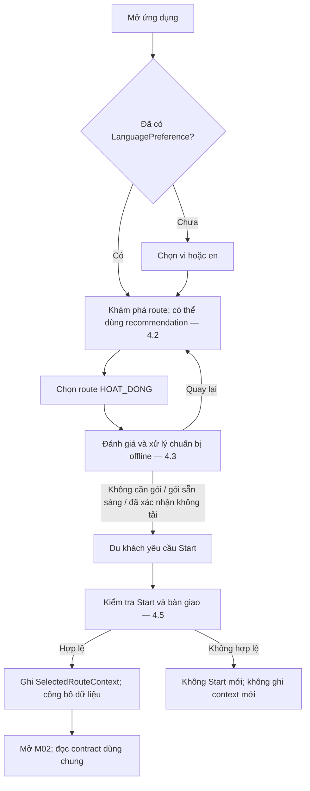
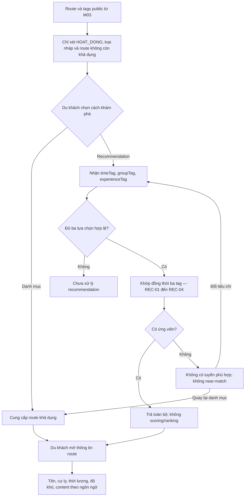
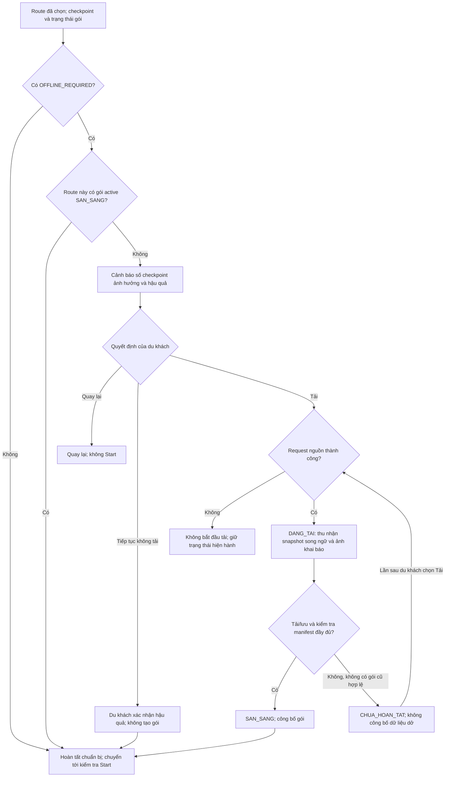
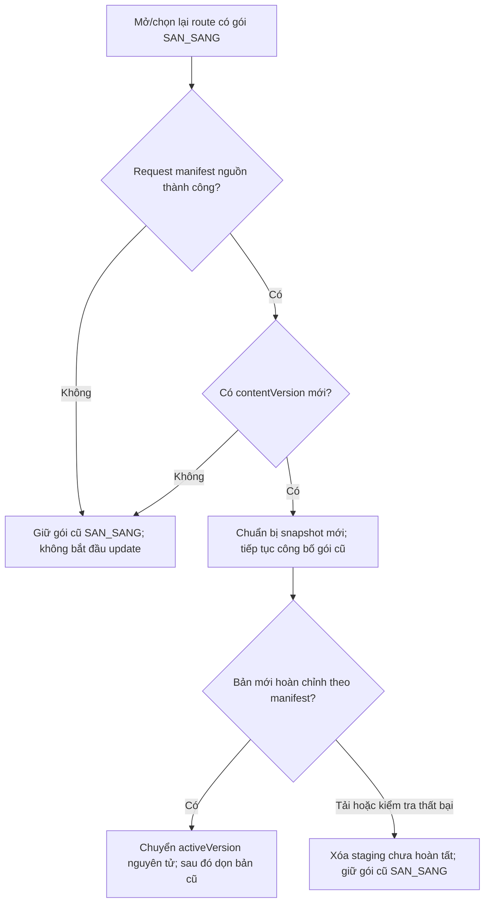
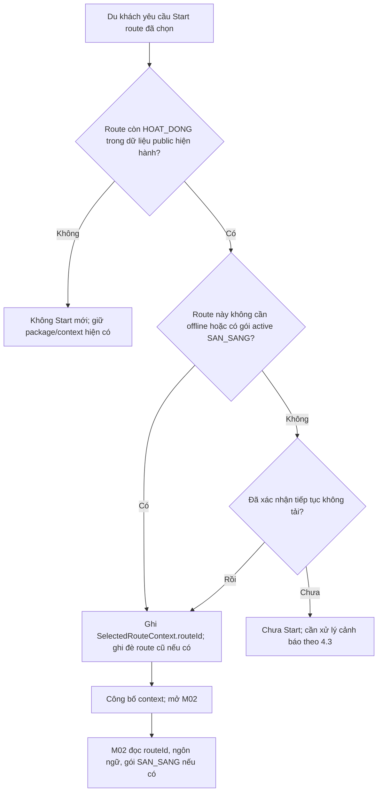
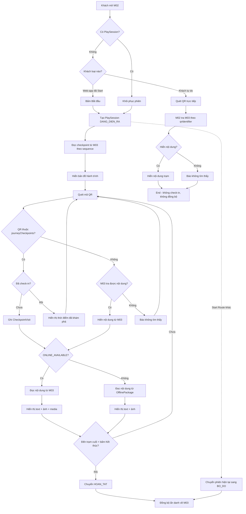
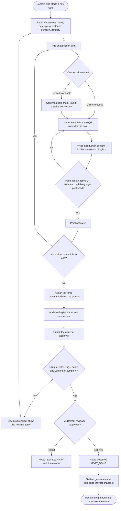

# Usage Flow — Cúc Phương Quest

File này chỉ tập hợp nguyên văn các block `flowchart` đã có trong specification module; không diễn giải, chỉnh sửa hoặc bổ sung flow.

## Danh mục flow

1. [UF-01 — Overall M01 Usage Flow](#uf-01--overall-m01-usage-flow)
2. [UF-02 — Route Discovery & Recommendation](#uf-02--route-discovery--recommendation)
3. [UF-03 — Offline Preparation](#uf-03--offline-preparation)
4. [UF-04 — Resource Management & Lazy Update](#uf-04--resource-management--lazy-update)
5. [UF-05 — Start Route & Handoff](#uf-05--start-route--handoff)
6. [UF-06 — M02 Usage Flow](#uf-06--m02-usage-flow)
7. [UF-07 — M03 Route Publication Flow](#uf-07--m03-route-publication-flow)

## M01 — Functional Flows

Nguồn: [spec-M01.md](../../specs/spec-M01.md), §4.1–§4.5.

### UF-01 — Overall M01 Usage Flow

### UF-02 — Route Discovery & Recommendation

### UF-03 — Offline Preparation

### UF-04 — Resource Management & Lazy Update

### UF-05 — Start Route & Handoff

## M02 — Usage flow

Nguồn: [spec-M02.md](../../specs/spec-M02.md), §4.1.

### UF-06 — M02 Usage Flow

## M03 — Usage flow

Nguồn: [spec-M03.md](../../specs/spec-M03.md), §4.1.

### UF-07 — M03 Route Publication Flow

