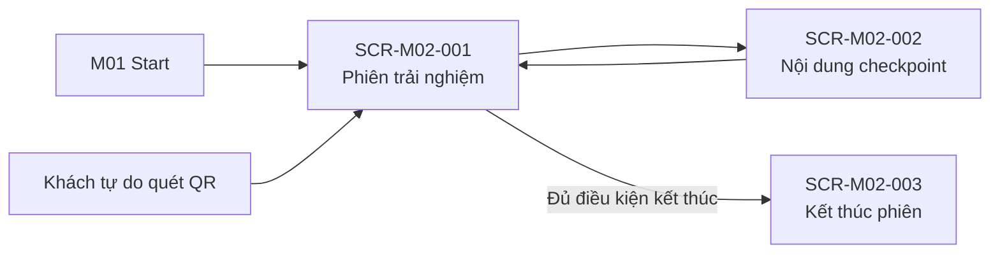

# Screen List M02 — Field Experience

## 1. Document information

| Field | Value |
|---|---|
| Module | M02 — Field Experience |
| Source Spec | [spec-M02.md](../specs/spec-M02.md) |
| Function Source | [function-list-M02.md](function-list-M02.md) |
| Priority Source | [MVP-Scope.md](../MVP-Scope.md) |
| Status | Ready for screen specification |

## 2. Decomposition rules

- Giữ ba màn logic trong spec M02; chuẩn hóa ID `S-M02-01…03` thành `SCR-M02-001…003` cho thống nhất repository.
- QR scanner nằm trong screen phiên; kết quả nội dung mở screen content.
- Reload/resume, local persistence và session sync là background behavior.
- Khách tự do dùng cùng scanner/content screen nhưng không tạo PlaySession.

## 3. Screen list

| Screen ID | Screen name | Actor | User goal | Owning functions | Main FR | Priority |
|---|---|---|---|---|---|---|
| SCR-M02-001 | Phiên trải nghiệm | Visitor | Bắt đầu/khôi phục phiên, xem journey map và quét QR | FN-M02-001, 002, 003, 007, 008 | FR-M02-001–011, 016–018, 025, 026 | Must |
| SCR-M02-002 | Nội dung checkpoint | Visitor | Xem nội dung đúng nguồn/ngôn ngữ và phát media khi có | FN-M02-004, 008 | FR-M02-011–015, 025, 027 | Must |
| SCR-M02-003 | Kết thúc phiên | Visitor | Xác nhận hoàn tất và xem kết quả terminal | FN-M02-001, 006 | FR-M02-019–024 | Must |

## 4. Screen details

### SCR-M02-001 — Phiên trải nghiệm

| Item | Definition |
|---|---|
| Entry | M01 handoff có routeId; resume phiên; hoặc khách tự do mở scanner |
| Primary data | RouteJourneyMap từ M03; PlaySession/CheckpointVisit từ IndexedDB; context M01 read-only |
| Main content | Bắt đầu, timeline checkpoint, trạng thái check-in, QR scanner, repeat/out-of-route result |
| Exit | Mở SCR-M02-002; mở SCR-M02-003 khi đủ điều kiện; quay M01 nếu thiếu context |
| States | No context, ready to start, active/resumed, scan processing, duplicate scan, outside-route scan |

### SCR-M02-002 — Nội dung checkpoint

| Item | Definition |
|---|---|
| Entry | Sau scan hoặc chọn mở nội dung checkpoint đã check-in |
| Primary data | `OFFLINE_REQUIRED` từ OfflinePackage M01; `ONLINE_AVAILABLE` từ M03 |
| Main content | `introductionText` theo `vi/en`, ảnh; audio/video online phát theo yêu cầu |
| Exit | Quay SCR-M02-001 |
| States | Offline content, live content loading, live source unavailable, media stopped/playing |

### SCR-M02-003 — Kết thúc phiên

| Item | Definition |
|---|---|
| Entry | Checkpoint cuối đã check-in và người dùng chọn Kết thúc |
| Primary data | PlaySession và visits local |
| Main content | Xác nhận/result `HOAN_TAT`; trạng thái đồng bộ không chặn kết thúc |
| Exit | Kết thúc hành trình; trở về entry phù hợp |
| States | Confirmation, completed/sync pending, completed/synced |

## 5. Navigation

## 6. Background/embedded behavior

| Behavior | Parent screen(s) | Source FR |
|---|---|---|
| Persist/resume session and visits | SCR-M02-001 | FR-M02-016, 017 |
| Auto-abandon on route change | SCR-M02-001 | FR-M02-018 |
| Idempotent check-in/repeat timestamp | SCR-M02-001 | FR-M02-007, 008 |
| Terminal sync/retry/no PII | SCR-M02-003/background | FR-M02-021–024 |
| Read-only M01/M03 contracts | All | FR-M02-025 |

## 7. Coverage check

| Coverage | Result |
|---|---|
| Source FR | 27/27 covered |
| User-facing screens | 3 |
| Separate scanner screen | Không — embedded in SCR-M02-001 |
| Separate sync screen | Không — background state |

## 8. Screen spec targets

| Screen ID | Target file |
|---|---|
| SCR-M02-001 | `screens/screen-spec-SCR-M02-001.md` |
| SCR-M02-002 | `screens/screen-spec-SCR-M02-002.md` |
| SCR-M02-003 | `screens/screen-spec-SCR-M02-003.md` |
