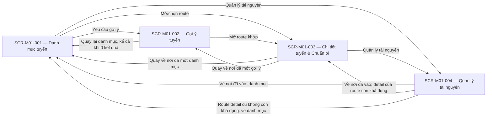

# M01 Screen List

## 1. Document Information

| Field | Value |
|---|---|
| Module | M01 — Route Planning & Preparation |
| Source Spec | [spec-M01.md](../specs/spec-M01.md) v1.1 — đồng bộ BRD M01 v2.4 |
| Business Source | [BRD-module-1.md](../business-requirements/BRD-module-1.md) — v2.4 |
| Purpose | Step 6: chia screen theo user goal; Step 7: baseline cho draft Screen Specs và visual design |
| Status | Draft — ready for visual design |
| Date | 2026-09-20 |
| Structure reference only | `templates/screen  spec template.md`; cấu trúc draft theo yêu cầu Step 7, không lấy requirement từ template |

Chỉ BRD và Spec là nguồn nghiệp vụ. `FR-M01-*` trong tài liệu này là **13 FR của Spec**, không phải 12 FR cùng namespace trong BRD; đối chiếu tại Spec §11.1.1. Priority lấy từ cột Priority của BRD §4.1 và nêu căn cứ dưới bảng screen. “Chốt” ở bước này nghĩa baseline phân rã nhất quán để tạo draft, không phải Product/UX đã phê duyệt.

Giữ cấu trúc repository: screen list ở `docs/`, screen specs ở `screens/`, module spec ở `specs/`. Link từ module spec dùng `../screens/…` để trỏ đúng file. Không dùng nội dung placeholder cũ làm requirement.

## 2. Screen Decomposition Principles

- Screens derive from user-facing functional capabilities; không map FR 1:1.
- Chỉ tách screen khi có user goal/information space và entry/exit riêng.
- Background processing, warning, confirmation, loading/error không tự trở thành screen.
- Ngôn ngữ là tương tác dùng chung; preparation và Start gắn với route đang xem.
- Không thêm feature, data field hay business rule. Cách nhóm và đường vào/ra là quyết định phân rã UX draft, không tuyên bố BRD đã thiết kế navigation.
- Không chọn layout/component cụ thể. Type của embedded UI chỉ mô tả vai trò; designer quyết định hình thức phù hợp, giữ trigger/outcome.

### 2.1 Capability Working Table

| Capability | Related FR | Needs UI? | Candidate Screen | Reason |
|---|---|---|---|---|
| Language Preference | FR-M01-001 | Shared with another screen | SCR-M01-001 lần đầu; cả bốn screen khi đổi | Hai lựa chọn dùng chung, không information space độc lập |
| Route Discovery | FR-M01-002 | Yes | SCR-M01-001 | Khám phá tập route khả dụng và chọn nơi đi tiếp |
| Route Detail | FR-M01-003 | Yes | SCR-M01-003 | Đọc thông tin và quyết định cho một route cụ thể |
| Route Recommendation | FR-M01-004 | Yes | SCR-M01-002 | Ba tiêu chí và 0..N kết quả cùng một task, không tách input/result |
| Offline evaluation/warning | FR-M01-005 | Shared with another screen | SCR-M01-003 | Kết quả hệ thống phải được truyền đạt theo route |
| Offline preparation decision | FR-M01-006 | Shared with another screen | SCR-M01-003 | Tiếp nối chọn route, không tạo màn cảnh báo riêng |
| Download request/feedback | FR-M01-007 | Shared with another screen | SCR-M01-003, SCR-M01-004 | Tải và trạng thái trên nơi khởi tạo, không màn tiến độ riêng |
| Validate/publish package | FR-M01-008 | No | Trạng thái tại SCR-M01-003, SCR-M01-004 | Xử lý hệ thống; readiness thể hiện qua gói |
| Resource Management | FR-M01-009 | Yes | SCR-M01-004 | Quản lý dữ liệu local độc lập với chọn/Start; vẫn cần khi route bị xóa/đóng |
| Lazy update | FR-M01-010 | No | Trạng thái gói tại SCR-M01-003, SCR-M01-004 | Không thêm Update UI; trigger vẫn mở/chọn lại route |
| Route Start | FR-M01-011 | Shared with another screen | SCR-M01-003 | Hoàn tất quyết định route; không màn Start/Success riêng |
| Create SelectedRouteContext | FR-M01-012 | No | Kết quả Start tại SCR-M01-003 | Không tương tác bổ sung |
| Publish Shared Data | FR-M01-013 | No | Hệ quả ngôn ngữ/gói/Start | Không screen công bố/handoff riêng |

### 2.2 Decomposition Decision

| Screen / grouping | Distinct goal and data | Entry / exit | State/lifecycle and complexity assessment |
|---|---|---|---|
| SCR-M01-001 riêng | Khám phá collection route | Vào M01; mở route/gợi ý/tài nguyên | Không nhét tiêu chí recommendation hoặc quản lý package vào collection |
| SCR-M01-002 riêng | Chọn ba tiêu chí và đọc kết quả | Từ danh mục; mở route hoặc về danh mục | Input/result/empty là một chu kỳ; không cần hai screen |
| SCR-M01-003 gộp detail + preparation + Start | Quyết định cho cùng một route | Từ danh mục/kết quả; quay lại, quản lý tài nguyên hoặc M02 | Chỉ mở phần cảnh báo khi có điều kiện; không chia nhỏ một task liên tục |
| SCR-M01-004 riêng | Xem/Tải/Xóa package local | Từ danh mục hoặc detail; về nơi đã vào | Bốn state và xác nhận Xóa, không phụ thuộc route còn trong danh mục |
| Language/warnings/confirmations/states nhúng | Task ngắn hoặc phản hồi của task hiện hữu | Không navigation độc lập | Không tạo thêm Screen ID, màn cài đặt, màn lỗi hoặc màn loading |

## 3. Screen List

| Screen ID | Screen Name | Primary Actor | Purpose | Entry Condition | Main FRs | Priority |
|---|---|---|---|---|---|---|
| SCR-M01-001 | Danh mục tuyến | ACT-001 — Visitor | Khám phá route khả dụng và chọn hướng tiếp tục | Mở M01; chọn ngôn ngữ trước chức năng khác; có public projection hợp lệ để hiển thị route | FR-M01-001, FR-M01-002 | Must |
| SCR-M01-002 | Gợi ý tuyến | ACT-001 — Visitor | Nhập ba tiêu chí và xem tất cả route khớp | Từ danh mục; đã có ngôn ngữ và dữ liệu route/tag khả dụng | FR-M01-004, FR-M01-001 | Must |
| SCR-M01-003 | Chi tiết tuyến & Chuẩn bị | ACT-001 — Visitor | Hiểu một route, xử lý chuẩn bị offline và yêu cầu Start | Mở/chọn route public HOAT_DONG từ danh mục hoặc kết quả | FR-M01-003, FR-M01-005, FR-M01-006, FR-M01-007, FR-M01-011, FR-M01-001 | Must |
| SCR-M01-004 | Quản lý tài nguyên | ACT-001 — Visitor | Xem, tải hoặc xóa gói local | Từ danh mục/detail; đã có ngôn ngữ; có route cần offline hoặc dữ liệu gói | FR-M01-009, FR-M01-007, FR-M01-001 | Should |

Căn cứ priority: SCR-M01-001 từ BRD FR-M01-001/002 (Must); SCR-M01-002 từ BRD FR-M01-003 (Must); SCR-M01-003 từ BRD FR-M01-002/004/005/006/009 (Must); SCR-M01-004 theo capability chính quản lý tài nguyên tại **BRD FR-M01-007 (Should)**, được map thành Spec FR-M01-009. Should của screen không hạ các rule bắt buộc khi thực hiện Tải/Xóa và không cho phép bỏ capability khỏi baseline này.

| Screen ID | Draft Screen Spec |
|---|---|
| SCR-M01-001 | [Danh mục tuyến](../screens/screen-spec-SCR-M01-001.md) |
| SCR-M01-002 | [Gợi ý tuyến](../screens/screen-spec-SCR-M01-002.md) |
| SCR-M01-003 | [Chi tiết tuyến & Chuẩn bị](../screens/screen-spec-SCR-M01-003.md) |
| SCR-M01-004 | [Quản lý tài nguyên](../screens/screen-spec-SCR-M01-004.md) |

## 4. Screen Functional Coverage

| Screen ID | Supported FRs | Supported Flows | Related GHER |
|---|---|---|---|
| SCR-M01-001 | FR-M01-001, FR-M01-002; FR-M01-013 qua preference | FLO-M01-01, FLO-M01-05 | GHER-001, GHER-002, GHER-003, GHER-018, GHER-021; GHER-022 là quyền nguồn, không UI ghi |
| SCR-M01-002 | FR-M01-001, FR-M01-004; FR-M01-013 qua preference | FLO-M01-02, FLO-M01-05 | GHER-002, GHER-004, GHER-005, GHER-006, GHER-021 |
| SCR-M01-003 | FR-M01-001, FR-M01-003, FR-M01-005, FR-M01-006, FR-M01-007, FR-M01-011; FR-M01-008, FR-M01-010, FR-M01-012, FR-M01-013 qua state/handoff | FLO-M01-01, FLO-M01-03, FLO-M01-04, FLO-M01-05, FLO-M01-07, FLO-M01-08 | GHER-002, GHER-003, GHER-007…011, GHER-013…017, GHER-019…021 |
| SCR-M01-004 | FR-M01-001, FR-M01-007, FR-M01-009; FR-M01-008, FR-M01-010, FR-M01-013 qua state/publication | FLO-M01-03, FLO-M01-05, FLO-M01-06; quan sát kết quả FLO-M01-07, không tạo trigger mới | GHER-002, GHER-009, GHER-010, GHER-012…014, GHER-018…021 |

### 4.1 FR → Screen (all 13 FR)

| FR | Screen coverage | Representation |
|---|---|---|
| FR-M01-001 | SCR-M01-001, SCR-M01-002, SCR-M01-003, SCR-M01-004 | Chọn lần đầu trên SCR-M01-001; đổi ngôn ngữ dùng chung |
| FR-M01-002 | SCR-M01-001 | Danh mục |
| FR-M01-003 | SCR-M01-003 | Thông tin route |
| FR-M01-004 | SCR-M01-002 | Tiêu chí, tất cả kết quả, empty outcome |
| FR-M01-005 | SCR-M01-003 | Readiness và cảnh báo khi chọn route |
| FR-M01-006 | SCR-M01-003 | Quyết định offline và xác nhận không tải |
| FR-M01-007 | SCR-M01-003, SCR-M01-004 | Yêu cầu Tải, phạm vi và phản hồi trạng thái |
| FR-M01-008 | SCR-M01-003, SCR-M01-004 | No dedicated screen — represented through system behavior/state |
| FR-M01-009 | SCR-M01-004 | Xem/Tải/Xóa đúng gói |
| FR-M01-010 | SCR-M01-003, SCR-M01-004 | No dedicated screen — represented through system behavior/state; không action Update |
| FR-M01-011 | SCR-M01-003 | Start với guard và outcome rời M01 |
| FR-M01-012 | SCR-M01-003 | No dedicated screen — represented through system behavior/state; ghi context sau Start |
| FR-M01-013 | SCR-M01-001, SCR-M01-002, SCR-M01-003, SCR-M01-004 | No dedicated screen — represented through system behavior/state; preference/package/context theo trigger độc lập |

GHER-017 chỉ là invariant context khi M02 scan ngoài route; không tạo scan UI ở M01. GHER-022 kiểm tra phân quyền nguồn; không cần màn truy cập bị từ chối hoặc thao tác CRUD trong M01.

## 5. Navigation Map

Đây là **navigation draft được derive**, không phải business processing diagram. Node chỉ là bốn Screen ID. Mở M02 là exit boundary nêu trong bảng, không invent Screen ID M02. Entry ban đầu là SCR-M01-001 với lựa chọn ngôn ngữ nhúng nếu chưa có preference; thay đổi ngôn ngữ không đổi screen.

| Navigation intent / result | Source and constraint |
|---|---|
| Danh mục → gợi ý → route detail; gợi ý → danh mục | FLO-M01-01/02; tách information space tại §2.2; không thêm bước xác nhận bắt buộc |
| Danh mục/detail → quản lý tài nguyên; quay về nơi vào | FLO-M01-06; entry placement là quyết định UX draft để quản lý gói không phụ thuộc chọn route mới |
| Quay lại từ cảnh báo offline | Ở SCR-M01-003, rời phần quyết định để về thông tin route; không Start, không ghi context. Nếu muốn bỏ route, quay về danh mục/kết quả đã mở; FLO-M01-01/04, FR-M01-006 |
| Tải thành công hoặc xác nhận không tải | Vẫn SCR-M01-003; không tự Start/M02. Cần yêu cầu Start riêng theo FLO-M01-08 |
| Start hợp lệ trên SCR-M01-003 | Exits M01 / opens M02; FR-M01-011…013. Không thêm screen bàn giao, không thiết kế navigation nội bộ M02 |
| Route detail đang mở về sau bị xóa/TAM_DONG sau sync thành công | Không còn là lựa chọn mới/không Start; có thể về danh mục hoặc tài nguyên local. Nếu quay từ tài nguyên mà route cũ không khả dụng, về danh mục; đây là xử lý navigation draft theo BR-M01-031, không xóa context/gói |

Việc ghép Start vào detail không đặt thêm điều kiện phải đọc hết nội dung hoặc xác nhận đã đọc. “Nơi đã vào” chỉ là ngữ cảnh navigation, không phải lịch sử hành trình cần lưu. Không quy định giữ bộ tiêu chí, vị trí cuộn hay tiến độ tải khi rời screen ngoài contract đã có.

## 6. Embedded UI / Overlay Inventory

Đếm **8 nhóm tương tác/trạng thái**, không phải 8 screen hoặc 8 modal bắt buộc. Một nhóm dùng ở nhiều parent chỉ tính một lần; các giá trị của package state không tính thành component riêng.

| ID / Name | Parent Screen | Type | Trigger | Purpose | Related FR |
|---|---|---|---|---|---|
| Chọn / đổi ngôn ngữ | SCR-M01-001 lần đầu; cả bốn screen khi đổi | Embedded Section | Chưa có preference hoặc yêu cầu đổi | Chọn vi/en, kể cả offline; chưa chọn thì chưa dùng chức năng khác | FR-M01-001 |
| Chuẩn bị offline và cảnh báo | SCR-M01-003 | Inline Warning | Chọn route cần offline, thiếu gói SAN_SANG | Số checkpoint ảnh hưởng, hậu quả; Tải/Tiếp tục không tải/Quay lại | FR-M01-005, FR-M01-006 |
| Xác nhận tiếp tục không tải | SCR-M01-003 | Dialog | Chọn Tiếp tục không tải | Xác nhận hậu quả trước khi đủ điều kiện Start | FR-M01-006, FR-M01-011 |
| Trạng thái / kết quả tải gói | SCR-M01-003, SCR-M01-004 | Embedded Section | Tải/kiểm tra/update làm thay đổi kết quả gói | CHUA_TAI/DANG_TAI/SAN_SANG/CHUA_HOAN_TAT; giữ readiness gói cũ khi lazy update lỗi | FR-M01-007, FR-M01-008, FR-M01-010 |
| Xem thông tin gói | SCR-M01-004 | Embedded Section | Chọn Xem | Route/version/trạng thái; không phải trình đọc `introductionText` | FR-M01-009 |
| Xác nhận Xóa | SCR-M01-004 | Dialog | Chọn Xóa một gói | Nhận diện gói đích và chỉ xóa sau xác nhận | FR-M01-009 |
| Không có tuyến phù hợp | SCR-M01-002 | Embedded Section | Matching 0 kết quả với ba input hợp lệ | Thông báo đúng nguồn, đổi tiêu chí hoặc về danh mục | FR-M01-004 |
| Route không còn khả dụng trong ngữ cảnh đang mở | SCR-M01-003 | Inline Warning | Sync thành công thấy route xóa/TAM_DONG | Không cho Start mới; đường về danh mục/tài nguyên; giữ local | FR-M01-003, FR-M01-011 |

Loại Dialog có thể được designer thể hiện bằng cách tương đương nếu vẫn có xác nhận rõ ràng; chưa ấn định modal/bottom sheet, gesture hoặc vị trí. Không thêm xác nhận đổi route, progress phần trăm, dung lượng/ETA hoặc notification nền.

## 7. Coverage Check

| Functional Area | Screen Coverage | Status |
|---|---|---|
| Language | SCR-M01-001 gate ban đầu; shared interaction cả bốn screen | Covered as state/overlay |
| Route Browse | SCR-M01-001 | Covered |
| Route Detail | SCR-M01-003 | Covered |
| Recommendation | SCR-M01-002 gồm criteria/results/empty | Covered |
| Offline Preparation | SCR-M01-003 gồm warning/confirmation | Covered as state/overlay |
| Download feedback | SCR-M01-003, SCR-M01-004 | Covered as state/overlay |
| Resource Management | SCR-M01-004 gồm Xem/Tải/Xóa | Covered |
| Start Route | SCR-M01-003 → exit M01 / M02 | Covered |
| Validate/Publish package — FR-M01-008 | Trạng thái gói, không màn mới | Background behavior |
| Lazy update — FR-M01-010 | Gói active vẫn sẵn sàng, không màn/action Update | Background behavior |
| Create context — FR-M01-012 | Hệ quả Start | Background behavior |
| Publish shared data — FR-M01-013 | Theo ngôn ngữ/gói/Start, không màn mới | Background behavior |

Kết quả tự kiểm tra phân rã: 4 screen có goal riêng; 9/9 FR user-facing (001–007, 009, 011) được bao phủ; 4/4 FR nền (008, 010, 012, 013) không có màn riêng. 8 nhóm nhúng giữ confirmation/state trong task liên quan. Không screen mồ côi hoặc navigation target ngoài baseline.

## 8. Screen Decomposition Questions

No blocking screen decomposition questions.

Không phát hiện conflict BRD v2.4/Spec v1.1 làm thay đổi cách chia screen. Danh sách này là baseline chức năng cho visual design; việc chưa có file screen-spec không làm thiếu screen hoặc thiếu flow.

| Item | Handling | Blocking for draft visual design? |
|---|---|---|
| Owner/người phê duyệt — OQ-M01-001 | Chưa có cá nhân xác nhận; giữ draft, không đóng approval | No |
| Hình thức overlay, layout, responsive/accessibility | To be finalized during visual design; không tự đặt pixel/breakpoint/WCAG | No |
| Copy/loading/error cho catalogue/recommendation khi nguồn không khả dụng | Nguồn chưa đặc tả đầy đủ; không thêm retry/fallback hoặc dùng copy empty-match để báo lỗi nguồn. Chốt presentation trong visual design; hành vi mới phải quay về requirement review | No cho thiết kế các flow đã có |

Cả SCR-M01-001…004 **Ready for Claude Design** ở mức đầu vào chức năng draft; không screen nào Needs Review về decomposition. Chưa có mockup hoặc Element Inventory hoàn chỉnh. Mỗi screen spec giữ checklist mockup chưa hoàn thành.
