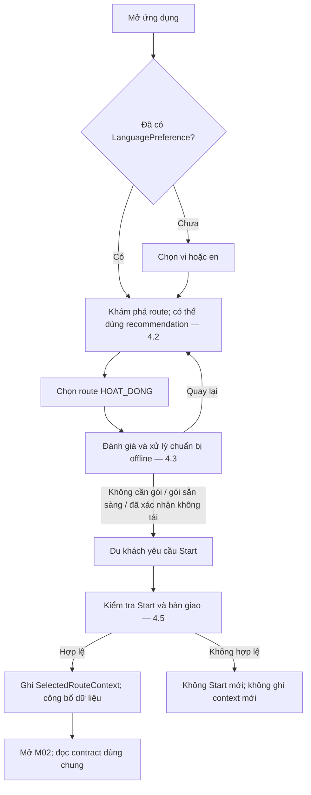
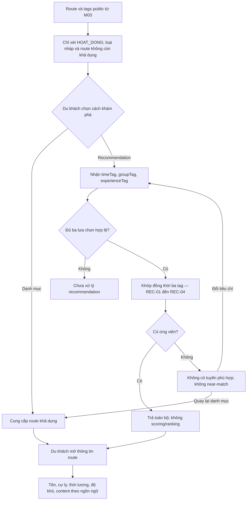
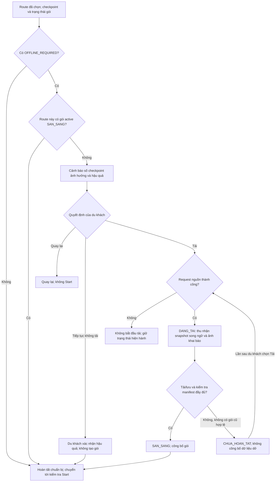
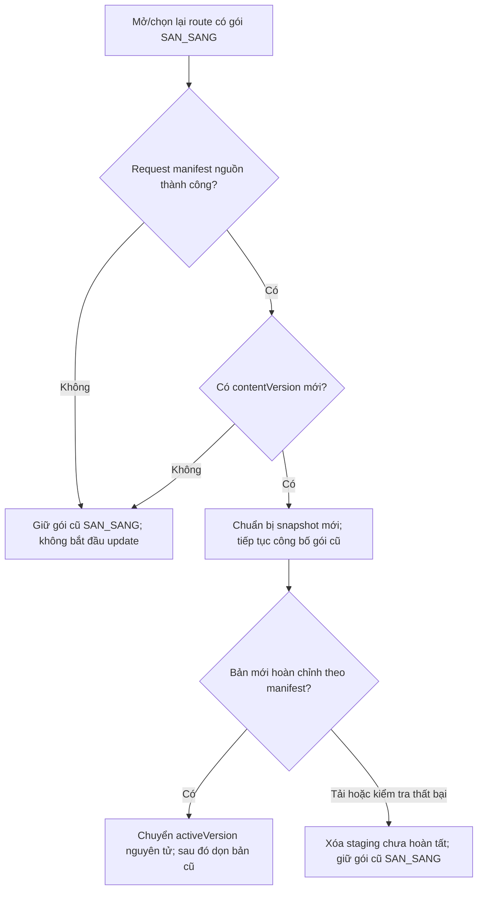
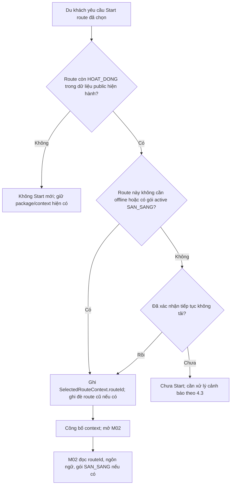
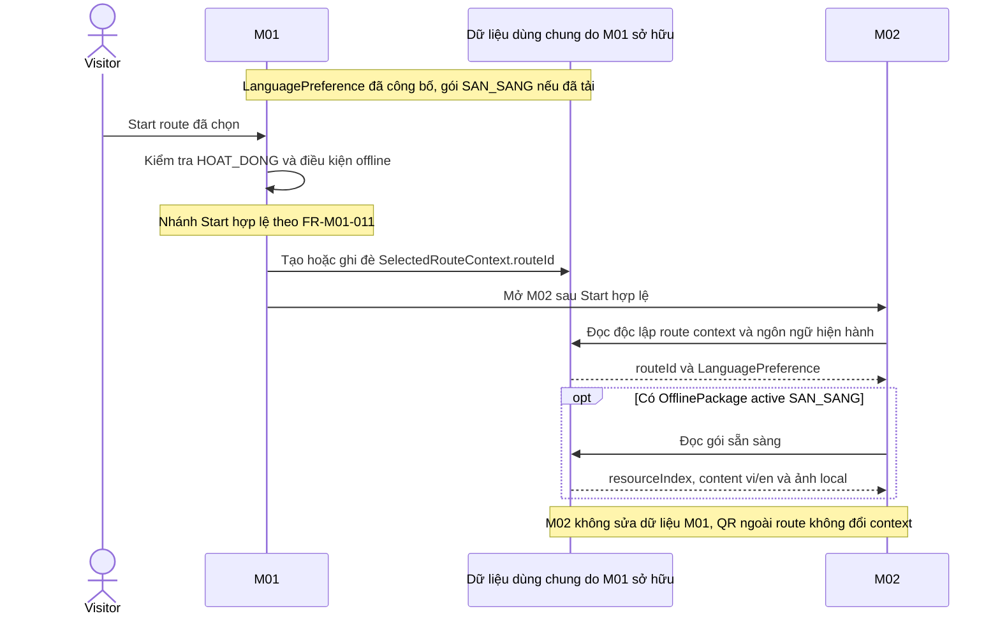
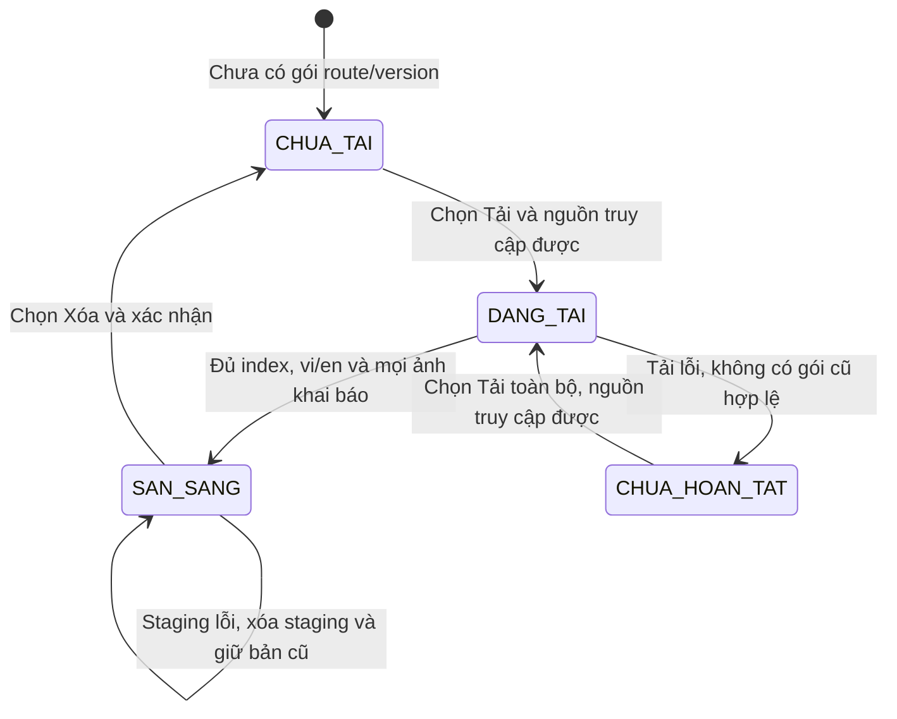
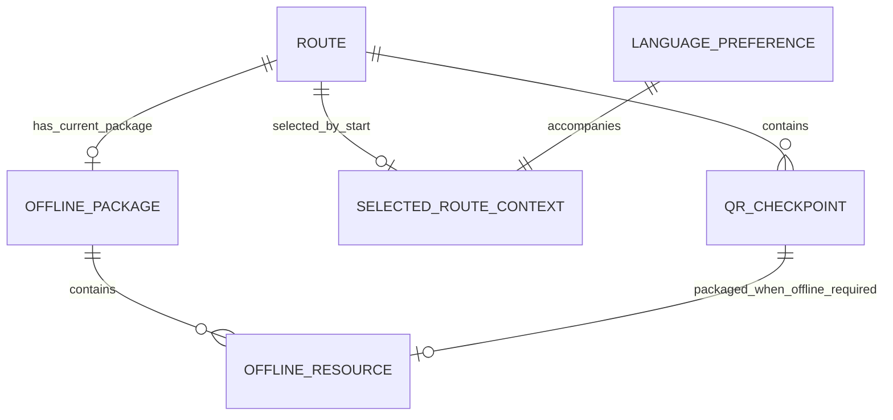

# Spec M01 — Route Planning & Preparation

## 0. Document Metadata

| Metadata | Value |
|---|---|
| Module ID | M01 |
| Module Name | Route Planning & Preparation — Lập kế hoạch & Chuẩn bị Tuyến |
| Version | 1.1 — đồng bộ baseline BRD v2.4 |
| Status | Ready for SDD/implementation planning — contract MVP M01/M02/M03 đã chốt |
| Source of Truth | [BRD-module-1.md](../../../business-requirements/BRD-module-1.md), v2.4 |
| Derived Documents | [Function List M01](../../function list/function-list-M01.md), [Screen List M01](../../screen list/screen-list-M01.md) |
| Last Updated | 2026-09-22 |
| Next Step | SDD, API/storage schema và implementation planning |

## 1. Purpose & Scope

### 1.1 Purpose

M01 giúp du khách hiểu và chọn route phù hợp, chuẩn bị tài nguyên song ngữ tại các checkpoint không bảo đảm kết nối, rồi bắt đầu route. Du khách có thể đổi ngôn ngữ cả khi offline và tự quyết định tải tài nguyên. M02 nhận route đã Start, ngôn ngữ hiện hành và gói offline sẵn sàng qua contract dùng chung. Nguồn: BRD §1.1, §1.3–1.4.

### 1.2 In Scope

| Capability | Functional scope | FR |
|---|---|---|
| Language preference | Chọn `vi/en` trước chức năng khác; lưu, đổi và công bố ngôn ngữ online/offline | FR-M01-001, FR-M01-013 |
| Route exploration | Danh mục route public `HOAT_DONG`; tên, cự ly, thời lượng, độ khó và content song ngữ | FR-M01-002, FR-M01-003 |
| Route recommendation | Ba lựa chọn định sẵn; trả mọi route khớp đủ ba tag hoặc outcome 0 kết quả | FR-M01-004 |
| Offline preparation | Đánh giá connectivity, số checkpoint ảnh hưởng, cảnh báo và quyết định của du khách | FR-M01-005, FR-M01-006 |
| Offline package lifecycle | Tải song ngữ, index ổn định và ảnh khai báo; chỉ công bố gói hoàn chỉnh | FR-M01-007, FR-M01-008 |
| Resource management | Xem, Tải; Xóa đúng gói sau xác nhận | FR-M01-009 |
| Lazy update | Khi mở/chọn lại route, kiểm tra nguồn/version, giữ gói cũ đến khi bản mới hoàn chỉnh | FR-M01-010 |
| Route Start and context | Kiểm tra điều kiện Start; tạo/ghi đè routeId chỉ sau Start hợp lệ | FR-M01-011, FR-M01-012 |
| M02 handoff | Công bố độc lập ba contract dùng chung | FR-M01-013 |

### 1.3 Out of Scope

- M03 sở hữu CRUD route/checkpoint/content, tag, ConnectivityMode, version và validation trước khi công bố.
- M02 sở hữu quét/xác thực QR, phân giải payload, hiển thị thông tin giới thiệu, tra cứu online, lịch sử, checkpoint hoàn thành, tiến trình và resume hành trình.
- Không có recommendation AI/machine learning, scoring/ranking; không có dẫn đường GPS hoặc bản đồ thời gian thực.
- OfflinePackage loại trừ hints, audio, video, bản đồ và tài nguyên của checkpoint `ONLINE_AVAILABLE`.
- MVP không đồng bộ/chuyển gói giữa thiết bị/trình duyệt, backup/restore dữ liệu website, push notification hoặc vô hiệu hóa gói từ xa khi offline.

Nguồn: BRD §1.2.2; BR-M01-004, BR-M01-006, BR-M01-024, BR-M01-025.

### 1.4 Dependencies & External Relationships

| Dependency | Direction | Data / Capability | Purpose |
|---|---|---|---|
| DEP-M01-001; XMOD-M01-001 | M03 → M01 | Public Route/status, checkpoint, content, tags, contentVersion | Nguồn chính thức cho khám phá, recommendation, chuẩn bị và Start |
| DEP-M01-002; XMOD-M01-003, XMOD-M01-005 | M03 → M01 | ID hợp lệ; route name/content `vi/en`; `introductionText` `vi/en` cho điểm offline; ba nhóm tag, connectivity, version hợp lệ | M01 dùng dữ liệu đã được M03 validate; bản nháp không là lựa chọn public |
| XMOD-M01-002, XMOD-M01-012 | M03 → M01 | `checkpointId` ổn định, `qrIdentifiers[]`, manifest và ảnh nguồn | Xác định phạm vi và kiểm tra package; resource vẫn khóa theo `checkpointId` |
| XMOD-M01-006, XMOD-M01-010 | M03 → M01 | Snapshot bất biến đã hoàn chỉnh theo version; current + previous và version bị thay thế chưa đủ 30 ngày | Tải/cập nhật mà không trộn snapshot; không cần acknowledgement |
| REL-M01-001; XMOD-M01-007 | M01 → M02 | LanguagePreference sau chọn/đổi | M02 đọc độc lập để chọn ngôn ngữ |
| REL-M01-001; XMOD-M01-008 | M01 → M02 | SelectedRouteContext.routeId sau Start | M02 đọc route hiện hành |
| REL-M01-001; XMOD-M01-006, XMOD-M01-010, XMOD-M01-012 | M01 → M02 | Active OfflinePackage `SAN_SANG` nếu có | M02 đọc index/content/ảnh local; không đọc staging hoặc sửa/xóa gói |
| XMOD-M01-011 | M03 → M01; boundary với M02 | Route bị xóa hoặc public `TAM_DONG` | Chặn dùng mới sau đồng bộ thành công; giữ dữ liệu local; phiên đang chạy thuộc M02 |
| XMOD-M01-013 | M03 → M01 | Quyền đọc dữ liệu nguồn của khách | M01 không ghi nguồn M03 |

Ba dữ liệu công bố có trigger độc lập. LanguagePreference hoặc gói sẵn sàng không cần chờ Start mới được công bố. BRD không định nghĩa input nghiệp vụ M02 → M01.

## 2. Actors

| Actor ID | Actor | Role in M01 |
|---|---|---|
| ACT-001 | Du khách | Chọn/đổi ngôn ngữ, tìm hiểu/chọn route, nhập tiêu chí, quyết định tải, quản lý gói và Start |
| ACT-002 | Hệ thống M01 | Matching, đánh giá offline, tải/kiểm tra/công bố gói, lưu preference và route đã Start |
| ACT-003 | Quản trị viên M03 | Quản trị nguồn route/checkpoint/content/tag/connectivity/version mà M01 đọc |
| ACT-004 | Hệ thống M02 | Đọc contract dùng chung; sở hữu QR, nội dung tại điểm và hành trình |
| ACT-005 | Ban Quản lý VQG | Phê duyệt nội dung, cảnh báo và quy tắc recommendation |

Nguồn: BRD §1.5. Vai trò ACT-005 không tự xác định cá nhân phê duyệt M01; OQ-M01-001 được giữ tại §10.

## 3. User Scenarios & Acceptance Criteria

Giữ nguyên các ID GHER trong BRD §3.5–3.6; bảng là acceptance summary, không thay thế Given/When/Then gốc. **22 ID GHER bao gồm 23 Scenario**, vì GHER-021 có hai Scenario: xóa route và tạm đóng route.

| Scenario ID | Scenario | Related FR | Expected Outcome |
|---|---|---|---|
| GHER-001 | Chọn ngôn ngữ lần đầu | FR-M01-001, FR-M01-013 | Yêu cầu `vi/en`; lưu để M01/M02 cùng đọc |
| GHER-002 | Đổi ngôn ngữ offline | FR-M01-001, FR-M01-013 | Đổi UI; M02 chọn nhánh tương ứng trong cùng gói; không tải/xóa gói |
| GHER-003 | Mở danh mục | FR-M01-002, FR-M01-003 | Chỉ route public `HOAT_DONG`, cho mở content; loại nháp/`TAM_DONG` |
| GHER-004 | Recommendation đủ ba tag | FR-M01-004 | Mọi kết quả là route `HOAT_DONG` khớp cả ba tag; không scoring |
| GHER-005 | Không có route phù hợp | FR-M01-004 | 0 route; thông báo theo BR-M01-013; cho đổi tiêu chí/quay lại; không nới điều kiện |
| GHER-006 | Hơn hai route phù hợp | FR-M01-004 | Trả toàn bộ route khớp, không ranking/scoring |
| GHER-007 | Route toàn online | FR-M01-005, FR-M01-011 | Không yêu cầu gói; cho phép Start |
| GHER-008 | Thiếu gói cho route offline | FR-M01-005, FR-M01-006, FR-M01-011 | Nêu số checkpoint bị ảnh hưởng; cho Tải/Tiếp tục không tải/Quay lại; guard trước Start |
| GHER-009 | Tải đúng phạm vi song ngữ | FR-M01-007 | Chỉ điểm offline; đủ `vi/en`; byte ảnh lưu IndexedDB; ảnh chung một lần; loại hints/audio/video/bản đồ |
| GHER-010 | Công bố gói đầy đủ | FR-M01-007, FR-M01-008, FR-M01-013 | `SAN_SANG` sau tải đủ index, `vi/en`, ảnh khai báo; M02 đọc được |
| GHER-011 | Xác nhận tiếp tục không tải | FR-M01-006, FR-M01-011 | Không tạo gói; vẫn cho phép Start |
| GHER-012 | Quản lý tài nguyên | FR-M01-008, FR-M01-009 | Chỉ Xem/Tải/Xóa; không action Retry hoặc Update thủ công |
| GHER-013 | Lazy update thành công | FR-M01-010 | Giữ gói cũ trong lúc staging; chỉ đổi activeVersion sau bản mới đầy đủ |
| GHER-014 | Lazy update thất bại | FR-M01-010 | Xóa staging chưa hoàn tất; giữ gói cũ `SAN_SANG` |
| GHER-015 | Start route | FR-M01-011, FR-M01-012, FR-M01-013 | Ghi đúng routeId sau Start; M02 đọc route/ngôn ngữ/gói nếu có; không tạo progress/history |
| GHER-016 | Start route khác | FR-M01-012 | Ghi đè routeId; không giữ hai route hiện hành |
| GHER-017 | M02 quét QR ngoài route | FR-M01-007, FR-M01-012, FR-M01-013 | Index theo checkpointId; M02 tự xử lý scan; context không đổi |
| GHER-018 | Xóa dữ liệu website | FR-M01-001, FR-M01-009, FR-M01-012, FR-M01-013 | Chấp nhận mất dữ liệu local; không tự khôi phục; chọn/tải lại khi có mạng |
| GHER-019 | Checkpoint không khai báo ảnh | FR-M01-007, FR-M01-008 | Vẫn hợp lệ nếu đủ nội dung bắt buộc; không buộc có ảnh |
| GHER-020 | Online indicator nhưng nguồn không truy cập được | FR-M01-007, FR-M01-010 | Không bắt đầu thay đổi gói; giữ bản cũ nếu có |
| GHER-021 | Xóa route / chuyển `TAM_DONG` | FR-M01-002, FR-M01-003, FR-M01-004, FR-M01-009, FR-M01-010, FR-M01-011, FR-M01-012 | Sau sync thành công: loại khỏi dùng mới, chặn Start mới, giữ package/context; phiên đang chạy thuộc M02; không bảo đảm cảnh báo tới thiết bị offline |
| GHER-022 | Guest cố ghi nguồn | FR-M01-002, FR-M01-003, FR-M01-004, FR-M01-005, FR-M01-007, FR-M01-010 | Supabase RLS từ chối; frontend không dùng service-role key |

GHER-017 và GHER-022 kiểm thử boundary liên module: M01 có nghĩa vụ về dữ liệu/quyền sử dụng; thực thi scan thuộc M02, thực thi quyền nguồn thuộc M03/Supabase. Coverage mô tả contract, không khẳng định phần mềm đã qua kiểm thử.

## 4. Functional Flows

Các diagram là góc nhìn bổ sung của FR §5.2. Chỉ vẽ nhánh có bằng chứng trong BRD; hậu quả chi tiết tra §5.4. `SAN_SANG` trong sơ đồ lazy update chỉ gói đang active, còn “staging” là bản đang chuẩn bị, không phải state mới.

### 4.1 Overall M01 Usage Flow

FR: FR-M01-001…008, FR-M01-011…013. Căn cứ node/nhánh: FLO-M01-01…05, FLO-M01-08; BR-M01-014…017, BR-M01-020, BR-M01-022…025, BR-M01-031. §4.2 giữ nhánh recommendation 0 kết quả; §4.3 giữ nhánh tải lỗi, không ngầm cho Start chỉ vì đã chọn Tải.

### 4.2 Route Discovery & Recommendation

Điều kiện: đã chọn ngôn ngữ; public projection hợp lệ khả dụng. M03 chịu trách nhiệm validation nguồn; M01 dùng trạng thái public hiện hành.

Đọc thông tin chưa tạo SelectedRouteContext; route được chọn để chuẩn bị chuyển sang §4.3. Sơ đồ chỉ minh họa đường mở thông tin, không đặt việc xem chi tiết thành điều kiện bắt buộc mới cho Start. Sau sync thành công nhận route bị xóa/`TAM_DONG`, M01 loại khỏi danh mục/recommendation, giữ package/context local. Nếu chỉ checkpoint tạm đóng, M01 theo trạng thái route do M03 công bố.

Related FR: FR-M01-002, FR-M01-003, FR-M01-004. Related BR: BR-M01-005, BR-M01-007…013, BR-M01-022, BR-M01-023, BR-M01-031. Related GHER: GHER-003…006, GHER-021. Căn cứ: FLO-M01-01/02, REC-01…06; EC-M01-001, EC-M01-009.

### 4.3 Offline Preparation

§4.3 mô tả tải lần đầu/tải lại gói chưa hoàn tất; cập nhật gói cũ sẵn sàng theo §4.4. Chọn Tải không tự xác nhận tiếp tục thiếu gói. “Hoàn tất chuẩn bị” không tự Start; vẫn cần sự kiện của du khách tại §4.5. Request thất bại chưa bắt đầu tải không làm `CHUA_TAI` thành `CHUA_HOAN_TAT`.

Related FR: FR-M01-005, FR-M01-006, FR-M01-007, FR-M01-008, FR-M01-011. Related BR: BR-M01-001…004, BR-M01-006, BR-M01-014…017, BR-M01-019, BR-M01-026…029. Related GHER: GHER-007…011, GHER-019, GHER-020. Căn cứ: FLO-M01-01/03/04; SM-001; EC-M01-002, EC-M01-008, EC-M01-010.

### 4.4 Resource Management & Lazy Update

FLO-M01-06 cung cấp đúng ba hành động nghiệp vụ. Xem trả route/version/trạng thái; Tải dùng FR-M01-007/008, kể cả tải lại toàn bộ gói sau lỗi; Xóa yêu cầu xác nhận rồi xóa đúng gói. Transition xóa gói sẵn sàng ở §4.8. Không có Retry hoặc Update thủ công. Chưa xác nhận Xóa thì chưa thực hiện xóa.

Sơ đồ sau tập trung FLO-M01-07, làm rõ gói cũ tiếp tục khả dụng:

Không đồng nhất “dọn bản cũ sau chuyển version” với tự xóa gói khi route đóng/xóa. Trường hợp route không còn khả dụng vẫn giữ package và context theo BR-M01-031. Bản cũ không bị đánh dấu chưa sẵn sàng chỉ vì có version mới; khi update thất bại, thử lại ở lần mở/chọn route sau. Các constraint IndexedDB/staging/activeVersion theo §9.3, không xác định cơ chế giao dịch.

Related FR: FR-M01-007, FR-M01-008, FR-M01-009, FR-M01-010, FR-M01-013. Related BR: BR-M01-017…019, BR-M01-024, BR-M01-026…029, BR-M01-031. Related GHER: GHER-012…014, GHER-020, GHER-021. Căn cứ: FLO-M01-06/07; EC-M01-005, EC-M01-009, EC-M01-010.

### 4.5 Start Route & Handoff

Việc kiểm tra trạng thái dùng dữ liệu public hiện hành theo Step 3; spec không bổ sung yêu cầu request online bắt buộc ở mỗi Start. M01 không tạo tiến trình hoặc lịch sử. QR ngoài route do M02 xử lý và không thay đổi context.

Related FR: FR-M01-005, FR-M01-006, FR-M01-011, FR-M01-012, FR-M01-013. Related BR: BR-M01-014…016, BR-M01-022…025, BR-M01-031. Related GHER: GHER-007, GHER-011, GHER-015…017, GHER-021. Căn cứ: FLO-M01-08; EC-M01-007/008/009.

### 4.6 Language Preference Flow

1. Khi chưa có LanguagePreference, M01 yêu cầu chọn `vi` hoặc `en` trước chức năng khác.
2. Nhận lựa chọn hợp lệ, tạo/cập nhật preference và thời điểm chọn.
3. Áp dụng UI theo resource i18n khả dụng, kể cả offline; công bố preference hiện hành.
4. M02 đọc preference để chọn nhánh `vi/en` trong cùng gói nếu có. Đổi ngôn ngữ không tải, xóa hoặc đổi state gói.

Tiền điều kiện: app shell và i18n hai ngôn ngữ khả dụng. Related FR: FR-M01-001, FR-M01-013. Related BR: BR-M01-020, BR-M01-021, BR-M01-024. Related GHER: GHER-001, GHER-002, GHER-018. Căn cứ: FLO-M01-05, EC-M01-006, CON-M01-001.

### 4.7 Sequence Diagrams

Route Data Interaction đã được thể hiện bởi quan hệ M03 → M01 tại §1.5 và xử lý dữ liệu tại §4.2. Không cần sequence riêng vì không đặt thêm thứ tự tương tác ngoài các bước đó.

Sequence Start dưới đây thể hiện **thứ tự ghi rồi đọc**. Participant “Dữ liệu dùng chung” là vai trò logic của ENT-004/005/007 theo BRD §1.5.2 và Phụ lục D.2, không phải service hoặc database mới. Sequence mô tả nhánh Start hợp lệ; nhánh bị chặn đã có tại §4.5.

Căn cứ: FLO-M01-08; FR-M01-011…013; BR-M01-021, BR-M01-022, BR-M01-024, BR-M01-025; REL-M01-001; GHER-015…017. Công bố preference/gói vẫn độc lập với sequence Start này.

### 4.8 OfflinePackage State Machine

| Current State | Trigger | Next State | Related FR / BR |
|---|---|---|---|
| Khởi tạo (không phải domain state) | Chưa có gói route/version | `CHUA_TAI` | FR-M01-009; BR-M01-019 |
| `CHUA_TAI` | Chọn Tải, route có OFFLINE_REQUIRED, request nguồn thành công | `DANG_TAI` | FR-M01-007, FR-M01-008; BR-M01-003, BR-M01-017, BR-M01-029 |
| `DANG_TAI` | Tải/lưu xong; đủ index, `introductionText` vi/en và mọi ảnh khai báo | `SAN_SANG` | FR-M01-008, FR-M01-013; BR-M01-017, BR-M01-024 |
| `DANG_TAI` | Tải thất bại, không có gói cũ hợp lệ | `CHUA_HOAN_TAT` | FR-M01-008; BR-M01-017 |
| `CHUA_HOAN_TAT` | Người dùng chọn Tải, nguồn truy cập được; tải lại toàn bộ | `DANG_TAI` | FR-M01-007…009; BR-M01-019, BR-M01-029 |
| `SAN_SANG` | Chọn Xóa và xác nhận | `CHUA_TAI` | FR-M01-009; BR-M01-019 |
| `SAN_SANG` | Mở/chọn lại route, nguồn truy cập được và có version mới; chuẩn bị staging | `SAN_SANG` — gói cũ active | FR-M01-010; BR-M01-018, BR-M01-026, BR-M01-029 |
| `SAN_SANG` | Staging hoàn chỉnh; switch activeVersion rồi dọn bản cũ | `SAN_SANG` — bản mới active | FR-M01-010, FR-M01-013; BR-M01-017, BR-M01-018 |
| `SAN_SANG` | Staging thất bại; xóa staging | `SAN_SANG` — giữ bản cũ | FR-M01-010; BR-M01-018 |

Nguồn: BRD SM-001; Step 4 §6. Đổi ngôn ngữ không đổi state; nguồn không truy cập được không bắt đầu tải/update; route bị xóa/`TAM_DONG` không tự xóa gói. Không công bố staging, `DANG_TAI` hoặc `CHUA_HOAN_TAT`. Checkpoint không khai báo ảnh vẫn hợp lệ. Các hành động ngoài transition đã nêu không được tự suy diễn thành state transition mới.

## 5. Functional Requirements

### 5.1 FR Summary

| FR ID | Name | Primary Actor | Related Flow |
|---|---|---|---|
| FR-M01-001 | Manage Language Preference | ACT-001 | FLO-M01-05 |
| FR-M01-002 | Browse Available Routes | ACT-001 | FLO-M01-01 |
| FR-M01-003 | View Route Information | ACT-001 | FLO-M01-01 |
| FR-M01-004 | Generate Route Recommendations | ACT-001 | FLO-M01-02 |
| FR-M01-005 | Evaluate Offline Preparation Requirement | ACT-001 chọn route; ACT-002 đánh giá | FLO-M01-01 |
| FR-M01-006 | Support Offline Preparation Decision | ACT-001 | FLO-M01-04 |
| FR-M01-007 | Download Offline Package | ACT-001 yêu cầu; ACT-002 tải | FLO-M01-03 |
| FR-M01-008 | Validate and Publish Offline Package | ACT-002 | FLO-M01-03, FLO-M01-06 |
| FR-M01-009 | Manage Offline Resources | ACT-001 | FLO-M01-06 |
| FR-M01-010 | Update Offline Package | ACT-002 | FLO-M01-07 |
| FR-M01-011 | Process Route Start | ACT-001 | FLO-M01-01, FLO-M01-04, FLO-M01-08 |
| FR-M01-012 | Create Selected Route Context | ACT-002 | FLO-M01-08 |
| FR-M01-013 | Publish Shared Data to M02 | ACT-002; ACT-004 đọc | FLO-M01-05, FLO-M01-08; sự kiện công bố gói |

### 5.2 Detailed Functional Requirements

Quy ước chung: du khách đã chọn ngôn ngữ trước khi dùng chức năng khác (BRD §1.2.1; BR-M01-020). Mọi đọc nguồn M03 dùng quyền khách, không có quyền ghi nguồn (BR-M01-030). Các precondition riêng dưới đây áp dụng bên cạnh hai ràng buộc này. “Tạo/cập nhật” trong spec là thao tác domain; việc phối hợp các FR không đặt ra component triển khai riêng.

#### FR-M01-001 — Manage Language Preference

**Requirement:** M01 phải cho du khách chọn và duy trì ngôn ngữ `vi/en`, áp dụng cho UI/nội dung M01 khả dụng kể cả offline, và cung cấp preference hiện hành cho M02.

**Trigger:** Mở app khi chưa có preference hoặc yêu cầu đổi ngôn ngữ.

**Preconditions:** App shell và i18n Việt/Anh khả dụng (FLO-M01-05).

**Expected Functional Behavior:**

1. Nếu chưa có lựa chọn, yêu cầu chọn ngôn ngữ trước các chức năng khác; chỉ chấp nhận `vi/en`.
2. Tạo/cập nhật LanguagePreference và selectedAt; áp dụng i18n ngay, kể cả offline.
3. Giao preference hiện hành cho FR-M01-013; M02 chọn nhánh content trong cùng gói nếu có. Gói không bị tải lại/xóa/đổi state.

**Related Entities:** ENT-007 tạo/cập nhật; ENT-005 giữ nguyên khi đổi ngôn ngữ.

**Related Business Rules:** BR-M01-020, BR-M01-021, BR-M01-024.

**Postconditions:** Preference hợp lệ được lưu/công bố; UI dùng ngôn ngữ đã chọn; package không đổi do đổi ngôn ngữ. Nếu dữ liệu website bị xóa, không tự khôi phục preference.

**Traceability:** FLO-M01-05; GHER-001/002/018; EC-M01-004/006; DEC-M01-004/010; CON-M01-001/004; XMOD-M01-007; Step 4 §4.1.

#### FR-M01-002 — Browse Available Routes

**Requirement:** M01 phải cung cấp danh mục route public `HOAT_DONG` hợp lệ và phản ánh route bị xóa/`TAM_DONG` sau đồng bộ thành công.

**Trigger:** Du khách yêu cầu danh mục hoặc M01 hoàn tất đồng bộ nguồn.

**Preconditions:** Có LanguagePreference và public projection hợp lệ khả dụng (FLO-M01-01).

**Expected Functional Behavior:**

1. Đọc public route/status M03; chỉ đưa route `HOAT_DONG` vào lựa chọn mới, cho mở thông tin route qua FR-M01-003.
2. Sau đồng bộ thành công, loại route đã xóa/`TAM_DONG` khỏi danh mục và đầu vào recommendation/Start mới.
3. Giữ package/context local; nếu chỉ checkpoint tạm đóng thì theo trạng thái route M03 công bố. Không tự thay đổi dữ liệu nguồn.

**Related Entities:** ENT-001 đọc/đánh giá; ENT-004, ENT-005 được giữ nguyên khi nguồn route không khả dụng.

**Related Business Rules:** BR-M01-023, BR-M01-030, BR-M01-031.

**Postconditions:** Danh mục chỉ có route hợp lệ đang hoạt động; dữ liệu local của route không khả dụng vẫn được giữ.

**Traceability:** FLO-M01-01; GHER-003/021/022; EC-M01-009; DEP-M01-001/002; DEC-M01-012/018/020; XMOD-M01-001/011/013; Step 4 §4.2.

#### FR-M01-003 — View Route Information

**Requirement:** M01 phải cung cấp thông tin route public `HOAT_DONG` theo ngôn ngữ hiện hành để du khách tìm hiểu trước khi quyết định.

**Trigger:** Du khách mở route từ danh mục hoặc recommendation.

**Preconditions:** Route public `HOAT_DONG` hợp lệ và LanguagePreference đã có.

**Expected Functional Behavior:**

1. Đọc route được mở và LanguagePreference.
2. Cung cấp tên, cự ly, thời lượng, độ khó và content theo nhánh ngôn ngữ. Content gồm mô tả, điểm nổi bật, thông tin an toàn nếu áp dụng; dùng dữ liệu M03.
3. Độ khó chỉ là thông tin hiển thị, không là tiêu chí recommendation. Xem route không ghi selected route context.

**Related Entities:** ENT-001, ENT-007 đọc; không thay đổi domain state.

**Related Business Rules:** BR-M01-005, BR-M01-022, BR-M01-023, BR-M01-031; ENT-001 quy định difficulty.

**Postconditions:** Có thông tin route đúng ngôn ngữ. Route đã đồng bộ là không khả dụng không được cung cấp như lựa chọn mới.

**Traceability:** FLO-M01-01; GHER-003/021; DEC-M01-001/018/020; XMOD-M01-001/005/011; Step 4 §4.3.

#### FR-M01-004 — Generate Route Recommendations

**Requirement:** M01 phải trả toàn bộ route `HOAT_DONG` đồng thời khớp ba tiêu chí hợp lệ; kết quả có thể là 0..N route.

**Trigger:** Du khách yêu cầu recommendation với timeTag, groupTag, experienceTag.

**Preconditions:** Dữ liệu public route/tag khả dụng; M03 duy trì tag hợp lệ (FLO-M01-02; ASM-M01-002).

**Expected Functional Behavior:**

1. Nhận ba lựa chọn; chỉ matching khi đủ giá trị hợp lệ theo ENT-003 tại §6.2.
2. Với route public `HOAT_DONG`, áp REC-01/02/03: mỗi tag được chọn phải thuộc nhóm tag tương ứng của route; chỉ lấy ứng viên khi cả ba đúng (REC-04).
3. Có ứng viên: trả toàn bộ, cho mở chi tiết; không giới hạn/scoring/ranking (REC-05).
4. Không ứng viên: trả 0 route và thông báo “Không có tuyến phù hợp với các tiêu chí đã chọn”; cho đổi tiêu chí hoặc quay lại danh mục; không nới điều kiện hoặc trả near-match (REC-06).

**Related Entities:** ENT-003 tạo từ lựa chọn/đánh giá; ENT-001 đọc/đánh giá.

**Related Business Rules:** BR-M01-007…013, BR-M01-023, BR-M01-031; REC-01…06.

**Postconditions:** Mọi kết quả khớp đủ ba tag và đang hoạt động; không bỏ bớt ứng viên; 0 kết quả là outcome hợp lệ. Không yêu cầu M03 phủ đủ 27 tổ hợp.

**Traceability:** FLO-M01-02; GHER-004/005/006/021; EC-M01-001/009; DEC-M01-006/007/018/020; XMOD-M01-003/004/011; Step 4 §4.4.

#### FR-M01-005 — Evaluate Offline Preparation Requirement

**Requirement:** M01 phải xác định nhu cầu offline của route và cảnh báo khi chưa có gói sẵn sàng.

**Trigger:** Du khách chọn route để chuẩn bị/bắt đầu.

**Preconditions:** Route public `HOAT_DONG` được chọn; checkpoint đã có connectivity do M03 cấu hình.

**Expected Functional Behavior:**

1. Đọc toàn bộ checkpoint của route; route cần gói khi ít nhất một checkpoint là `OFFLINE_REQUIRED`.
2. Đếm checkpoint offline và kiểm tra package hiện hành của route. Gói cũ vẫn `SAN_SANG` trong lazy update hoặc khi update lỗi; không coi chưa có version mới là mất readiness của gói cũ.
3. Nếu toàn online hoặc có gói sẵn sàng, hoàn tất đánh giá chuẩn bị. Nếu cần offline nhưng chưa có gói sẵn sàng, cảnh báo số checkpoint và hậu quả thiếu nội dung; giao FR-M01-006.

**Related Entities:** ENT-001, ENT-002, ENT-005 đọc/đánh giá.

**Related Business Rules:** BR-M01-001, BR-M01-002, BR-M01-014, BR-M01-017, BR-M01-018, BR-M01-023.

**Postconditions:** Có kết quả cần/không cần offline, readiness của package và cảnh báo khi cần; không tạo hoặc thay đổi gói/context.

**Traceability:** FLO-M01-01; GHER-007/008; EC-M01-008; XMOD-M01-002; SM-001; Step 4 §4.5; cách hiểu route/version được ghi nhận tại §10.2.

#### FR-M01-006 — Support Offline Preparation Decision

**Requirement:** M01 phải để du khách quyết định Tải, Tiếp tục không tải hoặc Quay lại sau cảnh báo thiếu gói.

**Trigger:** FR-M01-005 cung cấp cảnh báo cho route cần offline chưa có gói sẵn sàng.

**Preconditions:** Đã có kết quả đánh giá và cảnh báo số checkpoint/hậu quả.

**Expected Functional Behavior:**

1. Cung cấp ba lựa chọn đã định nghĩa; không tự chọn thay du khách.
2. Tải: giao route/yêu cầu tới FR-M01-007; việc bắt đầu tải không tự cho Start.
3. Tiếp tục không tải: nhận xác nhận hậu quả, không tạo gói, cho chuyển tới điều kiện Start.
4. Quay lại: không Start, không bắt buộc tạo gói.

**Related Entities:** ENT-001, ENT-005 làm ngữ cảnh quyết định; không tạo entity xác nhận mới.

**Related Business Rules:** BR-M01-014, BR-M01-015, BR-M01-016.

**Postconditions:** Có outcome theo lựa chọn. Với tiếp tục đã xác nhận, route vẫn có thể Start không gói; các điểm offline có thể thiếu content.

**Traceability:** FLO-M01-04; GHER-008/011; EC-M01-008; Step 4 §4.6.

#### FR-M01-007 — Download Offline Package

**Requirement:** M01 phải tải/lưu tài nguyên của một snapshot route/version đúng phạm vi khi du khách yêu cầu và nguồn truy cập được.

**Trigger:** Chọn Tải sau cảnh báo hoặc từ quản lý tài nguyên, kể cả chọn Tải sau lần lỗi.

**Preconditions:** Route có OFFLINE_REQUIRED; trước khi thực sự tải, request nguồn phải thành công và có snapshot bất biến được M03 công bố hoàn chỉnh. Kiểm tra nguồn nằm trong xử lý yêu cầu; nếu không đạt thì không bắt đầu tải.

**Expected Functional Behavior:**

1. Cung cấp route và phạm vi gói song ngữ; kiểm tra truy cập nguồn theo BR-M01-029.
2. Xác định manifest/version; thu nhận resourceIndex theo `checkpointId` và `introductionText` `vi/en` cho mọi điểm offline.
3. Lưu byte mọi ảnh khai báo, ảnh dùng chung hai ngôn ngữ chỉ lưu một lần; checkpoint không khai báo ảnh không phải lỗi. `qrIdentifiers[]` chỉ là dữ liệu mapping bổ sung, không phải khóa resource.
4. Loại tài nguyên ngoài scope; lưu theo constraint §9.3; chuyển candidate và kết quả tải cho FR-M01-008. Dữ liệu dở không công bố.
5. Sau lần lỗi không có gói cũ hợp lệ, lần Tải tiếp theo tải lại toàn bộ gói theo SM-001.

**Related Entities:** ENT-001/002 đọc; ENT-005/006 tạo/cập nhật bản local.

**Related Business Rules:** BR-M01-002…004, BR-M01-006, BR-M01-017, BR-M01-019, BR-M01-026…029.

**Postconditions:** Khi thu nhận thành công, candidate đúng manifest/phạm vi sẵn sàng để validation; chưa mặc nhiên `SAN_SANG`. Request nguồn thất bại trước tải không thay đổi gói hiện hành; lỗi sau bắt đầu chuyển sang xử lý FR-M01-008.

**Traceability:** FLO-M01-03; GHER-009/010/017/019/020; EC-M01-002/003/010; DEC-M01-003/011/013…016/019; CON-M01-002/003/006…008; XMOD-M01-002/005/006/012; Step 4 §4.7.

#### FR-M01-008 — Validate and Publish Offline Package

**Requirement:** M01 phải quản lý readiness theo SM-001 và chỉ cho công bố package đầy đủ.

**Trigger:** Bắt đầu, hoàn tất, thất bại khi tải hoặc đánh giá candidate theo manifest.

**Preconditions:** Có candidate gắn route/version; khi kiểm tra completeness có manifest bất biến làm chuẩn.

**Expected Functional Behavior:**

1. Quản lý bốn state tại §4.8. Đối chiếu đủ resourceIndex ổn định, `introductionText` `vi/en`, mọi ảnh khai báo có byte local đọc được và resource cùng version.
2. Checkpoint không khai báo ảnh vẫn hợp lệ. URL-only không là ảnh offline đã tải.
3. Khi đầy đủ, chuyển sang `SAN_SANG`, ghi thời điểm hoàn tất và giao FR-M01-013 công bố.
4. Tải lỗi không có gói cũ hợp lệ: `CHUA_HOAN_TAT`, không công bố. Lần sau dùng Tải; lazy update có gói cũ theo FR-M01-010.

**Related Entities:** ENT-005 transition/evaluate/publish; ENT-006 evaluate; SM-001.

**Related Business Rules:** BR-M01-017, BR-M01-019, BR-M01-024, BR-M01-026…028.

**Postconditions:** Package công bố đã đầy đủ; dữ liệu đang tải/chưa hoàn tất/staging không khả dụng cho M02.

**Traceability:** FLO-M01-03/06; GHER-010/012/019; EC-M01-002; CON-M01-002/003/006/007; XMOD-M01-006/012; Step 4 §4.8.

#### FR-M01-009 — Manage Offline Resources

**Requirement:** M01 phải hỗ trợ đúng ba hành động Xem, Tải và Xóa OfflinePackage.

**Trigger:** Du khách yêu cầu quản lý tài nguyên.

**Preconditions:** Có route cần offline hoặc dữ liệu gói (FLO-M01-06).

**Expected Functional Behavior:**

1. Xem: cung cấp thông tin gói gồm route, version, state; không sửa gói.
2. Tải: giao FR-M01-007/008; sau lỗi vẫn dùng hành động Tải, không thêm Retry/Update thủ công.
3. Xóa: yêu cầu xác nhận; chỉ xóa đúng gói được chọn sau xác nhận. Transition gói `SAN_SANG → CHUA_TAI` theo SM-001.
4. Route nguồn bị xóa/`TAM_DONG` không tự gây xóa package; package còn được giữ cho tới hành động Xóa của du khách, trừ mất dữ liệu website và dọn phiên bản theo các lifecycle riêng đã quy định.

**Related Entities:** ENT-005 đọc/xóa; tạo/cập nhật khi tải thông qua FR-M01-007/008. Resource thuộc gói được xử lý cùng lifecycle gói, không có action quản lý riêng.

**Related Business Rules:** BR-M01-019, BR-M01-031; CON-M01-004.

**Postconditions:** Có thông tin gói, yêu cầu tải hoặc kết quả xóa đúng nhánh; chưa xác nhận Xóa thì không xóa. Mất dữ liệu website không kích hoạt backup/restore.

**Traceability:** FLO-M01-06; GHER-012/018/021; EC-M01-002/004/009; DEC-M01-005/010/012/020; XMOD-M01-011; Step 4 §4.9.

#### FR-M01-010 — Update Offline Package

**Requirement:** M01 phải lazy update theo version nguồn mới, duy trì gói cũ sẵn sàng đến khi bản mới hoàn chỉnh.

**Trigger:** Mở/chọn lại route có gói `SAN_SANG`; bắt đầu tải bản mới chỉ sau request nguồn thành công.

**Preconditions:** Có active package `SAN_SANG`; nguồn version mới phải là snapshot bất biến đã công bố hoàn chỉnh.

**Expected Functional Behavior:**

1. Request manifest và so sánh version; không bắt đầu update khi nguồn không truy cập được hoặc version không thay đổi.
2. Có bản mới: tải snapshot vào staging theo cùng phạm vi/completeness của FR-M01-007/008; tiếp tục công bố gói cũ.
3. Chỉ khi bản mới hoàn chỉnh mới chuyển activeVersion nguyên tử; sau đó dọn bản cũ.
4. Staging lỗi: xóa staging chưa hoàn tất, giữ gói cũ `SAN_SANG`; thử lại ở lần mở/chọn route sau. Không cung cấp Update thủ công.

**Related Entities:** ENT-005/006 đọc, chuẩn bị bản mới, cập nhật gói active và dọn bản cũ/staging; SM-001.

**Related Business Rules:** BR-M01-017, BR-M01-018, BR-M01-026…029; BR-M01-031 về giữ dữ liệu khi route không khả dụng.

**Postconditions:** Consumer chỉ thấy gói cũ hoặc mới hoàn chỉnh. Bản cũ không mất `SAN_SANG` do update lỗi hay nguồn không truy cập được.

**Traceability:** FLO-M01-07; GHER-013/014/020/021; EC-M01-005/009/010; DEC-M01-013/014/016; CON-M01-003/006/008; XMOD-M01-010/011; Step 4 §4.10.

#### FR-M01-011 — Process Route Start

**Requirement:** M01 phải xử lý Start khi route còn hoạt động và điều kiện chuẩn bị offline đã được đáp ứng.

**Trigger:** Du khách yêu cầu Start route đã chọn.

**Preconditions:** Có route được chọn và kết quả đánh giá offline; trước khi chấp nhận Start, route còn `HOAT_DONG` và hoặc không cần gói, hoặc đã có gói `SAN_SANG`, hoặc đã xác nhận tiếp tục không tải.

**Expected Functional Behavior:**

1. Kiểm tra route trong dữ liệu public hiện hành; chặn Start mới nếu đã đồng bộ là xóa/`TAM_DONG`.
2. Đánh giá ba khả năng offline nêu trên; chỉ chọn Tải mà gói chưa sẵn sàng không đủ để chấp nhận Start.
3. Khi hợp lệ, giao routeId cho FR-M01-012; context được ghi rồi dữ liệu được FR-M01-013 công bố và M02 được mở theo FLO-M01-08.

**Related Entities:** ENT-001/005 đọc/đánh giá; ENT-004 thay đổi thông qua FR-M01-012.

**Related Business Rules:** BR-M01-014…016, BR-M01-022, BR-M01-023, BR-M01-031.

**Postconditions:** Start hợp lệ kích hoạt ghi context và handoff; nhánh không hợp lệ không ghi context mới. Start không bắt buộc có package sau xác nhận cảnh báo.

**Traceability:** FLO-M01-01/04/08; GHER-007/008/011/015/021; EC-M01-008/009; DEC-M01-008/018/020; Step 4 §4.11; xem lưu ý §10.2.

#### FR-M01-012 — Create Selected Route Context

**Requirement:** M01 phải tạo/cập nhật đúng một routeId hiện hành sau Start hợp lệ.

**Trigger:** Nhận Start hợp lệ từ FR-M01-011.

**Preconditions:** Route đã được xác định còn `HOAT_DONG` và đủ điều kiện Start.

**Expected Functional Behavior:**

1. Ghi SelectedRouteContext chỉ với routeId đã Start; nếu có routeId cũ thì ghi đè.
2. Không thêm checkpoint hiện tại, tiến trình, lịch sử hay trạng thái hoàn thành. Xem/chọn route và scan QR ngoài route không cập nhật context.
3. Giữ context khi route nguồn về sau bị xóa/`TAM_DONG`; giao context cho FR-M01-013 công bố.

**Related Entities:** ENT-001 đọc; ENT-004 tạo/cập nhật.

**Related Business Rules:** BR-M01-022…025, BR-M01-031.

**Postconditions:** Context chứa routeId Start gần nhất, không giữ hai route hiện hành; M02 có dữ liệu để đọc. Nếu dữ liệu website bị xóa, chấp nhận mất context, không tự khôi phục.

**Traceability:** FLO-M01-08; GHER-015/016/017/018/021; EC-M01-004/007/009; DEC-M01-008/009/010/012/018/020; CON-M01-004; XMOD-M01-008/009/011; Step 4 §4.12.

#### FR-M01-013 — Publish Shared Data to M02

**Requirement:** M01 phải công bố đúng ba contract để M02 đọc độc lập và giữ quyền sở hữu dữ liệu.

**Trigger:** Preference được chọn/đổi; context được ghi sau Start; package đạt `SAN_SANG` hoặc activeVersion mới được chuyển thành công.

**Preconditions:** Dữ liệu thuộc contract cho phép, hợp lệ theo FR tạo nó; riêng package phải active và `SAN_SANG`. Không yêu cầu cả ba dữ liệu phải đồng thời tồn tại.

**Expected Functional Behavior:**

1. Công bố preference hiện hành, context sau Start, package active `SAN_SANG` nếu có; mỗi loại theo trigger riêng tại §5.3.
2. M02 đọc mà không phụ thuộc UI/state nội bộ M01, chọn nhánh ngôn ngữ và dùng resourceIndex theo checkpointId ổn định.
3. Không công bố staging/gói dở hoặc progress/history; M02 không sửa trực tiếp dữ liệu do M01 sở hữu. M01 không quản lý scan hoặc thay context khi QR ngoài route được xử lý.

**Related Entities:** ENT-007, ENT-004, ENT-005 công bố; không tạo bản sao domain entity mới.

**Related Business Rules:** BR-M01-006, BR-M01-017, BR-M01-021, BR-M01-022, BR-M01-024, BR-M01-025.

**Postconditions:** M02 có thể đọc đúng dữ liệu đã công bố; gói chưa hoàn chỉnh không được đọc. Mất dữ liệu website có thể làm mất contract local; không tự khôi phục.

**Traceability:** FLO-M01-05/08; GHER-001/002/010/015/017/018; EC-M01-003/004/006/007; REL-M01-001; CON-M01-004; XMOD-M01-002/006…010/012; Step 4 §4.13.

### 5.3 Input / Output Contracts

Các field dưới đây là contract logic, không phải physical schema hay API payload. `Required = Yes` nghĩa là field bắt buộc khi FR/nhánh tương ứng được thực thi; `Conditional` nghĩa là chỉ bắt buộc khi điều kiện ghi trong cột Notes xảy ra. Collection có thể rỗng chỉ khi type ghi `0..N`. Tập enum và validation chi tiết theo §5.4, §6 và Step 4 §4.n. Không đưa dữ liệu M02-owned vào input M01.

| FR | Direction | Field | Logical Type | Required | Source / Consumer | Notes |
|---|---|---|---|---|---|---|
| FR-M01-001 | Input | `languageCode` | Enum(`vi`, `en`) | Yes | Visitor | Giá trị mới được chọn |
| FR-M01-001 | Input | `currentPreference` | `LanguagePreference` | Conditional | M01 | Có khi đã từng chọn ngôn ngữ |
| FR-M01-001 | Input | `i18nResources` | `LocalizedResourceSet<vi,en>` | Yes | M01 | Phải khả dụng cho UI/nội dung M01 |
| FR-M01-001 | Output | `languagePreference` | `LanguagePreference` | Yes | M01; FR-M01-013 | Preference hiện hành sau tạo/cập nhật |
| FR-M01-001 | Output | `localizedPresentation` | `LocalizedPresentation` | Yes | Visitor | UI/nội dung theo `languageCode` |
| FR-M01-002 | Input | `publicRoutes` | `Route[0..N]` | Yes | M03 | Public projection tại lần đọc/sync |
| FR-M01-002 | Input | `syncResult` | `SyncResult` | Conditional | M01 | Bắt buộc khi xử lý hoàn tất sync |
| FR-M01-002 | Input | `localPackages` | `OfflinePackage[0..N]` | No | M01 | Có thể chưa có gói local |
| FR-M01-002 | Input | `selectedRouteContext` | `SelectedRouteContext` | No | M01 | Có thể chưa Start route nào |
| FR-M01-002 | Output | `availableRoutes` | `Route[0..N]` | Yes | Visitor; FR-M01-003/005/011 | Chỉ route public `HOAT_DONG` hợp lệ |
| FR-M01-002 | Output | `availabilityResult` | `RouteAvailabilityResult` | Yes | M01 | Phản ánh route còn/không còn dùng mới |
| FR-M01-002 | Output | `retainedLocalData` | `LocalRouteDataReference[0..N]` | Conditional | M01 | Khi route nguồn bị xóa/`TAM_DONG` nhưng có package/context local |
| FR-M01-003 | Input | `route` | `Route` | Yes | Visitor selection; M03 | Route public `HOAT_DONG` được mở |
| FR-M01-003 | Input | `languagePreference` | `LanguagePreference` | Yes | M01 | Chọn nhánh nội dung `vi/en` |
| FR-M01-003 | Output | `name` | `LocalizedText` | Yes | Visitor | Giá trị theo preference hiện hành |
| FR-M01-003 | Output | `distance` | `NonNegativeNumber` | Yes | Visitor | Đơn vị trình bày do UI áp dụng nhất quán |
| FR-M01-003 | Output | `estimatedDuration` | `PositiveInteger` | Yes | Visitor | Số phút |
| FR-M01-003 | Output | `difficulty` | Enum(`NHE`, `TRUNG_BINH`, `KHO`) | Yes | Visitor | Chỉ hiển thị, không dùng matching |
| FR-M01-003 | Output | `content` | `LocalizedRouteContent` | Yes | Visitor | Mô tả, điểm nổi bật, an toàn nếu áp dụng |
| FR-M01-004 | Input | `timeTag` | `TimeTag` enum | Yes | Visitor | Một giá trị hợp lệ theo ENT-003 |
| FR-M01-004 | Input | `groupTag` | `GroupTag` enum | Yes | Visitor | Một giá trị hợp lệ theo ENT-003 |
| FR-M01-004 | Input | `experienceTag` | `ExperienceTag` enum | Yes | Visitor | Một giá trị hợp lệ theo ENT-003 |
| FR-M01-004 | Input | `publicRoutes` | `Route[0..N]` | Yes | M03 | Gồm tag của route để exact-match |
| FR-M01-004 | Output | `matchedRoutes` | `Route[0..N]` | Yes | Visitor; FR-M01-003 | Toàn bộ route khớp đủ ba tag |
| FR-M01-004 | Output | `emptyOutcome` | `RecommendationEmptyOutcome` | Conditional | Visitor | Bắt buộc khi `matchedRoutes` rỗng; gồm thông báo và hướng tiếp tục |
| FR-M01-005 | Input | `route` | `Route` | Yes | M03 | Route public `HOAT_DONG` được chọn |
| FR-M01-005 | Input | `checkpoints` | `QRCheckpoint[0..N]` | Yes | M03 | Toàn bộ checkpoint của route, gồm connectivity |
| FR-M01-005 | Input | `activePackage` | `OfflinePackage` | No | M01 | Vắng mặt tương đương chưa có gói active |
| FR-M01-005 | Output | `offlineRequired` | `Boolean` | Yes | FR-M01-006/011; Visitor | True khi có ít nhất một `OFFLINE_REQUIRED` |
| FR-M01-005 | Output | `offlineCheckpointCount` | `NonNegativeInteger` | Yes | FR-M01-006; Visitor | Số checkpoint `OFFLINE_REQUIRED` |
| FR-M01-005 | Output | `packageReadiness` | `PackageReadiness` enum | Yes | FR-M01-006/011; Visitor | Theo state contract §4.8 |
| FR-M01-005 | Output | `offlineWarning` | `OfflinePreparationWarning` | Conditional | FR-M01-006; Visitor | Khi cần offline nhưng chưa có gói `SAN_SANG` |
| FR-M01-006 | Input | `route` | `Route` | Yes | FR-M01-005 | Ngữ cảnh route đang chuẩn bị |
| FR-M01-006 | Input | `offlineWarning` | `OfflinePreparationWarning` | Yes | FR-M01-005 | Gồm số checkpoint và hậu quả |
| FR-M01-006 | Input | `decision` | Enum(`TAI`, `TIEP_TUC_KHONG_TAI`, `QUAY_LAI`) | Yes | Visitor | Một trong đúng ba lựa chọn |
| FR-M01-006 | Input | `consequenceConfirmed` | `Boolean` | Conditional | Visitor | Bắt buộc và phải true khi chọn `TIEP_TUC_KHONG_TAI` |
| FR-M01-006 | Output | `downloadRequest` | `OfflinePackageDownloadRequest` | Conditional | FR-M01-007 | Khi chọn `TAI` |
| FR-M01-006 | Output | `continueWithoutDownload` | `ConfirmedDecision` | Conditional | FR-M01-011 | Khi đã xác nhận tiếp tục không tải |
| FR-M01-006 | Output | `returnOutcome` | `ReturnOutcome` | Conditional | Visitor | Khi chọn `QUAY_LAI` |
| FR-M01-007 | Input | `downloadRequest` | `OfflinePackageDownloadRequest` | Yes | FR-M01-006/009 | Ý định tải cho một route |
| FR-M01-007 | Input | `route` | `Route` | Yes | M03 | Xác định route và phạm vi gói |
| FR-M01-007 | Input | `sourceAccessResult` | `SourceAccessResult` | Yes | Environment/M03 | Phải thành công trước khi bắt đầu tải |
| FR-M01-007 | Input | `manifest` | `SnapshotManifest` | Conditional | M03 | Bắt buộc khi nguồn truy cập thành công |
| FR-M01-007 | Input | `contentVersion` | `VersionIdentifier` | Conditional | M03 | Bắt buộc khi nguồn truy cập thành công |
| FR-M01-007 | Input | `checkpointResources` | `CheckpointResource[1..N]` | Conditional | M03 | Bắt buộc khi tải đã bắt đầu; gồm `checkpointId` và `introductionText` `vi/en` cho mọi điểm offline |
| FR-M01-007 | Input | `declaredImages` | `ImageResource[0..N]` | No | M03 | Chỉ các ảnh được manifest khai báo |
| FR-M01-007 | Input | `qrIdentifiers` | `Map<CheckpointId, QRIdentifier[1..N]>` | Yes | M03 | Toàn bộ QR hoạt động của mỗi checkpoint; chỉ dùng mapping, resource khóa theo `checkpointId` |
| FR-M01-007 | Output | `packageCandidate` | `OfflinePackageCandidate` | Conditional | FR-M01-008 | Khi đã thu nhận snapshot/resource để validation |
| FR-M01-007 | Output | `downloadResult` | `DownloadResult` | Yes | FR-M01-008; M01; Visitor | Gồm chưa bắt đầu, thành công hoặc lỗi |
| FR-M01-008 | Input | `packageCandidate` | `OfflinePackageCandidate` | Yes | FR-M01-007 | Gắn đúng route/version |
| FR-M01-008 | Input | `manifest` | `SnapshotManifest` | Yes | M03 qua FR-M01-007 | Chuẩn kiểm tra bất biến |
| FR-M01-008 | Input | `resourceIndex` | `ResourceIndex` | Yes | FR-M01-007/M01 | Index theo checkpointId |
| FR-M01-008 | Input | `localizedResources` | `LocalizedCheckpointResource<vi,en>[1..N]` | Yes | FR-M01-007/M01 | Đủ hai nhánh ngôn ngữ cho mọi điểm offline |
| FR-M01-008 | Input | `declaredImageBytes` | `LocalImageResource[0..N]` | Conditional | M01 | Bắt buộc cho mọi ảnh được manifest khai báo |
| FR-M01-008 | Input | `downloadResult` | `DownloadResult` | Yes | FR-M01-007 | Dùng xác định completeness/state |
| FR-M01-008 | Output | `completenessResult` | `CompletenessResult` | Yes | M01; FR-M01-009/010 | Kết quả đối chiếu manifest |
| FR-M01-008 | Output | `packageState` | Enum(`SAN_SANG`, `CHUA_HOAN_TAT`) | Yes | Visitor; M01 | State kết thúc nhánh validation; state đang tải theo §4.8 |
| FR-M01-008 | Output | `publishedPackage` | `OfflinePackage` | Conditional | FR-M01-013 | Chỉ khi đầy đủ và `SAN_SANG` |
| FR-M01-009 | Input | `action` | Enum(`XEM`, `TAI`, `XOA`) | Yes | Visitor | Đúng một hành động |
| FR-M01-009 | Input | `targetRouteId` | `RouteId` | Yes | Visitor/M01 | Route của gói được quản lý |
| FR-M01-009 | Input | `targetPackage` | `OfflinePackage` | Conditional | M01 | Bắt buộc cho Xem/Xóa; có thể chưa tồn tại khi Tải |
| FR-M01-009 | Input | `deleteConfirmed` | `Boolean` | Conditional | Visitor | Bắt buộc và phải true trước khi Xóa |
| FR-M01-009 | Output | `packageInformation` | `OfflinePackageSummary` | Conditional | Visitor | Khi Xem; gồm route, version, state |
| FR-M01-009 | Output | `downloadRequest` | `OfflinePackageDownloadRequest` | Conditional | FR-M01-007 | Khi Tải |
| FR-M01-009 | Output | `deleteResult` | `DeleteResult` | Conditional | Visitor; M01 | Khi Xóa đã được xác nhận |
| FR-M01-010 | Input | `activePackage` | `OfflinePackage` | Yes | M01 | Phải đang `SAN_SANG` |
| FR-M01-010 | Input | `routeReopenEvent` | `RouteOpenEvent` | Yes | Visitor/M01 | Mở hoặc chọn lại route |
| FR-M01-010 | Input | `sourceAccessResult` | `SourceAccessResult` | Yes | Environment/M03 | Quyết định có kiểm tra version được không |
| FR-M01-010 | Input | `sourceManifest` | `SnapshotManifest` | Conditional | M03 | Khi nguồn truy cập thành công |
| FR-M01-010 | Input | `sourceVersion` | `VersionIdentifier` | Conditional | M03 | Khi nguồn truy cập thành công |
| FR-M01-010 | Input | `newSnapshot` | `RouteSnapshot` | Conditional | M03 | Khi có version mới |
| FR-M01-010 | Output | `activePackage` | `OfflinePackage` | Yes | M01; FR-M01-013; M02 qua contract | Là gói cũ nếu không update/lỗi, hoặc gói mới sau switch thành công |
| FR-M01-010 | Output | `updateResult` | `PackageUpdateResult` | Yes | M01 | Không đổi, cập nhật thành công, hoặc giữ gói cũ sau lỗi |
| FR-M01-011 | Input | `startEvent` | `RouteStartEvent` | Yes | Visitor | Yêu cầu Start rõ ràng |
| FR-M01-011 | Input | `route` | `Route` | Yes | M03 qua M01 | Gồm routeId và status hiện hành |
| FR-M01-011 | Input | `offlineEvaluation` | `OfflineEvaluationResult` | Yes | FR-M01-005 | Nhu cầu offline và số checkpoint |
| FR-M01-011 | Input | `packageReadiness` | `PackageReadiness` enum | Conditional | FR-M01-005/008 | Bắt buộc khi route cần offline |
| FR-M01-011 | Input | `continueWithoutDownload` | `ConfirmedDecision` | Conditional | FR-M01-006 | Bắt buộc nếu cần offline và chưa có gói `SAN_SANG` |
| FR-M01-011 | Output | `acceptedStart` | `AcceptedRouteStart` | Conditional | FR-M01-012 | Khi mọi guard hợp lệ; gồm routeId |
| FR-M01-011 | Output | `startRejection` | `RouteStartRejection` | Conditional | Visitor | Khi route/điều kiện chuẩn bị không hợp lệ |
| FR-M01-012 | Input | `acceptedStart` | `AcceptedRouteStart` | Yes | FR-M01-011 | Start đã qua guard |
| FR-M01-012 | Input | `routeId` | `RouteId` | Yes | FR-M01-011 | Route vừa Start |
| FR-M01-012 | Input | `currentContext` | `SelectedRouteContext` | No | M01 | Có thể chưa có context cũ |
| FR-M01-012 | Output | `selectedRouteContext` | `SelectedRouteContext` | Yes | FR-M01-013; M02 qua contract | Chỉ chứa routeId hiện hành |
| FR-M01-013 | Input | `languagePreference` | `LanguagePreference` | Conditional | FR-M01-001 | Bắt buộc ở trigger chọn/đổi preference |
| FR-M01-013 | Input | `selectedRouteContext` | `SelectedRouteContext` | Conditional | FR-M01-012 | Bắt buộc ở trigger Start hợp lệ |
| FR-M01-013 | Input | `activeReadyPackage` | `OfflinePackage` | Conditional | FR-M01-008/010 | Bắt buộc ở trigger package đạt `SAN_SANG`/switch thành công |
| FR-M01-013 | Output | `publishedLanguagePreference` | `Readable<LanguagePreference>` | Conditional | M02 | Theo trigger preference |
| FR-M01-013 | Output | `publishedSelectedRouteContext` | `Readable<SelectedRouteContext>` | Conditional | M02 | Theo trigger Start |
| FR-M01-013 | Output | `publishedOfflinePackage` | `Readable<OfflinePackage>` | Conditional | M02 | Chỉ package active `SAN_SANG` |

| Shared data | Publication condition | M02 consumption boundary |
|---|---|---|
| LanguagePreference | Sau chọn/đổi hợp lệ | Đọc ngôn ngữ; không sửa trực tiếp dữ liệu M01 |
| SelectedRouteContext.routeId | Sau Start hợp lệ; ghi đè nếu route mới | Đọc route hiện hành; scan QR không tự thay routeId |
| OfflinePackage | Sau đầy đủ và `SAN_SANG`; sau switch nguyên tử nếu cập nhật | Đọc resourceIndex/content vi/en/ảnh local của active package; không staging, không sửa/xóa gói |

Nguồn bảng handoff: BRD Phụ lục D.2; BR-M01-021/024/025; REL-M01-001.

### 5.4 Validation

| FR | Validation | Related BR | Failure / Alternative Outcome |
|---|---|---|---|
| FR-M01-001 | Chỉ `vi/en`; phải có lựa chọn trước chức năng khác | BR-M01-020 | Chưa chọn thì yêu cầu chọn; không áp dụng giá trị ngoài tập; đổi offline dùng i18n local |
| FR-M01-002 | Public projection hợp lệ, route `HOAT_DONG`; sync thành công làm căn cứ availability | BR-M01-023, BR-M01-031 | Loại nháp/xóa/TAM_DONG khỏi lựa chọn mới; không tự xóa package/context |
| FR-M01-003 | Route khả dụng; name/content vi/en hợp lệ từ M03 | BR-M01-005, BR-M01-023, BR-M01-031 | Không cung cấp route không đủ điều kiện như lựa chọn mới; không tự tạo nội dung thay thế |
| FR-M01-004 | Đủ ba input trong ENT-003; route chứa đồng thời ba tag và HOAT_DONG | BR-M01-007…013, BR-M01-023, BR-M01-031 | Thiếu/sai input: chưa matching. Không khớp: loại ứng viên. 0 kết quả: outcome hợp lệ, đổi tiêu chí/quay lại, không near-match |
| FR-M01-005 | Connectivity hợp lệ; có ít nhất một OFFLINE_REQUIRED; kiểm tra gói SAN_SANG | BR-M01-001, BR-M01-002, BR-M01-014 | Toàn online: không yêu cầu gói. Cần offline/thiếu gói: cảnh báo số checkpoint và hậu quả |
| FR-M01-006 | Chỉ ba quyết định; tiếp tục không tải cần xác nhận hậu quả | BR-M01-014…016 | Tải giao FR-M01-007; xác nhận không tải cho phép tới Start; quay lại không Start |
| FR-M01-007 | Request nguồn thành công trước tải; snapshot bất biến; phạm vi offline, song ngữ và ảnh khai báo | BR-M01-002…004, BR-M01-006, BR-M01-026…029 | Nguồn không truy cập được: giữ trạng thái, chưa tải. Lỗi sau bắt đầu: FR-M01-008 xử lý, không công bố dở |
| FR-M01-008 | Đủ index theo checkpointId, vi/en, resource đúng version, ảnh khai báo có byte local đọc được | BR-M01-017, BR-M01-024, BR-M01-026, BR-M01-028 | Đầy đủ: SAN_SANG. Lỗi không có gói cũ hợp lệ: CHUA_HOAN_TAT. Không khai báo ảnh: không coi là lỗi |
| FR-M01-009 | Xem/Tải/Xóa; đúng gói; phải xác nhận trước xóa | BR-M01-019; FLO-M01-06 | Chưa xác nhận: chưa xóa. Tải sau lỗi vẫn là Tải; không Update/Retry riêng |
| FR-M01-010 | Nguồn truy cập được, có version mới; bản staging đầy đủ trước switch | BR-M01-017, BR-M01-018, BR-M01-026…029 | Cùng version/nguồn lỗi: giữ nguyên. Staging lỗi: xóa staging, giữ gói cũ; thử lại lần mở/chọn sau |
| FR-M01-011 | Start event, route còn HOAT_DONG, điều kiện chuẩn bị tại §4.5 | BR-M01-014…016, BR-M01-022, BR-M01-023, BR-M01-031 | Route không khả dụng hoặc thiếu xác nhận: chưa Start mới. Xác nhận không tải: cho Start |
| FR-M01-012 | Chỉ Start hợp lệ; context chỉ routeId | BR-M01-022…025, BR-M01-031 | Xem/chọn/scan không ghi context; Start mới ghi đè; route không khả dụng về sau không xóa context |
| FR-M01-013 | Đúng loại dữ liệu và trigger; package active phải SAN_SANG | BR-M01-006, BR-M01-021, BR-M01-024, BR-M01-025 | Không công bố gói dở/staging/progress/history; không cần đồng thời đủ cả ba dữ liệu |
| FR-M01-002…005, FR-M01-007, FR-M01-010 | Chỉ quyền đọc khách trên nguồn M03 | BR-M01-030 | Ghi nguồn thuộc Admin M03; Supabase RLS từ chối ghi của khách; không dùng service-role key ở frontend |

Validation trước phát hành dữ liệu nguồn thuộc M03. Spec không tự quy định cách M01 báo lỗi cho nguồn vi phạm contract, timeout, số lần thử, mã lỗi hoặc nội dung thông báo ngoài BRD.

#### Existing Edge Cases

| Edge Case | Related FR | Condition and required outcome |
|---|---|---|
| EC-M01-001 | FR-M01-004 | Ba input hợp lệ nhưng 0 kết quả: outcome không phù hợp, không là system error |
| EC-M01-002 | FR-M01-007…009 | Lỗi tải lần đầu: CHUA_HOAN_TAT, không công bố; lần sau dùng Tải toàn bộ |
| EC-M01-003 | FR-M01-007, FR-M01-013 | Điểm ONLINE_AVAILABLE mất mạng thực tế: M01 không có fallback; M02 xử lý kết nối |
| EC-M01-004 | FR-M01-001, FR-M01-009, FR-M01-012, FR-M01-013 | Xóa dữ liệu website: chấp nhận mất gói/ngôn ngữ/context, không tự restore; cấu hình/tải lại khi có mạng |
| EC-M01-005 | FR-M01-010 | Update lỗi: giữ gói cũ SAN_SANG; thử lại khi mở/chọn route lần sau |
| EC-M01-006 | FR-M01-001, FR-M01-013 | Đổi ngôn ngữ offline: i18n và nhánh local tương ứng, không tải lại gói |
| EC-M01-007 | FR-M01-012, FR-M01-013 | Start route khác: ghi đè routeId; M02 đọc route mới |
| EC-M01-008 | FR-M01-005, FR-M01-006, FR-M01-011 | Xác nhận không tải: không tạo gói, vẫn ghi route khi Start; offline QR có thể thiếu content |
| EC-M01-009 | FR-M01-002…004, FR-M01-009…012 | Sync thành công thấy route xóa/TAM_DONG: chặn dùng mới, giữ local; M02 xử lý phiên đang chạy; không bảo đảm cảnh báo thời gian thực đến thiết bị offline |
| EC-M01-010 | FR-M01-007, FR-M01-010 | Browser báo online nhưng nguồn không phản hồi: không bắt đầu tải/update, giữ gói hiện hành |

### 5.5 Business Rules

Business Rule Index này cũng là mapping BRD BR → FR chuẩn của spec. Chữ số rút gọn sau một prefix trong bảng cùng chỉ các ID thuộc prefix đó; ví dụ `FR-M01-005, 007` là FR-M01-005 và FR-M01-007. Loại rule mô tả vai trò tại điểm áp dụng, không tạo rule mới.

| BR ID | Rule Summary | Applied FR | Rule Type |
|---|---|---|---|
| BR-M01-001 | M03 gán connectivity cho mọi checkpoint | FR-M01-005 | Input/data constraint |
| BR-M01-002 | Route cần offline nếu có ít nhất một OFFLINE_REQUIRED | FR-M01-005, 007 | Eligibility |
| BR-M01-003 | Gói đủ index, `introductionText` vi/en và byte ảnh khai báo cho mọi điểm offline | FR-M01-007 | Package scope |
| BR-M01-004 | Loại hints/audio/video/map và resource online-only | FR-M01-007 | Package scope |
| BR-M01-005 | Một content route song ngữ gộp mô tả/điểm nổi bật/an toàn nếu áp dụng | FR-M01-003 | Output/data |
| BR-M01-006 | `checkpointId` ổn định; M03 cung cấp `qrIdentifiers[]`; M01 lập index theo checkpoint; M02 scan/phân giải | FR-M01-007, 013 | Integration/ownership |
| BR-M01-007 | Bắt buộc ba tiêu chí từ danh sách định sẵn | FR-M01-004 | Input validation |
| BR-M01-008 | Time tag theo ba khoảng thời gian, khớp tag route | FR-M01-004 | Matching |
| BR-M01-009 | Group tag khớp một tag của route | FR-M01-004 | Matching |
| BR-M01-010 | Experience tag khớp một tag của route | FR-M01-004 | Matching |
| BR-M01-011 | HOAT_DONG và khớp cả ba nhóm mới là ứng viên | FR-M01-004 | Eligibility |
| BR-M01-012 | Trả toàn bộ ứng viên, không giới hạn/scoring/ranking | FR-M01-004 | Output |
| BR-M01-013 | Cho 0 kết quả; thông báo đúng §5.2 FR-M01-004; đổi tiêu chí/quay lại; không nới điều kiện | FR-M01-004 | Alternative outcome |
| BR-M01-014 | Cảnh báo số checkpoint và hậu quả nếu cần offline mà thiếu gói sẵn sàng | FR-M01-005, 006, 011 | Preparation |
| BR-M01-015 | Cho Tải/Tiếp tục không tải/Quay lại | FR-M01-006, 011 | Decision |
| BR-M01-016 | Sau xác nhận, cho Start không gói | FR-M01-006, 011 | Eligibility |
| BR-M01-017 | SAN_SANG chỉ khi đủ index, vi/en và ảnh khai báo; ảnh tùy chọn theo checkpoint | FR-M01-005, 007, 008, 010, 013; guard Start của FR-M01-011 dùng readiness này | Validation/state |
| BR-M01-018 | Lazy update staging, switch sau đầy đủ; lỗi giữ gói cũ | FR-M01-005, 010 | Lifecycle/readiness |
| BR-M01-019 | Chỉ Xem/Tải/Xóa; tải sau lỗi vẫn dùng Tải | FR-M01-007, 008, 009 | Lifecycle |
| BR-M01-020 | Chọn vi/en; i18n hỗ trợ offline | FR-M01-001 | Validation/language |
| BR-M01-021 | M02 chọn nhánh theo preference trong cùng gói, không tải lại | FR-M01-001, 013 | Integration |
| BR-M01-022 | Chỉ Start mới ghi context.routeId | FR-M01-003, 011, 012, 013 | Context write guard |
| BR-M01-023 | Dùng public projection đã validate, chỉ route HOAT_DONG cho hiển thị/recommendation/Start | FR-M01-002, 003, 004, 005, 007, 010, 011, 012 | Source contract |
| BR-M01-024 | Công bố preference, context và gói SAN_SANG; không progress/history | FR-M01-001, 008, 012, 013 | Integration |
| BR-M01-025 | Start mới ghi đè; QR ngoài route không thay context | FR-M01-012, 013 | Lifecycle/ownership |
| BR-M01-026 | Snapshot hoàn chỉnh/bất biến trước chuyển version; M03 giữ current + previous và version bị thay thế chưa đủ 30 ngày; không cần acknowledgement | FR-M01-007, 008, 010 | Version contract |
| BR-M01-027 | Package manifest/index/content/ảnh lưu cùng IndexedDB; Cache Storage cho app shell/i18n | FR-M01-007, 008, 010 | Approved technical constraint |
| BR-M01-028 | Chỉ byte local đọc được là ảnh đã tải; URL/signed URL không đủ | FR-M01-007, 008, 010 | Completeness |
| BR-M01-029 | Request nguồn thành công trước tải/update; không chỉ dựa navigator.onLine | FR-M01-007, 010 | Source-access validation |
| BR-M01-030 | Guest chỉ đọc; Admin M03 ghi qua RLS; không service-role key frontend | FR-M01-002, 003, 004, 005, 007, 010 | Authorization boundary |
| BR-M01-031 | Sau sync thành công, route xóa/TAM_DONG không dùng mới; giữ gói/context; đóng checkpoint theo status route M03 | FR-M01-002, 003, 004, 009, 010, 011, 012 | Availability/retention |

Các rule gói được áp dụng cho bản mới của FR-M01-010 thông qua cùng contract tải/kiểm tra ở FR-M01-007/008, không tạo tập rule mới cho lazy update.

## 6. Key Entities

### 6.1 Domain Model

Giữ nguyên các quan hệ trong BRD §2.1.1; đây là domain model, không phải physical schema. `has_current_package` chỉ gói hiện hành, không loại bỏ staging trong lifecycle đã chốt. Quan hệ `accompanies` được đọc cùng quy tắc chỉ tạo SelectedRouteContext sau Start; chọn ngôn ngữ không tự tạo context. RecommendationContext được định nghĩa riêng trong BRD, không có quan hệ ERD bổ sung để suy diễn.

### 6.2 Entity Definitions

ID dùng đúng BRD (`ENT-001…007`), không tạo lại namespace entity. Các tên thuộc tính dưới đây là thông tin nghiệp vụ đã có ở BRD §2.2, không quy định cột lưu trữ.

#### ENT-001 — Route

Purpose: Route public mà du khách tìm hiểu, được recommendation và chọn Start. Owner: M03; M01 chỉ đọc.

Used by FR: FR-M01-002…007, FR-M01-011, FR-M01-012.

Key business information:

| Information | Logical constraint |
|---|---|
| `routeId` | Bắt buộc, duy nhất |
| `status` | M01 dùng `HOAT_DONG` cho hiển thị/recommendation/Start; `TAM_DONG` bị loại khỏi dùng mới sau sync thành công |
| `name`, `content` | Mỗi thông tin đủ `vi/en`; content gộp mô tả, điểm nổi bật và thông tin an toàn nếu áp dụng |
| `estimatedDuration`, `distance` | Thời lượng phút > 0; cự ly không âm |
| `difficulty` | `NHE`, `TRUNG_BINH`, `KHO`; chỉ hiển thị, không dùng matching |
| `timeTags`, `groupTags`, `experienceTags` | Mỗi nhóm có ít nhất một tag hợp lệ; miền giá trị theo ENT-003 |
| `contentVersion` | Version snapshot bất biến; thay đổi dữ liệu gói đã phát hành phải tạo version mới |

Lifecycle / rules: M03 có thể lưu nháp nhưng chỉ public dữ liệu đạt validation; M01 không sửa route. Route bị xóa/đóng không tự xóa package hoặc context. BR-M01-005, BR-M01-007…013, BR-M01-023, BR-M01-026, BR-M01-031.

#### ENT-002 — QRCheckpoint

Purpose: Xác định checkpoint của route và phạm vi cần tài nguyên offline. Owner: M03; scan/payload resolution thuộc M02.

Used by FR: FR-M01-005, FR-M01-007; resource identity được bảo toàn trong contract FR-M01-013.

Key business information: `checkpointId` duy nhất/ổn định, không đổi khi in lại biển; `routeId` bắt buộc; `sequence` số nguyên dương; `qrIdentifiers: Array<Text>` chứa ít nhất một QR hoạt động, mỗi giá trị duy nhất toàn hệ thống và cùng phân giải về `checkpointId`; `connectivityMode` bắt buộc là `ONLINE_AVAILABLE` hoặc `OFFLINE_REQUIRED` do M03 cấu hình.

Lifecycle / rules: M01 chỉ đọc để đánh giá nhu cầu và lập index gói, không quản trị checkpoint hoặc thực hiện scan. BR-M01-001, BR-M01-002, BR-M01-006, BR-M01-023.

#### ENT-003 — RecommendationContext

Purpose: Ba lựa chọn định sẵn làm đầu vào matching. Owner: M01. Used by FR: FR-M01-004.

Key business information:

| Required information | Allowed values |
|---|---|
| `timeTag` | `TIME_NGAN` (≤90 phút); `TIME_VUA` (>90–180 phút); `TIME_DAI` (>180 phút) |
| `groupTag` | `GROUP_CA_NHAN_NGUOI_LON` (một mình/nhóm người lớn); `GROUP_GIA_DINH_CO_TRE`; `GROUP_CAN_DE_DANG` (có người cao tuổi/nhóm hỗn hợp) |
| `experienceTag` | `INTEREST_THIEN_NHIEN_CHUP_ANH`; `INTEREST_TIM_HIEU`; `INTEREST_KHAM_PHA` |

Lifecycle / rules: Tạo từ bộ lựa chọn cho lần yêu cầu recommendation; validate và đánh giá cả ba tiêu chí. Đổi tiêu chí tạo đầu vào đánh giá tiếp theo, không suy ra yêu cầu lưu lịch sử. Không thu tuổi, sức khỏe hoặc văn bản tự do. Không dùng độ khó để matching. BR-M01-007…013; không đặt nghĩa vụ phủ toàn bộ 27 tổ hợp lên M03.

#### ENT-004 — SelectedRouteContext

Purpose: Cho M02 đọc route được Start gần nhất. Owner: M01. Used by FR: FR-M01-002, FR-M01-011, FR-M01-012, FR-M01-013.

Key business information: Chỉ `routeId`. Không có checkpoint hiện tại, tiến trình, lịch sử hoặc trạng thái hoàn thành.

Lifecycle / rules: FR-M01-012 tạo/ghi đè chỉ sau Start hợp lệ; FR-M01-013 công bố. Duyệt/chọn route chưa Start không ghi context; QR ngoài route và route nguồn bị xóa/đóng không đổi context. Mất dữ liệu website có thể làm mất context, không tự khôi phục. BR-M01-022…025, BR-M01-031; CON-M01-004.

#### ENT-005 — OfflinePackage

Purpose: Gói offline hoàn chỉnh theo route/version cho M02 đọc. Owner: M01. Used by FR: FR-M01-001, FR-M01-002, FR-M01-005…011, FR-M01-013.

Key business information:

| Information | Logical constraint |
|---|---|
| `packageId`, `routeId` | packageId duy nhất theo route/version; routeId bắt buộc |
| `contentVersion`, `manifest` | Khớp snapshot bất biến; manifest liệt kê checkpoint, content, ảnh để kiểm tra completeness |
| `supportedLanguages` | Luôn gồm cả `vi` và `en` |
| `status` | Chỉ bốn state trong §4.8 |
| `downloadedAt` | Thời điểm hoàn tất, chỉ có khi `SAN_SANG` |
| `resourceIndex` | Đủ mọi checkpoint offline, ánh xạ bằng checkpointId; có thể kèm QR mapping hiện hành khi payload khác checkpointId |
| `resources` | Các ENT-006; không chứa checkpoint `ONLINE_AVAILABLE` |

Lifecycle / rules: §4.8 là state contract chuẩn. Tải lại sau lỗi là tải toàn bộ bằng hành động Tải. Lazy update giữ gói cũ active đến khi bản mới hoàn chỉnh; M02 không đọc staging/dữ liệu dở. Xóa gói do du khách xác nhận khác với dọn bản cũ sau update. Đổi ngôn ngữ không đổi gói; route nguồn xóa/đóng không tự xóa gói. BR-M01-003, BR-M01-004, BR-M01-017…021, BR-M01-024, BR-M01-026…029, BR-M01-031.

#### ENT-006 — OfflineResource

Purpose: Storytelling song ngữ và ảnh của một checkpoint offline. Owner: nguồn M03, bản local M01. Used by FR: FR-M01-007, FR-M01-008, FR-M01-010; M02 đọc thông qua gói do FR-M01-013 công bố.

Key business information:

| Information | Logical constraint |
|---|---|
| `checkpointId` | Identity ổn định; checkpoint phải là `OFFLINE_REQUIRED` |
| `qrIdentifiers` | Tập QR hiện hành của checkpoint; chỉ hỗ trợ phân giải và không phải khóa resource |
| `localizedContent.vi.introductionText`, `localizedContent.en.introductionText` | Cả hai bắt buộc |
| `staticImages` | Danh sách BlobRef, có thể rỗng; là ảnh thực tế đã tải/lưu và đọc được local, không chỉ URL nguồn/signed URL |
| `contentVersion` | Khớp gói chứa resource |

Lifecycle / rules: Tạo/kiểm tra cùng snapshot, thay thế hoặc dọn cùng package/staging. Mọi ảnh khai báo trong manifest phải đủ; ảnh dùng chung chỉ lưu một lần. Không có hints/audio/video/bản đồ. Không có chức năng quản lý resource riêng cho du khách. BR-M01-003, BR-M01-004, BR-M01-006, BR-M01-017, BR-M01-027, BR-M01-028; DEC-M01-003.

#### ENT-007 — LanguagePreference

Purpose: Lựa chọn ngôn ngữ UI/nội dung hiện hành. Owner: M01. Used by FR: FR-M01-001, FR-M01-003, FR-M01-013.

Key business information: `languageCode` chỉ `vi` hoặc `en`; `selectedAt` là thời điểm chọn/đổi, lưu local.

Lifecycle / rules: Tạo khi chọn lần đầu, cập nhật khi đổi; công bố giá trị hiện hành cho M02. Chọn/đổi offline dựa vào app shell/i18n khả dụng, không tải lại gói; M02 tự chọn nhánh nội dung. Dữ liệu website bị xóa thì không tự phục hồi preference. BR-M01-020, BR-M01-021, BR-M01-024; GHER-018.

### 6.3 Entity Operation Matrix

Giữ operation của Step 4 §5. Dấu “—” nghĩa không có operation M01 được đặc tả, không phủ nhận hành vi của owner khác hoặc việc trình duyệt xóa dữ liệu. “Giữ nguyên” không phải lệnh ghi.

| Entity | Create | Read | Update | Delete | Evaluate / Other | Related FR |
|---|---|---|---|---|---|---|
| ENT-001 Route | — | Có | — | — | Availability/eligibility; matching; offline context | FR-M01-002…007, FR-M01-011, FR-M01-012 |
| ENT-002 QRCheckpoint | — | Có | — | — | Connectivity, phạm vi/index offline | FR-M01-005, FR-M01-007 |
| ENT-003 RecommendationContext | Từ lựa chọn | Có | — | — | Validate/evaluate ba tiêu chí | FR-M01-004 |
| ENT-004 SelectedRouteContext | Sau Start hợp lệ | Có | Ghi đè khi Start mới | — | Công bố; giữ khi nguồn không khả dụng | FR-M01-002, FR-M01-011, FR-M01-012, FR-M01-013 |
| ENT-005 OfflinePackage | Tải | Có | State/version | Xóa xác nhận; dọn bản cũ/staging theo lifecycle | Validate, transition, stage, activate, publish; giữ khi đổi ngôn ngữ/route đóng | FR-M01-001, FR-M01-002, FR-M01-005…011, FR-M01-013 |
| ENT-006 OfflineResource | Cùng gói | Qua gói | Cùng version mới | Cùng package/staging | Validate theo manifest | FR-M01-007, FR-M01-008, FR-M01-010; lifecycle xóa qua gói FR-M01-009 |
| ENT-007 LanguagePreference | Chọn lần đầu | Có | Đổi ngôn ngữ | — | Apply/publish | FR-M01-001, FR-M01-003, FR-M01-013 |

## 7. Screens Involved

Baseline screen decomposition: **Ready for visual design**. Phân rã và mapping đầy đủ tại [screen-list-M01.md](../../screen list/screen-list-M01.md). BRD v2.4 nêu sáu screen logic; spec gom các UI phụ như chọn ngôn ngữ và xác nhận tải vào bốn screen triển khai để tránh tạo màn hình độc lập không cần thiết.

| Screen ID | Screen Name | Primary FRs | Screen Spec |
|---|---|---|---|
| SCR-M01-001 | Danh mục tuyến | FR-M01-001, FR-M01-002 | `screens/screen-spec-SCR-M01-001.md` — chưa tạo |
| SCR-M01-002 | Gợi ý tuyến | FR-M01-004, FR-M01-001 | `screens/screen-spec-SCR-M01-002.md` — chưa tạo |
| SCR-M01-003 | Chi tiết tuyến & Chuẩn bị | FR-M01-003, FR-M01-005, FR-M01-006, FR-M01-007, FR-M01-011, FR-M01-001 | `screens/screen-spec-SCR-M01-003.md` — chưa tạo |
| SCR-M01-004 | Quản lý tài nguyên | FR-M01-009, FR-M01-007, FR-M01-001 | `screens/screen-spec-SCR-M01-004.md` — chưa tạo |

FR-M01-008/010/012/013 không có screen riêng; được map vào state/feedback/handoff trong Screen List §4.1. Khi tạo screen spec, dùng quy ước `screens/screen-spec-<SCREEN-ID>.md` tính từ thư mục project.

| BRD logical screen | Spec screen/component |
|---|---|
| `M01-S01` Chọn ngôn ngữ | Global language control nhúng trong `SCR-M01-001`…`004` |
| `M01-S02` Danh mục tuyến | `SCR-M01-001` |
| `M01-S03` Chi tiết tuyến | `SCR-M01-003` |
| `M01-S04` Recommendation | `SCR-M01-002` |
| `M01-S05` Xác nhận tải offline | Decision panel/modal trong `SCR-M01-003` |
| `M01-S06` Quản lý tài nguyên | `SCR-M01-004` |

## 8. Success Criteria

| Criterion | Measurement / Condition | Source |
|---|---|---|
| Hiểu route trước Start | Theo dõi tỷ lệ mở chi tiết trước Start; nguồn không đặt ngưỡng tỷ lệ | SC-M01-001; MO-M01-01; FR-M01-002/003 |
| Recommendation đúng và đủ | Trả toàn bộ exact-match; 100% route được trả khớp đủ ba tag; 0 kết quả không fallback/near-match | SC-M01-002; MO-M01-02; FR-M01-004 |
| Đánh giá và cảnh báo offline | 100% route có OFFLINE_REQUIRED được kiểm tra trước Start; cảnh báo khi thiếu gói sẵn sàng | SC-M01-003; MO-M01-03; FR-M01-005/006/011 |
| Gói sẵn sàng đầy đủ | Mọi gói SAN_SANG đạt BR-M01-017, đủ hai ngôn ngữ và tài nguyên khai báo | SC-M01-004; MO-M01-04; FR-M01-007/008/010 |
| M02 nhận đúng route | M02 đọc routeId đã Start từ SelectedRouteContext, không phụ thuộc UI/state nội bộ M01 | SC-M01-005; MO-M01-05; FR-M01-012/013 |

Nguồn: BRD §1.3 và §4.4. Đây là tiêu chí nghiệm thu, không phải kết quả đo thực tế. Không thêm KPI hiệu năng, conversion hoặc yêu cầu bắt buộc mở chi tiết trước Start.

## 9. Assumptions & Constraints

### 9.1 Business Assumptions

| Assumption | Functional impact |
|---|---|
| ASM-M01-001 — Trình duyệt hỗ trợ i18n, lưu trữ local và app shell offline | Điều kiện môi trường cho FR-M01-001, FR-M01-007…010, FR-M01-012/013; không suy diễn cơ chế fallback ngoài nguồn |
| ASM-M01-002 — M03 duy trì recommendation tags hợp lệ | FR-M01-004 dùng các tag public hợp lệ; không tự sửa tag hoặc suy ra coverage toàn bộ tổ hợp |

### 9.2 Business / Product Constraints

| Constraint | Functional Impact | Related FR |
|---|---|---|
| CON-M01-002; DEC-M01-003 | Gói theo route/version, gồm vi/en; ảnh dùng chung một lần | FR-M01-007/008 |
| CON-M01-004; DEC-M01-010 | Chấp nhận mất dữ liệu website; không backup/restore; cần chọn/tải lại khi có mạng | FR-M01-001/009/012/013 |
| CON-M01-005 | M03 ưu tiên thay đổi dữ liệu lúc không có/vắng khách; không tạo lịch đồng bộ hay chặn vận hành mới ở M01 | Không có FR M01 độc lập |
| DEC-M01-005/006/007/011 | Giữ phạm vi ba action quản lý, ba tiêu chí recommendation với 0..N kết quả, và loại trừ tài nguyên ngoài scope | FR-M01-004/007/009 |
| DEC-M01-008/009; REL-M01-001 | Chỉ Start ghi context; M02 đọc độc lập, QR ngoài route không sửa context; M01 không quản lý hành trình | FR-M01-011/012/013 |
| DEC-M01-012/018/020; BR-M01-031 | Chỉ dùng mới route active hợp lệ; sau sync loại route xóa/đóng nhưng giữ package/context; không bảo đảm cảnh báo thời gian thực cho thiết bị offline | FR-M01-002…004/009…012 |

### 9.3 Approved Technical Constraints

| Constraint | Functional Impact | Related FR |
|---|---|---|
| CON-M01-001; DEC-M01-004 — Bundle/cache i18n vi/en | UI đổi ngôn ngữ offline với resource khả dụng | FR-M01-001 |
| CON-M01-003; BR-M01-026; DEC-M01-013/022 — Snapshot bất biến, staging và activeVersion | M03 công bố snapshot hoàn chỉnh trước chuyển version và giữ current + previous cùng version bị thay thế chưa đủ 30 ngày; M01 chuyển nguyên tử, không gửi acknowledgement; M02 chỉ thấy bản hoàn chỉnh cũ hoặc mới | FR-M01-007/008/010/013 |
| CON-M01-006; BR-M01-027; DEC-M01-014 — IndexedDB và Cache Storage | Manifest/index/content/byte ảnh cùng OfflinePackage trong IndexedDB; Cache Storage chỉ cho app shell/i18n | FR-M01-007/008/010 |
| CON-M01-007; BR-M01-028; DEC-M01-015 — Byte/Blob ảnh local | Ảnh tùy chọn, nhưng mọi ảnh khai báo phải tải/lưu/đọc được; URL/signed URL không đủ | FR-M01-007/008/010 |
| CON-M01-008; BR-M01-029; DEC-M01-016 — Request nguồn thực tế | Chỉ tải/update khi request manifest/API nguồn thành công; navigator.onLine không đủ làm bằng chứng | FR-M01-007/010 |
| CON-M01-009; BR-M01-030; DEC-M01-017 — Supabase RLS | Guest chỉ đọc; chỉ Admin M03 ghi; frontend không chứa service-role key; không chỉ ẩn chức năng UI | FR-M01-002…005/007/010 |

Các tên công nghệ trên là constraint có sẵn, không phải lựa chọn thiết kế mới. Spec không đặt endpoint vật lý, schema lưu trữ, policy RLS chi tiết, cơ chế transaction, retry tự động hoặc timeout. Retention snapshot đã chốt ở mức nghiệp vụ là current + previous và version bị thay thế chưa đủ 30 ngày; SDD chỉ quyết định cách triển khai.

## 10. Open Questions

### 10.1 Unresolved Items and Deferred Work

Không còn open question nghiệp vụ chặn M01. Owner được chốt là Product Owner/BA dự án; screen logic và contract M02/M03 đã đóng trong BRD v2.4. Wireframe, visual design, endpoint vật lý và schema IndexedDB chi tiết thuộc SDD/UI design.

### 10.2 Source Wording and Clarification Record

Các điểm sau có ảnh hưởng tới cách đọc spec nên được ghi nhận công khai. Cách thể hiện dùng quy tắc rõ ràng của nguồn ưu tiên cao hơn, không bổ sung behavior hoặc yêu cầu người dùng chốt lại business decision.

| Source wording / gap | Explicit controlling source | Treatment in spec |
|---|---|---|
| Step 4 PRE-011-03 nêu xử lý cảnh báo “bằng Tải hoặc xác nhận”, dễ bị hiểu chọn Tải là đủ để Start | Step 3 FR-M01-011; BR-M01-016/017; GHER-010/011 | §4.3/4.5 và FR-M01-011: phải có gói SAN_SANG hoặc xác nhận không tải; chọn Tải đơn thuần không cấp phép Start |
| FR-M01-005 đề cập gói route/version, dễ bị hiểu version cũ tự mất readiness khi phát hiện version mới | BR-M01-018; SM-001; GHER-013/014 | §4.4/4.8: gói cũ vẫn active SAN_SANG trong staging và khi update lỗi; không ép xóa/tải lại để Start chỉ vì version mới |
| Step 4 §4.10.7 mô tả delete staging sau success/failure có thể lẫn bản vừa active với staging chưa hoàn tất | BR-M01-018; SM-001; FLO-M01-07 | Thành công: chuyển bản mới rồi dọn bản cũ; thất bại: xóa staging chưa hoàn tất, giữ bản cũ |
| Tóm lược Step 4 chưa nhấn mạnh ảnh chung chỉ lưu một lần và phạm vi tải lại sau lỗi | DEC-M01-003; GHER-009; SM-001 | FR-M01-007/009 và ENT-005/006 ghi rõ ảnh chung một lần; chọn Tải sau lỗi tải lại toàn bộ |

Không còn mâu thuẫn nghiệp vụ chưa có căn cứ ưu tiên để biểu diễn trong spec này. Các thay đổi contract của BRD v2.4 đã được áp dụng trực tiếp vào spec v1.1.

## 11. Internal Traceability

### 11.1 BRD → FR

#### 11.1.1 BRD FR Reconciliation

Mapping 12 FR mức BRD sang 13 FR chi tiết của spec; luôn giữ tiền tố BRD để tránh nhầm ID cùng số.

| BRD Artifact | FR |
|---|---|
| BRD FR-M01-001 | FR-M01-001, FR-M01-013 |
| BRD FR-M01-002 | FR-M01-002, FR-M01-003 |
| BRD FR-M01-003 | FR-M01-004 |
| BRD FR-M01-004 | FR-M01-005 |
| BRD FR-M01-005 | FR-M01-006, FR-M01-011 |
| BRD FR-M01-006 | FR-M01-007, FR-M01-008 |
| BRD FR-M01-007 | FR-M01-009 |
| BRD FR-M01-008 | FR-M01-010 |
| BRD FR-M01-009 | FR-M01-011, FR-M01-012 |
| BRD FR-M01-010 | FR-M01-001, FR-M01-008, FR-M01-012, FR-M01-013 |
| BRD FR-M01-011 | FR-M01-013 |
| BRD FR-M01-012 | FR-M01-002, FR-M01-003, FR-M01-004, FR-M01-005, FR-M01-007, FR-M01-010 |

#### 11.1.2 Flow, Rule, Scenario, Entity and Constraint Index

Các bảng chuẩn trong spec dưới đây là một phần của traceability; không nhân bản 31 rule hoặc 22 scenario chỉ để lặp lại mapping. Số viết tắt trong cùng cell kế thừa đầy đủ prefix đứng trước.

| BRD Artifact | FR |
|---|---|
| FLO-M01-01 | FR-M01-002, 003, 005, 011 |
| FLO-M01-02 | FR-M01-004 |
| FLO-M01-03 | FR-M01-007, 008 |
| FLO-M01-04 | FR-M01-006, 011 |
| FLO-M01-05 | FR-M01-001, 013 |
| FLO-M01-06 | FR-M01-008, 009; gọi FR-M01-007 khi Tải |
| FLO-M01-07 | FR-M01-010; dùng completeness của FR-M01-007/008 và publication FR-M01-013 |
| FLO-M01-08 | FR-M01-011, 012, 013 |
| BR-M01-001…031 | Mapping từng BR → FR đầy đủ tại §5.5; validation tại §5.4 |
| GHER-001…022 | Mapping từng GHER → FR tại §3; chiều ngược §11.3 |
| ENT-001…007 | Mapping từng entity → FR và operation tại §6.3; chiều ngược §11.4 |
| SM-001 | FR-M01-007…010, FR-M01-013; transition → FR/BR tại §4.8 |
| REC-01…06 | FR-M01-004; §4.2 và §5.2 |
| EC-M01-001…010 | Mapping từng EC → FR/outcome tại §5.4 |
| MO-M01-01…05; SC-M01-001…005 | Mapping từng mục tiêu/tiêu chí → FR tại §8 |
| ASM-M01-001/002 | §9.1: điều kiện môi trường và tag nguồn; không tạo FR mới |
| DEP-M01-001/002 | FR-M01-002…005, 007, 010; nguồn/validation public theo §1.4 |
| REL-M01-001 | FR-M01-001, 008, 010, 012, 013; ba contract công bố độc lập |

#### 11.1.3 Decisions

| BRD Artifact | FR |
|---|---|
| DEC-M01-001 | FR-M01-003 |
| DEC-M01-002 | FR-M01-002…005, 007, 010, 013 — ownership nguồn |
| DEC-M01-003 | FR-M01-007, 008 |
| DEC-M01-004 | FR-M01-001, 013 |
| DEC-M01-005 | FR-M01-009 |
| DEC-M01-006 | FR-M01-004 |
| DEC-M01-007 | FR-M01-004 |
| DEC-M01-008 | FR-M01-011, 012, 013 |
| DEC-M01-009 | FR-M01-012, 013 |
| DEC-M01-010 | FR-M01-001, 009, 012, 013 |
| DEC-M01-011 | FR-M01-007 |
| DEC-M01-012 | FR-M01-002, 009, 012 |
| DEC-M01-013 | FR-M01-007, 008, 010, 013 |
| DEC-M01-014 | FR-M01-007, 008, 010 |
| DEC-M01-015 | FR-M01-007, 008, 010 |
| DEC-M01-016 | FR-M01-007, 010 |
| DEC-M01-017 | FR-M01-002…005, 007, 010 |
| DEC-M01-018 | FR-M01-002…004, 011, 012 |
| DEC-M01-019 | FR-M01-007, 013 |
| DEC-M01-020 | FR-M01-002…004, 009, 011, 012 |
| DEC-M01-021 | FR-M01-007, 008, 010, 013 — canonical `introductionText` |
| DEC-M01-022 | FR-M01-007, 008, 010 — snapshot retention không acknowledgement |

#### 11.1.4 Constraints

| BRD Artifact | FR |
|---|---|
| CON-M01-001 | FR-M01-001 |
| CON-M01-002 | FR-M01-007, 008 |
| CON-M01-003 | FR-M01-007, 008, 010, 013 |
| CON-M01-004 | FR-M01-001, 009, 012, 013 |
| CON-M01-005 | Không có FR M01 độc lập; constraint vận hành M03 tại §9.2 |
| CON-M01-006 | FR-M01-007, 008, 010 |
| CON-M01-007 | FR-M01-007, 008, 010 |
| CON-M01-008 | FR-M01-007, 010 |
| CON-M01-009 | FR-M01-002…005, 007, 010 |

#### 11.1.5 Cross-Module Contracts

| BRD Artifact | FR |
|---|---|
| XMOD-M01-001 | FR-M01-002…004, 011, 012 — public active route |
| XMOD-M01-002 | FR-M01-005, 007, 013 — identity/connectivity/index |
| XMOD-M01-003 | FR-M01-004 — exact matching |
| XMOD-M01-004 | FR-M01-004 — 0..N outcome |
| XMOD-M01-005 | FR-M01-003, 007 — content song ngữ nguồn |
| XMOD-M01-006 | FR-M01-007, 008, 013 — gói hoàn chỉnh, chỉ đọc |
| XMOD-M01-007 | FR-M01-001, 013 — preference |
| XMOD-M01-008 | FR-M01-012, 013 — route đã Start |
| XMOD-M01-009 | FR-M01-012, 013 — không đổi context theo QR ngoài route |
| XMOD-M01-010 | FR-M01-010, 013 — lazy update và gói active |
| XMOD-M01-011 | FR-M01-002…004, 009…012 — route xóa/đóng, giữ local |
| XMOD-M01-012 | FR-M01-007, 008; FR-M01-010/013 dùng lại contract ảnh trong gói |
| XMOD-M01-013 | FR-M01-002…005, 007, 010 — guest read only |

### 11.2 FR → Flow

| FR | Functional Flow / Diagram |
|---|---|
| FR-M01-001 | FLO-M01-05; text §4.6; overall §4.1 |
| FR-M01-002 | FLO-M01-01; §4.2 |
| FR-M01-003 | FLO-M01-01; §4.2 |
| FR-M01-004 | FLO-M01-02; §4.2 |
| FR-M01-005 | FLO-M01-01; §4.3/4.5 |
| FR-M01-006 | FLO-M01-04; §4.3/4.5 |
| FR-M01-007 | FLO-M01-03; §4.3; Tải trong §4.4; state §4.8 |
| FR-M01-008 | FLO-M01-03/06; §4.3/4.4/4.8 |
| FR-M01-009 | FLO-M01-06; ba action tại §4.4, state §4.8 |
| FR-M01-010 | FLO-M01-07; §4.4/4.8 |
| FR-M01-011 | FLO-M01-01/04/08; §4.3/4.5, sequence §4.7 |
| FR-M01-012 | FLO-M01-08; §4.5/4.7 |
| FR-M01-013 | FLO-M01-05/08; §4.6/4.7; công bố gói tại §4.3/4.4/4.8 |

### 11.3 FR → GHER

Mapping gồm đóng góp trực tiếp và ràng buộc boundary. Một GHER kiểm tra nhiều FR không có nghĩa mỗi FR phải tự thực hiện toàn bộ scenario; expected outcome xem §3.

| FR | Gherkin Scenario |
|---|---|
| FR-M01-001 | GHER-001, 002, 018 |
| FR-M01-002 | GHER-003, 021, 022 |
| FR-M01-003 | GHER-003, 021, 022 |
| FR-M01-004 | GHER-004, 005, 006, 021, 022 |
| FR-M01-005 | GHER-007, 008, 022 |
| FR-M01-006 | GHER-008, 011 |
| FR-M01-007 | GHER-009, 010, 017, 019, 020, 022 |
| FR-M01-008 | GHER-010, 012, 019 |
| FR-M01-009 | GHER-012, 018, 021 |
| FR-M01-010 | GHER-013, 014, 020, 021, 022 |
| FR-M01-011 | GHER-007, 008, 011, 015, 021 |
| FR-M01-012 | GHER-015, 016, 017, 018, 021 |
| FR-M01-013 | GHER-001, 002, 010, 015, 017, 018 |

GHER-010 bao gồm bước thu nhận của FR-M01-007 trước quyết định readiness của FR-M01-008; GHER-008 gồm cảnh báo và guard Start ở FR-M01-011. GHER-021 bao gồm cả hai Scenario xóa route và tạm đóng route, không gom mất một trường hợp.

### 11.4 FR → Entity

| FR | Entities |
|---|---|
| FR-M01-001 | ENT-007 tạo/cập nhật; ENT-005 không đổi |
| FR-M01-002 | ENT-001 đọc; ENT-004/005 giữ nguyên khi route không khả dụng |
| FR-M01-003 | ENT-001/007 đọc |
| FR-M01-004 | ENT-003 tạo/đánh giá; ENT-001 matching |
| FR-M01-005 | ENT-001/002/005 đọc/đánh giá |
| FR-M01-006 | ENT-001/005 làm ngữ cảnh quyết định |
| FR-M01-007 | ENT-001/002 đọc; ENT-005/006 tạo/cập nhật local |
| FR-M01-008 | ENT-005 validate/transition; ENT-006 validate qua manifest |
| FR-M01-009 | ENT-005 quản lý; ENT-006 đi cùng lifecycle gói, không action riêng |
| FR-M01-010 | ENT-005/006 staging, validate, activate, dọn theo lifecycle |
| FR-M01-011 | ENT-001/005 evaluate; ENT-004 tạo/cập nhật qua FR-M01-012 |
| FR-M01-012 | ENT-001 đọc; ENT-004 tạo/ghi đè |
| FR-M01-013 | ENT-004/005/007 publish; ENT-006 được đọc qua package, không contract thứ tư |

### 11.5 Coverage Summary

Coverage là mức hoàn chỉnh của đặc tả, không phải kết quả chạy phần mềm hay phê duyệt triển khai. “Complete” không biến screen/SDD đang ngoài scope thành đã hoàn thành.

| Area | Coverage | Notes |
|---|---|---|
| Purpose, scope, actors và dependency | Complete | §1–2; chỉ sử dụng actor/quan hệ nguồn |
| 13 FR Step 3 | Complete | §5.1/5.2; mỗi FR có trigger, precondition, behavior, entity, BR, postcondition và traceability |
| 12 FR mức BRD | Complete | §11.1.1 phân biệt ID trước/sau decomposition |
| Logical I/O và validation | Complete | §5.3/5.4; các FR nguồn → FR consumer; không API/schema mới |
| 8 business flow | Complete | §4.2–4.6 và §11.2; language và resource actions dùng text phù hợp |
| Overall/context/sequence | Complete | §1.5, §4.1, §4.7; participant logic có căn cứ, không service mới |
| State machine | Complete | §4.8; đúng bốn state, chín transition gồm khởi tạo; giữ bản cũ khi update lỗi |
| 31 BR | Complete | §5.5; mapping từng rule và điểm validation |
| 22 GHER ID / 23 Scenario | Complete | §3 và §11.3; cả xóa và tạm đóng trong GHER-021 |
| 10 edge case | Complete | §5.4; outcome giữ đúng boundary M01/M02/M03 |
| 7 entity và operations | Complete | §6 và §11.4; ERD giữ sáu quan hệ BRD, không entity/schema mới |
| 22 DEC, 9 CON, 13 XMOD | Complete | §9 và §11.1; gồm canonical content và retention mới; CON-M01-005 là vận hành M03, không ép tạo FR |
| Source wording / priority | Complete | §10.2 ghi rõ cách biểu diễn theo nguồn cao hơn; không silent reconciliation |
| Governance owner/approval | Complete for draft | Product Owner/BA dự án là owner nghiệp vụ; phê duyệt phát hành thực tế theo quy trình dự án |
| Screens / implementation design | Complete for spec baseline | §7 map sáu screen logic BRD vào bốn screen triển khai; visual design vẫn thuộc bước UI |
| Scope và source hygiene | Complete | Chỉ bốn input tại §0; không reference tài liệu ngoài baseline |

Kiểm tra tài liệu đã thực hiện: đủ section 0–11 và tám trường mô tả cho mỗi FR; mapping FR ↔ GHER hai chiều; mọi FR có flow/entity; QR array, `checkpointId`, `introductionText`, retention và screen mapping khớp BRD v2.4. Chín Mermaid block đã được đối chiếu node/nhánh/participant/state với nguồn tại từng section; kiểm tra tĩnh không thấy node flowchart chưa định nghĩa hoặc orphan. ERD giữ nguyên sáu quan hệ BRD; state machine giữ bốn state/chín transition của SM-001. Chưa chạy Mermaid renderer; kiểm tra này không phải xác nhận bố cục render hoặc kiểm thử phần mềm.

Kết luận: spec M01 v1.1 đã đồng bộ BRD v2.4 và sẵn sàng làm đầu vào cho **SDD, API/storage schema và implementation planning**. Visual design và nghiệm thu phần mềm vẫn là các bước tiếp theo.
