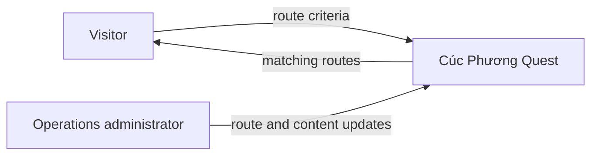
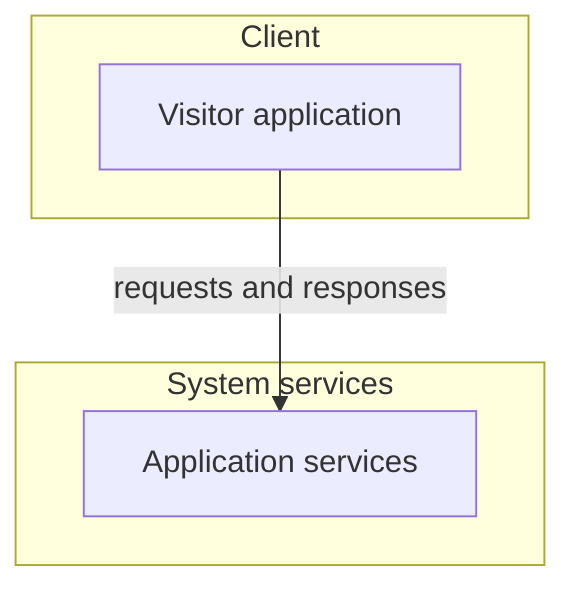
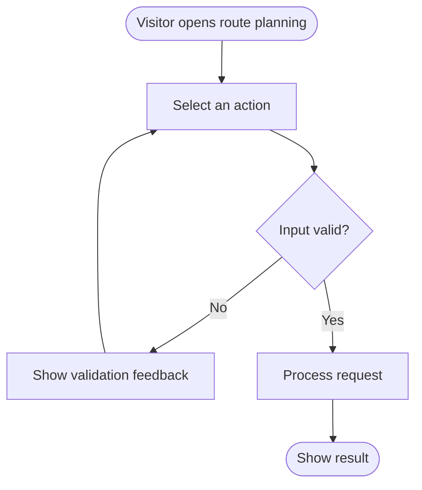
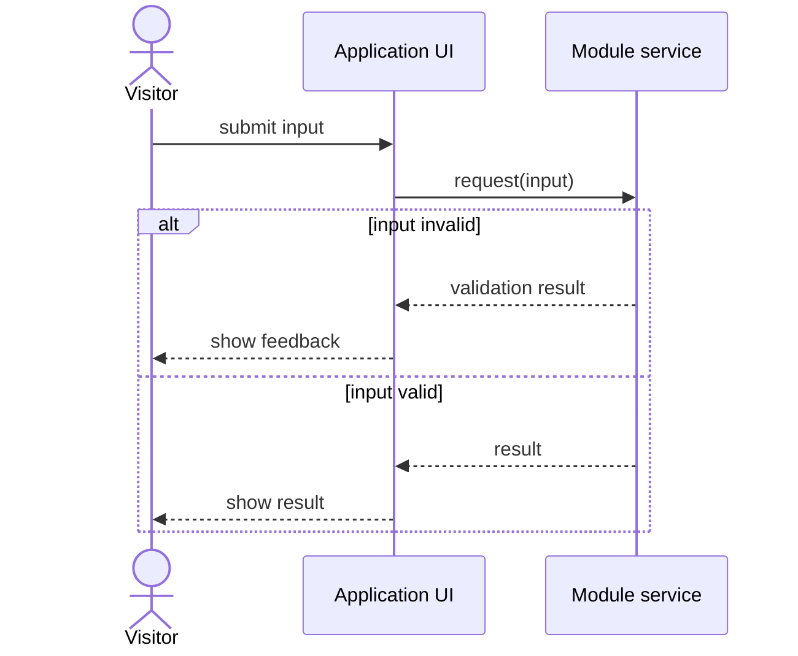

# Mermaid patterns for current specifications

Mermaid is the canonical textual representation for architecture and flows in this repository. Each diagram must reflect an existing requirement; use `[NEEDS CLARIFICATION: question]` when a required branch or participant has not been defined.

## Context diagram — `flowchart LR`

The system is one node. Everything else is an actor or external system. Label arrows with the information that travels.

## System configuration — `flowchart` with `subgraph`

Use one `subgraph` per defined tier. Do not add an undefined component.

## Usage flow — `flowchart TD`

Use one flow per actor. Every known decision has labelled branches and every defined loop is explicit.

## Sequence flow — `sequenceDiagram`

Participants must be real system parts, not job titles. Use `alt` / `else` for defined outcomes.

## Use-case and index tables

Mermaid has no native UML use-case diagram. A structured table is preferred when it communicates the relationship completely.

| Use Case ID | Use case | Primary actor | Related requirement IDs |
|---|---|---|---|
| US-M01-001 | Choose route | Visitor | FR-M01-001 |

Use current-artifact indexes for functions and screens:

| Module | Function or screen | Related ID | Actor | Priority |
|---|---|---|---|---|
| M01 | Choose route | FR-M01-001 | Visitor | Must |

## Verification

1. Every arrow represents a defined interaction and has the correct direction.
2. Every known decision branch is explicit and labelled.
3. Actor and component names match the specification.
4. Render the diagram before acceptance.
5. Record an unknown branch as `[NEEDS CLARIFICATION: question]`; never invent it.

Sources: [Mermaid documentation](https://mermaid.js.org/intro/) and [GitHub Mermaid guidance](https://github.blog/developer-skills/github/include-diagrams-markdown-files-mermaid/).
