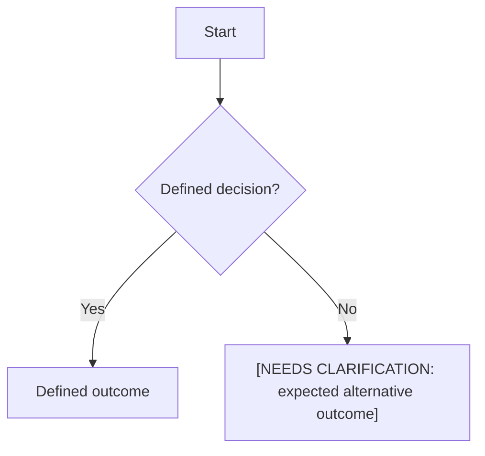
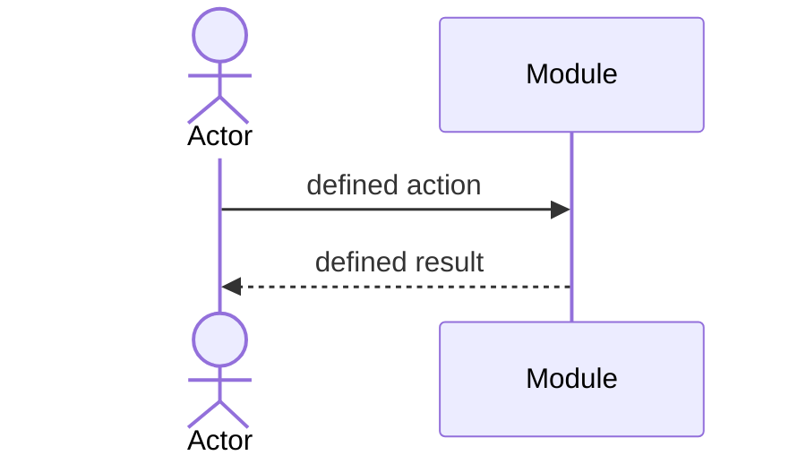

# Module Specification: <Module name>

| Field | Value |
|---|---|
| Module ID | `Mnn` |
| Module name | |
| Version | |
| Status | Draft / Clarified / Approved |
| Owner | |
| Last updated | YYYY-MM-DD |

## 1. Purpose and scope

**Purpose:** <business outcome this module provides>

**In scope**

- <capability owned by this module>

**Out of scope**

- <related capability owned elsewhere>

**Dependencies**

- <module, business service, or `[NEEDS CLARIFICATION: question]`>

## 2. Actors

| Actor ID | Actor | Role |
|---|---|---|
| ACT-001 | | Primary / secondary / system |

## 3. User scenarios and acceptance criteria

### US-Mnn-001 — <scenario title>

As a <actor>, I want to <goal>, so that <business benefit>.

- **Given** <state>, **when** <action>, **then** <observable result>.

## 4. Flows

### 4.1 Usage flow

### 4.2 Sequence flow

## 5. Functional requirements

| FR ID | Requirement | Actor | Priority | Acceptance criteria |
|---|---|---|---|---|
| FR-Mnn-001 | The system MUST … | | Must / Should / Could | |

### 5.1 Input / output contract

| FR ID | Input field | Type | Required | Output field | Type | Validation / notes |
|---|---|---|---|---|---|---|
| FR-Mnn-001 | | | Yes / No | | | |

### 5.2 Business rules

| Rule ID | Rule | Related FR IDs |
|---|---|---|
| BR-Mnn-001 | | |

## 6. Key entities

Describe business entities and relationships only; do not design a physical database schema here.

| Entity ID | Entity | Business attributes | Relationships |
|---|---|---|---|
| ENT-nnn | | | |

## 7. Screens involved

| Screen ID | Screen name | Actor | Priority | Screen spec |
|---|---|---|---|---|
| SCR-Mnn-001 | | | | `screen-spec-SCR-Mnn-001.md` |

## 8. Success criteria

| SC ID | Measurable, user/business-oriented criterion | Measurement |
|---|---|---|
| SC-Mnn-001 | | |

## 9. Assumptions

- <explicit assumption currently supported by a decision>

## 10. Open questions

| ID | Question | Blocking | Owner | Status |
|---|---|---|---|---|
| OQ-Mnn-001 | [NEEDS CLARIFICATION: question] | Yes / No | | Open |

## 11. Internal traceability

| Artifact | Related artifact | Relationship |
|---|---|---|
| US-Mnn-001 | FR-Mnn-001 | Implemented by |
| FR-Mnn-001 | BR-Mnn-001 | Constrained by |
| FR-Mnn-001 | SCR-Mnn-001 | Presented on |

## Completion checklist

- [ ] Every requirement is atomic, testable, and has an actor and priority.
- [ ] Every input/output field has a type, required flag, and validation or explicit `None`.
- [ ] Mermaid renders and matches defined behaviour.
- [ ] Every referenced ID resolves inside the specification package.
- [ ] Every unknown is recorded as `[NEEDS CLARIFICATION: ...]`.
