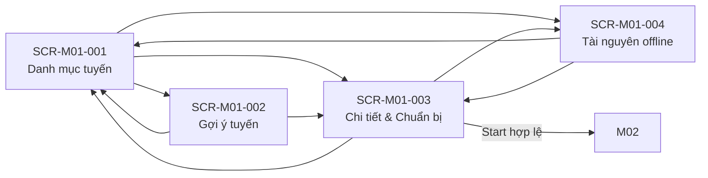

# Screen List M01 — Route Planning & Preparation

## 1. Document information

| Field | Value |
|---|---|
| Module | M01 — Route Planning & Preparation |
| Source Spec | [spec-M01.md](../spec/modules/spec-M01.md) |
| Function Source | [function-list-M01.md](../function list/function-list-M01.md) |
| Priority Source | [MVP-Scope.md](../../MVP-Scope.md) |
| Status | Ready for screen specification |

## 2. Decomposition rules

- Screen được tách theo user goal, không tách 1:1 theo FR.
- Chọn/đổi ngôn ngữ là control dùng chung, không phải screen độc lập.
- Cảnh báo/xác nhận offline nằm trong route detail/preparation.
- Validate package, lazy update, tạo context và publish contract là background behavior.
- Priority screen lấy priority cao nhất của function cốt lõi hiện diện trên screen; function dùng chung như language control không tự nâng priority screen khác.

## 3. Screen list

| Screen ID | Screen name | Actor | User goal | Owning functions | Main FR | Priority |
|---|---|---|---|---|---|---|
| SCR-M01-001 | Danh mục tuyến | Visitor | Chọn ngôn ngữ, khám phá route public và mở bước tiếp theo | FN-M01-001, FN-M01-002 | FR-M01-001, 002 | Must |
| SCR-M01-002 | Gợi ý tuyến | Visitor | Chọn ba tiêu chí, xem toàn bộ kết quả hoặc empty state | FN-M01-003 | FR-M01-004 | Should |
| SCR-M01-003 | Chi tiết tuyến & Chuẩn bị | Visitor | Xem route, xử lý offline và Start sang M02 | FN-M01-002, FN-M01-004, FN-M01-006 | FR-M01-003, 005–008, 010–013 | Must |
| SCR-M01-004 | Quản lý tài nguyên offline | Visitor | Xem, tải hoặc xóa package local | FN-M01-004, FN-M01-005 | FR-M01-007–010 | Should |

## 4. Screen details

### SCR-M01-001 — Danh mục tuyến

| Item | Definition |
|---|---|
| Entry | Mở M01; nếu chưa có preference thì yêu cầu chọn `vi/en` trước chức năng khác |
| Primary data | Public route projection `HOAT_DONG` đọc từ M03 |
| Main content | Tên, cự ly, thời lượng, độ khó; entry tới recommendation/resource management |
| Exit | Mở SCR-M01-002, SCR-M01-003 hoặc SCR-M01-004 |
| States | Loading, route list, empty/unavailable source, language selection |

### SCR-M01-002 — Gợi ý tuyến

| Item | Definition |
|---|---|
| Entry | Từ SCR-M01-001 |
| Primary data | Public route tags từ M03; input local gồm `timeTag`, `groupTag`, `experienceTag` |
| Main content | Ba lựa chọn, toàn bộ route exact-match, empty state không near-match |
| Exit | Mở SCR-M01-003 hoặc quay SCR-M01-001 |
| States | Input incomplete, results `1..N`, zero-result |

### SCR-M01-003 — Chi tiết tuyến & Chuẩn bị

| Item | Definition |
|---|---|
| Entry | Chọn route từ catalog/recommendation |
| Primary data | Route/checkpoint metadata và snapshot manifest từ M03; package readiness từ IndexedDB M01 |
| Main content | Route detail, offline warning, Tải/Tiếp tục không tải/Quay lại, download state và Start |
| Exit | Quay nguồn vào, mở SCR-M01-004 hoặc mở M02 sau Start hợp lệ |
| States | Online-only route, package missing/downloading/ready/incomplete, route unavailable |

### SCR-M01-004 — Quản lý tài nguyên offline

| Item | Definition |
|---|---|
| Entry | Từ catalog hoặc route detail |
| Primary data | **Chỉ metadata/package local trong IndexedDB M01**; M03 chỉ được gọi khi người dùng yêu cầu tải hoặc M01 kiểm tra version |
| Main content | Route/package/version/status và ba action Xem, Tải, Xóa |
| Exit | Quay screen đã mở hoặc catalog nếu route nguồn không còn khả dụng |
| States | `CHUA_TAI`, `DANG_TAI`, `SAN_SANG`, `CHUA_HOAN_TAT`, delete confirmation |

> SCR-M01-004 không phải màn quản trị content/media M03 và không phải trình đọc `introductionText`. “Resource” ở đây là package offline trên thiết bị do M01 sở hữu.

## 5. Navigation

## 6. Background/embedded behavior

| Behavior | Parent screen(s) | Source FR |
|---|---|---|
| Global language control | SCR-M01-001…004 | FR-M01-001, 013 |
| Offline warning and continue-without-download confirmation | SCR-M01-003 | FR-M01-005, 006, 011 |
| Package completeness validation | SCR-M01-003, 004 | FR-M01-008 |
| Lazy update/staging/atomic switch | SCR-M01-003, 004 | FR-M01-010 |
| Create route context and publish handoff | SCR-M01-003 | FR-M01-012, 013 |
| Delete confirmation | SCR-M01-004 | FR-M01-009 |

## 7. Coverage check

| Coverage | Result |
|---|---|
| Source FR | 13/13 covered |
| User-facing screens | 4 |
| Dedicated language screen | Không — shared control |
| Dedicated download/progress screen | Không — embedded state |
| Dedicated handoff screen | Không — exit từ SCR-M01-003 |

## 8. Screen spec targets

| Screen ID | Target file |
|---|---|
| SCR-M01-001 | `screens/screen-spec-SCR-M01-001.md` |
| SCR-M01-002 | `screens/screen-spec-SCR-M01-002.md` |
| SCR-M01-003 | `screens/screen-spec-SCR-M01-003.md` |
| SCR-M01-004 | `screens/screen-spec-SCR-M01-004.md` |
