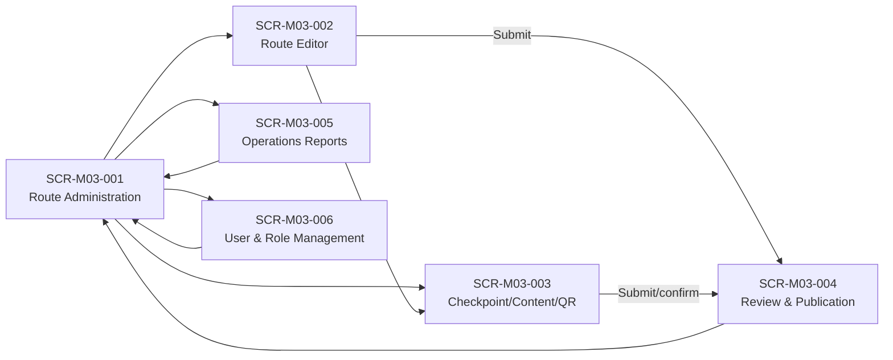

# Screen List M03 — Operations & Content Administration

## 1. Document information

| Field | Value |
|---|---|
| Module | M03 — Operations & Content Administration |
| Source Spec | [spec-M03.md](../spec/modules/spec-M03.md) |
| Function Source | [function-list-M03.md](../function list/function-list-M03.md) |
| Priority Source | [MVP-Scope.md](../../MVP-Scope.md) |
| Status | Ready for screen specification — synchronized with Spec M03 v1.1 |

## 2. Decomposition rules

- Giữ sáu implementation screens đã chốt tại spec M03 §8.
- Gộp checkpoint, QR, content và media vào một workspace theo cùng checkpoint context.
- Completeness guard, snapshot generation và session intake là system behavior, không tạo màn riêng.
- Emergency close/reopen là action theo context trên danh sách/chi tiết, không tạo dashboard khẩn cấp riêng.
- Quản lý tài khoản và hai role cố định cần một màn riêng vì đây là nghiệp vụ chỉ dành cho Reviewer; màn đăng nhập dùng chung toàn hệ thống không tính vào M03.

## 3. Screen list

| Screen ID | Screen name | Actor | User goal | Owning functions | Main FR | Priority |
|---|---|---|---|---|---|---|
| SCR-M03-001 | Route Administration | Content Staff, Reviewer | Tìm/tạo route, xem trạng thái và thực hiện action vận hành | FN-M03-001, 008 | FR-001–003, 012, 013 | Must |
| SCR-M03-002 | Route Editor | Content Staff | Soạn route song ngữ, tag, sắp checkpoint và gửi duyệt | FN-M03-001, 002, 006, 009 | FR-001–004, 009, 018 | Must |
| SCR-M03-003 | Checkpoint Content & QR Workspace | Content Staff, Reviewer | Quản lý checkpoint, nhiều QR, content và media | FN-M03-002–005, 007, 009 | FR-004–008, 011, 018 | Must |
| SCR-M03-004 | Review & Publication | Reviewer | Kiểm tra gaps, approve/reject và theo dõi publish snapshot | FN-M03-006, 009 | FR-009, 010, 014 | Must |
| SCR-M03-005 | Operations Reports | Content Staff, Reviewer | Xem RPT-01/RPT-02 theo thời gian/route/checkpoint | FN-M03-010 | FR-015–017 | Must |
| SCR-M03-006 | User & Role Management | Reviewer | Mời người dùng quản trị, gán role và quản lý trạng thái tài khoản | FN-M03-009 | FR-014, 019 | Must |

## 4. Screen details

### SCR-M03-001 — Route Administration

| Item | Definition |
|---|---|
| Entry | Người dùng M03 đã đăng nhập |
| Primary data | Routes và status từ M03 |
| Main content | List/filter, create, open editor/review, close; reopen chỉ cho Reviewer |
| Exit | SCR-M03-002, 003, 004 hoặc 005 |
| States | Empty/list/filter, permission denied, concurrency refresh, closed/live status |

### SCR-M03-002 — Route Editor

| Item | Definition |
|---|---|
| Entry | Tạo route hoặc mở route có quyền sửa |
| Primary data | Route fields, tags và ordered checkpoint references |
| Main content | `vi/en`, distance/duration/difficulty, safety warning, three tag groups, submit |
| Exit | Save draft, open checkpoint workspace, submit to SCR-M03-004 |
| States | Draft, validation gaps, stale-write conflict, submitted |

### SCR-M03-003 — Checkpoint Content & QR Workspace

| Item | Definition |
|---|---|
| Entry | Từ route editor/administration với route context |
| Primary data | Checkpoint, connectivity verification, `qrIdentifiers[]`, content vi/en và media |
| Main content | Create/edit/order point; generate/reprint/change QR; edit/publish content; manage media |
| Exit | Quay route editor/list hoặc gửi item cần Reviewer xác nhận |
| States | Draft/active/closed/archived, validation gaps, identity-change pending, stale conflict |

### SCR-M03-004 — Review & Publication

| Item | Definition |
|---|---|
| Entry | Reviewer mở item `CHO_DUYET` |
| Primary data | Route/checkpoint/content cùng completeness result và creator identity |
| Main content | Gaps, approve/reject/reason, snapshot publication result |
| Exit | Route administration hoặc item kế tiếp |
| States | Pending, blocked gaps, rejected, approved/publishing, published/error |

### SCR-M03-005 — Operations Reports

| Item | Definition |
|---|---|
| Entry | Content Staff/Reviewer chọn Reports |
| Primary data | Terminal anonymous `SessionSyncRecord` đã upsert |
| Main content | RPT-01/RPT-02, date range mặc định 30 ngày, route/checkpoint filters |
| Exit | Route administration |
| States | Loading, data, empty, query error |

### SCR-M03-006 — User & Role Management

| Item | Definition |
|---|---|
| Entry | Reviewer chọn User & Role Management từ khu vực quản trị |
| Primary data | Administrative accounts, email, fixed role và active status |
| Main content | List/search account; invite account; assign `CONTENT_STAFF`/`REVIEWER`; activate/deactivate |
| Exit | Lưu thay đổi và ở lại danh sách hoặc quay Route Administration |
| States | Loading, empty/list, invite pending/sent, saved, validation error, permission denied, last-Reviewer blocked |

## 5. Navigation

## 6. Background/embedded behavior

| Behavior | Parent screen(s) | Source FR |
|---|---|---|
| Completeness guard and maker-checker | SCR-M03-002, 004 | FR-009 |
| Snapshot generation/version switch/retention | SCR-M03-004/background | FR-010 |
| RLS/server permission enforcement | All M03 screens | FR-014 |
| Optimistic concurrency conflict | SCR-M03-001–004 | FR-018 |
| Session intake/upsert | Background feeding SCR-M03-005 | FR-015 |
| Emergency audit log | SCR-M03-001/003 action | FR-012, 013 |
| Authentication invitation/reset delivery | Background supporting SCR-M03-006 | FR-019 |
| Fixed-role and last-active-Reviewer guard | SCR-M03-006 | FR-014, 019 |

## 7. Coverage check

| Coverage | Result |
|---|---|
| Source FR | 19/19 covered |
| User-facing M03 business screens | 6 |
| Shared authentication screen | Không tính vào M03 — dùng chung toàn hệ thống |
| Dedicated media screen | Không — embedded in checkpoint workspace |
| Dedicated snapshot screen | Không — publication state |
| Dedicated session intake screen | Không — background integration |

## 8. Screen spec targets

| Screen ID | Target file |
|---|---|
| SCR-M03-001 | `screens/screen-spec-SCR-M03-001.md` |
| SCR-M03-002 | `screens/screen-spec-SCR-M03-002.md` |
| SCR-M03-003 | `screens/screen-spec-SCR-M03-003.md` |
| SCR-M03-004 | `screens/screen-spec-SCR-M03-004.md` |
| SCR-M03-005 | `screens/screen-spec-SCR-M03-005.md` |
| SCR-M03-006 | `screens/screen-spec-SCR-M03-006.md` |
