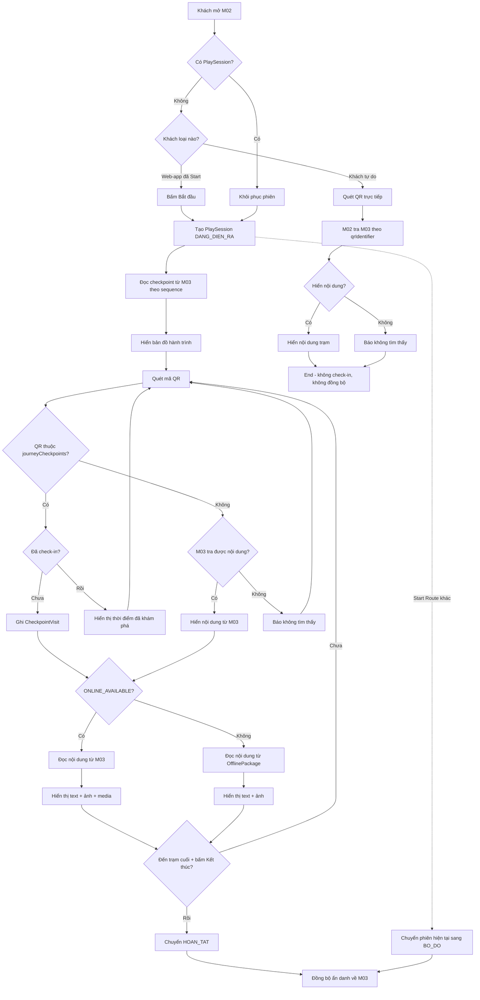
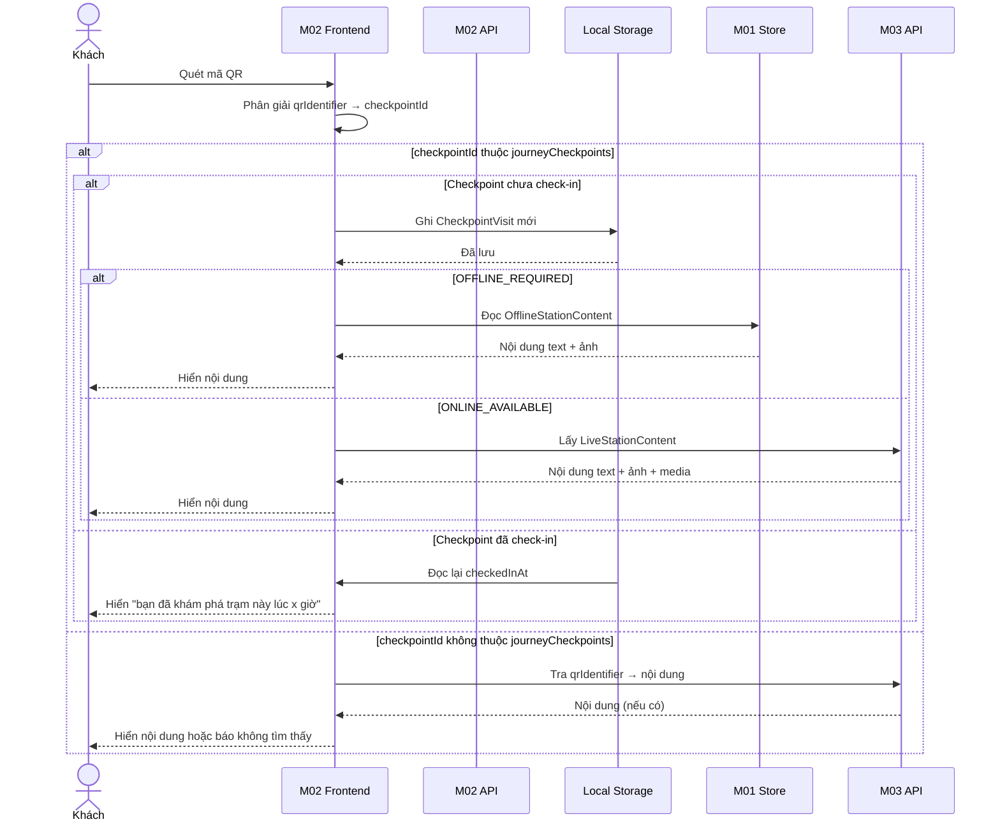
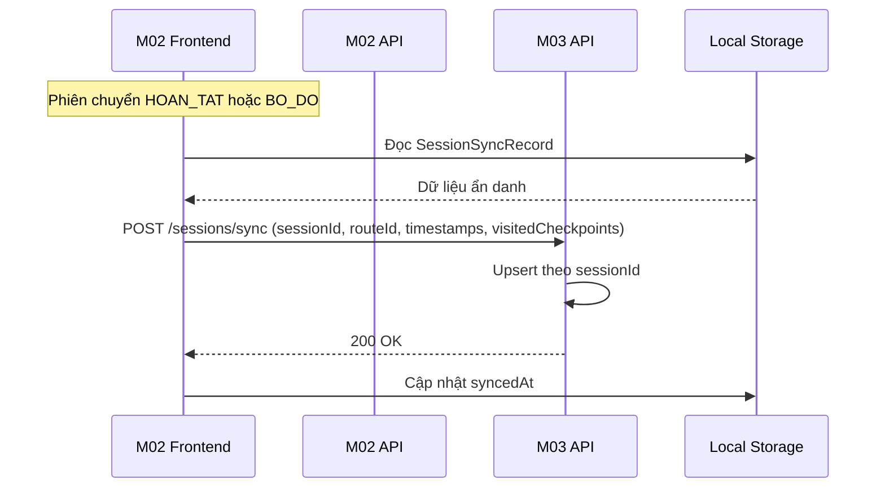

# Spec Document: Module 2 — Trải nghiệm Khám phá Thực địa

<!--
DBIZ3 Session 4 template. Fill in every section. Delete the HTML comments as you go.
Sections marked (mandatory) must be complete before Session 7 (Go / No-Go).
Write for a reader who has never seen your DBIZ2 report.
-->

| Field | Value |
|---|---|
| **Module ID** | M02 |
| **Module name** | Trải nghiệm Khám phá Thực địa (Field Quest Experience) |
| **Spec version** | v1.3 |
| **Author (team member)** | BA Team — Cúc Phương Quest Project |
| **Date** | 2026-09-21 |
| **Status** | Draft — chờ cross-review/phê duyệt |
| **Approved by (Client role)** | Ban Quản lý VQG Cúc Phương |
| **Source documents** | ; BRD-module-2 v1.3 |

---

## 1. Purpose and scope

M02 đồng hành cùng du khách trong hành trình thực địa tại Vườn Quốc gia Cúc Phương: hiển thị bản đồ hành trình, xác thực điểm đến qua mã QR, mở thông tin giới thiệu (text/ảnh/audio/video tùy loại checkpoint) và duy trì liên tục trạng thái trải nghiệm trên thiết bị kể cả khi mất mạng.

<!-- Source: DBIZ2 Schematic design 1.1 System Objectives and 1.2 System Main Functions.
     Rewrite in your own words for this module only. No technology words here. -->

**In scope**

- Tạo và quản lý phiên trải nghiệm (PlaySession) khi khách web-app bấm Bắt đầu, sau khi đã chọn Route ở M01.
- Hiển thị bản đồ tĩnh dạng sơ đồ/timeline liệt kê checkpoint theo đúng thứ tự đã chốt.
- Quét mã QR để check-in tại trạm — cho phép quét thoải mái, kể cả QR ngoài route: QR thuộc hành trình sẽ ghi nhận check-in, QR ngoài route vẫn hiển thị nội dung nếu truy xuất được từ M03.
- Hiển thị thông tin giới thiệu text + ảnh; audio/video bổ sung tại checkpoint ONLINE_AVAILABLE, phát theo yêu cầu.
- Nội dung cho checkpoint OFFLINE_REQUIRED đọc từ OfflinePackage (M01); cho checkpoint ONLINE_AVAILABLE đọc trực tiếp từ M03.
- Cho phép đổi Route khác bất cứ lúc nào; phiên đang chạy khi đó chuyển trạng thái bỏ dở.
- Hoàn tất phiên khi đến checkpoint cuối cùng và chủ động bấm Kết thúc.
- Lưu liên tục trên thiết bị: thông tin phiên và lịch sử check-in.
- Đồng bộ dữ liệu phiên ẩn danh về M03 khi thiết bị có mạng.
- Phục vụ cả khách tự do (chưa mở web-app): chỉ quét QR để xem thông tin, không sinh phiên hay dữ liệu báo cáo.

**Out of scope**

- CRUD Route, QRCheckpoint, nội dung, sinh mã QR — thuộc M03.
- Tải/quản lý OfflinePackage, chọn/đổi ngôn ngữ, đề xuất Route — thuộc M01.
- Hệ thống gợi ý (hint chain) và cơ chế khám phá thông điệp ẩn.
- Gamification: chấm điểm, bảng xếp hạng, huy hiệu, chứng nhận điện tử.
- Đăng ký/định danh tài khoản du khách.
- Dẫn đường GPS hoặc bản đồ định vị thời gian thực.
- Tuyến đa ngày, cắm trại qua đêm.
- Tính năng tự chọn checkpoint / Custom Journey.
- Nhãn tourType (GUIDED/FREE_FOR_ALL).

**Depends on**

- **M01** — Route Planning & Preparation: cung cấp LanguagePreference, SelectedRouteContext.routeId, OfflinePackage SAN_SANG.
- **M03** — Operations & Content Administration: cung cấp Route/QRCheckpoint (gồm sequence, connectivityMode), nội dung trực tiếp cho checkpoint ONLINE_AVAILABLE, và tra nội dung theo qrIdentifier cho QR ngoài route.

## 2. Actors

| Actor | Role in this module | Type | Source |
|---|---|---|---|
| **Khách sử dụng web-app** | Có chọn Route ở M01, bấm Bắt đầu, xem bản đồ, quét QR check-in, xem/mở nội dung, phát audio/video theo ý muốn, bấm Kết thúc. Chỉ nhóm này sinh ra PlaySession/CheckpointVisit và dữ liệu đồng bộ về M03. | Primary | Người dùng ứng dụng |
| **Khách tự do** | Chưa mở web-app, chỉ quét QR tại trạm để xem thông tin. Không sinh phiên, không check-in, không đồng bộ; vẫn xem được nội dung khi quét QR. | Primary | Người dùng không qua web-app |
| **Hệ thống M02** | Quản lý vòng đời PlaySession, xác thực QR theo Route, đọc nội dung offline/online đúng nguồn, lưu tiến trình cục bộ, đồng bộ dữ liệu ẩn danh về M03. | System | Tự động |
| **Hệ thống M01** | Công bố LanguagePreference, SelectedRouteContext (chỉ routeId), OfflinePackage SAN_SANG; không quản lý tiến trình. | System | Tự động |
| **Hệ thống M03** | Nguồn chính thức của Route/QRCheckpoint/nội dung; tiếp nhận dữ liệu đồng bộ ẩn danh từ M02 để báo cáo. | System | Tự động |
| **Ban Quản lý VQG** | Cấu hình thứ tự trạm (sequence), phân loại connectivityMode, phê duyệt nội dung; sử dụng báo cáo tổng hợp từ M03. | Secondary | Quản trị |

## 3. User scenarios and acceptance criteria

### US-1 (P1): Bắt đầu phiên trải nghiệm và xem bản đồ hành trình

**Journey.** As a khách sử dụng web-app, I want to bắt đầu một phiên trải nghiệm và xem bản đồ hành trình, so that tôi biết mình sẽ đi qua những trạm nào và tiến trình của mình.

**Acceptance scenarios**

1. **Given** SelectedRouteContext.routeId tồn tại (đã Start ở M01) và không có phiên nào khác đang DANG_DIEN_RA, **When** khách bấm Bắt đầu, **Then** hệ thống tạo PlaySession ở trạng thái DANG_DIEN_RA và hiển thị bản đồ hành trình với danh sách checkpoint theo đúng thứ tự đã chốt.

2. **Given** khách đã có PlaySession DANG_DIEN_RA, **When** khách đóng ứng dụng rồi mở lại, **Then** hệ thống khôi phục đúng phiên đang chạy mà không tạo phiên mới.

### US-2 (P1): Quét mã QR và check-in tại trạm

**Journey.** As a khách sử dụng web-app, I want to quét mã QR tại một trạm để check-in và xem thông tin giới thiệu, so that tôi được ghi nhận đã đến điểm đó.

**Acceptance scenarios**

1. **Given** đã có PlaySession ở trạng thái DANG_DIEN_RA, **When** khách quét mã QR thuộc journeyCheckpoints và checkpoint đó chưa từng check-in, **Then** hệ thống ghi CheckpointVisit mới và hiển thị nội dung trạm.

2. **Given** đã check-in checkpoint C01 lúc 09:15, **When** khách quét lại mã QR của C01, **Then** hệ thống hiển thị "bạn đã khám phá trạm này lúc 09:15" và không tạo bản ghi mới.

3. **Given** khách quét mã QR không thuộc journeyCheckpoints hiện tại, **When** M03 trả được nội dung cho qrIdentifier, **Then** hệ thống hiển thị nội dung trạm từ M03; không ghi CheckpointVisit, không hiển thị thông báo lỗi.

### US-3 (P1): Check-in tự do, không theo thứ tự

**Journey.** As a khách sử dụng web-app, I want to check-in tại các trạm theo nhịp độ riêng mà không bị ép buộc thứ tự, so that tôi khám phá tự do theo sở thích.

**Acceptance scenarios**

1. **Given** checkpoint C05 có thứ tự cao (5) và checkpoint C02 có thứ tự thấp (2), **When** khách quét QR của C05 trước khi quét C02, **Then** hệ thống vẫn ghi nhận check-in bình thường và không hiển thị cảnh báo sai thứ tự.

### US-4 (P2): Đổi Route giữa chừng

**Journey.** As a khách sử dụng web-app, I want to có thể đổi sang Route khác bất cứ lúc nào, so that tôi không bị ràng buộc nếu muốn thay đổi kế hoạch.

**Acceptance scenarios**

1. **Given** đã có PlaySession của Route R01 đang DANG_DIEN_RA với 3 CheckpointVisit, **When** khách quay lại M01 và bấm Start Route R02 khác, **Then** hệ thống chuyển phiên R01 sang trạng thái BO_DO và giữ nguyên 3 CheckpointVisit đã ghi.

### US-5 (P1): Hoàn tất phiên trải nghiệm

**Journey.** As a khách sử dụng web-app, I want to hoàn tất phiên trải nghiệm khi đã đến trạm cuối cùng, so that hành trình được ghi nhận là hoàn chỉnh.

**Acceptance scenarios**

1. **Given** checkpoint cuối cùng trong journeyCheckpoints đã được check-in, **When** khách bấm Kết thúc, **Then** hệ thống ghi endedAt và chuyển PlaySession sang trạng thái HOAN_TAT.

2. **Given** checkpoint cuối cùng trong journeyCheckpoints chưa được check-in, **When** khách mở màn hình phiên, **Then** nút Kết thúc không khả dụng.

### US-6 (P2): Đồng bộ dữ liệu ẩn danh về M03

**Journey.** As a hệ thống M02, I want to gửi dữ liệu phiên ẩn danh về M03 khi có mạng, so that M03 có dữ liệu phục vụ báo cáo vận hành mà không thu thập thông tin cá nhân.

**Acceptance scenarios**

1. **Given** phiên đã HOAN_TAT hoặc BO_DO và thiết bị đang offline, **When** thiết bị có mạng trở lại, **Then** hệ thống gửi ngay SessionSyncRecord ẩn danh về M03.

2. **Given** SessionSyncRecord đã gửi một phần rồi mất mạng, **When** thiết bị có mạng trở lại và gửi lại, **Then** M03 upsert theo sessionId và không tạo bản ghi trùng lặp.

### US-7 (P2): Khách tự do quét QR xem thông tin

**Journey.** As a khách tự do, I want to quét bất kỳ mã QR nào tại trạm để xem thông tin giới thiệu, so that tôi tiếp cận nội dung mà không cần đăng ký hay bắt đầu phiên trải nghiệm.

**Acceptance scenarios**

1. **Given** khách tự do chưa mở web-app, không có PlaySession, **When** khách quét mã QR của một checkpoint mà M03 có nội dung, **Then** hệ thống hiển thị nội dung trạm từ M03; không tạo PlaySession, không ghi CheckpointVisit, không đồng bộ dữ liệu.

2. **Given** khách tự do quét mã QR mà M03 không trả được nội dung, **When** khách quét, **Then** hệ thống hiển thị "không tìm thấy thông tin cho mã QR này".

**Edge cases**

- Mở M02 nhưng chưa có SelectedRouteContext (chưa Start ở M01): điều hướng về M01 để chọn Route.
- Mất mạng giữa phiên tại checkpoint OFFLINE_REQUIRED: không ảnh hưởng vì nội dung đã có sẵn trong OfflinePackage.
- Mất mạng giữa phiên tại checkpoint ONLINE_AVAILABLE: không có cơ chế fallback; các trạm này được xác nhận luôn có kết nối ổn định.
- Route không có checkpoint ONLINE_AVAILABLE nào: toàn bộ trải nghiệm bằng text + ảnh.
- Dữ liệu trình duyệt bị xóa giữa phiên: chấp nhận mất PlaySession/CheckpointVisit cục bộ.
- Đồng bộ thất bại nhiều lần: giữ SessionSyncRecord cục bộ, thử lại ở lần có mạng kế tiếp.
- Khách tự do quét QR tại checkpoint OFFLINE_REQUIRED: tra M03 trực tiếp; nếu M03 không có nội dung thì báo không tìm thấy.

## 4. Flows

### 4.1 Usage flow

### 4.2 Sequence for the main flow (Quét QR và Check-in)

### 4.3 Sequence for session sync

## 5. Functional requirements

| FR ID | DBIZ2 Subfunction ID | Requirement (system MUST ...) | Actor | Priority |
|---|---|---|---|---|
| FR-M02-001 | F-M02-01 | Tạo PlaySession ở trạng thái DANG_DIEN_RA khi khách bấm Bắt đầu, sau khi SelectedRouteContext.routeId đã tồn tại từ M01. | Khách web-app | Must |
| FR-M02-002 | F-M02-02 | Chỉ cho phép tối đa một PlaySession ở trạng thái DANG_DIEN_RA trên một thiết bị tại một thời điểm. | Hệ thống M02 | Must |
| FR-M02-003 | F-M02-03 | Hiển thị bản đồ tĩnh dạng sơ đồ/timeline liệt kê toàn bộ checkpoint của journeyCheckpoints theo đúng thứ tự đã chốt. | Khách web-app | Must |
| FR-M02-004 | F-M02-04 | Đọc danh sách checkpoint đầy đủ (gồm cả ONLINE_AVAILABLE và OFFLINE_REQUIRED) trực tiếp từ M03 theo sequence, không qua M01. | Hệ thống M02 | Must |
| FR-M02-005 | F-M02-05 | Cập nhật đánh dấu trên bản đồ khi checkpoint được check-in. | Hệ thống M02 | Must |
| FR-M02-006 | F-M02-06 | Phân giải qrIdentifier về checkpointId, rồi xác thực checkpointId có thuộc journeyCheckpoints hiện tại không. | Hệ thống M02 | Must |
| FR-M02-007 | F-M02-07 | Khi QR hợp lệ (thuộc journeyCheckpoints) và checkpoint chưa từng check-in: ghi CheckpointVisit mới với checkpointId và checkedInAt. | Hệ thống M02 | Must |
| FR-M02-008 | F-M02-08 | Khi QR hợp lệ nhưng checkpoint đã check-in: không tạo bản ghi mới, hiển thị "bạn đã khám phá trạm này lúc [giờ:phút]". | Hệ thống M02 | Must |
| FR-M02-009 | F-M02-09 | Khi QR ngoài journeyCheckpoints: tra M03 và hiển thị nội dung nếu có; không ghi CheckpointVisit, không thông báo lỗi. | Hệ thống M02 | Must |
| FR-M02-010 | F-M02-10 | Chấp nhận QR hợp lệ bất kể thứ tự hiển thị trên bản đồ; không chặn hoặc cảnh báo lệch thứ tự. | Khách web-app | Must |
| FR-M02-011 | F-M02-11 | Check-in xác nhận khách đã đến điểm; việc mở xem nội dung là tùy chọn, không ảnh hưởng trạng thái check-in đã ghi. | Khách web-app | Must |
| FR-M02-012 | F-M02-12 | Với checkpoint OFFLINE_REQUIRED: hiển thị introductionText + ảnh từ OfflinePackage (M01); không có audio/video. | Khách web-app | Must |
| FR-M02-013 | F-M02-13 | Với checkpoint ONLINE_AVAILABLE: đọc introductionText + ảnh + audio/video trực tiếp từ M03; không preload, không lưu offline. | Khách | Must |
| FR-M02-014 | F-M02-14 | Audio/video tại checkpoint ONLINE_AVAILABLE chỉ phát khi khách chủ động chọn; không tự động phát. | Khách | Must |
| FR-M02-015 | F-M02-15 | Hiển thị introductionText theo ngôn ngữ khớp LanguagePreference hiện tại (vi/en). | Hệ thống M02 | Must |
| FR-M02-016 | F-M02-16 | Lưu liên tục trên thiết bị: thông tin PlaySession và danh sách CheckpointVisit, độc lập với trạng thái mạng. | Hệ thống M02 | Must |
| FR-M02-017 | F-M02-17 | Không làm mất hoặc ghi lùi dữ liệu CheckpointVisit đã lưu hợp lệ khi tải lại trang hoặc kết nối mạng thay đổi. | Hệ thống M02 | Must |
| FR-M02-018 | F-M02-18 | Khi SelectedRouteContext.routeId đổi trong lúc có phiên DANG_DIEN_RA: chuyển phiên hiện tại sang BO_DO; CheckpointVisit đã có được giữ nguyên. | Hệ thống M02 | Must |
| FR-M02-019 | F-M02-19 | Chuyển PlaySession sang HOAN_TAT chỉ khi checkpoint cuối cùng đã được check-in và khách chủ động bấm Kết thúc. | Khách web-app | Must |
| FR-M02-020 | F-M02-20 | Nút Kết thúc chỉ hiển thị/khả dụng sau khi checkpoint cuối cùng đã được check-in. | Hệ thống M02 | Must |
| FR-M02-021 | F-M02-21 | Khi thiết bị có mạng: gửi SessionSyncRecord gồm sessionId, routeId, mốc thời gian, danh sách checkpoint đã check-in về M03. | Hệ thống M02 | Must |
| FR-M02-022 | F-M02-22 | Dữ liệu đồng bộ không chứa bất kỳ thông tin định danh cá nhân nào của khách. | Hệ thống M02 | Must |
| FR-M02-023 | F-M02-23 | Chỉ đồng bộ phiên đã kết thúc (HOAN_TAT hoặc BO_DO). Nếu kết thúc khi offline, giữ record cục bộ và thử lại khi có mạng. | Hệ thống M02 | Must |
| FR-M02-024 | F-M02-24 | M03 dùng sessionId làm khóa upsert để tránh nhân đôi bản ghi. | Hệ thống M03 | Must |
| FR-M02-025 | F-M02-25 | Chỉ đọc SelectedRouteContext, LanguagePreference, OfflinePackage (M01) và Route/QRCheckpoint/nội dung (M03); không ghi/sửa các store này. | Hệ thống M02 | Must |
| FR-M02-026 | F-M02-26 | Khách tự do không tạo PlaySession, không ghi CheckpointVisit, không đồng bộ dữ liệu về M03. | Hệ thống M02 | Must |
| FR-M02-027 | F-M02-27 | Không cung cấp cơ chế gợi ý theo kịch bản (hint chain); thông điệp nằm trực tiếp trong introductionText. | Hệ thống M02 | Must |

### 5.1 Input / Output contract

| FR ID | Input field | Type | Required | Output field | Type | Notes / validation |
|---|---|---|---|---|---|---|
| FR-M02-001 | SelectedRouteContext.routeId | Text | Yes | PlaySession | Object | sessionId sinh cục bộ, ẩn danh |
| FR-M02-001 | startedAt | DateTime | Yes | journeyCheckpoints | Array<Text> | Chốt một lần tại thời điểm Bắt đầu |
| FR-M02-006 | qrIdentifier | Text | Yes | QRValidationResult | Enum | VALID, INVALID, NOT_IN_JOURNEY |
| FR-M02-007 | checkpointId, sessionId | Text | Yes | CheckpointVisit | Object | Ghi mới khi chưa tồn tại |
| FR-M02-007 | checkedInAt | DateTime | Yes | checkedInAt | DateTime | Thời điểm check-in đầu tiên |
| FR-M02-012 | checkpointId | Text | Yes | OfflineStationContent | Object | Text + ảnh từ OfflinePackage |
| FR-M02-013 | checkpointId | Text | Yes | LiveStationContent | Object | Text + ảnh + media từ M03 |
| FR-M02-015 | LanguagePreference | Enum | Yes | localizedContent | Object | vi/en branch |
| FR-M02-021 | sessionId | Text | Yes | SessionSyncRecord | Object | Gửi về M03 |
| FR-M02-021 | routeId, startedAt, endedAt, status | Mixed | Yes | visitedCheckpoints | Array | {checkpointId, checkedInAt} |
| FR-M02-021 | syncedAt | DateTime | Yes | syncedAt | DateTime | Thời điểm đồng bộ thành công |

### 5.2 Business rules

| Rule ID | Rule | Why it exists |
|---|---|---|
| BR-M02-001 | PlaySession chỉ được tạo khi khách web-app bấm Bắt đầu tại M02, sau khi SelectedRouteContext.routeId đã tồn tại từ M01. | Đảm bảo khách đã chọn Route trước khi bắt đầu phiên. |
| BR-M02-002 | Tại một thời điểm, thiết bị chỉ có tối đa một PlaySession ở trạng thái DANG_DIEN_RA. | Tránh xung đột tiến trình và dữ liệu. |
| BR-M02-003 | Không có hành động Tạm dừng; đóng/mở lại app tự động khôi phục đúng phiên DANG_DIEN_RA hiện có. | Đơn giản hóa UX; khôi phục là tính năng kỹ thuật, không phải action. |
| BR-M02-004 | Khi SelectedRouteContext.routeId đổi trong lúc có phiên DANG_DIEN_RA, phiên hiện tại chuyển BO_DO ngay lập tức; CheckpointVisit đã có được giữ nguyên. | Cho phép đổi ý mà không mất dữ liệu check-in cũ. |
| BR-M02-005 | Phiên chuyển HOAN_TAT chỉ khi checkpoint cuối cùng đã được check-in và khách chủ động bấm Kết thúc. | Đảm bảo khách chủ động kết thúc khi đã hoàn thành. |
| BR-M02-009 | Khi QR ngoài journeyCheckpoints: M02 tra M03 và hiển thị nội dung nếu có; không ghi CheckpointVisit, không thông báo lỗi, không ảnh hưởng SelectedRouteContext. | Hỗ trợ khách tự do và cho phép khám phá ngoài Route. |
| BR-M02-010 | Quét QR hợp lệ được chấp nhận bất kể thứ tự hiển thị trên bản đồ; hệ thống không chặn hoặc cảnh báo lệch thứ tự. | Phù hợp thực tế địa hình rừng. |
| BR-M02-012 | Check-in chỉ xác nhận khách đã đến điểm; mở xem nội dung là tùy chọn của khách, không ảnh hưởng trạng thái check-in đã ghi. | Tách biệt hành động check-in và hành động xem nội dung. |
| BR-M02-013 | Với checkpoint OFFLINE_REQUIRED, nội dung (text + ảnh) đọc từ OfflinePackage do M01 công bố; không có audio/video. | Đảm bảo nội dung offline luôn sẵn sàng. |
| BR-M02-014 | Với checkpoint ONLINE_AVAILABLE, nội dung (text + ảnh + audio/video) đọc trực tiếp từ M03 tại thời điểm quét; không preload, không lưu offline. | Đảm bảo nội dung online luôn mới nhất. |
| BR-M02-017 | Hiển thị introductionText theo nhánh vi/en khớp LanguagePreference hiện tại, dù đọc từ OfflinePackage hay từ M03. | Hỗ trợ đa ngôn ngữ. |
| BR-M02-021 | Lưu liên tục trên thiết bị: thông tin phiên và danh sách CheckpointVisit. | Đảm bảo tiến trình không bị mất khi mất mạng hoặc tải lại. |
| BR-M02-024 | Dữ liệu đồng bộ không chứa bất kỳ thông tin định danh cá nhân nào của khách. | Bảo vệ quyền riêng tư. |
| BR-M02-025 | Chỉ đồng bộ phiên đã kết thúc (HOAN_TAT hoặc BO_DO). Nếu kết thúc khi offline, giữ record cục bộ và thử lại khi có mạng. | Đảm bảo tính nhất quán dữ liệu. |
| BR-M02-030 | Khách tự do không tạo PlaySession, không ghi CheckpointVisit, không đồng bộ bất kỳ dữ liệu nào về M03. | Phân biệt rõ hai nhóm khách. |

## 6. Key entities

| Entity | Attributes (from Input/Output fields) | Relationships |
|---|---|---|
| **PlaySession** | sessionId (Text), routeId (Text), journeyCheckpoints (Array<Text>), status (Enum: DANG_DIEN_RA/HOAN_TAT/BO_DO), startedAt (DateTime), endedAt (DateTime), syncedAt (DateTime) | 1 thiết bị có nhiều phiên; 1 phiên có nhiều CheckpointVisit |
| **CheckpointVisit** | sessionId (Text), checkpointId (Text), qrIdentifier (Text), checkedInAt (DateTime) | Thuộc 1 PlaySession; xác thực qua QRCheckpoint |
| **RouteJourneyMap** | routeId (Text), checkpoints (Array: {checkpointId, orderIndex, qrIdentifiers[], connectivityMode}), fetchedAt (DateTime) | Tham chiếu đến QRCheckpoint của M03 |
| **OfflineStationContent** | checkpointId (Text), localizedContent (vi/en: introductionText), staticImages (Array) | Đọc từ OfflinePackage của M01 |
| **LiveStationContent** | checkpointId (Text), localizedContent (vi/en: introductionText), staticImages (Array), mediaResources (Array: {type, sourceRef}) | Đọc trực tiếp từ M03 |
| **SessionSyncRecord** | sessionId (Text), routeId (Text), startedAt (DateTime), endedAt (DateTime), status (Enum: HOAN_TAT/BO_DO), visitedCheckpoints (Array: {checkpointId, checkedInAt}) | Gửi về M03 để báo cáo |

## 7. Screens involved

| Screen ID | Screen name | Priority | Screen Spec file |
|---|---|---|---|
| S-M02-01 | Màn hình phiên trải nghiệm (bản đồ + QR) | Must | `screens/screen-spec-S-M02-01.md` |
| S-M02-02 | Màn hình nội dung checkpoint | Must | `screens/screen-spec-S-M02-02.md` |
| S-M02-03 | Màn hình kết thúc phiên | Must | `screens/screen-spec-S-M02-03.md` |

## 8. Success criteria

| SC ID | Criterion | How it is measured |
|---|---|---|
| SC-M02-001 | Khách có thể bắt đầu phiên và xem bản đồ hành trình trong vòng 5 giây sau khi bấm Bắt đầu. | Thời gian từ lúc bấm nút đến khi bản đồ hiển thị đầy đủ. |
| SC-M02-002 | Quét mã QR hợp lệ cho phản hồi trong vòng 2 giây (sau khi QR được nhận diện). | Thời gian từ khi QR được scan đến khi nội dung hiển thị hoặc thông báo xuất hiện. |
| SC-M02-003 | Không có tiến trình nào bị mất khi đóng và mở lại ứng dụng giữa phiên. | Test đóng/mở app 10 lần trong phiên có 5 checkpoint, so sánh số CheckpointVisit trước và sau. |
| SC-M02-004 | Dữ liệu đồng bộ về M03 không chứa bất kỳ trường PII nào (sessionId là ẩn danh). | Code review và kiểm tra schema đồng bộ. |
| SC-M02-005 | Check-in tự do được ghi nhận chính xác dù khách quét sai thứ tự. | Test scenario: quét checkpoint 5 → 2 → 4 → 1, kiểm tra cả 4 đều được ghi với đúng thời điểm. |
| SC-M02-006 | Nội dung offline hiển thị ngay lập tức mà không cần kết nối. | Test tắt wifi/4G, mở nội dung checkpoint OFFLINE_REQUIRED đã check-in. |

## 9. Assumptions

- Thiết bị có camera hoạt động và quyền truy cập camera được cấp cho trình duyệt.
- Mã QR vật lý được Ban quản lý lắp đặt đúng trạm và bảo trì định kỳ.
- Mọi checkpoint được M03 phân loại ONLINE_AVAILABLE có kết nối ổn định tại vị trí thực địa; không cần cơ chế fallback khi mất sóng.
- MVP chỉ áp dụng cho tuyến tham quan trong ngày; không bao gồm tuyến đa ngày/cắm trại qua đêm.
- Khách tự do có thiết bị cá nhân và trình duyệt hỗ trợ quét QR; chấp nhận trải nghiệm không có offline.

## 10. Open questions

| # | Question | Blocking? | Owner | Status |
|---|---|---|---|---|
| 1 | Audio/video có cần phụ đề cho người khiếm thị không? | No | Design Team | Open |

## 11. Traceability to BRD

| Spec section | BRD source | Location |
|---|---|---|
| 1. Purpose | BRD_Cuc_Phuong_Goc.md | Section 2, BR-02 |
| 1. Scope | BRD-module-2-updated.md v1.3 | Section 1.2, 1.2.1, 1.2.2 |
| 2. Actors | BRD-module-2-updated.md v1.3 | Section 1.5 |
| 3. User scenarios | BRD-module-2-updated.md v1.3 | Section 3.4 (Gherkin scenarios) |
| 4. Flows | BRD-module-2-updated.md v1.3 | Section 3.1, 3.2, 3.3 |
| 5. Functional requirements | BRD-module-2-updated.md v1.3 | Section 2.4 (BR codes) |
| 5.3 Business rules | BRD-module-2-updated.md v1.3 | Section 2.4 |
| 6. Key entities | BRD-module-2-updated.md v1.3 | Section 2.1, 2.2 |
| 8. Success criteria | BRD_Cuc_Phuong_Goc.md | Section 2, KPI column |
| 9. Assumptions | BRD-module-2-updated.md v1.3 | Section 1.6 |
| Cross-module | BRD-module-2-updated.md v1.3 | Section D.1 |

---

## Completion checklist

- [x] Every functional requirement appears as an FR row.
- [x] Every Input and Output field has a type and a required flag.
- [x] Every Mermaid block renders without an error.
- [x] At least one business rule is written that is not visible in any diagram.
- [x] Every screen this module touches is listed with an existing Screen Spec file (placeholder).
- [x] Success criteria contain no technology words.
- [x] Open questions carry the unresolved items from BRD Module 2.
- [x] The traceability table points to real sources.
- [ ] M01 Team review: xác nhận contract đọc từ M01.
- [ ] M03 Team review: xác nhận contract đọc/ghi từ M03.
- [ ] Ban Quản lý VQG xác nhận các giả định (ASM).
- [ ] BA/Tech Lead phê duyệt.

---

*Spec Document này được tạo dựa trên BRD Module 2 v1.3 đã cập nhật ngày 2026-09-21*
*Template nguồn: DBIZ3 Session 4 Spec Template*
