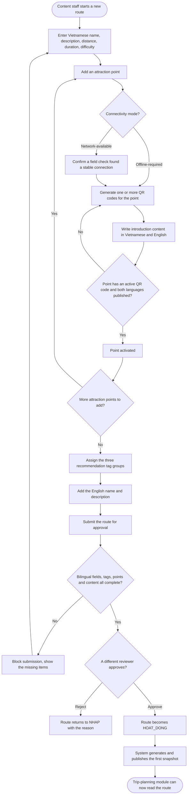
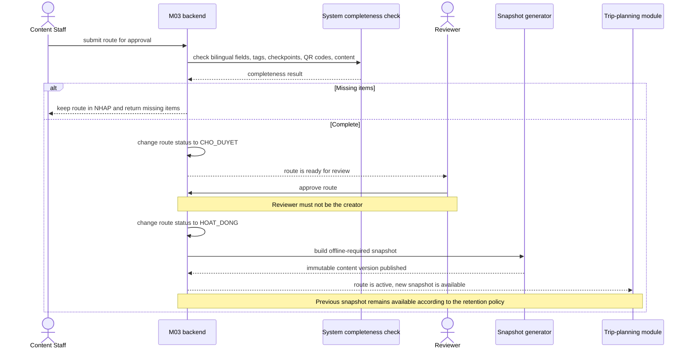

# Spec M03 — Operations & Content Administration

| Field | Value |
|---|---|
| Module ID | M03 |
| Module name | Operations & Content Administration (route, attraction point, QR and content management) |
| Spec version | v1.1 — screen and role-management alignment |
| Author | Product/BA Team |
| Date | 2026-09-22 |
| Status | Ready for SDD/implementation planning |
| Approved by (Client role) | Park Management — pending formal sign-off |
| BRD source | [BRD-module-3.md](../business-requirements/BRD-module-3.md), v3.2 |

## 1. Purpose and scope

This module lets the park's operations staff create, review and publish visiting routes, attraction points and their QR codes, together with bilingual introduction content, so that every published route is complete and ready before a visitor ever sees it. It also lets the operations team close a route or an attraction point the moment a safety risk appears, and reopen it once the risk is confirmed resolved.

**In scope**

- Creating and publishing a route with a bilingual name, description, safety warning, difficulty, and three groups of recommendation tags.
- Creating attraction points within a route and assigning each one a connectivity mode (network-available or offline-required).
- Generating one or more QR codes per attraction point, one per physical object or spot in the zone, and telling apart a reprint (same identity) from a genuine identity change (rare, requires approval).
- Writing and approving bilingual introduction content for each attraction point.
- Attaching optional static images and supplementary audio/video; only published static images of offline-required points enter the snapshot.
- Checking that a route meets every publication condition before it can go live, with a different person approving it than the one who created it.
- Generating an unchangeable snapshot of a route's offline-required data for the trip-planning module to package.
- Adding or removing an attraction point on a route that is already live, without re-approving the whole route.
- Letting either Content Staff or Reviewer close a route/attraction point in an emergency; only Reviewer can reopen it after safety confirmation.
- Enforcing who is allowed to do each of the above.
- Letting a Reviewer manage administrative accounts and assign one of the two fixed MVP roles: Content Staff or Reviewer.
- Receiving terminal anonymous session records from M02 and providing the two MVP reports RPT-01/RPT-02.

**Out of scope**

- Scanning a QR code at the park, showing content to a visitor, or recording a visit — the field-experience module.
- Preparing or downloading an offline package, choosing a display language, or starting a route on a visitor's device — the trip-planning module.
- Any story-driven narrative content, a "hidden message" mechanic, or a hint chain — this module only carries plain introduction text.
- Score-keeping, leaderboards or badges.
- Custom roles, per-user permission overrides, temporary role delegation, and an administrator-managed password system.
- Real-time GPS turn-by-turn navigation.
- Pushing a live warning to a visitor's device or to a visit already in progress — no module in this product carries that capability.

**Depends on**

- M01 (trip planning and offline packaging) — reads this module's published routes, content and snapshots.
- M02 (field experience) — reads this module's attraction points, QR codes and content, and sends back anonymous visit records used for reporting.

## 2. Actors

| Actor | Role in this module | Where it comes from |
|---|---|---|
| Content Staff (`QuanTriVien`) | Primary. Creates and edits routes, attraction points, QR codes and content; submits for approval; may close a route/point in an emergency; views reports. | Product behaviour, BRD §1.3 |
| Reviewer (`NguoiDuyetNoiDung`) | Primary. Approves or rejects; may close and is the only role allowed to reopen; configures admin permissions; views reports. | Product behaviour, BRD §1.3 |
| System | Checks publication conditions, generates immutable snapshots, enforces permissions, upserts terminal session records and computes RPT-01/RPT-02. | Product behaviour, BRD §1.3 |
| Trip-planning module | Secondary, consumer. Reads published routes, content and snapshots. | BRD dependency, §1.4 |
| Field-experience module | Secondary, consumer/producer. Reads attraction points, QR codes and content; sends back anonymous visit records. | BRD dependency, §1.4 |
| Park Management | Secondary. Owns the process; confirms field checks and out-of-app safety measures for a closed area. | Product behaviour, BRD §1.1 |

### 2.1 Permission matrix

| Action | Content Staff | Reviewer | System |
|---|---|---|---|
| Create/edit route, checkpoint, bilingual content, media and tags | Yes | Read | Validate |
| Generate/reprint QR with the same identity | Yes | Read | Generate unique payload |
| Change QR identity | Propose | Approve | Apply and trigger snapshot when needed |
| Submit route/content | Yes | No | Completeness guard |
| Approve/reject publication | No | Yes, must differ from creator | Publish/snapshot |
| Add/remove checkpoint on live route | Propose | Confirm | Publish projection/snapshot when needed |
| Emergency close route/checkpoint | Yes | Yes | Log and update immediately |
| Reopen route/checkpoint | No | Yes | Log and republish status |
| View RPT-01/RPT-02 | Yes | Yes | Query/aggregate |
| View administrative accounts | No | Yes | Return authorized account data |
| Invite, activate/deactivate account; assign Content Staff/Reviewer role | No | Yes | Enforce fixed roles and protect the last active Reviewer |

Every write/action in this matrix is enforced by backend/RLS or a server function, not only by UI visibility.

## 3. User scenarios and acceptance criteria

**US-1 (P1): Content Staff creates and publishes a new route**

**Journey.** As a content staff member, I want to build a complete route with its attraction points, QR codes and bilingual content, so that the route can go live and be used by the trip-planning module.

**Acceptance scenarios**

1. **Given** a new route with only a Vietnamese name and description, **When** content staff tries to submit it for approval with zero attraction points, **Then** the system blocks submission.
2. **Given** a route with every attraction point activated, all three tag groups filled, and both languages complete, **When** a reviewer who did not create the route approves it, **Then** the route becomes live and the system publishes its first immutable snapshot.
3. **Given** a route missing the English name or description, **When** a reviewer tries to approve it, **Then** the system blocks the approval and names the missing language.
4. **Given** an attraction point with zero active QR codes, **When** content staff tries to activate it, **Then** the system blocks activation.

**US-2 (P1): Content Staff manages QR codes for one attraction point**

**Journey.** As a content staff member, I want to print more than one QR code for a single attraction point, so that a visitor can check in from wherever they are standing in that zone, not only from one exact spot.

**Acceptance scenarios**

1. **Given** an attraction point with three active QR codes attached to three different natural features, **When** a visitor scans any one of them, **Then** the field-experience module resolves it to the same attraction point (confirmed contract, execution outside this module).
2. **Given** a QR code that has faded and needs reprinting, **When** content staff reprints it, **Then** the code's identity is unchanged and no new snapshot is created.
3. **Given** an attraction point with only one active QR code, **When** content staff requests an identity change on that code, **Then** the system blocks the change until a replacement code exists.
4. **Given** a reviewer approves an identity change on an offline-required point's QR code, **When** the change is saved, **Then** a new snapshot is generated immediately for that route.

**US-3 (P2): Content Staff adds or removes an attraction point on a route that is already live**

**Journey.** As a content staff member, I want to add a newly surveyed attraction point to a route visitors are already using, so that I don't have to take the whole route offline while I prepare it.

**Acceptance scenarios**

1. **Given** a live route, **When** content staff creates a new attraction point on it, **Then** the route keeps showing exactly as before to the trip-planning module until the new point is activated.
2. **Given** a new offline-required attraction point has just been activated and confirmed by a reviewer, **When** the confirmation is saved, **Then** the system generates a new snapshot that includes the new point.
3. **Given** a reviewer approves removing an attraction point from a live route, **When** the removal is saved, **Then** the point is archived, not deleted, and a new snapshot excludes it if it was offline-required.

**US-4 (P1): Content Staff or Reviewer closes a route or attraction point in an emergency**

**Journey.** As an authorized operations user, I want to close a route or a single attraction point the moment I learn of a safety risk, so that the trip-planning module stops offering it to new visitors as soon as possible.

**Acceptance scenarios**

1. **Given** a live route, **When** Content Staff or Reviewer closes it with a reason, **Then** the route's status changes immediately and the actor, time and reason are logged.
2. **Given** a single attraction point is closed rather than the whole route, **When** the point is offline-required, **Then** the system evaluates whether the route can still stay live without that point, and the reviewer confirms the route-level outcome.
3. **Given** a visit is already in progress on the route being closed, **When** the closure is saved, **Then** no in-app warning is sent to that in-progress visit — this module makes no such promise (see Out of scope).

**US-5 (P2): Reviewer reopens a route or attraction point**

**Journey.** As a reviewer, I want to reopen a route once I have confirmed the safety issue is resolved, so that visitors can use it again.

**Acceptance scenarios**

1. **Given** a closed route and confirmed safe conditions, **When** the reviewer reopens it, **Then** the route returns to live status and the trip-planning module can offer it again from its next read.
2. **Given** a content staff member, not a reviewer, tries to reopen a route, **When** the request is made, **Then** the system rejects it regardless of what the screen shows.

**US-6 (P2): Content Staff updates published content without breaking a package already in someone's hands**

**Journey.** As a content staff member, I want to correct a mistake in an attraction point's introduction text after it is live, so that visitors get accurate information without losing what has already been downloaded by someone mid-trip.

**Acceptance scenarios**

1. **Given** a published introduction text with a typo, **When** content staff edits it and a reviewer approves the correction, **Then** a new snapshot is generated but a package a visitor already has stays exactly as it was.
2. **Given** the corrected point is network-available rather than offline-required, **When** the correction is approved, **Then** no new snapshot is required — the field-experience module reads the latest text directly.

**US-7 (P1): Reviewer manages administrative accounts and roles**

**Journey.** As a reviewer, I want to invite an operations user, assign one of the fixed administrative roles and deactivate accounts that are no longer used, so that access stays manageable without developer intervention.

**Acceptance scenarios**

1. **Given** a valid email address, **When** a reviewer invites the user and assigns Content Staff or Reviewer, **Then** the system creates a pending administrative account and sends the normal authentication invitation.
2. **Given** an active administrative account, **When** a reviewer changes its role or active status, **Then** the new permission takes effect on the next authorized request and the action is logged.
3. **Given** there is only one active Reviewer account, **When** anyone tries to demote or deactivate it, **Then** the system blocks the action and explains that at least one active Reviewer must remain.
4. **Given** a Content Staff account, **When** it calls an account-management operation directly, **Then** the server rejects the request even if the UI is bypassed.

**Resolved edge cases**

- There is no temporary delegation feature in MVP. Park Management provisions at least one backup Reviewer account through the normal account-management process.
- Concurrent edits use optimistic concurrency through `updated_at`. A stale update is rejected and the user must reload; MVP does not merge edits automatically.
- M03 administration is online-only. A failed save leaves the current form visible for retry but does not create an offline draft/sync queue.
- If M01 cannot reach a newly published snapshot, the current/previous snapshots remain reachable; M01 retains its active package and retries through its normal lazy-update flow.

## 4. Flows

### 4.1 Usage flow

*Reconstructed from BRD Module 3 v3.1 §3.4–3.9. There is no DBIZ2 diagram for this project to check against; the source of truth is the BRD's own flow descriptions.*

### 4.2 Sequence for the main flow

*The main flow is submitting a route for approval and having it go live. This zooms into that single interaction, the way the worked example zooms into saving one attendance mark.*

## 5. Functional requirements

| FR ID | Subfunction ID | Requirement (system MUST ...) | Actor | Priority |
|---|---|---|---|---|
| FR-001 | N/A | Let content staff create and edit a route's bilingual name, description, safety warning, distance, duration and difficulty. | Content Staff | Must |
| FR-002 | N/A | Require the Vietnamese name and description to save a route as a draft, and both languages to approve it. | System | Must |
| FR-003 | N/A | Let content staff assign at least one tag from each of the three recommendation tag groups to a route, and block approval when any group is empty. | Content Staff | Must |
| FR-004 | N/A | Let content staff create attraction points within a route, order them, and assign each one a connectivity mode; require a confirmed field check before a point can be set to network-available. | Content Staff | Must |
| FR-005 | N/A | Let content staff generate one or more QR codes for a single attraction point, each one naming the object or spot it is attached to. | Content Staff | Must |
| FR-006 | N/A | Tell apart a QR reprint (same identity) from an identity change (a different code, requires reviewer approval), and block an identity change that would leave the point with zero active codes. | System | Must |
| FR-007 | N/A | Let content staff write bilingual introduction content for an attraction point, and require both languages published before any public point can be activated. | Content Staff | Must |
| FR-008 | N/A | Let content staff attach optional static images and audio/video; include published static images in offline snapshots and keep audio/video online-only. | Content Staff | Should |
| FR-009 | N/A | Check every publication condition automatically before a route can be approved, and require the approver to be a different person from the route's creator. | System | Must |
| FR-010 | N/A | Generate and publish an unchangeable snapshot of a route's offline-required data whenever the route is first approved, or whenever that data later changes; keep the previous snapshot reachable during the handover. | System | Must |
| FR-011 | N/A | Let content staff add a new attraction point to a route that is already live, or remove one, without re-approving the whole route. | Content Staff, Reviewer | Must |
| FR-012 | N/A | Let Content Staff or Reviewer close a route or a single attraction point immediately, logging actor/time/reason, without promising any warning to a visit already in progress. | Content Staff, Reviewer | Must |
| FR-013 | N/A | Let only a reviewer reopen a closed route or attraction point, after confirming the safety condition is resolved. | Reviewer | Must |
| FR-014 | N/A | Enforce the permission matrix for every write action on the server, not only by hiding a button on screen. | System | Must |
| FR-015 | N/A | Accept only anonymous terminal `SessionSyncRecord` values (`HOAN_TAT`/`BO_DO`) from M02 and upsert idempotently by `sessionId`. | System | Must |
| FR-016 | N/A | Provide RPT-01 by date range and route: unique total sessions and count/rate of `HOAN_TAT` and `BO_DO`. | Content Staff, Reviewer | Must |
| FR-017 | N/A | Provide RPT-02 by date range, route and checkpoint: unique sessions that visited each checkpoint, counting at most once per checkpoint/session. | Content Staff, Reviewer | Must |
| FR-018 | N/A | Reject a stale administrative update using optimistic concurrency (`id` + `updated_at`) and require reload instead of silently overwriting newer data. | System | Must |
| FR-019 | N/A | Let a Reviewer list, invite, activate or deactivate administrative accounts and assign either Content Staff or Reviewer; block any change that would leave no active Reviewer. | Reviewer | Must |

### 5.1 Input / Output contract

| FR ID | Input field | Type | Required | Output field | Type | Notes / validation |
|---|---|---|---|---|---|---|
| FR-001 | `ten_tuyen.vi`, `mo_ta.vi` | TEXT | Yes | `tuyen` | OBJECT (draft route) | English fields optional at this stage |
| FR-001 | `cu_ly_km`, `thoi_luong_du_kien_phut`, `do_kho` | DECIMAL, INTEGER, ENUM(NHE, TRUNG_BINH, KHO) | Yes | — | — | Distance and duration must be greater than zero |
| FR-002 | `ten_tuyen.en`, `mo_ta.en` | TEXT | Conditional | approval gate result | BOOLEAN | Required only at the approval step, not at draft save |
| FR-003 | `timeTags`, `groupTags`, `experienceTags` | ARRAY of ENUM (×3) | Yes, ≥1 each, checked at approval | `tuyen.tags` | ARRAY of ENUM | One fixed value set per group |
| FR-004 | `ten_diem`, `thu_tu`, `connectivity_mode` | TEXT, INTEGER, ENUM(ONLINE_AVAILABLE, OFFLINE_REQUIRED) | Yes | `diem` | OBJECT (attraction point) | `thu_tu` unique within the route |
| FR-005 | `ma_diem`, `ten_doi_tuong_gan_ma` | UUID, TEXT | Yes | `ma_qr` | OBJECT (QR code, status HOAT_DONG) | System generates `noi_dung_ma`, unique system-wide, encoding `ma_diem` |
| FR-006 | `action` | ENUM(reprint, change_identity) | Yes | `qr_result` | OBJECT | `change_identity` requires reviewer approval and a reason |
| FR-007 | `noi_dung_gioi_thieu`, `ngon_ngu` | TEXT, ENUM(vi, en) | Yes | `thong_tin` | OBJECT (content, per language) | Minimum 30 characters |
| FR-009 | `tuyen` at CHO_DUYET | OBJECT | Yes | `guard_result` | OBJECT (pass / list of gaps) | See BR-002 |
| FR-010 | route's offline-required attraction points | ARRAY | Yes, when any exists | `snapshot.danh_sach_checkpoint` | ARRAY | Each item: `checkpointId`, `qrIdentifiers[]`, `connectivityMode`, `localizedContent.vi/en.introductionText`, `staticImages[]` |
| FR-012 | `target`, `reason` | route or point reference, TEXT | Yes | `trang_thai_moi` | ENUM(TAM_DONG) | No "warning sent" output is produced |
| FR-013 | `target`, `confirmation_note` | route or point reference, TEXT | Yes | `trang_thai_moi` | ENUM(HOAT_DONG) | Only the Reviewer role is accepted |
| FR-015 | `SessionSyncRecord` | OBJECT | Yes | upsert result | OBJECT | `sessionId`, `routeId`, ISO timestamps, terminal status and unique `visitedCheckpoints[]`; no PII |
| FR-016 | `fromDate`, `toDate`, `routeId` | DATE, DATE, TEXT | No | RPT-01 | OBJECT | Dates default to last 30 days; route is optional; group/filter using `Asia/Bangkok`; timestamps stored ISO 8601 |
| FR-017 | `fromDate`, `toDate`, `routeId` | DATE, DATE, TEXT | No | RPT-02 | ARRAY | Same default/filter behavior; one visit maximum per `(sessionId, checkpointId)` |
| FR-018 | `id`, `updated_at`, changed fields | TEXT, DATETIME, OBJECT | Yes | update result | OBJECT | Reject when stored `updated_at` no longer matches |
| FR-019 | `email`, `role`, `active` | EMAIL, ENUM(CONTENT_STAFF, REVIEWER), BOOLEAN | Conditional | `admin_account` | OBJECT | Email required for invite; role required on invite/change; only Reviewer may write; use the authentication provider's invitation/reset flow |

### 5.2 Business rules

| Rule ID | Rule | Why it exists |
|---|---|---|
| BR-001 | A route can only go live once both the Vietnamese and English name, description, and (if present) safety warning are complete. | An English-only or half-translated route would satisfy the trip-planning module's catalog check but never build an offline package for an English-speaking visitor. |
| BR-002 | A route can only go live once every attraction point has at least one active QR code and published introduction content in both languages. Only offline-required points are included in `SnapshotTuyen`. | M02 needs bilingual content at every public point; M01 packages only the offline-required subset. |
| BR-003 | The person who approves a route can never be the person who created it. | Keeps a second, independent check on content before it reaches a visitor. |
| BR-004 | An attraction point can carry more than one active QR code; scanning any one of them checks a visitor in at the same point. | One faded or vandalized code should never take an entire attraction point out of service. |
| BR-005 | Reprinting a QR code keeps its identity; changing a code's identity is a separate, reviewed action, and is blocked if it would leave the point with zero active codes. | Reprinting is routine field maintenance; changing identity can silently break every offline package a visitor has already downloaded, so it must be deliberate and rare. |
| BR-006 | A published snapshot is immutable. M03 keeps current, previous and every snapshot replaced less than 30 days ago; cleanup needs no acknowledgement from M01. | M01 needs stable versions for atomic package download/update without a cross-module acknowledgement protocol. |
| BR-007 | Adding a new attraction point to a live route, or removing one, does not require re-approving the whole route. | Forcing a full re-approval for every field addition would make the module too slow to keep pace with real survey work. |
| BR-008 | Closing a route or an attraction point updates its status immediately, but this module never promises a warning reaches a visit already in progress. | A device deep in the forest may have no signal at all; promising delivery would be a promise the system cannot keep, and could give false confidence instead of caution. |
| BR-009 | Every permission in the role matrix is enforced on the server, never only by hiding a button. | A hidden button is not a security control; a determined or mistaken client-side call must still be rejected. |
| BR-010 | Content Staff and Reviewer may close a route/point; only Reviewer may reopen it. MVP has no temporary delegation and uses provisioned backup Reviewer accounts. | Keeps emergency closure available while preserving independent safety confirmation for reopening. |
| BR-011 | `toa_do_gps` is optional operational metadata and is not used for navigation, check-in or validation. | GPS navigation is outside MVP scope. |
| BR-012 | M03 has no offline admin draft and no QR-installed-at-wrong-location reporting feature in MVP. | Avoids two sync/workflow systems that do not support the core visitor journey. |
| BR-013 | M03 accepts only terminal, anonymous session records and upserts by `sessionId`. | Makes retries safe and keeps reporting free of visitor PII. |
| BR-014 | RPT-01 and RPT-02 use a default 30-day range; date filtering/grouping uses `Asia/Bangkok`, while stored timestamps remain ISO 8601. | Gives deterministic MVP report results. |
| BR-015 | Administrative updates use optimistic concurrency and reject stale writes; MVP does not auto-merge concurrent edits. | Prevents silent data loss with minimal implementation complexity. |
| BR-016 | Administrative access uses only the two fixed roles Content Staff and Reviewer. Only a Reviewer may manage accounts, and the last active Reviewer cannot be demoted or deactivated. | Keeps authorization simple for MVP while preventing the administration area from becoming ownerless. |

## 6. Key entities

| Entity | Attributes | Relationships |
|---|---|---|
| Tuyen (Route) | `ma_tuyen`, `ten_tuyen` (vi/en), `mo_ta` (vi/en), `canh_bao_an_toan` (vi/en), `cu_ly_km`, `thoi_luong_du_kien_phut`, `do_kho`, `timeTags`, `groupTags`, `experienceTags`, `trang_thai`, `activeContentVersion`, `updated_at` | has many DiemThamQuan; has many SnapshotTuyen |
| DiemThamQuan (Attraction point) | `ma_diem`, `ma_tuyen`, `ten_diem`, `thu_tu`, `connectivity_mode`, `mo_ta_khu_vuc`, `trang_thai` | belongs to Tuyen; has many MaQR; has two ThongTinDiemThamQuan (vi, en) |
| MaQR (QR code) | `ma_qr`, `ma_diem`, `ten_doi_tuong_gan_ma`, `noi_dung_ma`, `trang_thai` | belongs to DiemThamQuan (many codes per point) |
| ThongTinDiemThamQuan (Introduction content) | `ma_thong_tin`, `ma_diem`, `ngon_ngu`, `noi_dung_gioi_thieu`, `trang_thai` | belongs to DiemThamQuan; may have many TaiNguyenMedia |
| TaiNguyenMedia (Supplementary media) | `ma_media`, `ma_thong_tin`, `loai` (`IMAGE`/`AUDIO`/`VIDEO`), `url_luu_tru`, `quyen_su_dung`, `trang_thai` | belongs to ThongTinDiemThamQuan; only published IMAGE enters offline snapshot |
| LichSuPhienBan (Version history) | `loai_doi_tuong`, `ma_doi_tuong`, `du_lieu_truoc`, `du_lieu_sau`, `nguoi_thuc_hien`, `thoi_gian` | records changes to Tuyen and ThongTinDiemThamQuan |
| SnapshotTuyen (Immutable snapshot) | `ma_snapshot`, `ma_tuyen`, `content_version`, `danh_sach_checkpoint[]`, `trang_thai`, `thoi_gian_cong_bo`, `snapshot_truoc_do` | belongs to Tuyen; consumed by M01; checkpoint item uses the canonical FR-010 contract |
| SessionSyncRecord | `sessionId`, `routeId`, `startedAt`, `endedAt`, `status`, `visitedCheckpoints[]`, `receivedAt` | upserted by `sessionId`; source for RPT-01/RPT-02; contains no PII |
| AdminAccount | `user_id`, `email`, `role`, `active`, `invited_at`, `updated_at` | belongs to an authentication identity; role is `CONTENT_STAFF` or `REVIEWER`; managed only by Reviewer |

Every administratively editable entity carries `updated_at` for optimistic concurrency. Physical column naming may follow the implementation convention as long as the logical contract is unchanged.

## 7. Success criteria

| SC ID | Criterion | How it is measured |
|---|---|---|
| SC-001 | A content staff member can take a surveyed route from first entry to live, on their own, without asking a developer for help. | Walkthrough of one full route creation with a real staff member, no engineering support given. |
| SC-002 | A route that is live is always usable by the trip-planning module — bilingual, tagged, and packaged. | Sample of live routes checked against the four publication conditions; target 100% pass. |
| SC-003 | Damaging one QR code never stops visitors from checking in at that attraction point. | After a reprint or a planned identity change, the point still accepts at least one working code at every point in the process. |
| SC-004 | A safety closure is reflected the moment a reviewer confirms it, with no dependency on any other system being reachable. | Time between the reviewer's confirmation and the status change in the data, measured with the network to other modules disconnected. |
| SC-005 | Editing published content never changes what a visitor already carrying an offline package sees mid-trip. | Compare a downloaded package before and after a content correction is approved; the older package is unchanged. |
| SC-006 | Retried terminal-session synchronization never duplicates a session or checkpoint visit in reports. | Submit the same `SessionSyncRecord` repeatedly and compare RPT-01/RPT-02 totals. |
| SC-007 | A stale admin save never silently overwrites a newer saved version. | Open the same record in two clients, save one, then verify the second receives a conflict/reload result. |
| SC-008 | The operations team can provision and remove administrative access without developer intervention while always retaining at least one active Reviewer. | Invite one Content Staff account, change its role, deactivate it, and verify an attempt to deactivate the last Reviewer is blocked. |

## 8. Screens involved

Chi tiết phân rã tại [screen-list-M03.md](../docs/screen-list-M03.md).

| Screen ID | Screen name | Main scope | Priority |
|---|---|---|---|
| SCR-M03-001 | Route Administration | Route list, status/filter, create route, emergency close/reopen entry points | Must |
| SCR-M03-002 | Route Editor | Bilingual route fields, tags, ordering and submit-for-review | Must |
| SCR-M03-003 | Checkpoint Content & QR Workspace | Checkpoint, connectivity verification, multiple QR, bilingual content and media | Must |
| SCR-M03-004 | Review & Publication | Completeness gaps, approve/reject, snapshot publication status | Must |
| SCR-M03-005 | Operations Reports | RPT-01 and RPT-02 with date/route filters | Must |
| SCR-M03-006 | User & Role Management | Administrative account list, invitation, fixed-role assignment and activation/deactivation | Must |

These six implementation screens are grouped for MVP simplicity. Authentication itself is a shared system entry screen and is not counted as an M03 business screen. Detailed screen-spec files remain a UI-design deliverable; the grouping does not change the FR boundaries.

## 9. Assumptions

- Content Staff and Reviewer are two different people in the operations team; the requirement that an approver differ from the creator assumes this separation holds in practice.
- The operations team is able to physically verify network reliability at a spot before marking it network-available.
- The park has an out-of-app way to keep visitors away from a closed area (signage, ranger post, blocked trailhead) — this module's closure action does not, by itself, keep anyone out.
- A route's attraction points, once surveyed, do not change order frequently enough to need a bulk reordering tool in the MVP.
- Administrative users authenticate through the shared authentication provider; M03 manages account status and fixed application roles, not passwords.

## 10. Resolved MVP decisions

Không còn open question nghiệp vụ chặn MVP. Các quyết định đã chốt:

| Decision | Resolution |
|---|---|
| Reviewer availability | Không có temporary delegation; Park Management cấp ít nhất một backup Reviewer account |
| Administrative access | Reviewer quản lý tài khoản qua SCR-M03-006; chỉ có hai role cố định, không có custom permission; không được vô hiệu hóa/hạ quyền Reviewer cuối cùng |
| GPS | Optional operational metadata; không dùng navigation/check-in |
| Admin offline | M03 online-only; không có offline draft sync |
| Concurrent edit | Optimistic concurrency qua `updated_at`; reject stale write, không auto-merge |
| Wrong QR placement report | Out of scope MVP |
| Reporting | RPT-01/RPT-02 theo FR-016/017; query on demand sau terminal-session sync |
| Multiple QR | Đã chốt `qrIdentifiers[]`; M02 resolve về `checkpointId` |
| Snapshot contract | Đã chốt tại FR-010 và §6; retention current + previous + version bị thay thế chưa đủ 30 ngày |

## 11. Traceability

| Spec section | BRD source | Location |
|---|---|---|
| 1. Purpose and scope | Module goals and MVP scope | BRD §1.1–1.2 |
| 2. Actors | Actor list and permission matrix | BRD §1.3, §1.3.2 |
| 3. User scenarios | Route publication, QR handling, adding/removing points, emergency closure, reopening, content updates, reporting and administrative account management | BRD §1.3.2, §3.4–3.10 |
| 4.1, 4.2 Flows | Same detailed flows, redrawn as a single usage flow and one main-flow sequence | BRD §3.4, §3.8 |
| 5. Functional requirements, 5.2 Business rules | Business Rule Catalog and reporting mechanism | BRD §2.3, §3.10 |
| 6. Key entities | Domain entities including SnapshotTuyen and SessionSyncRecord | BRD §2.1 |
| 8. Screens | MVP grouping derived from functional scope | Spec §5; BRD §3.4–3.10 |
| 9. Assumptions | Module assumptions and accepted limitations | BRD §1.6; Appendix B.2 |
| 10. Resolved MVP decisions | MVP decisions and cross-module contracts | BRD Appendix B.1–B.3; DEC-M03-021…027 |

There is no DBIZ2 Function List or Use Case Diagram for this project; the BRD is the sole source of truth, the same treatment used for this project's M01 module spec.

## Completion checklist

- [x] Every subfunction of this module in scope appears as an FR row.
- [x] Every Input and Output field has a type and a required flag.
- [x] Mermaid blocks pass static structure/source validation; visual rendering remains part of UI/SDD review.
- [x] Every node and arrow in the Mermaid flows was checked against the BRD's own flow descriptions (§3.4–3.9), since no DBIZ2 diagram exists for this project.
- [x] At least one business rule is written that is not visible in any diagram (BR-005, BR-008, BR-009).
- [x] Every implementation screen is listed in §8; detailed screen-spec files remain a separate UI deliverable.
- [x] Success criteria contain no technology words.
- [x] Previously open MVP decisions are resolved in §10 and synchronized with BRD v3.2/M01/M02.
- [x] The traceability table points to real BRD sections, not "see the report".
