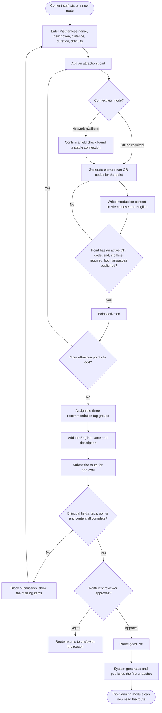

Spec Document: Operations & Content Administration

| Field | Value |
|---|---|
| Module ID | M03 |
| Module name | Operations & Content Administration (route, attraction point, QR and content management) |
| Spec version | v0.1 |
| Author | [team member] |
| Date | 2026-09-22 |
| Status | Draft |
| Approved by (Client role) | [pending — Park Management] |
| BRD source | Not applicable: this project has no DBIZ2 report. The source is `BRD_Module_3_Operations_Content_Administration_v3_1.md`, the module's own Business Requirements Document. |

## 1. Purpose and scope

This module lets the park's operations staff create, review and publish visiting routes, attraction points and their QR codes, together with bilingual introduction content, so that every published route is complete and ready before a visitor ever sees it. It also lets the operations team close a route or an attraction point the moment a safety risk appears, and reopen it once the risk is confirmed resolved.

**In scope**

- Creating and publishing a route with a bilingual name, description, safety warning, difficulty, and three groups of recommendation tags.
- Creating attraction points within a route and assigning each one a connectivity mode (network-available or offline-required).
- Generating one or more QR codes per attraction point, one per physical object or spot in the zone, and telling apart a reprint (same identity) from a genuine identity change (rare, requires approval).
- Writing and approving bilingual introduction content for each attraction point.
- Attaching optional audio/video to an attraction point's content.
- Checking that a route meets every publication condition before it can go live, with a different person approving it than the one who created it.
- Generating an unchangeable snapshot of a route's offline-required data for the trip-planning module to package.
- Adding or removing an attraction point on a route that is already live, without re-approving the whole route.
- Closing a route or an attraction point in an emergency, and reopening it once conditions are confirmed safe.
- Enforcing who is allowed to do each of the above.

**Out of scope**

- Scanning a QR code at the park, showing content to a visitor, or recording a visit — the field-experience module.
- Preparing or downloading an offline package, choosing a display language, or starting a route on a visitor's device — the trip-planning module.
- Any story-driven narrative content, a "hidden message" mechanic, or a hint chain — this module only carries plain introduction text.
- Score-keeping, leaderboards or badges.
- Real-time GPS turn-by-turn navigation.
- Pushing a live warning to a visitor's device or to a visit already in progress — no module in this product carries that capability.

**Depends on**

- M01 (trip planning and offline packaging) — reads this module's published routes, content and snapshots.
- M02 (field experience) — reads this module's attraction points, QR codes and content, and sends back anonymous visit records used for reporting.

## 2. Actors

| Actor | Role in this module | Where it comes from |
|---|---|---|
| Content Staff | Primary. Creates and edits routes, attraction points, QR codes and content; submits a route for approval. | Product behaviour, BRD §1.3 |
| Reviewer | Primary. Approves or rejects a route and its content; closes and reopens a route or attraction point in an emergency; configures admin permissions. | Product behaviour, BRD §1.3 |
| System | Checks publication conditions, generates the immutable snapshot, enforces the permission matrix, computes report totals. | Product behaviour, BRD §1.3 |
| Trip-planning module | Secondary, consumer. Reads published routes, content and snapshots. | BRD dependency, §1.4 |
| Field-experience module | Secondary, consumer/producer. Reads attraction points, QR codes and content; sends back anonymous visit records. | BRD dependency, §1.4 |
| Park Management | Secondary. Owns the process; confirms field checks and out-of-app safety measures for a closed area. | Product behaviour, BRD §1.1 |

## 3. User scenarios and acceptance criteria

**US-1 (P1): Content Staff creates and publishes a new route**

**Journey.** As a content staff member, I want to build a complete route with its attraction points, QR codes and bilingual content, so that the route can go live and be used by the trip-planning module.

**Acceptance scenarios**

1. **Given** a new route with only a Vietnamese name and description, **When** content staff tries to submit it for approval with zero attraction points, **Then** the system blocks submission.
2. **Given** a route with every attraction point activated, all three tag groups filled, and both languages complete, **When** a reviewer who did not create the route approves it, **Then** the route becomes live and the system publishes its first immutable snapshot.
3. **Given** a route missing the English name or description, **When** a reviewer tries to approve it, **Then** the system blocks the approval and names the missing language.
4. **Given** an attraction point with zero active QR codes, **When** content staff tries to activate it, **Then** the system blocks activation.

**US-2 (P1): Content Staff manages QR codes for one attraction point**

**Journey.** As a content staff member, I want to print more than one QR code for a single attraction point, so that a visitor can check in from wherever they are standing in that zone, not only from one exact spot.

**Acceptance scenarios**

1. **Given** an attraction point with three active QR codes attached to three different natural features, **When** a visitor scans any one of them, **Then** the field-experience module resolves it to the same attraction point (confirmed contract, execution outside this module).
2. **Given** a QR code that has faded and needs reprinting, **When** content staff reprints it, **Then** the code's identity is unchanged and no new snapshot is created.
3. **Given** an attraction point with only one active QR code, **When** content staff requests an identity change on that code, **Then** the system blocks the change until a replacement code exists.
4. **Given** a reviewer approves an identity change on an offline-required point's QR code, **When** the change is saved, **Then** a new snapshot is generated immediately for that route.

**US-3 (P2): Content Staff adds or removes an attraction point on a route that is already live**

**Journey.** As a content staff member, I want to add a newly surveyed attraction point to a route visitors are already using, so that I don't have to take the whole route offline while I prepare it.

**Acceptance scenarios**

1. **Given** a live route, **When** content staff creates a new attraction point on it, **Then** the route keeps showing exactly as before to the trip-planning module until the new point is activated.
2. **Given** a new offline-required attraction point has just been activated and confirmed by a reviewer, **When** the confirmation is saved, **Then** the system generates a new snapshot that includes the new point.
3. **Given** a reviewer approves removing an attraction point from a live route, **When** the removal is saved, **Then** the point is archived, not deleted, and a new snapshot excludes it if it was offline-required.

**US-4 (P1): Reviewer closes a route or attraction point in an emergency**

**Journey.** As a reviewer, I want to close a route or a single attraction point the moment I learn of a safety risk, so that the trip-planning module stops offering it to new visitors as soon as possible.

**Acceptance scenarios**

1. **Given** a live route, **When** a reviewer closes it with a reason, **Then** the route's status changes immediately and the reason is logged.
2. **Given** a single attraction point is closed rather than the whole route, **When** the point is offline-required, **Then** the system evaluates whether the route can still stay live without that point, and the reviewer confirms the route-level outcome.
3. **Given** a visit is already in progress on the route being closed, **When** the closure is saved, **Then** no in-app warning is sent to that in-progress visit — this module makes no such promise (see Out of scope).

**US-5 (P2): Reviewer reopens a route or attraction point**

**Journey.** As a reviewer, I want to reopen a route once I have confirmed the safety issue is resolved, so that visitors can use it again.

**Acceptance scenarios**

1. **Given** a closed route and confirmed safe conditions, **When** the reviewer reopens it, **Then** the route returns to live status and the trip-planning module can offer it again from its next read.
2. **Given** a content staff member, not a reviewer, tries to reopen a route, **When** the request is made, **Then** the system rejects it regardless of what the screen shows.

**US-6 (P2): Content Staff updates published content without breaking a package already in someone's hands**

**Journey.** As a content staff member, I want to correct a mistake in an attraction point's introduction text after it is live, so that visitors get accurate information without losing what has already been downloaded by someone mid-trip.

**Acceptance scenarios**

1. **Given** a published introduction text with a typo, **When** content staff edits it and a reviewer approves the correction, **Then** a new snapshot is generated but a package a visitor already has stays exactly as it was.
2. **Given** the corrected point is network-available rather than offline-required, **When** the correction is approved, **Then** no new snapshot is required — the field-experience module reads the latest text directly.

**Edge cases**

- What happens when the sole reviewer is unavailable and a route or attraction point needs approving, closing or reopening? [NEEDS CLARIFICATION: is there a backup reviewer, or does the process simply wait?]
- What happens when two content staff members edit the same route at the same time? [NEEDS CLARIFICATION: no concurrency rule is defined yet]
- What happens when the trip-planning module cannot reach a snapshot that was just published? This module keeps the previous snapshot reachable during the handover; recovering from a failed handover on the consuming side is out of scope for this module.

## 4. Flows

### 4.1 Usage flow

*Reconstructed from BRD Module 3 v3.1 §3.4–3.9. There is no DBIZ2 diagram for this project to check against; the source of truth is the BRD's own flow descriptions.*



### 4.2 Sequence for the main flow

*The main flow is submitting a route for approval and having it go live. This zooms into that single interaction, the way the worked example zooms into saving one attendance mark.*

```mermaid
sequenceDiagram
    actor CS as Content Staff
    participant BE as M03 backend
    participant SYS as System (completeness check)
    actor RV as Reviewer
    participant SNAP as Snapshot generator
    participant M01 as Trip-planning module

    CS->>BE: submit route for approval
    BE->>SYS: check bilingual fields, tags, points, QR codes, content
    SYS-->>BE: complete, or a list of missing items
    alt Missing items
        BE-->>CS: route stays in draft, missing items listed
    else Complete
        BE-->>RV: route is ready for review
        RV->>BE: approve (reviewer is not the creator)
        BE->>SNAP: build the offline-required data set
        SNAP-->>BE: new content version, published, unchangeable
        BE-->>M01: route is live; new snapshot is available
        Note over BE,M01: the previous snapshot stays reachable until M01 confirms it has switched over
    end
```

## 5. Functional requirements

| FR ID | Subfunction ID | Requirement (system MUST ...) | Actor | Priority |
|---|---|---|---|---|
| FR-001 | N/A | Let content staff create and edit a route's bilingual name, description, safety warning, distance, duration and difficulty. | Content Staff | Must |
| FR-002 | N/A | Require the Vietnamese name and description to save a route as a draft, and both languages to approve it. | System | Must |
| FR-003 | N/A | Let content staff assign at least one tag from each of the three recommendation tag groups to a route, and block approval when any group is empty. | Content Staff | Must |
| FR-004 | N/A | Let content staff create attraction points within a route, order them, and assign each one a connectivity mode; require a confirmed field check before a point can be set to network-available. | Content Staff | Must |
| FR-005 | N/A | Let content staff generate one or more QR codes for a single attraction point, each one naming the object or spot it is attached to. | Content Staff | Must |
| FR-006 | N/A | Tell apart a QR reprint (same identity) from an identity change (a different code, requires reviewer approval), and block an identity change that would leave the point with zero active codes. | System | Must |
| FR-007 | N/A | Let content staff write bilingual introduction content for an attraction point, and require both languages published before an offline-required point can be activated. | Content Staff | Must |
| FR-008 | N/A | Let content staff attach optional audio or video to an attraction point's content, without it affecting whether the text can be published. | Content Staff | Should |
| FR-009 | N/A | Check every publication condition automatically before a route can be approved, and require the approver to be a different person from the route's creator. | System | Must |
| FR-010 | N/A | Generate and publish an unchangeable snapshot of a route's offline-required data whenever the route is first approved, or whenever that data later changes; keep the previous snapshot reachable during the handover. | System | Must |
| FR-011 | N/A | Let content staff add a new attraction point to a route that is already live, or remove one, without re-approving the whole route. | Content Staff, Reviewer | Must |
| FR-012 | N/A | Let a reviewer close a route or a single attraction point immediately, with a logged reason, without promising any warning to a visit already in progress. | Reviewer | Must |
| FR-013 | N/A | Let only a reviewer reopen a closed route or attraction point, after confirming the safety condition is resolved. | Reviewer | Must |
| FR-014 | N/A | Enforce the permission matrix for every write action on the server, not only by hiding a button on screen. | System | Must |
| FR-015 | N/A | Summarize operational reports from the visit data sent by the field-experience module. | System | Could |

### 5.1 Input / Output contract

| FR ID | Input field | Type | Required | Output field | Type | Notes / validation |
|---|---|---|---|---|---|---|
| FR-001 | `ten_tuyen.vi`, `mo_ta.vi` | TEXT | Yes | `tuyen` | OBJECT (draft route) | English fields optional at this stage |
| FR-001 | `cu_ly_km`, `thoi_luong_du_kien_phut`, `do_kho` | DECIMAL, INTEGER, ENUM(NHE, TRUNG_BINH, KHO) | Yes | — | — | Distance and duration must be greater than zero |
| FR-002 | `ten_tuyen.en`, `mo_ta.en` | TEXT | Conditional | approval gate result | BOOLEAN | Required only at the approval step, not at draft save |
| FR-003 | `timeTags`, `groupTags`, `experienceTags` | ARRAY of ENUM (×3) | Yes, ≥1 each, checked at approval | `tuyen.tags` | ARRAY of ENUM | One fixed value set per group |
| FR-004 | `ten_diem`, `thu_tu`, `connectivity_mode` | TEXT, INTEGER, ENUM(ONLINE_AVAILABLE, OFFLINE_REQUIRED) | Yes | `diem` | OBJECT (attraction point) | `thu_tu` unique within the route |
| FR-005 | `ma_diem`, `ten_doi_tuong_gan_ma` | UUID, TEXT | Yes | `ma_qr` | OBJECT (QR code, status HOAT_DONG) | System generates `noi_dung_ma`, unique system-wide, encoding `ma_diem` |
| FR-006 | `action` | ENUM(reprint, change_identity) | Yes | `qr_result` | OBJECT | `change_identity` requires reviewer approval and a reason |
| FR-007 | `noi_dung_gioi_thieu`, `ngon_ngu` | TEXT, ENUM(vi, en) | Yes | `thong_tin` | OBJECT (content, per language) | Minimum 30 characters |
| FR-009 | `tuyen` at CHO_DUYET | OBJECT | Yes | `guard_result` | OBJECT (pass / list of gaps) | See BR-002 |
| FR-010 | route's offline-required attraction points | ARRAY | Yes, ≥1 point implied when any exists | `snapshot` | OBJECT (unchangeable, versioned) | Includes every active QR code per point, not a single code |
| FR-012 | `target`, `reason` | route or point reference, TEXT | Yes | `trang_thai_moi` | ENUM(TAM_DONG) | No "warning sent" output is produced |
| FR-013 | `target`, `confirmation_note` | route or point reference, TEXT | Yes | `trang_thai_moi` | ENUM(HOAT_DONG) | Only the Reviewer role is accepted |
| FR-015 | anonymous visit records from M02 | ARRAY | Conditional | `report` | [NEEDS CLARIFICATION] | No confirmed contract yet |

### 5.2 Business rules

| Rule ID | Rule | Why it exists |
|---|---|---|
| BR-001 | A route can only go live once both the Vietnamese and English name, description, and (if present) safety warning are complete. | An English-only or half-translated route would satisfy the trip-planning module's catalog check but never build an offline package for an English-speaking visitor. |
| BR-002 | A route can only go live once every one of its attraction points has at least one active QR code, and every offline-required point has published content in both languages. | Recommendation tags and offline packaging both depend on this data; a route without it would be live but functionally unusable for part of the product. |
| BR-003 | The person who approves a route can never be the person who created it. | Keeps a second, independent check on content before it reaches a visitor. |
| BR-004 | An attraction point can carry more than one active QR code; scanning any one of them checks a visitor in at the same point. | One faded or vandalized code should never take an entire attraction point out of service. |
| BR-005 | Reprinting a QR code keeps its identity; changing a code's identity is a separate, reviewed action, and is blocked if it would leave the point with zero active codes. | Reprinting is routine field maintenance; changing identity can silently break every offline package a visitor has already downloaded, so it must be deliberate and rare. |
| BR-006 | A snapshot, once published, is never edited in place; a later change produces a new snapshot, and the previous one stays reachable until the trip-planning module has switched over. | The trip-planning module needs one immutable version to build an offline package from; editing a version in place would corrupt a package mid-build. |
| BR-007 | Adding a new attraction point to a live route, or removing one, does not require re-approving the whole route. | Forcing a full re-approval for every field addition would make the module too slow to keep pace with real survey work. |
| BR-008 | Closing a route or an attraction point updates its status immediately, but this module never promises a warning reaches a visit already in progress. | A device deep in the forest may have no signal at all; promising delivery would be a promise the system cannot keep, and could give false confidence instead of caution. |
| BR-009 | Every permission in the role matrix is enforced on the server, never only by hiding a button. | A hidden button is not a security control; a determined or mistaken client-side call must still be rejected. |

## 6. Key entities

| Entity | Attributes | Relationships |
|---|---|---|
| Tuyen (Route) | `ma_tuyen`, `ten_tuyen` (vi/en), `mo_ta` (vi/en), `canh_bao_an_toan` (vi/en), `cu_ly_km`, `thoi_luong_du_kien_phut`, `do_kho`, `timeTags`, `groupTags`, `experienceTags`, `trang_thai`, `activeContentVersion` | has many DiemThamQuan; has many SnapshotTuyen |
| DiemThamQuan (Attraction point) | `ma_diem`, `ma_tuyen`, `ten_diem`, `thu_tu`, `connectivity_mode`, `mo_ta_khu_vuc`, `trang_thai` | belongs to Tuyen; has many MaQR; has two ThongTinDiemThamQuan (vi, en) |
| MaQR (QR code) | `ma_qr`, `ma_diem`, `ten_doi_tuong_gan_ma`, `noi_dung_ma`, `trang_thai` | belongs to DiemThamQuan (many codes per point) |
| ThongTinDiemThamQuan (Introduction content) | `ma_thong_tin`, `ma_diem`, `ngon_ngu`, `noi_dung_gioi_thieu`, `trang_thai` | belongs to DiemThamQuan; may have many TaiNguyenMedia |
| TaiNguyenMedia (Supplementary media) | `ma_media`, `ma_thong_tin`, `loai`, `url_luu_tru`, `quyen_su_dung` | belongs to ThongTinDiemThamQuan |
| LichSuPhienBan (Version history) | `loai_doi_tuong`, `ma_doi_tuong`, `du_lieu_truoc`, `du_lieu_sau`, `nguoi_thuc_hien`, `thoi_gian` | records changes to Tuyen and ThongTinDiemThamQuan |
| SnapshotTuyen (Immutable snapshot) | `ma_snapshot`, `ma_tuyen`, `content_version`, `danh_sach_checkpoint`, `trang_thai` | belongs to Tuyen; consumed by the trip-planning module |

## 7. Success criteria

| SC ID | Criterion | How it is measured |
|---|---|---|
| SC-001 | A content staff member can take a surveyed route from first entry to live, on their own, without asking a developer for help. | Walkthrough of one full route creation with a real staff member, no engineering support given. |
| SC-002 | A route that is live is always usable by the trip-planning module — bilingual, tagged, and packaged. | Sample of live routes checked against the four publication conditions; target 100% pass. |
| SC-003 | Damaging one QR code never stops visitors from checking in at that attraction point. | After a reprint or a planned identity change, the point still accepts at least one working code at every point in the process. |
| SC-004 | A safety closure is reflected the moment a reviewer confirms it, with no dependency on any other system being reachable. | Time between the reviewer's confirmation and the status change in the data, measured with the network to other modules disconnected. |
| SC-005 | Editing published content never changes what a visitor already carrying an offline package sees mid-trip. | Compare a downloaded package before and after a content correction is approved; the older package is unchanged. |

## 9. Assumptions

- Content Staff and Reviewer are two different people in the operations team; the requirement that an approver differ from the creator assumes this separation holds in practice.
- The operations team is able to physically verify network reliability at a spot before marking it network-available.
- The park has an out-of-app way to keep visitors away from a closed area (signage, ranger post, blocked trailhead) — this module's closure action does not, by itself, keep anyone out.
- A route's attraction points, once surveyed, do not change order frequently enough to need a bulk reordering tool in the MVP.

## 10. Open questions

| # | Question | Blocking? | Owner | Status |
|---|---|---|---|---|
| 1 | Is there a backup reviewer when the sole Reviewer is unavailable for an approval, a closure or a reopening? | Yes, it changes who can act in an emergency. | Park Management | Open |
| 2 | What is `toa_do_gps` on an attraction point actually used for? | No | Product | Open |
| 3 | Does the module need to keep working, with drafts saved locally, when a content staff member loses connection while editing — or is a connected office assumed? | No | Tech Lead | Open |
| 4 | What is the contract for the field-experience module to report a QR code installed at the wrong spot? | No | M02 owner, M03 owner | Open |
| 5 | What is the scope, frequency and acceptable delay for the operational reports (FR-015)? | Yes, it blocks FR-015 from being ready to build. | M02 owner, M03 owner | Open |
| 6 | Has the field-experience module agreed to read a list of QR codes per attraction point, rather than a single code? | Yes, it blocks FR-005/FR-010 from being usable end to end. | M02 owner | Open |
| 7 | Has the trip-planning module agreed on the exact shape of the snapshot as its offline data contract? | Yes, it blocks FR-010 from being usable end to end. | M01 owner | Open |

## 11. Traceability

| Spec section | BRD source | Location |
|---|---|---|
| 1. Purpose and scope | Module goals and MVP scope | BRD §1.1–1.2 |
| 2. Actors | Actor list and permission matrix | BRD §1.3, §1.3.2 |
| 3. User scenarios | Detailed flows for route publication, QR handling, adding/removing points, emergency closure, reopening, content updates | BRD §3.4–3.9 |
| 4.1, 4.2 Flows | Same detailed flows, redrawn as a single usage flow and one main-flow sequence | BRD §3.4, §3.8 |
| 5. Functional requirements, 5.2 Business rules | Business Rule Catalog | BRD §2.3 |
| 6. Key entities | Domain entities | BRD §2.1 |
| 9. Assumptions | Cross-module open decisions | BRD Appendix B.2 |
| 10. Open questions | Cross-module open decisions | BRD Appendix B.2, B.3 |

There is no DBIZ2 Function List or Use Case Diagram for this project; the BRD is the sole source of truth, the same treatment used for this project's M01 module spec.

## Completion checklist

- [x] Every subfunction of this module in scope appears as an FR row.
- [x] Every Input and Output field has a type and a required flag.
- [ ] Every Mermaid block renders without an error — not yet run through a renderer in this session; needs a manual check before this spec feeds an SDD.
- [x] Every node and arrow in the Mermaid flows was checked against the BRD's own flow descriptions (§3.4–3.9), since no DBIZ2 diagram exists for this project.
- [x] At least one business rule is written that is not visible in any diagram (BR-005, BR-008, BR-009).
- [ ] Every screen this module touches is listed with an existing Screen Spec file — the seven screens above are named but no Screen Spec file has been written yet.
- [x] Success criteria contain no technology words.
- [x] Open questions carry the unresolved items from the BRD's own open-decisions appendix, plus new ones found while writing this spec.
- [x] The traceability table points to real BRD sections, not "see the report".
